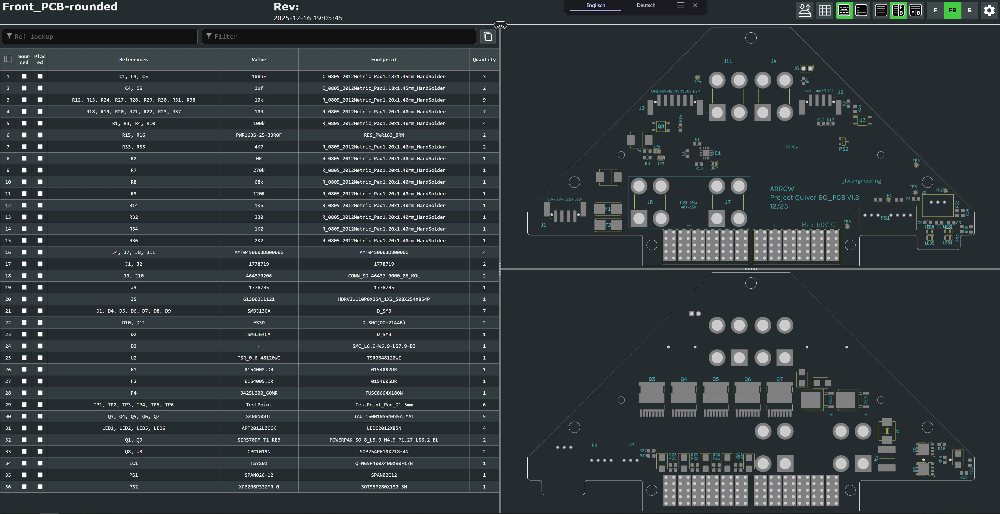
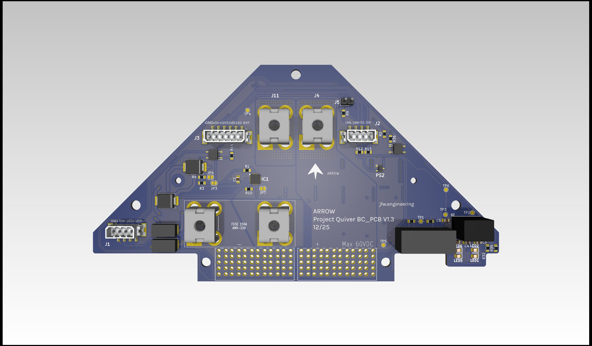
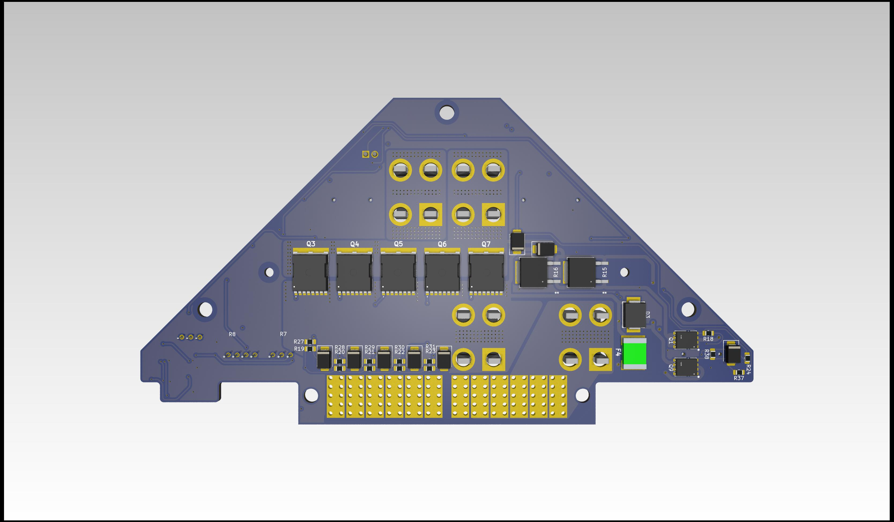

# Project Quiver Dev-Kit BC PCB Assembly Manual

This manual will help with the project Quiver BC PCB (Battery connector PCB) assembly process.

> Note: This is not a final version of this document. The given instructions will give a general guide on the assembly process. Assembly should only be carried out by an experienced worker with experience in SMD soldering and the appropriate equipment. If you need this PCB fully assembled please contact the project Quiver team.

This PCB can be ordered (almost) fully assembled from the respective PCB manufacturer (e.g. JLCPCB). There are several parts that are normally not in stock at the PCB manufacturer and need to be sourced from one of the large electronic component distributors by the PCB manufacturer. This means that the production time for a finished PCB is around 3 weeks.

The large molex battery connectors (J9, J10) still need manual assembly at the moment. A quick explanation is written under the chapter: **Additional Steps**

The manual soldering of the circuit board can be done with the help of this interactive BOM which is stored in the respective github folder of this PCB(it is not recommended):

## Quiver_PT3_BC_PCB_ibom.html

This is an HTML file that opens in the browser. On the left side is the parts list and on the right side are the views for the front and back of the circuit board. It will help to put the components in the right place.

It is essential to use a pcb stencil to place the solder paste in the right places. A reflow oven or a hot air blower (temperature and airflow controllable) should be used for the soldering process.

### View on the top side of this PCB:

### View on the bottom side of this PCB:

## Additional Steps

**1. Adding the Molex battery connector (J9, J10):**

The molex battery connector can not be bought in one piece at the moment (12/25). It's assembled from four individual parts (1x guiding pin left, 1x guiding pin right, 2x Molex 46437-9206). The guiding pins are sourced from a pre assembled Molex connector 464379-301. The individual parts can be clipped together and then inserted into the PCB. The connector pins should be manually soldered to the PCB.

Picture:PCB with Molex connector

**2. Installation of the heatsink:**

The heatsink must be attached to the PCB for the PCB to function properly. The heat sink is in direct contact with the frame of the drone and ensures that the power mosfets are well cooled.

   - Gap filler: Arctic TP-3 thermal pad: [https://www.arctic.de/TP-3/ACTPD00057A](https://www.arctic.de/TP-3/ACTPD00057A)
   - Nylon spacers: McMaster 99072A104
   - Screws: McMaster 92125A090
   - Washers: McMaster 95610A011
   - Nuts: McMaster 90591A270

   Please secure the screws of the heatsink with loctite.

Picture: Thermal pad area and nylon spacer location

Picture: Screwed down heatsink

**3. Installation of the fuse:**

A AMX-200 fuse needs to be mounted between J7 and J8. Please use loctite to secure the screws.

Example screws: McMaster 98093A213
