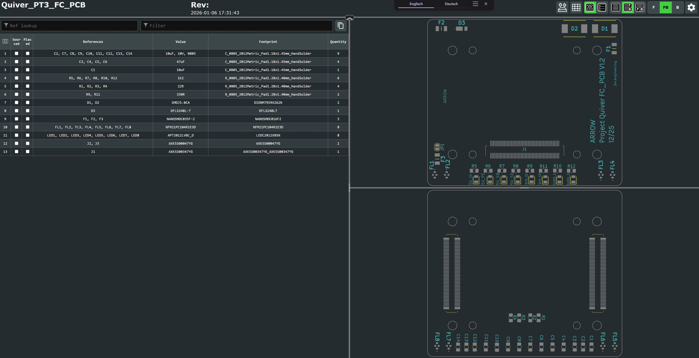
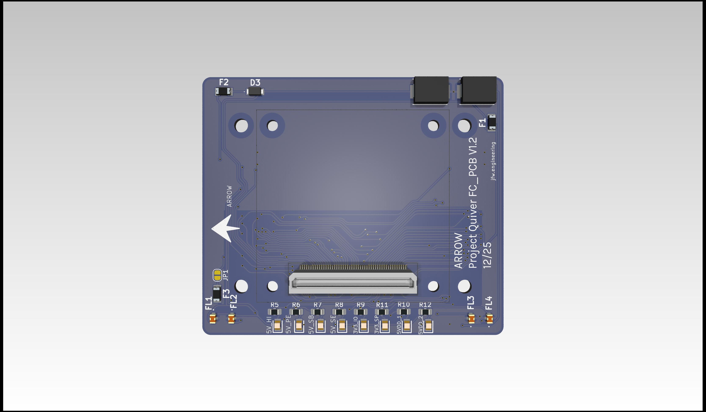
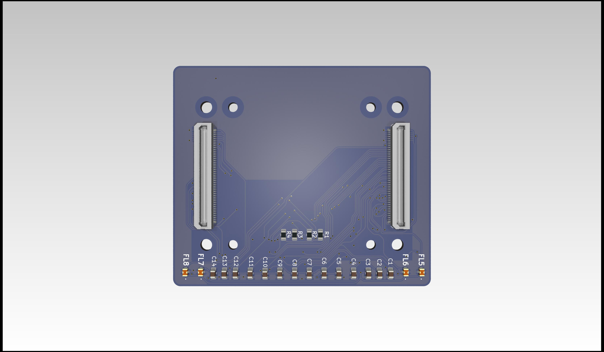

# Project Quiver Dev-Kit FC PCB Assembly Manual

This manual will help with the project Quiver FC PCB (Flight controller PCB) assembly process.

> Note: This is not a final version of this document. The given instructions will give a general guide on the assembly process. Assembly should only be carried out by an experienced worker with experience in SMD soldering and the appropriate equipment. If you need this PCB fully assembled please contact the project Quiver team.

This PCB can be ordered fully assembled from the respective PCB manufacturer (e.g. JLCPCB). The 100 pin connectors (J1, J2, J3) are normally not in stock and must be ordered from the manufacturer. This means that the production time for a finished PCB is around 3 weeks.

The manual soldering of the circuit board can be done with the help of this interactive BOM which is stored in the respective github folder of this PCB(it is not recommended):

## Quiver_PT3_FC_PCB_ibom.html

This is an HTML file that opens in the browser. On the left side is the parts list and on the right side are the views for the front and back of the circuit board. It will help to put the components in the right place.

It is essential to use a pcb stencil to place the solder paste in the right places. A reflow oven or a hot air blower (temperature and airflow controllable) should be used for the soldering process.

### View on the top side of this PCB (this side will connect to the pix32 v6 flight controller):

### View on the bottom side of this PCB (this side will connect to the PT3 Main PCB):

## Additional Steps

- no additional steps are needed.
