# Harness Manufacturing Guide

## Purpose

This guide explains how to manufacture and assemble the wiring harnesses for all of the components present on the dev kit build. Modifications include custom cut spool cables, pre made cables, pre crimped cables, and reducing length of default connectors. 

Use the following wiring table for all of the connections TO/FROM for all of the dev kit’s systems: [Dev Kit Wire Data](https://docs.google.com/spreadsheets/d/1U9Jd1zW-IGLvGdLw63Ius3nsfnPE6wN_-VjMNnLCjd8/edit?gid=2139598833#gid=2139598833) 
The spreadsheet gives the full view of all connectors, mating connectors, wire gauge, estimated length, and suggested/default wire colors. 

## How To Use This Guide

This guide will detail the manufacturing process for all harnesses in no particular order. It is intended to be broken up and placed in the manufacturing guide according to the Quiver assembly steps. This is to allow harness routing that may be blocked by the installation of certain structural components. The user is encouraged to treat this document as a knowledge base and prep guide for the harnessing. Installation steps will be covered in the broader assembly guide. 

## Tools Required
* Soldering iron with hot air rework station
* Solder
* Wire stripper 
* Wire cutter
* Heat shrink
* Heat shrink solder connectors 
* Flathead screwdriver (1.5mm)
* Pliers
* Multimeter

## Quality Assurance (QC) Checklist
- [ ] **Visual:** Check for exposed strands or damaged insulation.
- [ ] **Mechanical:** Pull-test all crimps lightly to ensure retention.
- [ ] **Continuity:** Probe Pin 1 to Pin 1 (Tone check).
- [ ] **Polarity:** Verify Red is Positive, Black is Ground.

## HAR-0001 Pushbutton 
| **FROM**    | **TO**  |
| ------------| ------- |
| BC_PCB J25|Pushbutton |

### 1. Nailboard

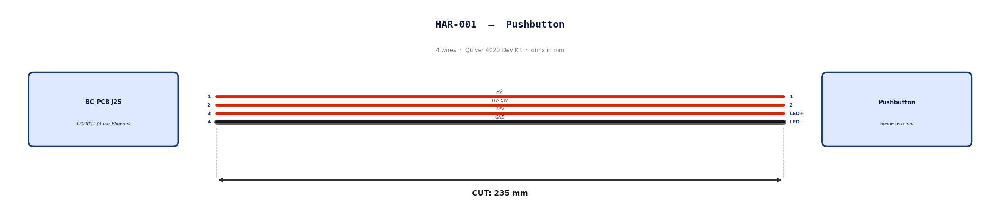

*Bounding box: 156.4 × 47.5 × 32.0 mm*

### 2. Bill of Materials (Kitting)
*Gather these parts before starting the build.*

| Item Type | Part Number | Description / Spec | Qty Needed |
| :--- | :--- | :--- | :--- |
| **Connector A** | 1704857 | 4-Pos Phoenix | 1 |
| **Terminals A** | Wire | Bare wire, twisted end | 4 |
| **Connector B** | Spade | Spade terminal | 4 |
| **Terminals B** | Wire | Bare wire | 4 |
| **Wire** | 18 AWG | Silicon | 800 mm |
| **Sleeving** | Optional| Mesh | 180 mm|

### 3. Wire Prep (Cut & Strip)
*Prepare all wires before assembly.*

| Wire ID | Color | Gauge | Cut Length (mm) | Strip A (mm) | Strip B (mm) |
| :--- | :--- | :--- | :--- | :--- | :--- |
| **W1** | Red | 18 AWG | 200 mm | 6mm  | 6mm |
| **W2** | Red | 18 AWG | 200 mm | 6mm | 6mm |
| **W3** | Red | 18 AWG | 200 mm | 6mm | 6mm |
| **W4** | Black | 18 AWG | 200 mm | 6mm | 6mm |

### 4. Termination & Pinout Map
*Connect End A to End B following this chart.*

| Wire ID | Color | From: 1704857  | To: Spade | Function / Signal |
| :--- | :--- | :--- | :--- | :--- |
| **W1** | Red | **Pin 1** | 1 | HV- |
| **W2** | Red | **Pin 2** | 2 | HV- SW |
| **W3** | Red | **Pin 3** | LED+| 12V |
| **W4** | Black | **Pin 4** | LED- | GND |

### 5. Assembly Instructions
1.  **Prep:** Cut wires to length and strip insulation per Section 3.
2.  **Label:** Install identification markers per Section 5. *Do not shrink yet.*
4.  **Populate A:** Insert contacts into Connector A housing. *Verify "Click" and perform pull-back test.*
5.  **Crimp Side B:** Terminate Side B using crimping tool.
6.  **Populate B:** Insert contacts into Connector B housing.

---

### 6. Installation & Routing (Vehicle Integration)
*Instructions for the technician installing this harness into the chassis.*

* **Source Connection:** Bat_PCB, J1
* **Destination Connection:** Pushbutton
* **Routing Path:**
    * Path - Over Battery PCB
    * Constraint - N/A
    * Fixing - Zip Tie Provision Circled in red

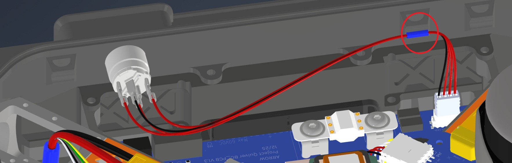

## HAR-0002 BC_PCB Signal
| **FROM**    | **TO**  |
| ------------| ------- |
| BC_PCB J25|Main_PCB J43 |

### 1. Nailboard

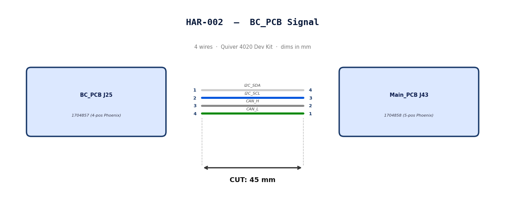

### 2. Bill of Materials (Kitting)
*Gather these parts before starting the build.*

| Item Type | Part Number | Description / Spec | Qty Needed |
| :--- | :--- | :--- | :--- |
| **Connector A** | 1704857 | 4-Pos Phoenix | 1 |
| **Terminals A** | Wire | Bare wire, twisted end | 4 |
| **Connector B** | 1704858 | 5-Pos Phoenix | 1 |
| **Terminals B** | Wire | Bare wire, twisted end | 4 |
| **Wire** | 20 AWG | Silicon | 240mm |
| **Sleeving** | Optional| Mesh | N/A|

### 3. Wire Prep (Cut & Strip)
*Prepare all wires before assembly.*

| Wire ID | Color | Gauge | Cut Length (mm) | Strip A (mm) | Strip B (mm) |
| :--- | :--- | :--- | :--- | :--- | :--- |
| **W1** | White | 20 AWG | 56mm | 6mm  | 6mm |
| **W2** | Blue | 20 AWG | 56mm | 6mm | 6mm |
| **W3** | Gray | 20 AWG | 56mm | 6mm | 6mm |
| **W4** | Green | 20 AWG | 56mm | 6mm | 6mm |

### 4. Termination & Pinout Map
*Connect End A to End B following this chart.*

| Wire ID | Color | From: 1704857  | To: 1704858 | Function / Signal |
| :--- | :--- | :--- | :--- | :--- |
| **W1** | White | **Pin 1** | 4 | I2C_SDA |
| **W2** | Blue | **Pin 2** | 3 | I2C_SCL |
| **W3** | Gray | **Pin 3** | 2| CAN_H |
| **W4** | Green | **Pin 4** | 1 | CAN_L |

### 5. Assembly Instructions
1.  **Prep:** Cut wires to length and strip insulation per Section 
4.  **Populate A:** Insert contacts into Connector A housing. *Verify "Click" and perform pull-back test.*
6.  **Populate B:** Insert contacts into Connector B housing.*Verify "Click" and perform pull-back test.*

---

### 6. Installation & Routing (Vehicle Integration)
Instructions for the technician installing this harness into the chassis.*

* **Source Connection:** Bat_PCB, J2
* **Destination Connection:** Main_PCB, J43
* **Routing Path:**
    * Path - N/A
    * Constraint - N/A
    * Fixing - N/A
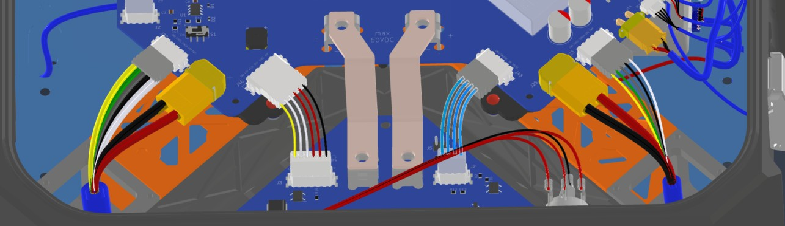    

## HAR-0003 BC_PCB SSR
| **FROM**    | **TO**  |
| ------------| ------- |
| BC_PCB J25|Main_PCB J46 |

### 1. Nailboard

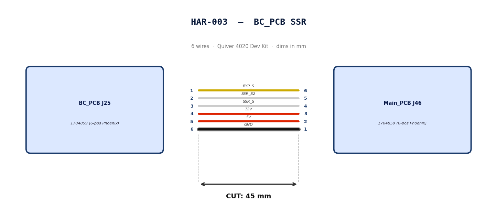

### 2. Bill of Materials (Kitting)
*Gather these parts before starting the build.*

| Item Type | Part Number | Description / Spec | Qty Needed |
| :--- | :--- | :--- | :--- |
| **Connector A** | 1704859| 6-Pos Phoenix | 1 |
| **Terminals A** | Wire | Bare wire, twisted end | 6|
| **Connector B** | 1704859| 6-Pos Phoenix | 1 |
| **Terminals B** | Wire | Bare wire, twisted end | 6|
| **Wire** | 20 AWG | Silicon | 50mm |
| **Sleeving** | Optional| Mesh | xx mm|

### 3. Wire Prep (Cut & Strip)
*Prepare all wires before assembly.*

| Wire ID | Color | Gauge | Cut Length (mm) | Strip A (mm) | Strip B (mm) |
| :--- | :--- | :--- | :--- | :--- | :--- |
| **W1** | Yellow| 20 AWG | 56mm | 6mm  | 6mm |
| **W2** | White| 20 AWG | 56mm | 6mm | 6mm |
| **W3** | White| 20 AWG | 56mm | 6mm | 6mm |
| **W4** | Red| 20 AWG | 56mm | 6mm | 6mm |
| **W5** | Red| 20 AWG | 56mm | 6mm | 6mm |
| **W6** | Black | 20 AWG | 56mm | 6mm | 6mm |

### 4. Termination & Pinout Map
*Connect End A to End B following this chart.*

| Wire ID | Color | From: 1704859| To: 1704859| Function / Signal |
| :--- | :--- | :--- | :--- | :--- |
| **W1** | Yellow| **Pin 1** | 6 | BYP_S|
| **W2** | White | **Pin 2** | 5 | SSR_S2|
| **W3** | White | **Pin 3** | 4| SSR_S|
| **W4** | Red | **Pin 4** | 3 | 12V|
| **W5** | Red | **Pin 5** | 2 | 5V|
| **W6** | Black | **Pin 6** | 1 | GND|

### 5. Assembly Instructions
1.  **Prep:** Cut wires to length and strip insulation per Section 
4.  **Populate A:** Insert contacts into Connector A housing. *Verify "Click" and perform pull-back test.*
6.  **Populate B:** Insert contacts into Connector B housing.*Verify "Click" and perform pull-back test.*

---

### 6. Installation & Routing (Vehicle Integration)
*Instructions for the technician installing this harness into the chassis.*

* **Source Connection:** Bat_PCB, J3
* **Destination Connection:** Main_PCB, J46
* **Routing Path:**
    * Path - 
    * Constraint - 
    * Fixing - 
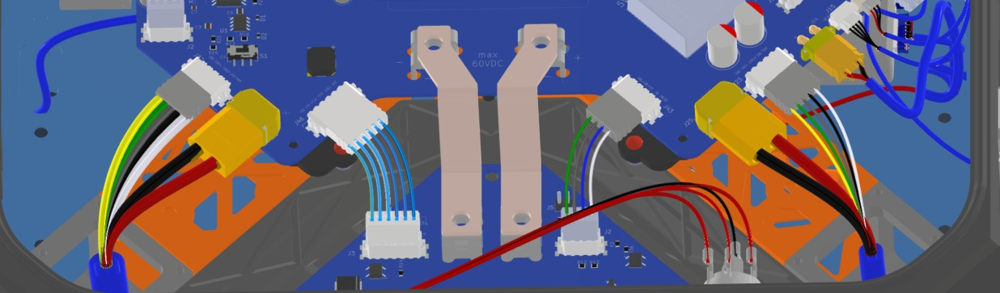

## HAR-0004 -> HAR-007 ESC Power 
| **FROM**    | **TO**  |
| ------------| ------- |
| Main_PCB J25|ESC1 PWR |
| Main_PCB J28|ESC2 PWR |
| Main_PCB J34|ESC3 PWR |
| Main_PCB J42|ESC4 PWR |

### 1. Nailboard

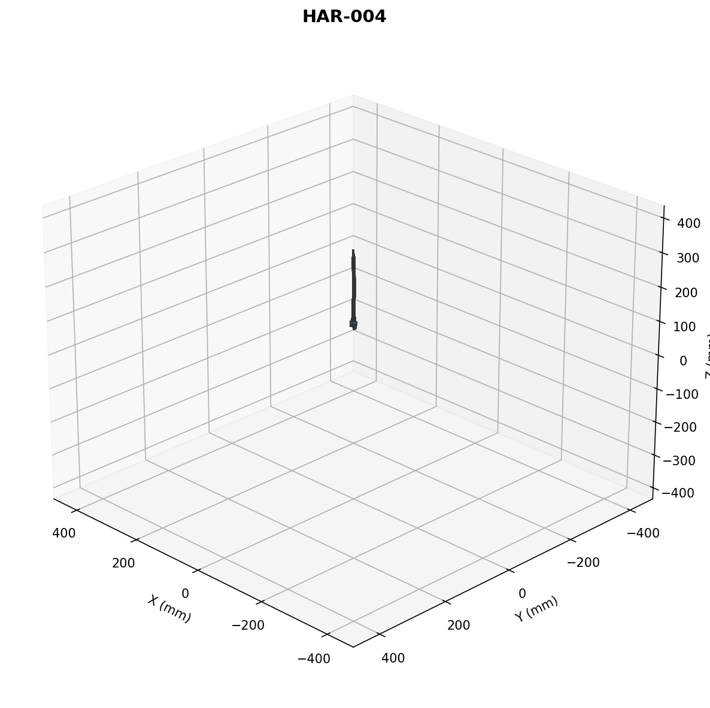

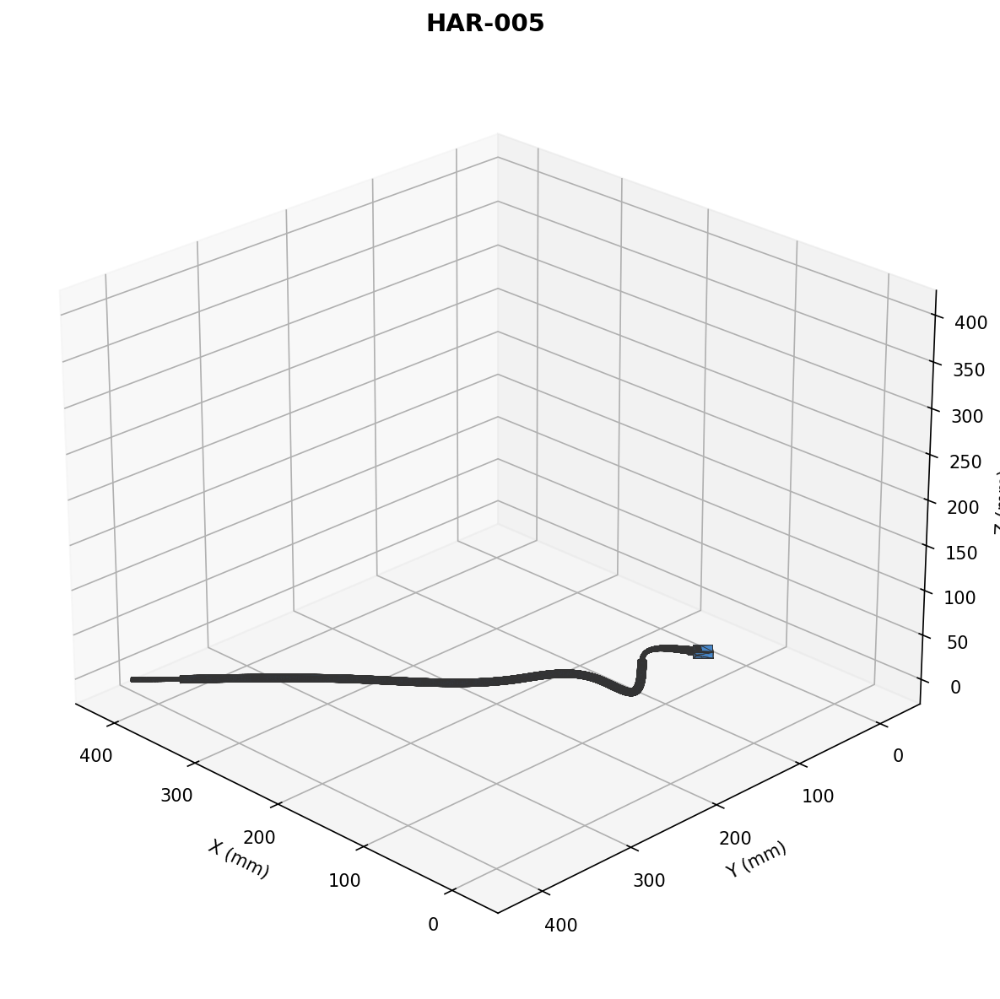

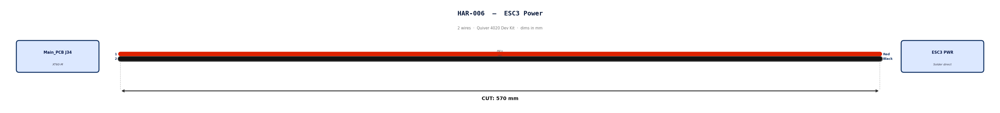

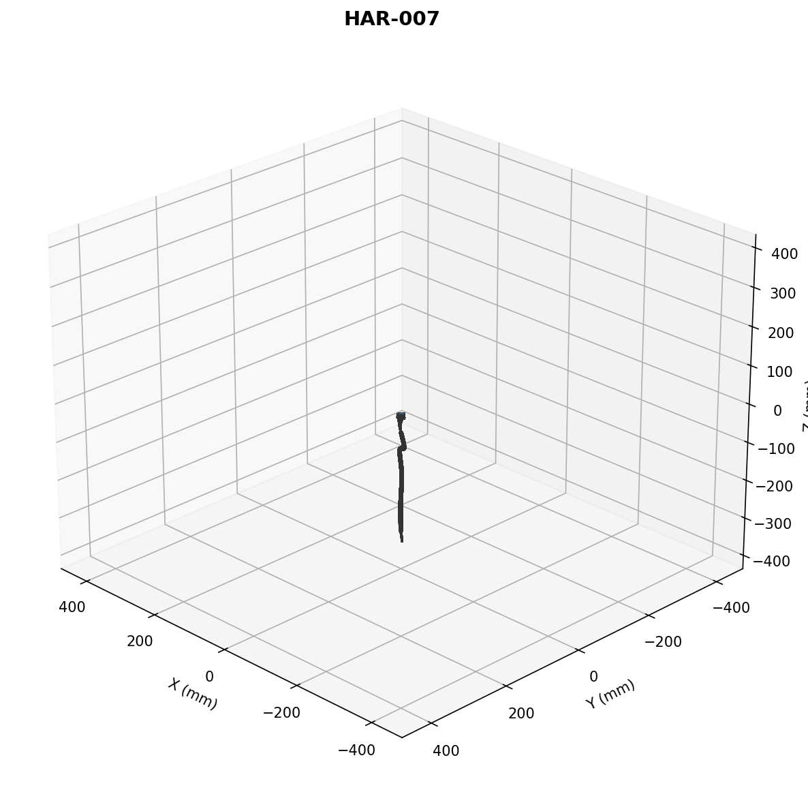

### 2. Bill of Materials (Kitting)
*Gather these parts before starting the build.*

| Item Type | Part Number | Description / Spec | Qty Needed |
| :--- | :--- | :--- | :--- |
| **Connector A** | XT60-M| 2-Pos XT-60| 1 |
| **Terminals A** | Wire | Solder | 2|
| **Wire** | 6 AWG | Silicon | 490mm |
| **Sleeving** | Required| 9.5mm ID Heatshrink at motor arm bend | 7cm |

### 3. Wire Prep (Cut & Strip)
*Prepare all wires before assembly.*

| Wire ID | Color | Gauge | Cut Length (mm) | Strip A (mm) | Strip B (mm) |
| :--- | :--- | :--- | :--- | :--- | :--- |
| **W1** | Red| 6 AWG | 490mm | 4mm  | N/A |
| **W2** | Black| 6 AWG | 490mm | 4mm | N/A|

### 4. Termination & Pinout Map
*Connect End A to End B following this chart.*

| Wire ID | Color | From: XT60-M| To: ESC1| Function / Signal |
| :--- | :--- | :--- | :--- | :--- |
| **W1** | Red| **Pin 1** | Red| HV+|
| **W2** | Black| **Pin 2** | Black| HV-|

### 6. Assembly Instructions (Not finished)
1.  **Prep:** Cut wires to length and strip insulation per Section 3.
4.  **Populate A:** Solder cables into Connector A housing.
6.  **Heatshrink:** Apply a 7cm 9.5mm ID Heathrink at the motor arm bend location. This heatshrink will protect the ESC Power and signal cables*

---

### 7. Installation & Routing (Vehicle Integration)
*Instructions for the technician installing this harness into the chassis.*

* **Source Connection:** Main_PCB, J27
* **Destination Connection:** ESC 1 PWR
* **Routing Path:**
    * Path - Through circular hole on upper plate to middle plate
    * Constraint - N/A
    * Fixing - N/A
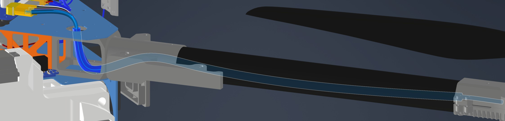

## HAR-0008 -> HAR-0011
| **FROM**    | **TO**  |
| ------------| ------- |
| Main_PCB J23|ESC1 Signal |
| Main_PCB J27|ESC2 Signal |
| Main_PCB J32|ESC3 Signal |
| Main_PCB J40|ESC4 Signal |

### 1. Nailboard

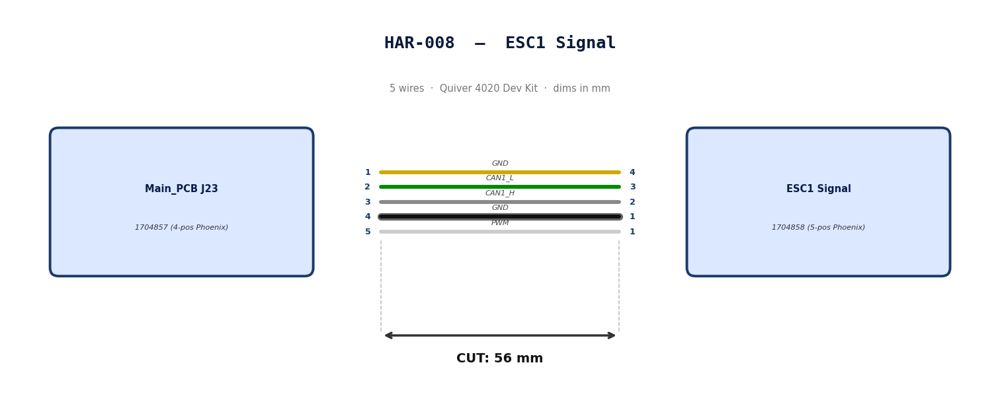

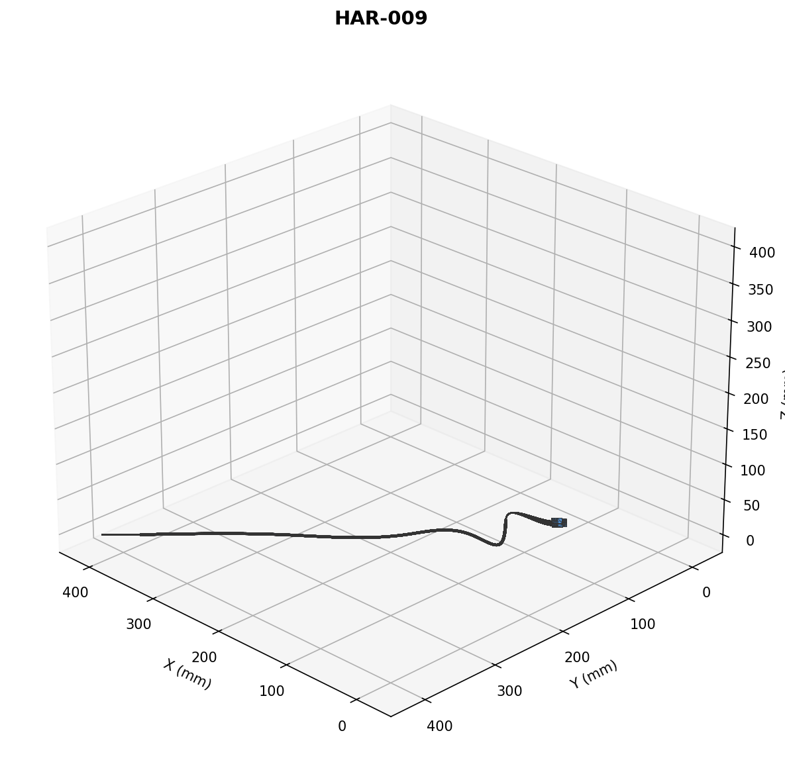

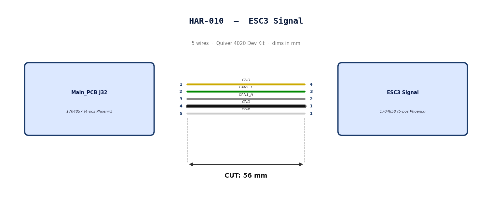

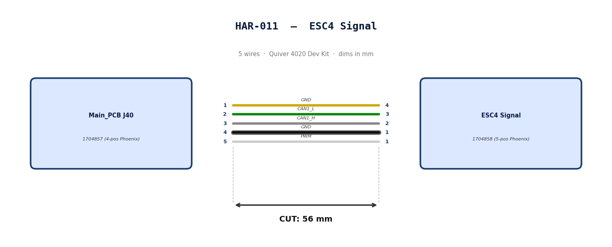

### 2. Bill of Materials (Kitting)
*Gather these parts before starting the build.*

| Item Type | Part Number | Description / Spec | Qty Needed |
| :--- | :--- | :--- | :--- |
| **Connector A** | 1704858 | 5-Pos Phoenix | 1 |
| **Terminals A** | Wire | Bare wire, twisted end | 5 |
| **Wire** | 20 AWG | Silicon | 240mm |
| **Sleeving** | Required| 9.5mm ID Heatshrink at motor arm bend | 7cm |

### 3. Wire Prep (Cut & Strip)
*Prepare all wires before assembly.*

| Wire ID | Color | Gauge | Cut Length (mm) | Strip A (mm) | Strip B (mm) |
| :--- | :--- | :--- | :--- | :--- | :--- |
| **W1** | Yellow | 20 AWG | 56mm | 6mm  | 6mm |
| **W2** | Green | 20 AWG | 56mm | 6mm | 6mm |
| **W3** | Gray | 20 AWG | 56mm | 6mm | 6mm |
| **W4** | Black | 20 AWG | 56mm | 6mm | 6mm |
| **W5** | White | 20 AWG | 56mm | 6mm | 6mm |

### 4. Termination & Pinout Map
*Connect End A to End B following this chart.*

| Wire ID | Color | From: 1704857  | To: 1704858 | Function / Signal |
| :--- | :--- | :--- | :--- | :--- |
| **W1** | Yellow | **Pin 1** | 4 | GND |
| **W2** | Green | **Pin 2** | 3 | CAN1_L |
| **W3** | Gray | **Pin 3** | 2| CAN1_H |
| **W4** | Black | **Pin 4** | 1 | GND |
| **W5** | White | **Pin 5** | 1 | PWM  |

### 5. Assembly Instructions
1.  **Prep:** Cut wires to length and strip insulation per Section 
4.  **Populate A:** Insert contacts into Connector A housing. *Verify "Click" and perform pull-back test.*
6.  **Heatshrink:** Apply a 7cm 9.5mm ID Heathrink at the motor arm bend location. This heatshrink will protect the ESC Power and signal cables*

---

### 6. Installation & Routing (Vehicle Integration)
Instructions for the technician installing this harness into the chassis.*

* **Source Connection:** Bat_PCB, J2
* **Destination Connection:** Main_PCB, J43
* **Routing Path:**
    * Path - N/A
    * Constraint - N/A
    * Fixing - N/A

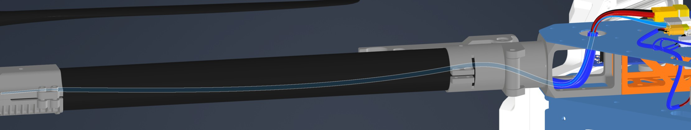

## HAR-0012 -> HAR-0013 Side Payloads
| **FROM**    | **TO**  |
| ------------| ------- |
| Main_PCB J29, J37|ATT_INT (right) |
| Main_PCB J30, J38|ATT_INT (left) |

### 1. Nailboard

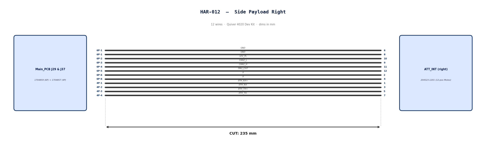

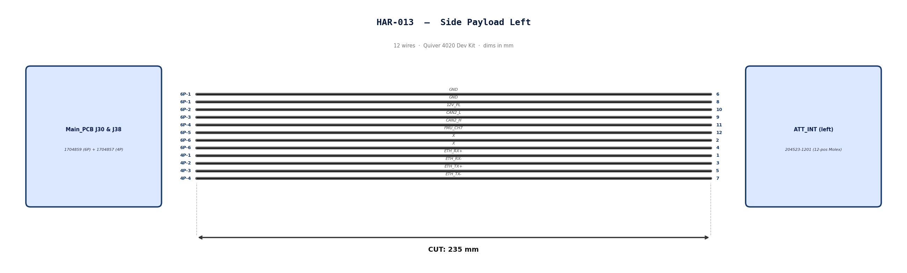

### 2. Bill of Materials (Kitting)
*Gather these parts before starting the build.*

| Item Type | Part Number | Description / Spec | Qty Needed |  
| :--- | :--- | :--- | :--- |  
|  **Connector A**  | 1704859| 6-Pos Phoenix | 1 |  
|  **Terminals A**  | Wire | Pre-crimped | 8|  
|  **Connector B**  | 1704857| 4-Pos Phoenix | 1 |  
|  **Terminals B**  | Wire | Pre-crimped | 4|  
|  **Connector C**  | 204523-1201| 12-Pos Molex | 1 |  
|  **Terminals C**  | Wire | Pre-crimped | 12|  
|  **Wire**  | 26 AWG | Pre-Crimped Lead | 235mm |  
|  **Sleeving**  | Optional| Mesh | xx mm|  

### 3. Wire Prep (Cut & Strip)
*All wires connecting the payload to the PCBs will use pre-crimped jumper wires.* 
**Mouser #: 538-79758-1149**  
  

| Wire ID | Color | AWG| Cut Length (mm) | Strip A (mm) | Strip B (mm) |  
| :--- | :--- | :--- | :--- | :--- | :--- |  
|  **W1**  | Black| 26 | 235mm | N/A| N/A|  
|  **W2**  | Black| 26  | 235mm | N/A| N/A|  
|  **W3**  | Black| 26  | 235mm | N/A| N/A|  
|  **W4**  | Black| 26  | 235mm | N/A| N/A|  
|  **W5**  | Black| 26  | 235mm  | N/A| N/A|  
|  **W6**  | Black| 26  | 235mm | N/A| N/A|  
|  **W7**  | Black| 26  | 235mm  | N/A| N/A|  
|  **W8**  | Black| 26  | 235mm  | N/A| N/A|  
|  **W9**  | Black| 26  | 235mm | N/A| N/A|  
|  **W10**  | Black| 26  | 235mm | N/A| N/A|  
|  **W11**  | Black| 26  | 235mm | N/A| N/A| 
|  **W12**  | Black| 26  | 235mm  | N/A| N/A| 

### 4. Termination & Pinout Map
*Connect End A or B to End C following this chart.*

| Wire ID | Color | From: 1704859| To: 204523-1201| Function / Signal |  
| :--- | :--- | :--- | :--- | :--- |  
|  **W1**  | Black|  **Pin 1**  | 6 | GND|  
|  **W2**  | Black|  **Pin 1**  | 8 | GND| 
|  **W3**  | Black|  **Pin 2**  | 10 | 12V_PL|  
|  **W4**  | Black|  **Pin 3**  | 9| CAN2_L|  
|  **W5**  | Black|  **Pin 4**  | 11 | CAN2_H|  
|  **W6**  | Black|  **Pin 5**  | 12 | FMU_CH7|  
|  **W7**  | Black |  **Pin 6**  | 2 | X|  
|  **W8**  | Black |  **Pin 6**  | 4 | X|

| Wire ID | Color | From: 1704857| To: 204523-1201| Function / Signal |  
| :--- | :--- | :--- | :--- | :--- |  
|  **W9**  | Black|  **Pin 1**  | 1 | ETH_RX+|  
|  **W10**  | Black|  **Pin 2**  | 3 | ETH_RX-|  
|  **W11**  | Black|  **Pin 3**  | 5| ETH_TX+|  
|  **W12**  | Black|  **Pin 4**  | 7 | ETH_TX-|  

### 5. Assembly Instructions
1.  **Populate A & B:** Insert contacts into Connector A housing. *Verify "Click" and perform pull-back test.*
2.  **Populate C:** Insert contacts into Connector B housing. Verify correct crimp orientation into [housing.](https://www.molex.com/content/dam/molex/molex-dot-com/products/automated/en-us/applicationspecificationspdf/505/505432/5054320000-AS-000.pdf)

---

### 6. Installation & Routing (Vehicle Integration)
*Instructions for the technician installing this harness into the chassis. Mirror the installation path for the payload on the opposite side.*

  

* **Source Connection:** Main_PCB J29 & J37  
* **Destination Connection:** ATT_INT (right)  
* **Routing Path:**  
 * Path -   Underneath MainPCB to middle plate side circular openings 
 * Constraint -   Telemetry air unit location
 * Fixing -   N/A
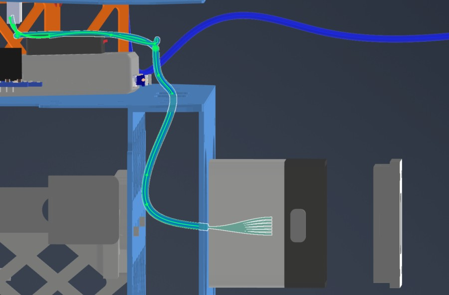

## HAR-0014 Bottom Payload 
| **FROM**    | **TO**  |
| -----------------| ------- |
| Main_PCB J31, J39|ATT_INT (bottom) |

### 1. Nailboard

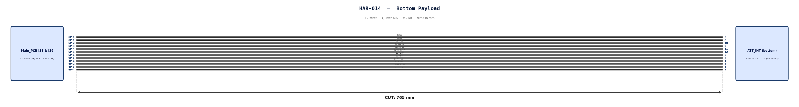

### 2. Bill of Materials (Kitting)
*Gather these parts before starting the build.*

| Item Type | Part Number | Description / Spec | Qty Needed |  
| :--- | :--- | :--- | :--- |  
|  **Connector A**  | 1704859| 6-Pos Phoenix | 1 |  
|  **Terminals A**  | Wire | Pre-crimped | 8|  
|  **Connector B**  | 1704857| 4-Pos Phoenix | 1 |  
|  **Terminals B**  | Wire | Pre-crimped | 4| 
|  **Connector C**  | 204523-1201| 12-Pos Molex | 1 | 
|  **Terminals C**  | Wire | Pre-crimped | 12| 
|  **Wire**  | 26 AWG | Pre-Crimped Lead | 205mm | 
|  **Sleeving**  | Optional| Mesh | xx mm| 

### 3. Wire Prep (Cut & Strip)
*All wires connecting the payload to the PCBs will use pre-crimped jumper wires.* 
**Mouser #: 538-79758-1149** 

Technician will have to combine two cables to create a 400mm cable. 

#### **Step 1: Cut to Length**

1.  Take two separate cable assemblies.
    
2.  Measure **205mm** from the back of the connector on the first cable.
    
3.  Cut the wire at the 205mm mark. Discard the excess.
    
4.  Repeat for the second cable.
    
    -   _Note: We cut to 205mm (not 200mm) to allow 5mm of overlap for the splice, resulting in a final length of 400mm._
        

#### **Step 2: Strip Insulation**

1.  Strip **5mm** of insulation from the _cut end_ of the first cable.
    
2.  Strip **5mm** of insulation from the _cut end_ of the second cable.
    

#### **Step 3: Insert Sleeve (Critical Step)**

1.  **Before connecting the wires**, slide the **Self-Solder Heat Shrink Sleeve** onto one of the cables.
    
2.  Slide it at least 50mm down the wire so the heat from soldering doesn't shrink it prematurely.
    

#### **Step 4: Mesh the Wires**

1.  Fan out the exposed strands of both cables slightly.
    
2.  Push the two ends together so the strands interlace (mesh) with each other inline. **Do not twist them side-by-side (pigtail).**
    
3.  Once meshed, twist the joined section to lock the strands together. The splice should be smooth and straight.
    

#### **Step 5: Position the Sleeve**

1.  Slide the solder sleeve over the twisted joint.
    
2.  Center the low-temperature **solder ring** directly over the bare copper twist.
    
3.  Ensure the colored **adhesive rings** (at the ends of the sleeve) are covering the wire insulation, not the bare copper.
    

#### **Step 6: Apply Heat**
    
1.  Using a heat gun, heat the **center solder ring** first. Watch for the solder to melt and flow into the wire strands (it will turn shiny and liquid).
    
2.  Move the heat to the ends of the sleeve to shrink the tubing and activate the waterproof adhesive seals.
    
3.  **Allow to cool** for 30 seconds before moving. Do not pull on the cable while the solder is hot.
    

#### **Final Check**

-   **Total Length:** Confirm the total length is **400mm**.
    
-   **Solder Joint:** Ensure the solder ring has fully melted and is not visible as a solid ring anymore.
    
-   **Insulation:** Ensure there is no exposed copper outside the sleeve.
  

| Wire ID | Color | AWG| Cut Length (mm) | Strip A (mm) | Strip B (mm) |  
| :--- | :--- | :--- | :--- | :--- | :--- |  
|  **W1**  | Black| 26 | 400mm | N/A| N/A|  
|  **W2**  | Black| 26  | 400mm | N/A| N/A|  
|  **W3**  | Black| 26  | 400mm | N/A| N/A|  
|  **W4**  | Black| 26  | 400mm | N/A| N/A|  
|  **W5**  | Black| 26  | 400mm | N/A| N/A|  
|  **W6**  | Black| 26  | 400mm | N/A| N/A|  
|  **W7**  | Black| 26  | 400mm | N/A| N/A|  
|  **W8**  | Black| 26  | 400mm | N/A| N/A|  
|  **W9**  | Black| 26  | 400mm | N/A| N/A|  
|  **W10**  | Black| 26  | 400mm | N/A| N/A|  
|  **W11**  | Black| 26  | 400mm | N/A| N/A| 
|  **W12**  | Black| 26  | 400mm | N/A| N/A| 
  

---  

### 4. Termination & Pinout Map
*Connect End A or B to End C following this chart.*

| Wire ID | Color | From: 1704859| To: 204523-1201| Function / Signal |  
| :--- | :--- | :--- | :--- | :--- |  
|  **W1**  | Black|  **Pin 1**  | 6 | GND|  
|  **W2**  | Black|  **Pin 1**  | 8 | GND| 
|  **W3**  | Black|  **Pin 2**  | 10 | 12V_PL|  
|  **W4**  | Black|  **Pin 3**  | 9| CAN2_L|  
|  **W5**  | Black|  **Pin 4**  | 11 | CAN2_H|  
|  **W6**  | Black|  **Pin 5**  | 12 | FMU_CH7|  
|  **W7**  | Black |  **Pin 6**  | 2 | 12VSW|  
|  **W8**  | Black |  **Pin 6**  | 4 | 12VSW|

| Wire ID | Color | From: 1704857| To: 204523-1201| Function / Signal |  
| :--- | :--- | :--- | :--- | :--- |  
|  **W9**  | Black|  **Pin 1**  | 1 | ETH_RX+|  
|  **W10**  | Black|  **Pin 2**  | 3 | ETH_RX-|  
|  **W11**  | Black|  **Pin 3**  | 5| ETH_TX+|  
|  **W12**  | Black|  **Pin 4**  | 7 | ETH_TX-|  

### 5. Assembly Instructions
1.  **Prep:** Cut wires to length and strip insulation per Section 3.
2.  **Label:** Install identification markers to the cables. This will help correctly adding cables to Phoenix connector
4.  **Populate A & B:** Insert contacts into Connector A & B housing. *Verify "Click" and perform pull-back test.*
6.  **Populate C:** Insert contacts into Connector C housing. Verify correct crimp orientation into [housing.](https://www.molex.com/content/dam/molex/molex-dot-com/products/automated/en-us/applicationspecificationspdf/505/505432/5054320000-AS-000.pdf)

### 6. Installation & Routing (Vehicle Integration)
*Instructions for the technician installing this harness into the chassis.*

* **Source Connection:** Main_PCB J31 & J39  
* **Destination Connection:** ATT INT (bottom)  
* **Routing Path:**  
 * Path -   Top Plate, right side opening, through mid plate openings, attached to the underside of the bottom plate
 * Constraint -   Number of cables passing through opentings
 * Fixing -   Various zip ties show in red
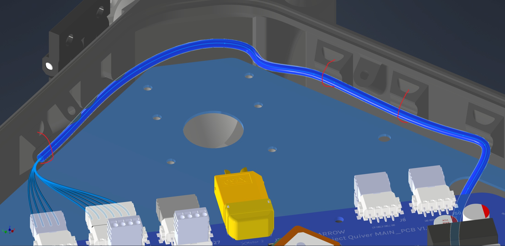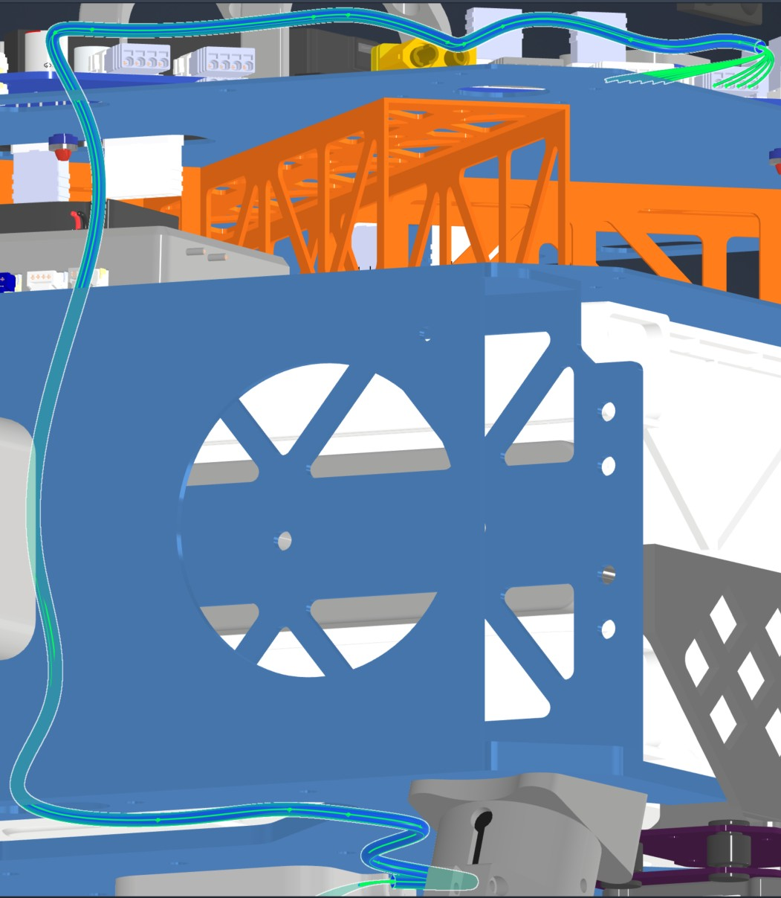

## HAR-0015 Altimeter
| **FROM**     | **TO**   |
| ------------ | -------- |
| Main_PCB J8  | NRA15    |

### 1. Nailboard

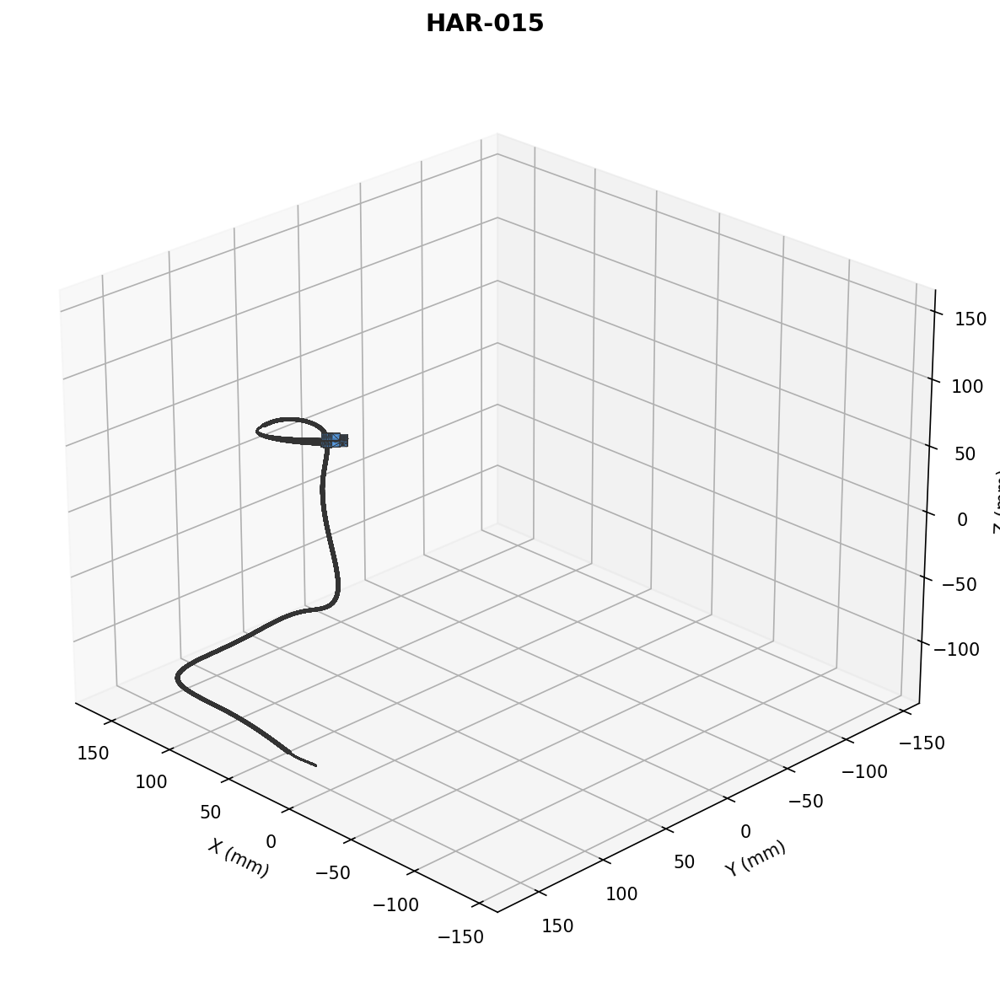

### 2. Bill of Materials (Kitting)
*Gather these parts before starting the build.*

| Item Type       | Part Number | Description / Spec     | Qty Needed |
|:--------------- |:----------- |:---------------------- |:---------- |
| **Connector A** | 1704857     | 4-Pos Phoenix          | 1          |
| **Terminals A** | Wire        | Bare wire, twisted end | 4          |
| **Wire**        | Default     | Silicon                | 190mm      |
| **Sleeving**    | Optional    | Mesh                   | xx mm      |

### 3. Wire Prep (Cut & Strip)
*Prepare all wires before assembly.*

| Wire ID | Color | Gauge | Cut Length (mm) | Strip A (mm) | Strip B (mm) |
| :--- | :--- | :--- | :--- | :--- | :--- |
| **W1** | Default| Default | 190mm | 6mm  | N/A|
| **W2** | Default| Default | 190mm | 6mm | N/A|
| **W3** | Default| Default | 190mm | 6mm | N/A|
| **W4** | Default| Default | 190mm | 6mm | N/A|

### 4. Termination & Pinout Map
*Connect End A to End B following this chart.*

| Wire ID | Color | From: 1704857  | To: NRA 15| Function / Signal |
| :--- | :--- | :--- | :--- | :--- |
| **W1** | White | **Pin 1** | 4 | GND|
| **W2** | Blue | **Pin 2** | 3 | CAN2_L|
| **W3** | Gray | **Pin 3** | 2| CAN2_H|
| **W4** | Green | **Pin 4** | 1 | 12V|

### 5. Assembly Instructions
1.  **Prep:** Cut wires to length and strip insulation per Section 3.
3.  **Crimp Side A:** Terminate Side A using [Tool Name/Die].
4.  **Populate A:** Insert contacts into Connector A housing. *Verify "Click" and perform pull-back test.*

---

### 6. Installation & Routing (Vehicle Integration)
*Instructions for the technician installing this harness into the chassis.*

* **Source Connection:** Main PCB, J8
* **Destination Connection:** NRA 15
* **Routing Path:**
    * Path - Right side top plate entry to bottom plate
    * Constraint - other cables
    * Fixing - Zip tie in red
 
 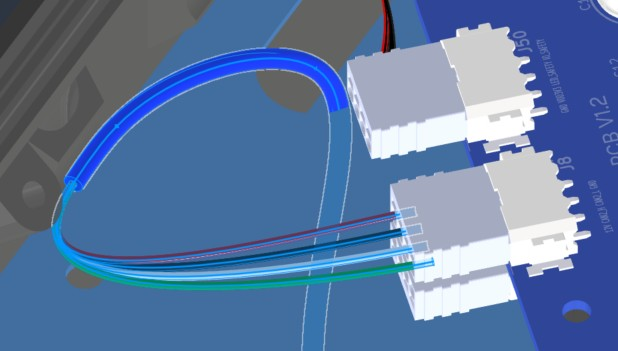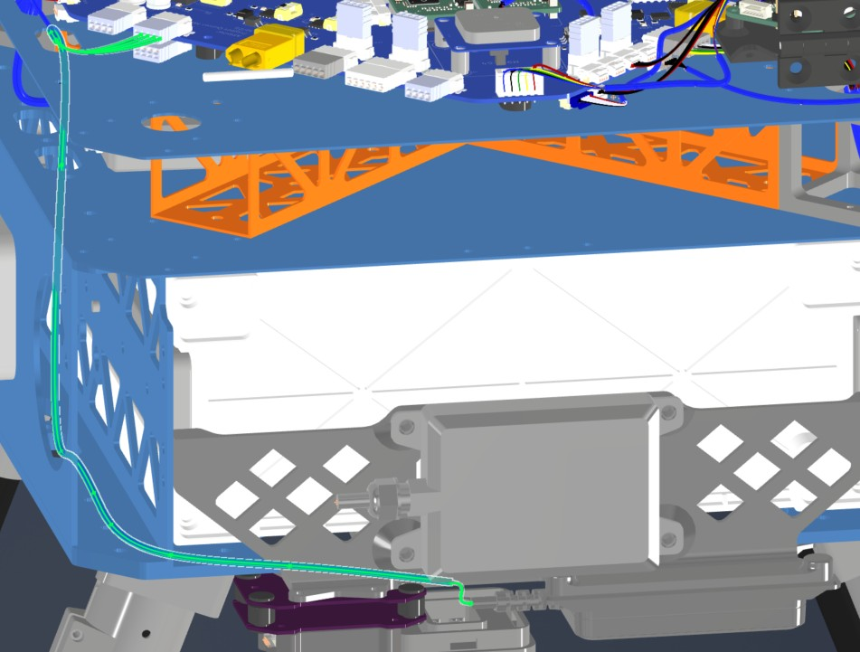   

## HAR-0016 360 LIDAR
| **FROM**     | **TO**   |
| ------------ | -------- |
| Main_PCB U5  | S2l      |

### 1. Nailboard

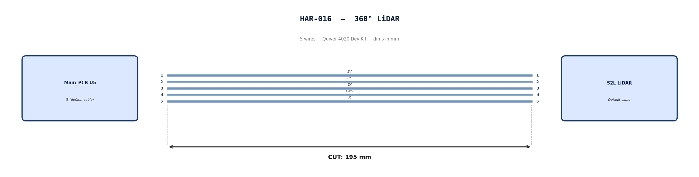

### 2. Bill of Materials (Kitting)
Default cable that comes with 360° Lidar. No modification required

### 3. Wire Prep (Cut & Strip)
*Use the default cable supplied with the 360° LiDAR module.*

| Cable | Required Length (mm) |
| :--- | :--- |
| Default LiDAR cable | 195 |

### 4. Termination & Pinout Map
*Connect End A to End B following this chart.*

| Wire ID | Color | From: J5| To: NRA 15| Function / Signal |
| :--- | :--- | :--- | :--- | :--- |
| **W1** | Default| **Pin 1** | 1| 5V|
| **W2** | Default| **Pin 2** | 2| RX|
| **W3** | Default| **Pin 3** | 3| TX|
| **W4** | Default| **Pin 4** | 4| GND|
| **W4** | Default| **Pin 5** | 5| X|

### 5. Assembly Instructions
N/A

---

### 6. Installation & Routing (Vehicle Integration)
*Instructions for the technician installing this harness into the chassis.*

* **Source Connection:** Main PCB, U5
* **Destination Connection:** S2L Lidar
* **Routing Path:**
    * Path - Downward towards connector
    * Constraint - N/A
    * Fixing - Zip tie in red

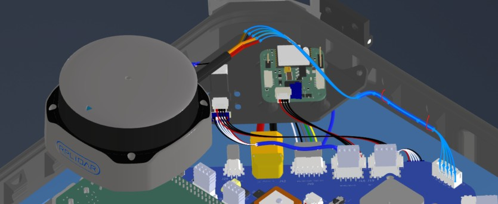

## HAR-0017 Front Radar
| **FROM**     | **TO**      |
| ------------ | ----------- |
| Main_PCB J49 | Front Radar |

### 1. Nailboard

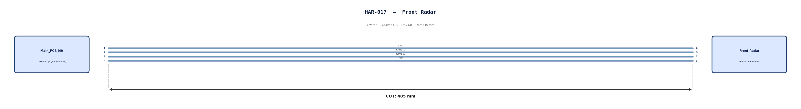

### 2. Bill of Materials (Kitting)
*Gather these parts before starting the build.*

| Item Type | Part Number | Description / Spec | Qty Needed |
| :--- | :--- | :--- | :--- |
| **Connector A** | 1704857 | 4-Pos Phoenix | 1 |
| **Terminals A** | Wire | Bare wire, twisted end | 4 |
| **Wire** | Default | Silicon | 190mm |
| **Sleeving** | Optional| Mesh | xx mm|

### 3. Wire Prep (Cut & Strip)
*Prepare all wires before assembly.*

| Wire ID | Color | Gauge | Cut Length (mm) | Strip A (mm) | Strip B (mm) |
| :--- | :--- | :--- | :--- | :--- | :--- |
| **W1** | Default| Default | 485 mm | 6mm  | N/A|
| **W2** | Default| Default | 485 mm | 6mm | N/A|
| **W3** | Default| Default | 485 mm | 6mm | N/A|
| **W4** | Default| Default | 485 mm | 6mm | N/A|

### 4. Termination & Pinout Map
*Connect End A to End B following this chart.*

| Wire ID | Color | From: 1704857  | To: NRA 15| Function / Signal |
| :--- | :--- | :--- | :--- | :--- |
| **W1** | Default| **Pin 1** | 4 | GND|
| **W2** | Default| **Pin 2** | 3 | CAN1_L|
| **W3** | Default| **Pin 3** | 2| CAN1_H|
| **W4** | Default| **Pin 4** | 1 | 12V|

### 5. Assembly Instructions
1.  **Prep:** Cut wires to length and strip insulation per Section 3.
4.  **Populate A:** Insert contacts into Connector A housing. *Verify "Click" and perform pull-back test.*
---

### 6. Installation & Routing (Vehicle Integration)
*Instructions for the technician installing this harness into the chassis.*

* **Source Connection:** Main PCB, J49
* **Destination Connection:** Front Radar
* **Routing Path:**
    * Path - Right side top plate entry to bottom plate
    * Constraint - other cables
    * Fixing - Zip tie in red

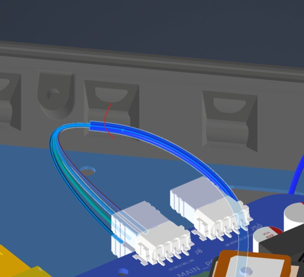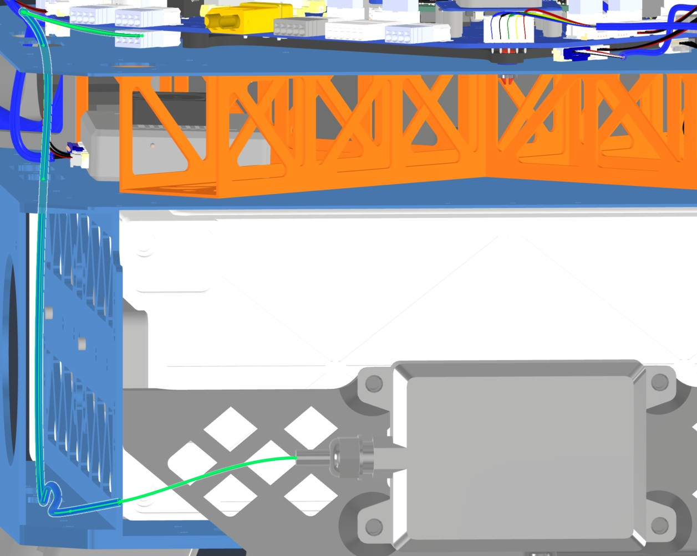

## HAR-0018 HM30 Power
| **FROM**    | **TO**  |
| ------------| ------- |
| Main_PCB J14|HM30 PWR |

### 1. Nailboard

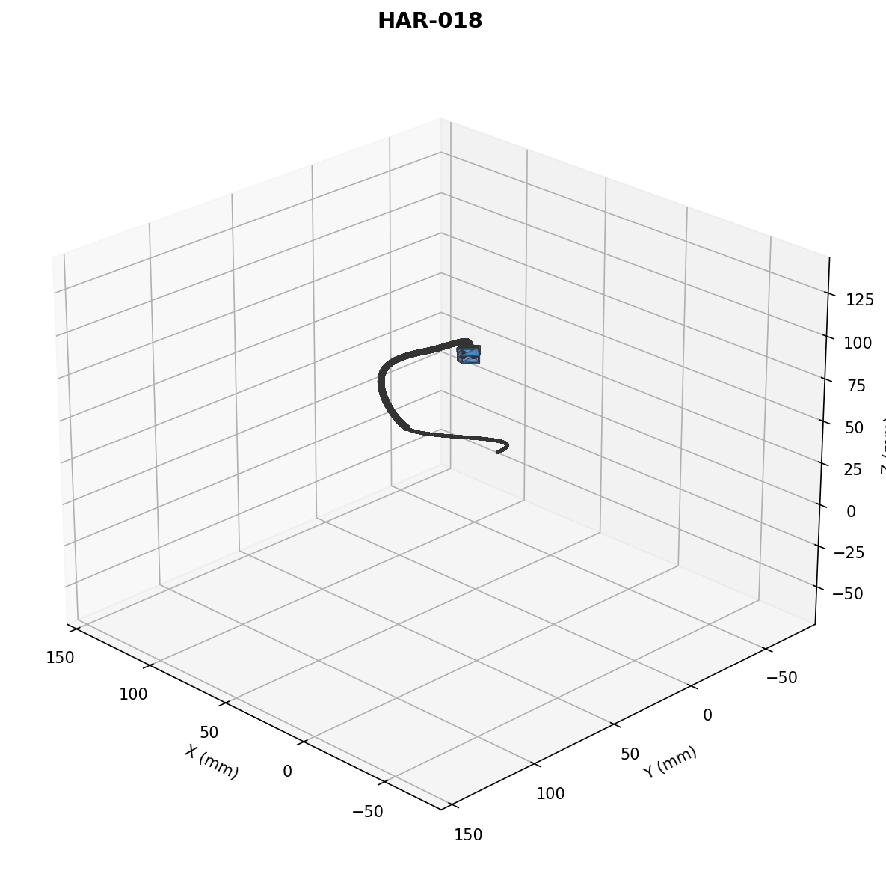

### 2. Bill of Materials (Kitting)
*Gather these parts before starting the build.*

| Item Type | Part Number | Description / Spec | Qty Needed |
| :--- | :--- | :--- | :--- |
| **Connector A** | XT30-M| 2-Pos XT-30| 1 |
| **Terminals A** | Wire | Solder | 2|
| **Wire** | 16 AWG | Silicon | 170mm |
| **Sleeving** | Optional| Mesh|  xx mm|

### 3. Wire Prep (Cut & Strip)
*Prepare all wires before assembly.*

| Wire ID | Color | Gauge     | Cut Length (mm) | Strip A (mm) |
|:------- |:----- |:--------- |:--------------- |:------------ |
| **W1**  | Red   | **Pin 1** | 185             | 10           |
| **W2**  | Black | **Pin 2** | 185             | 10           |

### 4. Termination & Pinout Map
*Connect End A to End B following this chart.*

| Wire ID | Color | From: 1704857  | To: Spade | Function / Signal |
| :--- | :--- | :--- | :--- | :--- |
| **W1** | Red | **Pin 1** | 1 | 12V |
| **W2** | Red | **Pin 2** | 2 | GND |

### 5. Assembly Instructions
1.  **Prep:** Cut wires to length and strip insulation per Section 3.
3.  **Solder Side A:** Solder cables into housing.
---

### 6. Installation & Routing (Vehicle Integration)
*Instructions for the technician installing this harness into the chassis.*

* **Source Connection:** Main_PCB, J27
* **Destination Connection:** ESC 1 PWR
* **Routing Path:**
    * Path - Right side top plate opening
    * Constraint - N/A
    * Fixing - N/A
    
 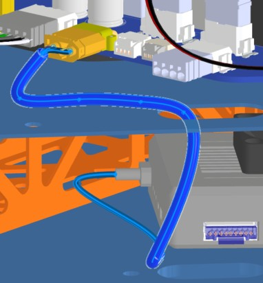   

## HAR-0019 -> HAR-0020 HM30 Signal
| **FROM**    | **TO**  |
| ------------| ------- |
| Main_PCB J15|HM30 UART |
| Main_PCB J17|HM30 SBUS |

### 1. Nailboard

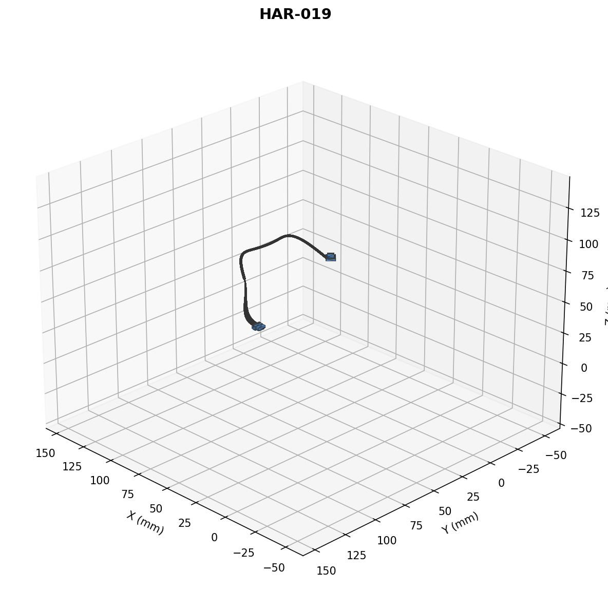

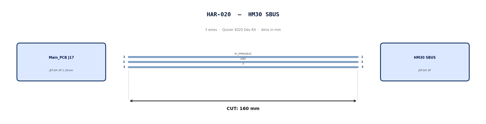

### 2. Bill of Materials (Kitting)
*Gather these parts before starting the build.*

| Item Type | Part Number | Description / Spec | Qty Needed |
| :--- | :--- | :--- | :--- |
|**4 Pin JST Cable** | N/A| JST, GH Connector Housing, 1.25mm Pitch, 4 Way| 1 |
|**3 Pin JST Cable** | N/A| JST, GH Connector Housing, 1.25mm Pitch, 3 Way| 1 |
| **Sleeving** | Optional| Mesh|  xx mm|

### 3. Wire Prep (Cut & Strip)
*Prepare all wires before assembly.*

Pre-made JST-GH cables. No crimping required — source cables at the required lengths below.

| Harness | Connector | Required Length (mm) |
| :--- | :--- | :--- |
| HAR-019 (HM30 UART) | JST-GH 4P | 170 |
| HAR-020 (HM30 SBUS) | JST-GH 3P | 160 |

### 4. Termination & Pinout Map
*Connect End A to End B following this chart.*

| Wire ID | Color | From: J15| To: HM30 UART| Function / Signal |
| :--- | :--- | :--- | :--- | :--- |
| **W1** | Default| **Pin 1** | 1| TX|
| **W2** | Default| **Pin 2** | 2| RX|
| **W1** | Default| **Pin 1** | 3| GND|
| **W2** | Default| **Pin 2** | 4| X|

| Wire ID | Color | From: J17| To: HM30 SBUS| Function / Signal |
| :--- | :--- | :--- | :--- | :--- |
| **W1** | Default| **Pin 1** | 1| IO_PPM_INPUT_AND_SBUS_INPUT|
| **W2** | Default| **Pin 2** | 2| GND|
| **W1** | Default| **Pin 1** | 3| x|

### 5. Assembly Instructions
N/A

---

### 6. Installation & Routing (Vehicle Integration)
*Instructions for the technician installing this harness into the chassis.*

* **Source Connection:** Bat_PCB J15, J17
* **Destination Connection:** HM30
* **Routing Path:**
    * Path - Right side top plate opening
    * Constraint - other cables
    * Fixing - Zip ties

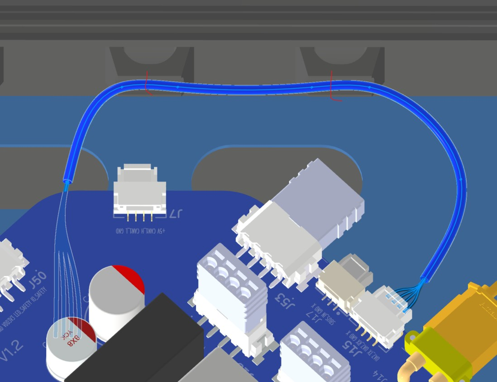  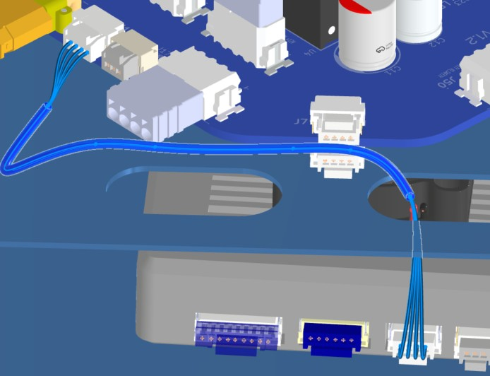  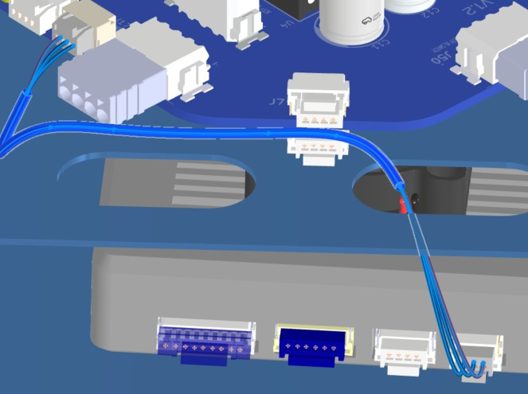

## HAR-0021 -> HAR-0022 Navigation
| **FROM**    | **TO**  |
| ------------| ------- |
| Main_PCB J7|F9P |
| Main_PCB J9|Mateksys |

### 1. Nailboard

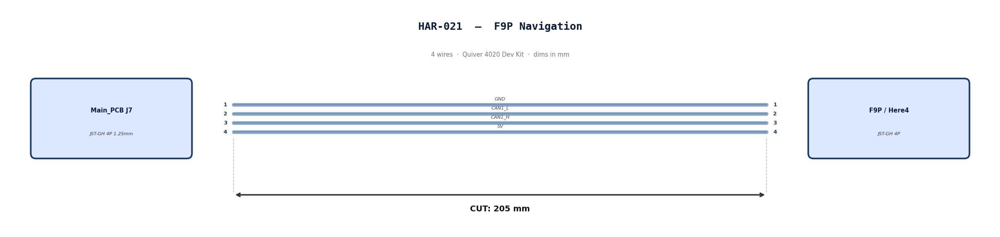

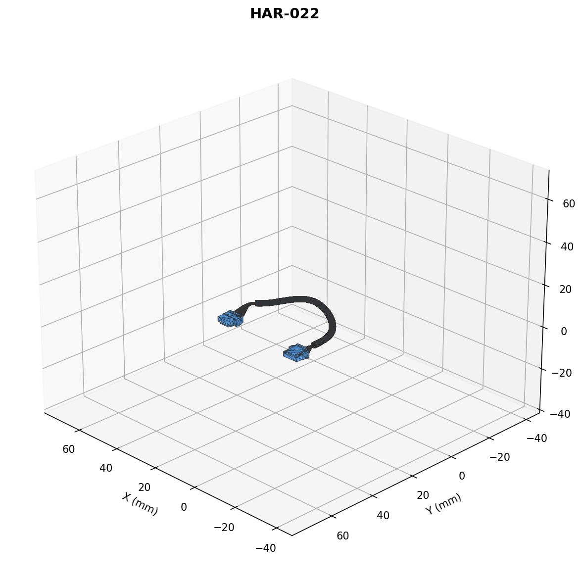

### 2. Bill of Materials (Kitting)
*Gather these parts before starting the build.*

| Item Type | Part Number | Description / Spec | Qty Needed |
| :--- | :--- | :--- | :--- |
|**4 Pin JST Cable** | N/A| JST, GH Connector Housing, 1.25mm Pitch, 4 Way| 2 |
| **Sleeving** | Optional| Mesh|  xx mm|

### 3. Wire Prep (Cut & Strip)
*Prepare all wires before assembly.*

Pre-made JST-GH cables. No crimping required — source cables at the required lengths below.

| Harness | Connector | Required Length (mm) |
| :--- | :--- | :--- |
| HAR-021 (F9P / Here4) | JST-GH 4P | 205 |
| HAR-022 (Mateksys)    | JST-GH 4P | 70  |

### 4. Termination & Pinout Map
*Connect End A to End B following this chart.*

| Wire ID | Color | From: J9| To: M9N| Function / Signal |
| :--- | :--- | :--- | :--- | :--- |
| **W1** | Default| **Pin 1** | 1| GND|
| **W2** | Default| **Pin 2** | 2| CAN1_L|
| **W3** | Default| **Pin 1** | 3| CAN1_H|
| **W4** | Default| **Pin 2** | 4| 5V|

| Wire ID | Color | From: J7| To: F9P| Function / Signal |
| :--- | :--- | :--- | :--- | :--- |
| **W1** | Default| **Pin 1** | 1| GND|
| **W2** | Default| **Pin 2** | 2| CAN1_L|
| **W3** | Default| **Pin 1** | 3| CAN1_H|
| **W4** | Default| **Pin 2** | 4| 5V|

### 5. Assembly Instructions
N/A

---

### 6. Installation & Routing (Vehicle Integration)
*Instructions for the technician installing this harness into the chassis.*
* **Source Connection:** Main_PCB J7, J9
* **Destination Connection:**  F9P/Here 4, Mateksys
* **Routing Path:**
    * Path - Immediately to the right
    * Constraint - N/A
    * Fixing - N/A

  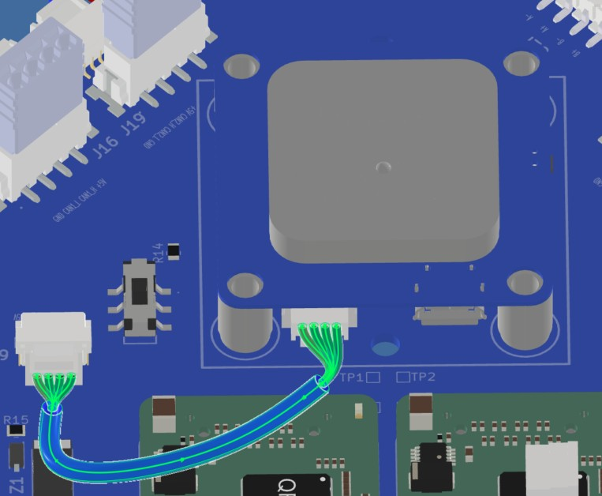  

## HAR-0023 -> HAR-0025 PPP2ETH
| **FROM**     | **TO**  |
| ------------ | ------- |
| Main_PCB J35 | PPP2ETH |
| Main_PCB J36 | PPP2ETH |
| Main_PCB J41 | PPP2ETH |

### 1. Nailboard

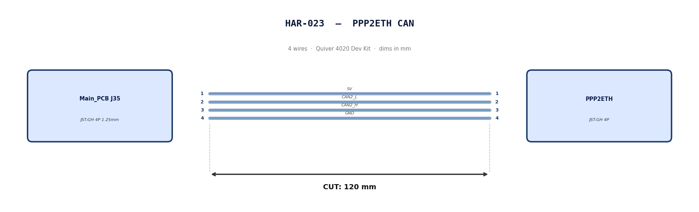

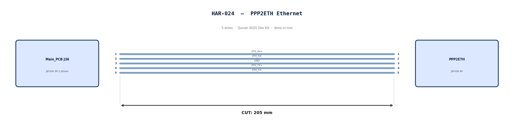

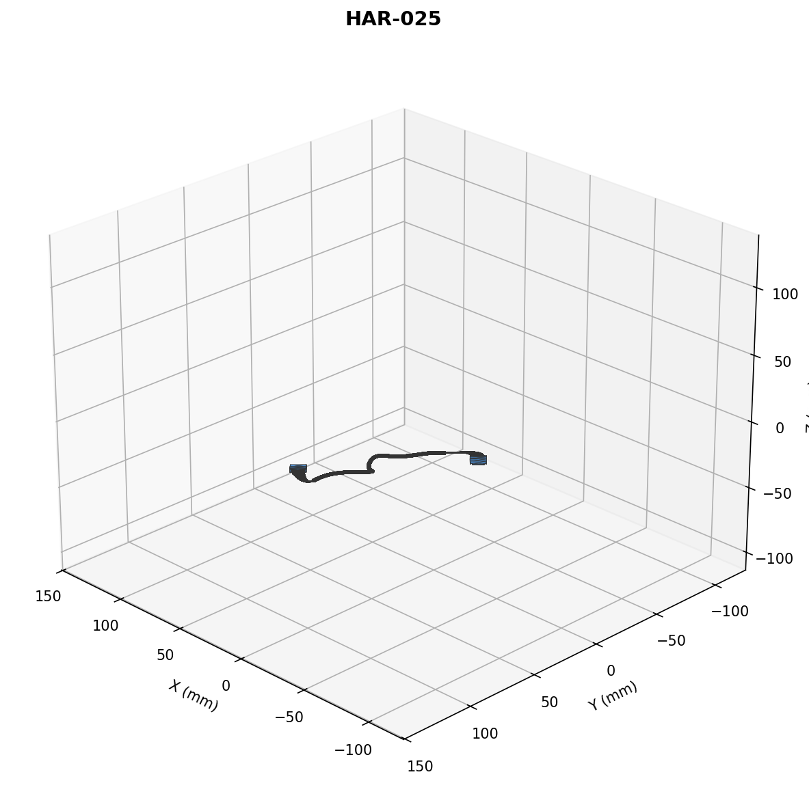

### 2. Bill of Materials (Kitting)
*Gather these parts before starting the build.*

| Item Type | Part Number | Description / Spec | Qty Needed |
| :--- | :--- | :--- | :--- |
|**4 Pin JST Cable** | N/A| JST, GH Connector Housing, 1.25mm Pitch, 4 Way| 1 |
|**5 Pin JST Cable** | N/A| JST, GH Connector Housing, 1.25mm Pitch, 5 Way| 1 |
|**6 Pin JST Cable** | N/A| JST, GH Connector Housing, 1.25mm Pitch, 6 Way| 1 |
| **Sleeving** | Optional| Mesh|  xx mm|

### 3. Wire Prep (Cut & Strip)
*Prepare all wires before assembly.*

Pre-made JST-GH cables. No crimping required — source cables at the required lengths below.

| Harness | Connector | Required Length (mm) |
| :--- | :--- | :--- |
| HAR-023 (PPP2ETH CAN)      | JST-GH 4P | 120 |
| HAR-024 (PPP2ETH Ethernet) | JST-GH 5P | 205 |
| HAR-025 (PPP2ETH UART)     | JST-GH 6P | 155 |

### 4. Termination & Pinout Map
*Connect End A to End B following this chart.*

| Wire ID | Color | From: J35| To: PPP2ETH| Function / Signal |
| :--- | :--- | :--- | :--- | :--- |
| **W1** | Default| **Pin 1** | 1| 5V|
| **W2** | Default| **Pin 2** | 2| CAN2_L|
| **W3** | Default| **Pin 3** | 3| CAN2_H|
| **W4** | Default| **Pin 4** | 4| GND|

| Wire ID | Color | From: J7| To: PPP2ETH| Function / Signal |
| :--- | :--- | :--- | :--- | :--- |
| **W1** | Default| **Pin 1** | 1| ETH_RX+|
| **W2** | Default| **Pin 2** | 2| ETH_RX-|
| **W3** | Default| **Pin 3** | 3| GND|
| **W4** | Default| **Pin 4** | 4| ETH_TX+|
| **W5** | Default| **Pin 5** | 5| ETH_TX-|

| Wire ID | Color | From: J7| To: PPP2ETH| Function / Signal |
| :--- | :--- | :--- | :--- | :--- |
| **W1** | Default| **Pin 1** | 1| 5V|
| **W2** | Default| **Pin 2** | 2| UART5_RX_TEL2|
| **W3** | Default| **Pin 3** | 3| UART5_TX_TEL2|
| **W4** | Default| **Pin 4** | 4| UART5_CTS_TEL2|
| **W5** | Default| **Pin 5** | 5| UART5_RTS_TEL2|
| **W6** | Default| **Pin 6** | 6| GND|

### 5. Assembly Instructions
N/A

---

### 6. Installation & Routing (Vehicle Integration)
*Instructions for the technician installing this harness into the chassis.*

* **Source Connection:** Main_PCB J35, J36, J41
* **Destination Connection:**  PPP2ETH
* **Routing Path:**
    * Path - Direct connections. HAR024 will be routed under PPP, Beacon mounting board
    * Constraint - PPP,Beacon mounting board
    * Fixing - zip tie in red (HAR024)

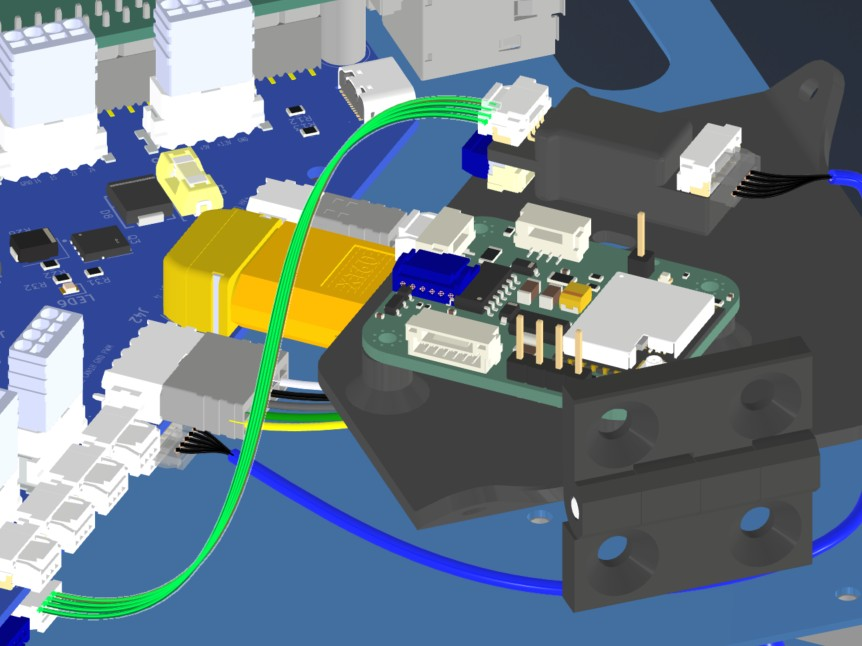 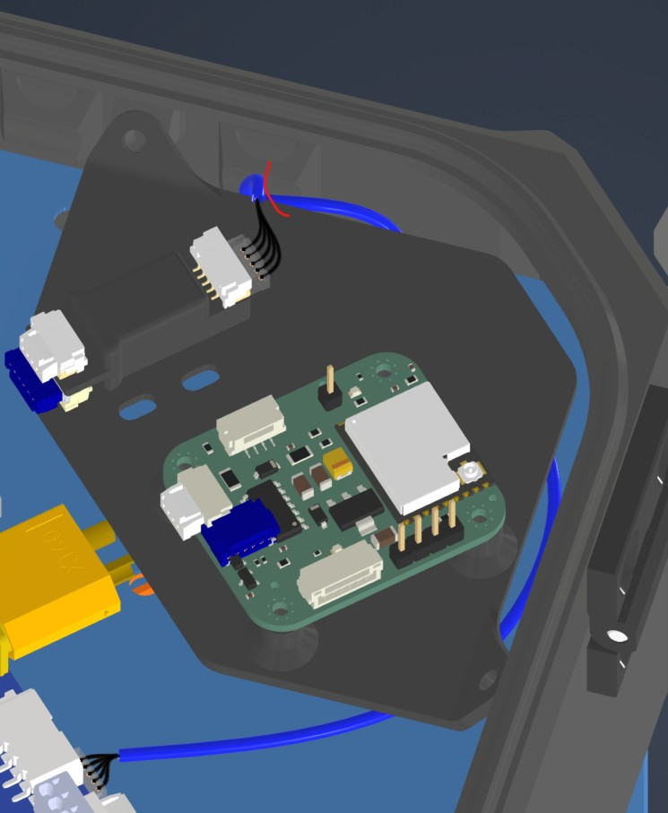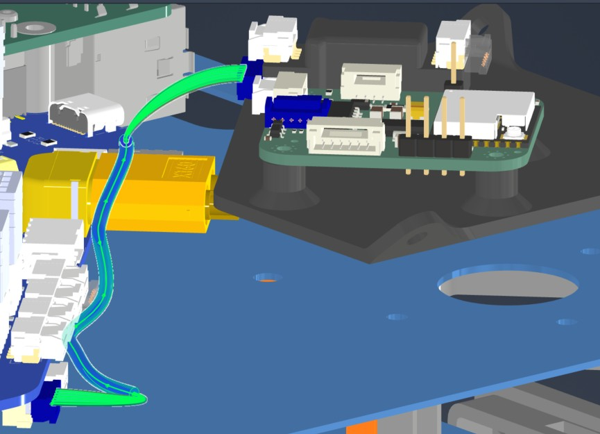   

## HAR-0026 Remote ID

| **FROM**    | **TO**  |
| ------------| ------- |
| Main_PCB J20|Remote ID CAN |

### 1. Nailboard

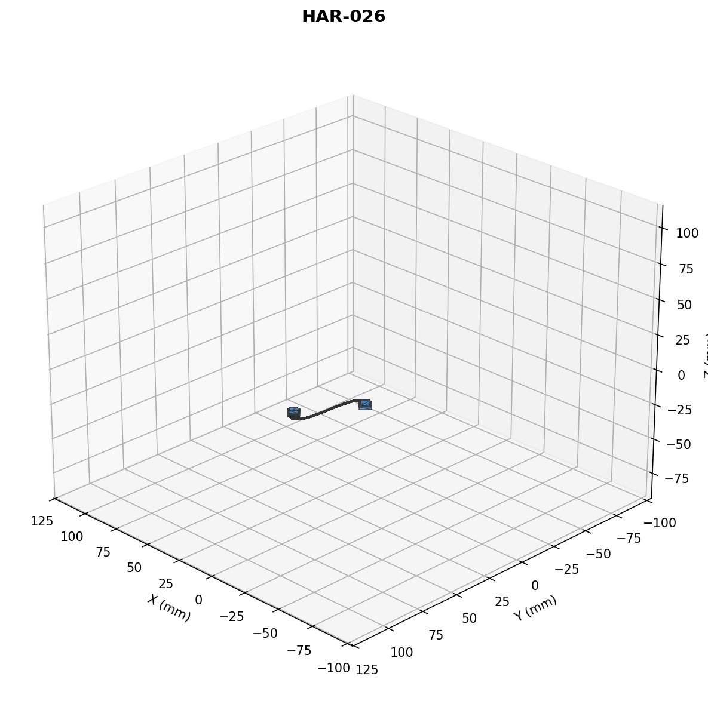

### 2. Bill of Materials (Kitting)
*Gather these parts before starting the build.*

| Item Type | Part Number | Description / Spec | Qty Needed |
| :--- | :--- | :--- | :--- |
|**4 Pin JST Cable** | N/A| JST, GH Connector Housing, 1.25mm Pitch, 4 Way| 1 |
| **Sleeving** | Optional| Mesh|  xx mm|

### 3. Wire Prep (Cut & Strip)
*Prepare all wires before assembly.*

Pre-made JST-GH cable. No crimping required — source cable at the required length below.

| Harness | Connector | Required Length (mm) |
| :--- | :--- | :--- |
| HAR-026 (Remote ID) | JST-GH 4P | 65 |

### 4. Termination & Pinout Map
*Connect End A to End B following this chart.*

| Wire ID | Color | From: J20| To: RID| Function / Signal |
| :--- | :--- | :--- | :--- | :--- |
| **W1** | Default| **Pin 1** | 1| 5V|
| **W2** | Default| **Pin 2** | 2| CAN1_L|
| **W3** | Default| **Pin 3** | 3| CAN1_H|
| **W4** | Default| **Pin 4** | 4| GND|

### 5. Assembly Instructions
N/A

---

### 6. Installation & Routing (Vehicle Integration)
*Instructions for the technician installing this harness into the chassis.*

* **Source Connection:** Main_PCB J20
* **Destination Connection:**  RID
* **Routing Path:**
    * Path - Direct connection
    * Constraint - N/A
    * Fixing - N/A

 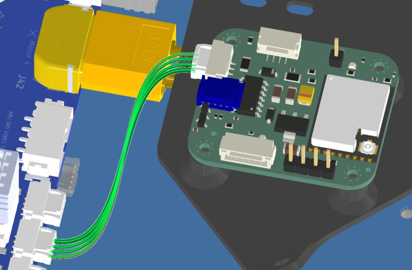   

## HAR-0027 SIYI Camera
| **FROM**    | **TO**  |
| ------------| ------- |
| HM30 LAN & PWR|A8 PWR |
| HM30 LAN & PWR|A8 Video & Protocol |

### 1. Nailboard

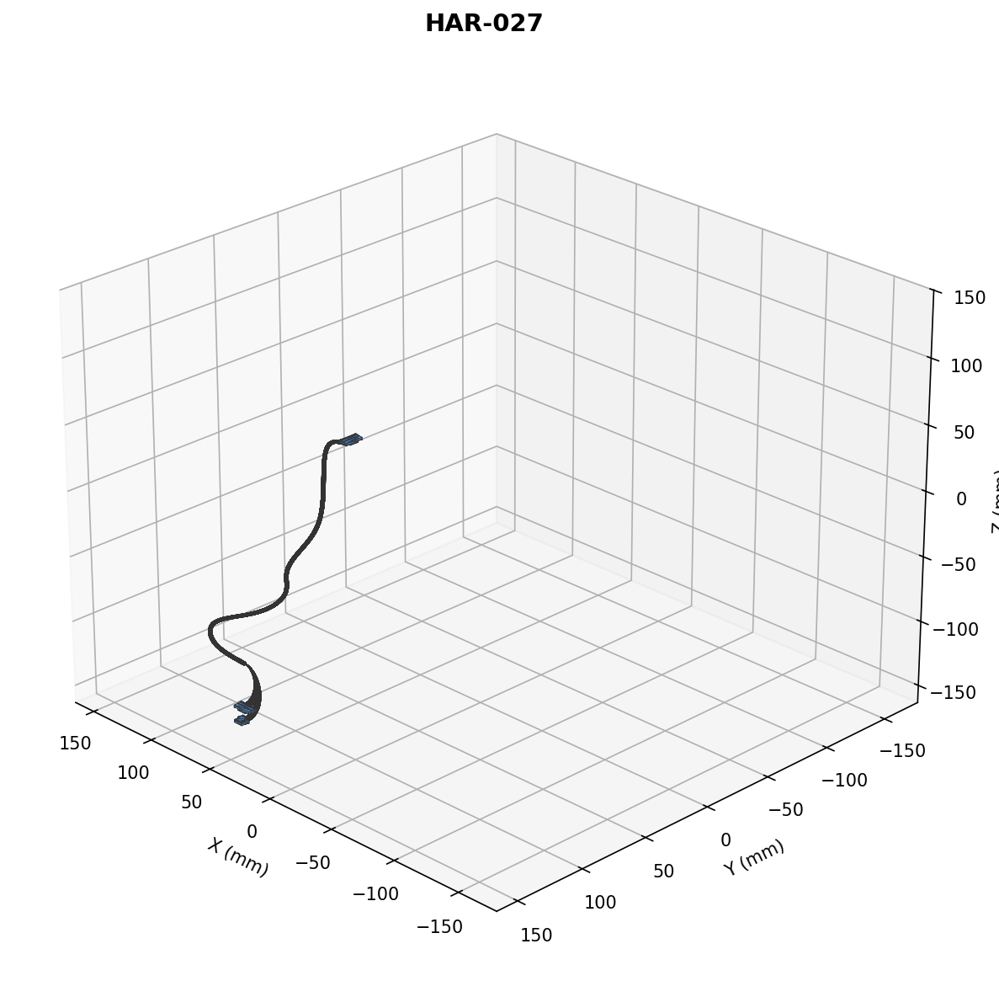

### 2. Bill of Materials (Kitting)
*Gather these parts before starting the build.*

| Item Type | Part Number | Description / Spec | Qty Needed |
| :--- | :--- | :--- | :--- |
|**4 Pin JST Cable** | N/A| JST, GH Connector Housing, 1.25mm Pitch, 4 Way| 1 |
|**8 Pin JST Cable** | N/A| JST, GH Connector Housing, 1.25mm Pitch, 6 Way| 1 |
| **Sleeving** | Optional| Mesh|  xx mm|

### 3. Wire Prep (Cut & Strip)
*Prepare all wires before assembly.*

Pre-made JST-GH cables. No crimping required — source cables at the required lengths below.

| Harness | Connector | Required Length (mm) |
| :--- | :--- | :--- |
| HAR-027 power (4P) | JST-GH 4P | 325 |
| HAR-027 video (8P) | JST-GH 8P | 325 |

### 4. Termination & Pinout Map
*Connect End A to End B following this chart.*

| Wire ID | Color | From: HM30 LAN & PWR| To: A8 PWR| Function / Signal |
| :--- | :--- | :--- | :--- | :--- |
| **W1** | Default| **Pin 1** | 1| 12V|
| **W2** | Default| **Pin 1** | 2| 12V|
| **W3** | Default| **Pin 2** | 3| GND|
| **W4** | Default| **Pin 2** | 4| GND|
 
  
 
| Wire ID | Color | From: HM30 LAN & PWR| To: A8 Vid| Function / Signal |
| :--- | :--- | :--- | :--- | :--- |
| **W1** | Default| **Pin 3** | 3| ETH_TX+|
| **W2** | Default| **Pin 4** | 4| ETH_TX-|
| **W3** | Default| **Pin 5** | 5| ETH_RX+|
| **W4** | Default| **Pin 6** | 6| ETH_RX-|

### 5. Assembly Instructions
N/A

---

### 6. Installation & Routing (Vehicle Integration)
*Instructions for the technician installing this harness into the chassis.*

* **Source Connection:** HM30 LAN & PWR
* **Destination Connection:**  SIYI A8
* **Routing Path:**
    * Path - Right side middle plate opening to underside of bottom plate
    * Constraint - Other cables
    * Fixing - Undecided zip ties

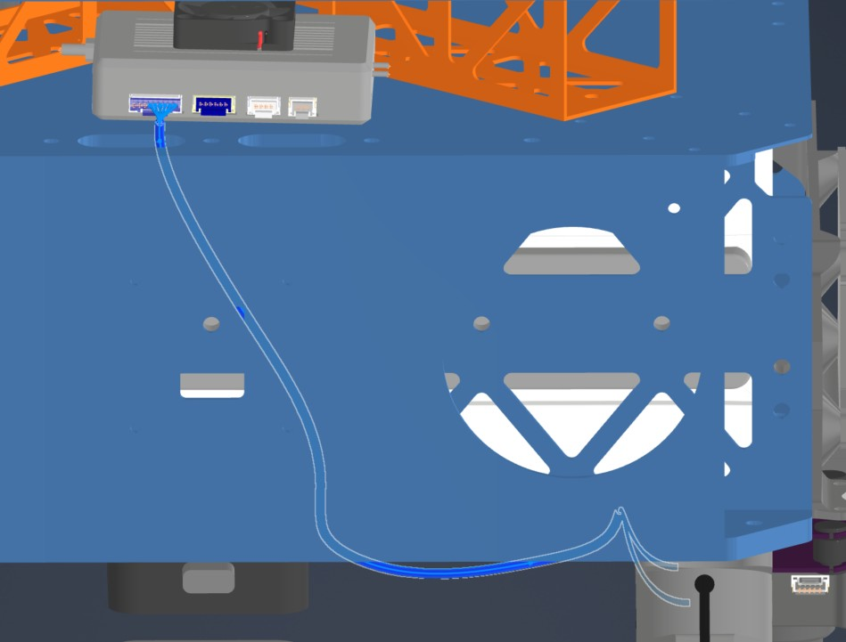  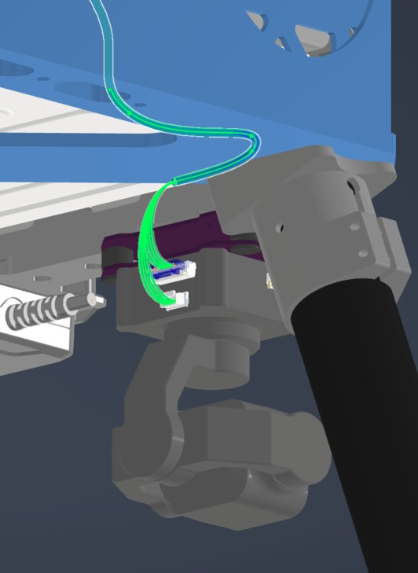  

## HAR-0028 Antenna
| **FROM**    | **TO**  |
| ------------| ------- |
| Antenna 1|HM30 |
| Antenna 2|HM30 |

### 1. Nailboard

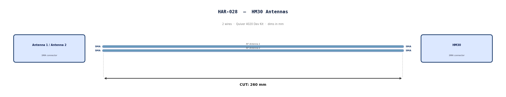

### 2. Bill of Materials (Kitting)
*Gather these parts before starting the build.*

Pre made cables with SMA connector. Length adjustment not required. 

### 3. Wire Prep (Cut & Strip)
N/A

### 4. Termination & Pinout Map
N/A

### 5. Assembly Instructions
N/A

---

### 6. Installation & Routing (Vehicle Integration)
*Instructions for the technician installing this harness into the chassis.*

* **Source Connection:** Antenna
* **Destination Connection:** HM30 
* **Routing Path:**
    * Path - Through enclosure provisions to middle plate
    * Constraint - N/A
    * Fixing - N/A

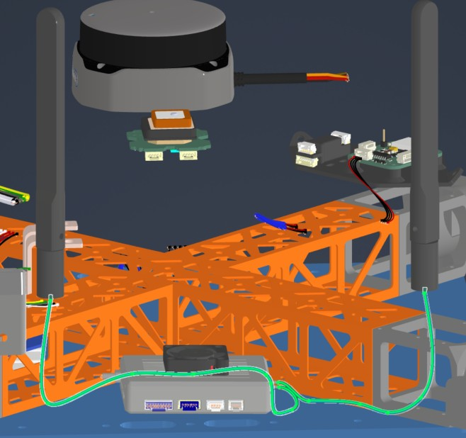    
