# **Project Quiver PT3 Structural Assembly Guide**

## BOM for the Assembly

### Table 1. Structure Parts

|	 ID	|	Part Name	|	Material	|	Sourcing	|	Quantity	|
|	--------	|	--------	|	--------	|	--------	|	--------	|
|	1111	|	 Upper plate	|	Aluminum	|	Laser Cut	|	1	|
|	1112	|	 Middle plate   	|	Aluminum	|	Laser Cut	|	1	|
|	1113	|	 Lower plate    	|	Aluminum	|	Laser Cut	|	1	|
|	1211	|	 Cockpit Support Beam CW Long	|	Aluminum	|	Laser Cut	|	1	|
|	121X	|	 Cockpit Support Beam CCW Back	|	Aluminum	|	Laser Cut	|	2	|
|	122X	|	Battery Wall	|	Aluminum	|	Laser Cut	|	2	|
|	131X	|	Landing Gear Vertical Tubes	|	Carbon-Fiber	|	Cut-to-Length	|	4	|
|	132X	|	Landing Gear Horizontal Tubes	|	Carbon-Fiber	|	Cut-to-Length	|	2	|
|	133X	|	Landing Gear Main Adapters	|	Aluminum	|	Off-the-Shelf	|	4	|
|	134X	|	Landing Gear Tube Joints	|	Aluminum	|	Off-the-Shelf	|	4	|
|	14X1	|	 Foldable Motor Arm Connectors	|	Aluminum	|	Off-the-Shelf	|	4	|
|	14X2	|	Motor Arm Tubes	|	Carbon-Fiber	|	Cut-to-Length	|	4	|
|	21X2	|	Attachment Interface	|	Aluminum	|	Off-the-Shelf	|	3	|
|	21X1	|	Attachment Interface Spacer Left & Right	|	PETG-CF	|	3D Print	|	2	|
|	2131	|	Attachment Interface Spacer Bottom	|	PETG-CF	|	3D Print	|	1	|
|	221X	|	Battery sliders	|	PETG-CF	|	3D Print	|	2	|
|	2311	|	Main PCB Mount	|	PETG	|	3D Print	|	1	|
|	2312	|	BC PCB Mount	|	PETG	|	3D Print	|	1	|
|	2313	|	BC PCB Cover	|	PETG-CF	|	3D Print	|	1	|
|	2321	|	Sensor Mount	|	PETG-CF	|	3D Print	|	1	|
|	2331	|	GNSS Mount	|	PETG	|	3D Print	|	1	|
|	2341	|	PPP Adapter & Beacon Mount	|	PETG	|	3D Print	|	1	|
|	2411	|	Main Enclosure	|	PETG	|	3D Print	|	1	|
|	2412	|	Enclosure Top Cap	|	PETG	|	3D Print	|	1	|
|	242X	|	Enclosure Hinge	|	Zinc	|	Off-the-Shelf	|	2	|
|	243X	|	Enclosure Latch	|	Steel	|	Off-the-Shelf	|	2	|

### Table 2. Fasteners
|	Fastener ID	|	Fastener Description	|	Quantity	|	Reference Part	|
|	--	|	--	|	--	|	--	|
|	Rivet 1	|	4mm Diameter for 1 mm - 2.5 mm thickness	|	26	|	[97525A224](https://www.mcmaster.com/97525A224/)	|
|	Rivet 2	|	4mm Diameter for 2.5 mm - 4.5 mm thickness	|	10	|	[97525A251](https://www.mcmaster.com/97525A251)	|
|	Rivet 3	|	4mm Diameter for 4.5 mm - 6.4 mm thickness	|	10	|	[97525A226](https://www.mcmaster.com/97525A226)	|
|	Screw 1	|	Socket Head Screw M3x10	|	8	|	[91292A113](https://www.mcmaster.com/91292A113)	|
|	Screw 2	|	Flanged Button Head Screw M4x10	|	16	|	[92095A190](https://www.mcmaster.com/92095A190)	|
|	Screw 4	|	Socket Head Screw M3x12	|	8	|	[91292A114](https://www.mcmaster.com/91292A114)	|
|	Screw 5	|	Socket Head Screw M3x8	|	75	|	[91292A112](https://www.mcmaster.com/91292A112)	|
|	Screw 6	|	Socket Head Screw M3x40	|	16	|	[91292A024](https://www.mcmaster.com/91292A024)	|
|	Screw 7	|	Hex Drive Flat Head Screw M3x8	|	4	|	[92125A128](https://www.mcmaster.com/92125A128/)	|
|	Screw 8	|	Hex Drive Flat Head Screw M3x10	|	8	|	[92125A130](https://www.mcmaster.com/92125A130/)	|
|	Screw 9	|	Socket Head Screw M4x8	|	8	|	[91292A108](https://www.mcmaster.com/91292A108)	|
| Screw 10  | Socket Head Screw M2x6   | 4 | [91292A832](https://www.mcmaster.com/91292A832/) |
| Screw 11  | Flanged Button Head Hex-Drive Screw M3x6   | 27 | [97654A674](https://www.mcmaster.com/products/97654a674/) |
| Screw 12  | Socket Head Hex-Drive Screw M2x5   | 4 | [92855A837](https://www.mcmaster.com/92855A837/) |
| Screw 13  | Socket Head Hex-Drive Screw M2.5x8   | 4 | [91292A012](https://www.mcmaster.com/91292A012/) |
| Screw 14  | Socket Head Hex-Drive Screw M2x10   | 4 | [91292A833](https://www.mcmaster.com/91292A833/) |
| Screw 15  | Socket Head Hex-Drive Screw M5x8   | 4 | [91292A191](https://www.mcmaster.com/91292A191) |
| Screw 16  | Button Head Hex Drive Screw M3x40   | 4 | [92095A203](https://www.mcmaster.com/92095A203/) |
| Screw 17  | Socket Head Screw M3x6   | 8 | [90751A110](https://www.mcmaster.com/90751A110/) |
| Screw 3  | Button Head Hex-Drive Screw M2x4   | 12 | [92095A451](https://www.mcmaster.com/92095A451/) |
|	Insert 1 |	M3 Threaded Inserts - 5.7 mm	|	50	|	[94459A140](https://www.mcmaster.com/94459A140/)	|
|	Insert 2 |	M4 Threaded Inserts	|	8	|	[94180A351](https://www.mcmaster.com/94180A351/)	|
| Insert 3 | M2 Threaded Inserts | 4 | [94180A312](https://www.mcmaster.com/94180A312/) |
| Insert 4 | M3 Threaded Inserts - 3.8 mm | 16 | [94180A331](https://www.mcmaster.com/94180A331) |
|	Washer 1 |	M3 General Purpose Washer 3.2 mm ID, 6 mm OD	|	123	|	[98689A112](https://www.mcmaster.com/98689A112)	|
|	Washer 2 |	M4 General Purpose Washer 4.3 mm ID, 9 mm OD	|	8	|	[93475A230](https://www.mcmaster.com/93475A230)	|
|	Washer 3 |	M2 Nylon Washer 2.2 mm ID, 5 mm OD	|	12	|	[95610A110](https://www.mcmaster.com/95610A110)	|
| Washer 4 |	M2.5 Nylon Washer 2.7 mm ID, 5.6 mm OD	|	4	|	[95610A011](https://www.mcmaster.com/95610A011/)	|
| Washer 5 |	M3 Nylon Washer 3.2 mm ID, 6 mm OD	|	4	|	[95610A704](https://www.mcmaster.com/95610A704/)	|
| Washer 6 |	M5 General Purpose Washer 5.3 mm ID, 10 mm OD	|	4	|	[93475A240](https://www.mcmaster.com/93475A240/)	|
|	 Nut 1	|	Nylon-Insert Locknut M3	|	16	|	[90576A811](https://www.mcmaster.com/90576A811)	|
| Vibration Mount | M3 Rubber Anti-Vibration Spacer | 5 | [Amazon](https://www.amazon.com/iRCMATRC-Stretchy-Anti-Vibration-Controllers-Accessories/dp/B09KCGKX1F?th=1) | 
| Grommet 1| Circular Grommet OD: 20 mm | 4 | [Amazon](https://amzn.eu/d/0acx4eWp) |
| Grommet 2| Oval Grommet 27x13 mm | 12 | [Amazon](https://amzn.eu/d/06VwAZfb) |
| Silicone Foam Seal Strip| Circular, OD: 8 mm | 1 | [Amazon](https://www.amazon.com/uxcell-Silicone-Meters-Weather-Warehouse/dp/B0CB6H3BJ4/ref=sr_1_2?__mk_de_DE=%C3%85M%C3%85%C5%BD%C3%95%C3%91&nsdOptOutParam=true&refresh=1&sr=8-2) |

### Table 3. Tools and Consumables

| Item | Description | Reference |
|--|--|--|
| Allen key set | Metric, M2 - M5 | |
| Wrench set | Metric | |
| Cordless screwdriver or drill press | | |
| Riveting tool | For 4 mm rivets | |
| Double-Sided Tape | Heavy Duty | |
| Loctite Threadlocker Purple 222 | Low-strength threadlocker | [McMaster-Carr 1810A28](https://www.mcmaster.com/1810A28/) |
| Loctite Threadlocker Blue 242 | Medium-strength threadlocker | [McMaster-Carr 91458A113](https://www.mcmaster.com/91458A113/) |
| Würth Super RTV Silicone Black | 200 ml, black RTV silicone | [Model Number: 08933311](https://www.wurthusa.com/Lucid-Motors/Super-RTV-Silicone-Black-200ml/p/08933311) |

-------

## Preparation

### 1111, 1112 & 1113 - Rack Plates
- All three are aluminum 6 series sheets, laser cut, sanded. 
- Bounding box dimension is 300x300 mm for each.
- Qty: 1 each.
- Reference supplier: [Rapiddirect](https://www.rapiddirect.com/)

| | 1111 (Upper Plate) | 1112 (Mid Plate) | 1113 (Lower Plate)|
|--|--|--|--|
|Thickness| 1 mm| 1 mm| 4 mm|
| Image|  |  | 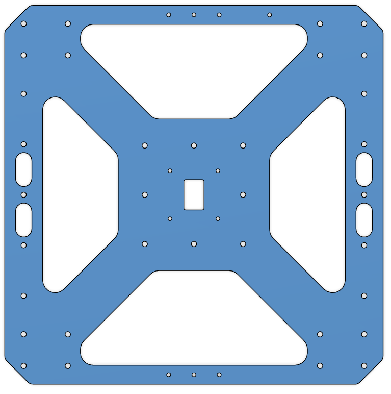 |  
| CAD File|[1111](assets/models/structural/1111.step)| [1112](assets/models/structural/1112.step)| [1113](assets/models/structural/1113.step)|
---
### 1211, 1212 & 1213 - Cockpit Support Beams
- All three are aluminum 6 series, 40x40x1 mm square tubes, laser cut, sanded.
- Part 1211; Qty: 1.
- Parts 1212 and 1213 are identical; Qty: 2.
- Reference supplier: [Rapiddirect](https://www.rapiddirect.com/)

| | 1211 (Cockpit Support Beam CW Long) | 1212 & 1213 (Cockpit Support Beam CCW Back & Front) |
|--|--|--|
|Length|289.2 mm|124.2 mm|
| Image| 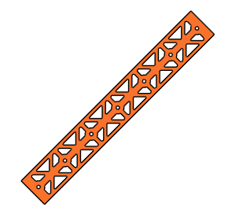 |  |
| CAD File|[1211](assets/models/structural/1211.step)| [1212 & 1213](assets/models/structural/1212_1213.step)|
---
### 1221 & 1222 - Battery Walls
- Both are aluminum 6 series, 1000x30x2 mm rectangular tubes, laser cut, sanded.
- Length is 300 mm for each.
- Parts are identical; Qty: 2.
- Reference supplier: [Rapiddirect](https://www.rapiddirect.com/)

| | 1221 & 1222 (Battery Wall Left & Right) |
|--|--|
| Image| 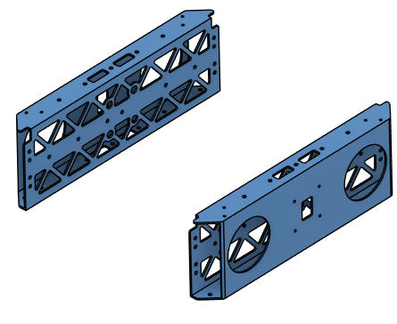 |
| CAD File|[1221 & 1222](assets/models/structural/1221_1222.step)|
---
### 1311, 1312, 1313 & 1314 - Landing Gear Vertical Tubes
- Carbon-fiber tubes, 30 mm diameter, 1 mm thickness.
- Length is 400 mm for each.
- Parts are identical; Qty: 4.
  - Note: Order parts pre-cut to the specified length if available; otherwise, cut to length.
---
### 1321 & 1322 - Landing Gear Horizontal Tubes
- Carbon-fiber tubes, 30 mm diameter, 1 mm thickness.
- Length is 500 mm for each.
- Parts are identical; Qty: 2.
  - Note: Order parts pre-cut to the specified length if available; otherwise, cut to length.
---
### 1331, 1332, 1333 & 1334 - Landing Gear Main Adapters
- Off-the-shelf component.
- 30 mm option.
- Product Link: [Link](https://www.rjxhobby.com/rjx-1pcs-20mm-quick-release-tripod-aluminum-tilt-fixed-seat-landing-gear-connector-1)
- Qty: 4.

> [!NOTE]
> - This product became available in RJXHobby catalog after a customized order for 30 mm tube diameter.
> - If not available in the catalog, contact RJXHobby for the customization.
> - Request 30 mm diameter variant of [this product](https://www.rjxhobby.com/rjx-1pcs-20mm-quick-release-tripod-aluminum-tilt-fixed-seat-landing-gear-connector-1) with bolt pattern of 30 mm version of [this one](https://www.rjxhobby.com/rjxhobby-1pcs-20mm-25mm-30mm-landing-gear-vertical-mount-base-nozzle-connecting-rod-fixing-parts-for-rc-plant-agriculture-uav-drone).

> [!Note]
> If detachable landing gear is not favored, you may use 30 mm version of [this product](https://www.rjxhobby.com/rjxhobby-1pcs-20mm-25mm-30mm-landing-gear-vertical-mount-base-nozzle-connecting-rod-fixing-parts-for-rc-plant-agriculture-uav-drone).

| 1331, 1332, 1333 & 1334 (Landing Gear Main Adapter) |
|--|
| 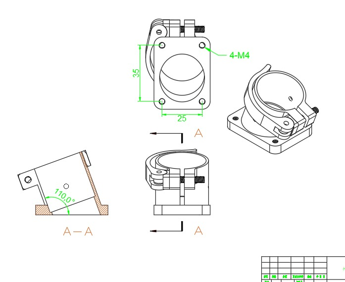 |
---
### 1341, 1342, 1343 & 1344 - Landing Gear Tube Joints

- Off-the-shelf component.
- Product Link: [Link](https://www.innloi.com/productinfo/448455.html)
- Qty: 4.

| | 1341, 1342, 1343 & 1344  (Landing Gear Tube Joint) |
|--|--|
| Image| 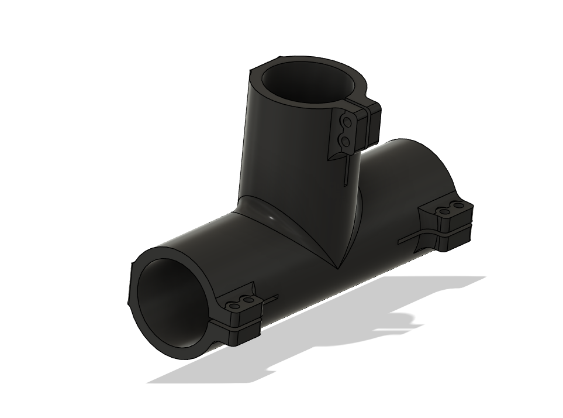 |
---
### 1351, 1352, 1353 & 1354 - Landing Gear Foam Wraps.
- Pipe insulation foam, 28 mm inner diameter, 46 mm outer diameter.
- Length is 103 mm each.
- Parts are identical; Qty: 4.
- Cut from stock material to length.
- Product Link: [Link](https://a.co/d/06ePWuUq)

| 1351, 1352, 1353 & 1354 (Landing Gear Foam Wrap) |
|--|
|  |
---
### 1411, 1421, 1431 & 1441 - Motor Arm Foldable Connectors
- 30 mm tube diameter version.
- Parts are identical; Qty: 4.
- Product Link: [Link](https://www.alibaba.com/product-detail/30-40mm-Folding-arm-tube-Drone_1600762096177.html?spm=a2756.order-detail-ta-bn-b.0.0.78e1f19cegXkOZ)

| 1411, 1421, 1431 & 1441 (Motor Arm Foldable Connectors) |
|--|
|  |
---
### 1412, 1422, 1432 & 1442 - Motor Arms
- Carbon-fiber tubes, 30 mm diameter, 1 mm thickness.
- Length is 360 mm for each.
- Parts are identical; Qty: 4.
  - Note: Order parts pre-cut to the specified length if available; otherwise, cut to length.
---
### 2111, 2121 & 2131 - Attachment Interface Spacers
- 3D printed.
- PETG-CF.
- Use 6 wall loops.
- Parts 2111 and 2121 are identical; Qty: 2.
- Part 2131; Qty: 1.

| | 2111 & 2121 (Attachment Interface Spacers, Left and Right) | 2131 (Attachment Interface Spacer, Bottom) |
|--|--|--|
| Image|  |  |
| CAD File|[2111 & 2121](assets/models/structural/2111_2121.stl)| [2131](assets/models/structural/2131.stl)|
---
### 2112, 2122 & 2132 - Attachment Interfaces
- Parts are identical, order 3 parts.
- Select "Without PCB Board" option.
- Product Link: [Link](https://www.alibaba.com/product-detail/Quick-Release-Clip-Plate-Clamp-Quick_1600982145247.html?chatToken=dTVOQ0lHSDBGNnNIYWVkZGdQNnBUSmFhUzNnb3dTTktRdTFiYjZVZzJRb25RRjBPTUs0bVZqdUd5MHUvYWVCblk4R2ZnVHdnREZwTWh3bjZ6bTJmRXYwWXdUVm1sOUd3Sk5YaVRGVWpCK2h4MXlSRkhRcHk0cWI4US9VUDI5R0kmdmVyc2lvbj0xLjAuMA%3D%3D&encryptTargetLoginId=8pctgRBMALNqZAuqE6c17aH4RKPxocV0)

| 2112, 2122 & 2132 (Attachment Interface) |
|--|
| 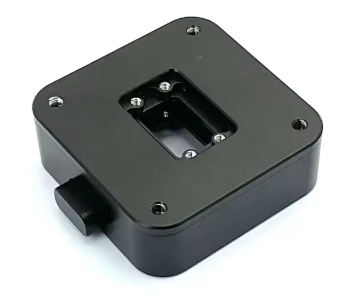 |
---
### 2211 & 2212 - Battery Sliders
- 3D printed.
- PETG-CF.
- Use 6 wall loops.
- Parts are identical; Qty: 2.

| | 2211 & 2212  (Battery Slider) |
|--|--|
| Image| 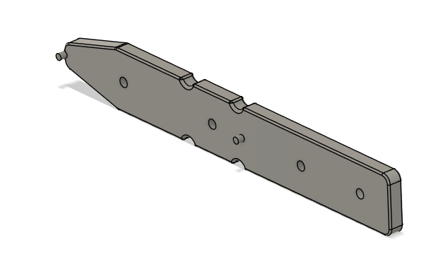 |
| CAD File|[2211 & 2212](assets/models/structural/2211_2212.stl)|
---
### 2311 - Main PCB Mount
- 3D printed.
- PETG-CF.
- Use 6 wall loops.
- Qty: 1.

| | 2311  (Main PCB Mount) |
|--|--|
| Image|  |
| CAD File|[2311](assets/models/structural/2311.stl)|
---
### 2312 - Battery Connector PCB Mount
- 3D printed.
- PETG-CF.
- Use 6 wall loops.
- Qty: 1.

| | 2312  (BC PCB Mount) |
|--|--|
| Image|  |
| CAD File|[2312](assets/models/structural/2312.stl)|
---
### 2313 - Battery Connector PCB Cover
- 3D printed.
- PETG-CF.
- Use 6 wall loops.
- Qty: 1.

| | 2313  (BC PCB Cover) |
|--|--|
| Image| 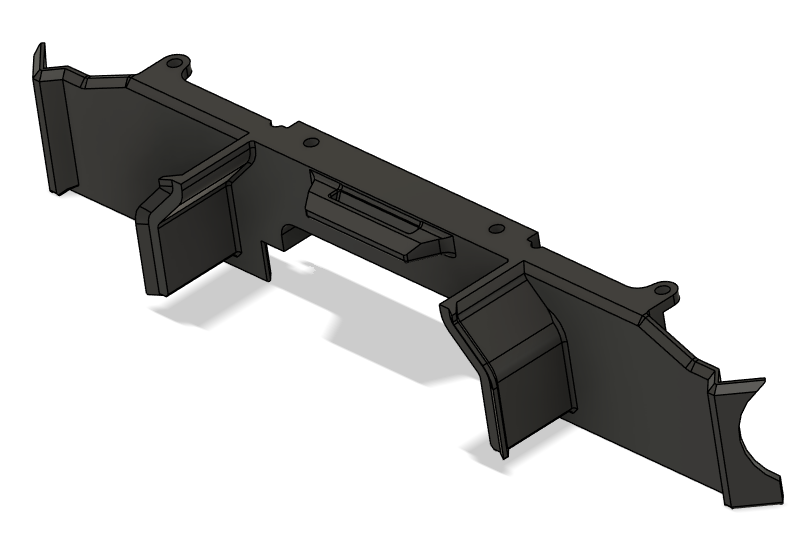 |
| CAD File|[2313](assets/models/structural/2313.stl)|
---
### 2321 - Sensor Mount
- 3D printed.
- PETG-CF.
- Use 6 wall loops.
- Qty: 1.

| | 2321  (Sensor Mount) |
|--|--|
| Image| 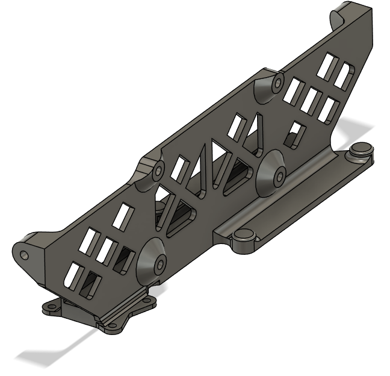 |
| CAD File|[2321](assets/models/structural/2321.stl)|
---
### 2331 - GNSS Mount
- 3D printed.
- PETG-CF.
- Use 6 wall loops.
- Qty: 1.

| | 2331  (GNSS Mount) |
|--|--|
| Image|  |
| CAD File|[2331](assets/models/structural/2331.stl)|
---
### 2341 - PPP & Beacon Mount
- 3D printed.
- PETG-CF.
- Use 6 wall loops.
- Qty: 1.

| | 2341  (PPP & Beacon Mount) |
|--|--|
| Image|  |
| CAD File|[2341](assets/models/structural/2341.stl)|
---
### 2411 - Main Enclosure
- 3D printed.
- PETG-CF.
- Use 6 wall loops.
- Qty: 1.

| | 2411  (Main Enclosure) |
|--|--|
| Image| 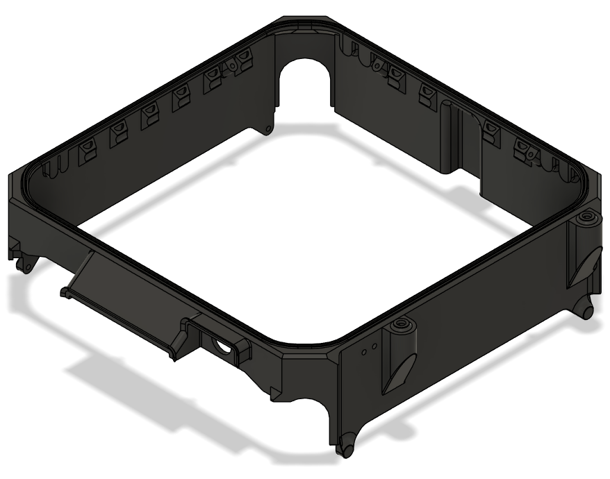 |
| CAD File|[2411](assets/models/structural/2411.stl)|
---
### 2412 - Top Cap
- 3D printed.
- PETG-CF.
- Use 6 wall loops.
- Mind the print orientation as shown.
- Qty: 1.
---
| | 2412  (Top Cap) |
|--|--|
| Image|  |
| Print Orientation|  |
| CAD File|[2412](assets/models/structural/2412.stl)|
---
### 2421 & 2422 - Enclosure Hinges
- Off-the-shelf component.
- Part Number: GN 237-ZD-30-30-A-SW
- Product Link: [Link](https://www.jwwinco.com/en-us/products/3.3-Hinging-latching-locking-of-doors-and-covers/Hinges/GN-237-Zinc-Die-Cast-or-Aluminum-Hinges-Countersunk-Thru-Holes-or-Threaded-Stud-Type)
- Qty: 2.

| 2421 & 2422  (Enclosure Hinges) |
|--|
| 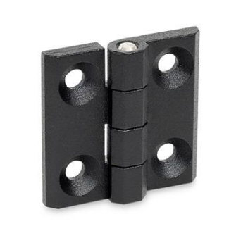 |
---
### 2431 & 2432 - Enclosure Latches
- Off-the-shelf component.
- Screw on draw latch.
- Parts are identical; Qty: 2.
- Product Link:
  - US: [Link](https://www.mcmaster.com/6082A11/)
  - UK: Latch and catch plate are sold separately.
    - [Latch](https://protex.com/21-1785SS-non-adjustable-toggle-latch-light-duty-stainless-steel-natural)
    - [Catch Plate](https://protex.com/01-1785SS-catch-plate-for-toggle-latch-stainless-steel-natural)
---
### 3322 & 3323 - Busbars
- Both are Copper C110 | CU ETP, laser cut, bent. 
- Bounding box dimension is 300x300 mm for each.
- Qty: 1 each.
- Reference supplier: [Rapiddirect](https://www.rapiddirect.com/)

| | 3322 (Busbar Positive) | 3323 (Busbar Negative) |
|--|--|--|
| Image|  |  |
| CAD File|[3322](assets/models/structural/3322.step)| [3323](assets/models/structural/3323.step)|
--
### 3324 - BC PCB Heatsink
- Aluminum 6 series, laser cut, sanded.
- Experimental part:
  - Order both 4 mm and 5 mm thickness variants for evaluation.
- Qty: 1 each.
- Reference supplier: [Rapiddirect](https://www.rapiddirect.com/)

| | 3324 (BC PCB Heatsink) |
|--|--|
| Image| 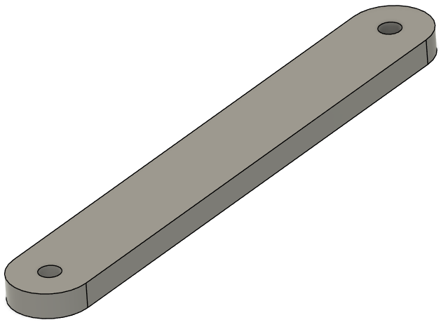 |
| CAD File|[3324 - 4 mm](assets/models/structural/3324_1.step) , [3324 - 5 mm](assets/models/structural/3324_2.step)|
---

## Assembly Steps

### Step 1. Assemble the Cockpit Support Beams on Mid Plate
- Parts needed:
  - 1112 (Mid Plate)
  - 1211, 1212 & 1213 (Cockpit Support Beams)
  - Rivet 1 x13 (4mm Diameter for 1 mm - 2.5 mm thickness)

- Place the cockpit support beams on the mid plate as shown in the picture.
- Rivet the cockpit support beams from the mid plate on the holes shown in the picture.

|Orientation|Rivet Holes|
|--|--|
||  |
---

### Step 2. Install the Battery Walls
- Parts needed:
  - 1221 & 1222 (Battery Walls)
  - Rivet 2 x10 (4mm Diameter for 2.5 mm - 4.5 mm thickness)
- Place the battery walls on the sides of the chassis as shown in the picture.
  - Make sure the dented side stays on the chassis side.
- Rivet the battery walls from the mid plate on the holes shown in the picture.

|Orientation|Rivet Holes|
|--|--|
||  |
---

### Step 3. Install the Motor Arm Connectors
- Parts needed:
  - 14X1 x4 (Foldable Motor Arm Connectors)
  - Screw 5 x16 (Socket Head Screw M3x8)
  - Screw 1 x8 (Socket Head Screw M3x10)
  - Washer 1 x24 (M3 General Purpose Washer 3.2 mm ID, 6 mm OD)
  - Loctite Threadlocker Blue 242
- Remove the fasteners marked in the picture.
  - Apply Loctite Threadlocker Blue on the fasteners.
  - Secure the fasteners back.

| Motor Arm Connector - Loctite Threadlocker Application|
|---|
| 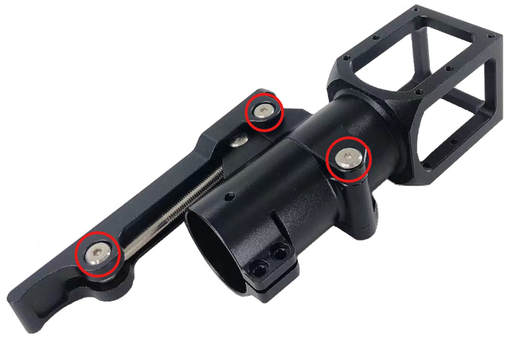|
 
- Place the motor arm connectors on the chassis as shown in the picture.
- Secure the motor arm connectors on the chassis.
  - Use **Screw 5** for **red holes** and **Screw 1** for **green holes**.
  - Use Loctite Threadlocker Blue.
  - Use Washer 1.
  - Use cordless screwdriver where possible, or else an allen key.
 
|Orientation|Screw Holes|
|--|--|
|| 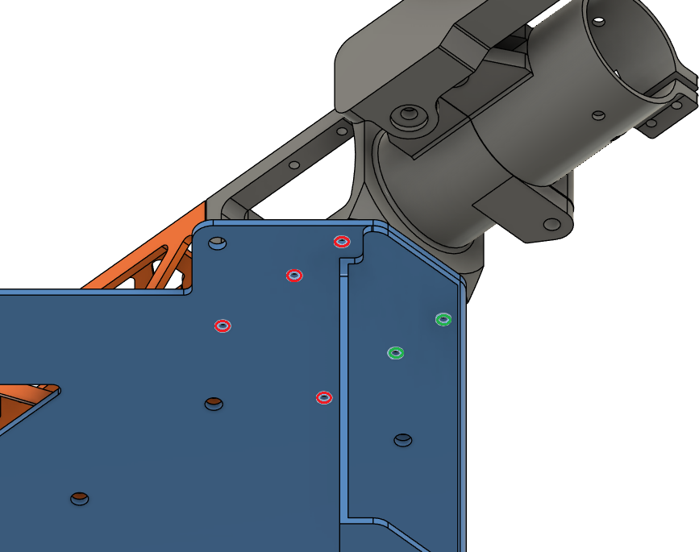 |
---
### Step 4. Install the Lower Plate
- Parts needed:
  - 1113 (Lower Plate)
  - Rivet 3 x10 (4mm Diameter for 4.5 mm - 6.4 mm thickness)
- Place the lower plate on the chassis as shown in the picture.
- Rivet the lower plate to the chassis on the holes shown in the picture.

|Orientation|Rivet Holes|
|--|--|
|| 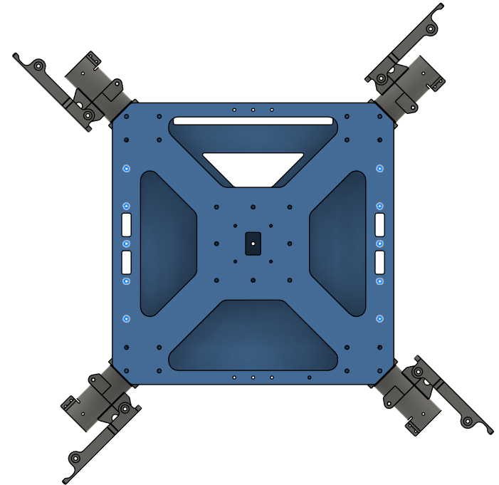 |
---
### Step 5. Install the Upper Plate
- Parts needed:
  - 1111 (Upper Plate)
  - Rivet 1 x13 (4mm Diameter for 1 mm - 2.5 mm thickness)
  - Screw 5 x24 (Socket Head Screw M3x8)
  - Washer 1 x24 (M3 General Purpose Washer 3.2 mm ID, 6 mm OD)
  - Loctite Threadlocker Blue 242

- Place the upper plate over the chassis as shown in the picture.
- Rivet the cockpit support beams from the upper plate on the holes shown in the picture.
- Screw the motor arm connectors from the upper plate with Screw 5.
  - Use Washer 1.
  - Use Loctite Threadlocker Blue.

|Orientation|Rivet Holes|
|--|--|
|| 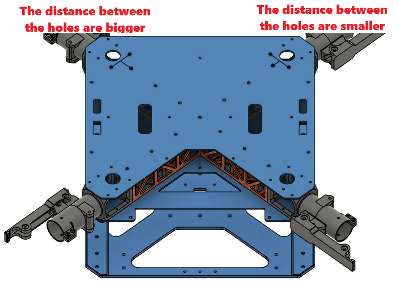 |
---
### Step 6. Install the Main PCB Mount
- Parts needed:
  - 2311 (Main PCB Mount)
  - Screw 11 x5 (Flanged Button Head Hex-Drive Screw M3x6)
  - Vibration Mount x5 (M3 Rubber Anti-Vibration Spacer)
  - Insert 4 x16 (M3 Threaded Inserts - 3.8 mm)
  - Loctite Threadlocker Blue 242

- Install 11x Insert 4 into the top face of the Main PCB Mount as shown in the picture.

| Top Insert Locations|
|---|
| |

- Install 5x Insert 4 into the bottom face of the Main PCB Mount (2311) as shown in the picture.

| Bottom Insert Locations|
|---|
| 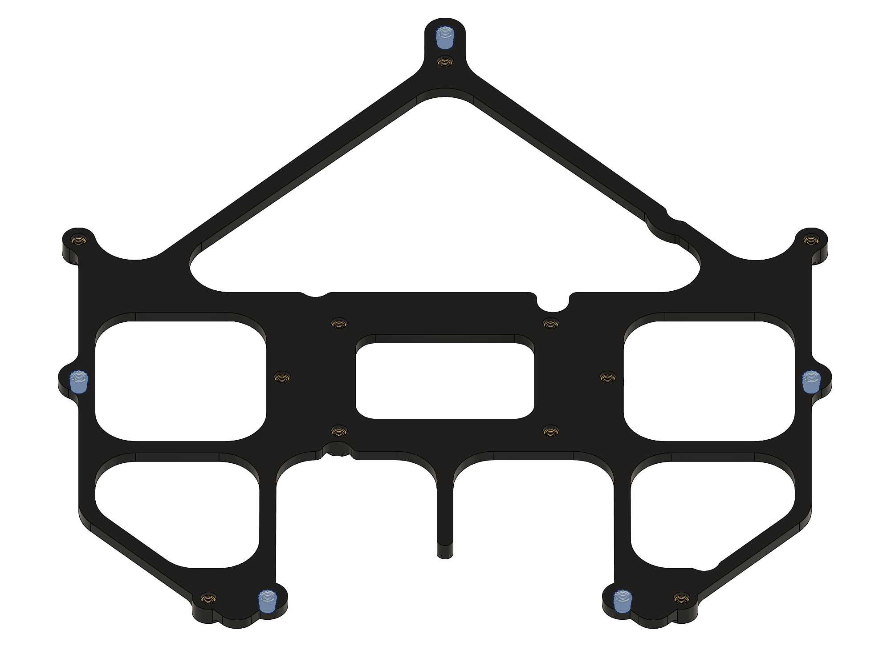|

- Install 5x Vibration Mount into the designated holes on the Upper Plate (1111).
- Orientation: Ensure the longer side of the rubber dampener (3 mm section) is facing upwards, towards where the 3D-printed holder will sit.

| Vibration Mount Locations| Vibration Mount Insertion |
|---|---|
| | |

- Apply a small amount of Loctite Threadlocker Blue to the threads of the 5x Screw 11 (M3x6) flat head screws.
- Align the 3D-printed mount over the rubber dampeners.
- Insert the Screw 11 (M3x6) screws through the center of the rubber dampeners and thread them into the bottom-side inserts of the PCB holder.
- **Compression:** Tighten the screws until the rubber dampener is compressed to a height of approximately **2.0 mm**. Refer to the visual guide below.

| Vibration Mount Compression|
|---|
| |
---
### Step 7. Install the Battery Connector PCB Mount
- Parts needed:
  - 2312 (BC PCB Mount)
  - Insert 1 x10 (M3 Threaded Inserts - 5.7 mm)
  - Screw 5 x3 (Socket Head Screw M3x8)
  - Washer 1 x3 (M3 General Purpose Washer 3.2 mm ID, 6 mm OD)

- Place Insert 1 to the holes shown in the picture, on the top and bottom sides of the BC PCB mount.
  - Use a soldering iron to place them inside the plastic.

|Top|Bottom|
|--|--|
|| 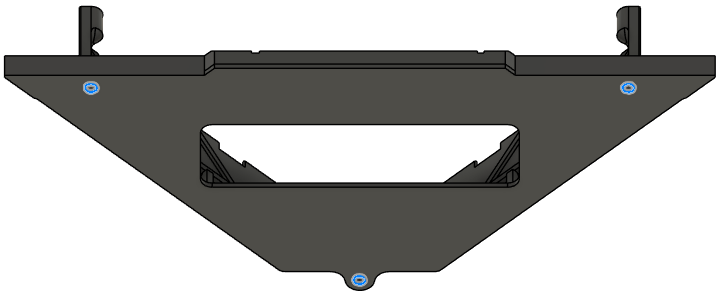 |

- Place the Battery Connector PCB mount over the mid plate.
  - Secure it with 3x Screw 5 in total from below the mid plate on the holes below.
  - Use Washer 1 for the holes.

---
### Step 8. Install the Battery Sliders
- Parts needed:
  - 2211, 2212 (Battery Sliders)
  - Insert 2 x8 (M4 Threaded Inserts)
  - Screw 9 x8 (Socket Head Screw M4x8)
  - Washer 2 x8 (M4 General Purpose Washer 4.3 mm ID, 9 mm OD)

- Place Insert 2 to the holes shown in the picture on both of the battery slides.
  - Use a soldering iron to place them inside the plastic.

- Place the battery sliders inside the battery compartment.
  - Be careful about the orientation of the angled end, they should point where the cutouts on the plates are.
  - Secure it with 8x Screw 9 in total from the sides of the frame.
  - Use Washer 2 with the screws.

|Orientation|Installation Holes|
|--|--|
|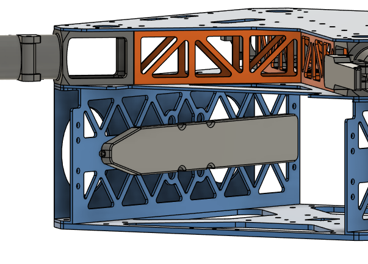| 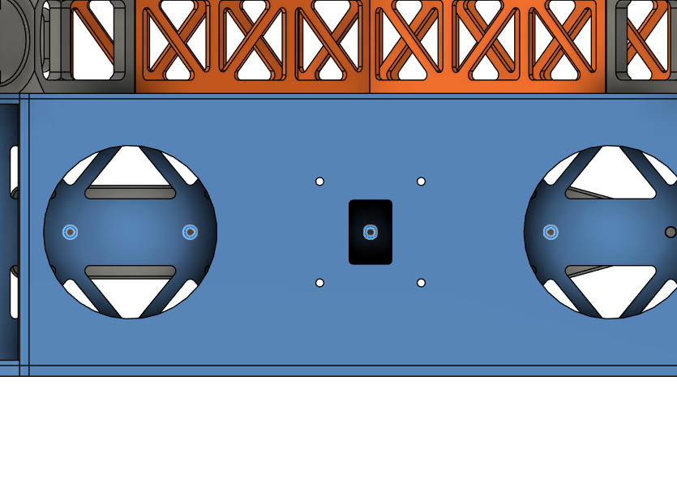 |
---
### Step 9. Install the Landing Gear
- Parts needed:
  - 131X, 132X (Landing Gear Horizontal & Vertical Tubes)
  - 133X (Landing Gear Main Adapters)
  - 134X (Landing Gear Tube Joints)
  - 135X (Landing Gear Foam) 
  - Screw 2 x16 (Flanged Button Head Screw M4x10)
  - Screw 5 x16 (Socket Head Screw M3x8)
  - Washer 1 x16 (M3 General Purpose Washer 3.2 mm ID, 6 mm OD)
  - Loctite Threadlocker Blue 242
  - Loctite Threadlocker Purple 222

- Place the landing gear main adapters below the chassis, as shown in the picture.
  -  The adapters are facing outward, to the left and right of the structure.
  -  Screw the adapters with 16x Screw 2 to the chassis.
  -  Use Loctite Threadlocker Blue to secure the screws.

|Orientation|Installation Holes|
|--|--|
||  |

- Insert the vertical landing gear tubes inside landing gear main adapters.
  - Make sure the tubes are inserted all the way.
  - Tighten the clamps to secure the tubes in place.

> [!NOTE]
>
> Due to the lack of the detachable landing gear adapter geometry, this image depicts the old adapter. It should be updated with a real life image.

|Landing Gear Adapter|
|---|
||

- Make sure the chassis stands level on the ground.
  -  If not, measure and equalize the tube lengths.
  
- Assemble landing gear tube joints and the horizontal tubes as shown in the picture.
  - Insert the vertical tubes inside the holes before tightening the screws.
  - Use Screw 5.
  - Use Washer 1.
  - Use Loctite Threadlocker Purple.

|Positioning|Correct Final Appearance |
|--|--|
|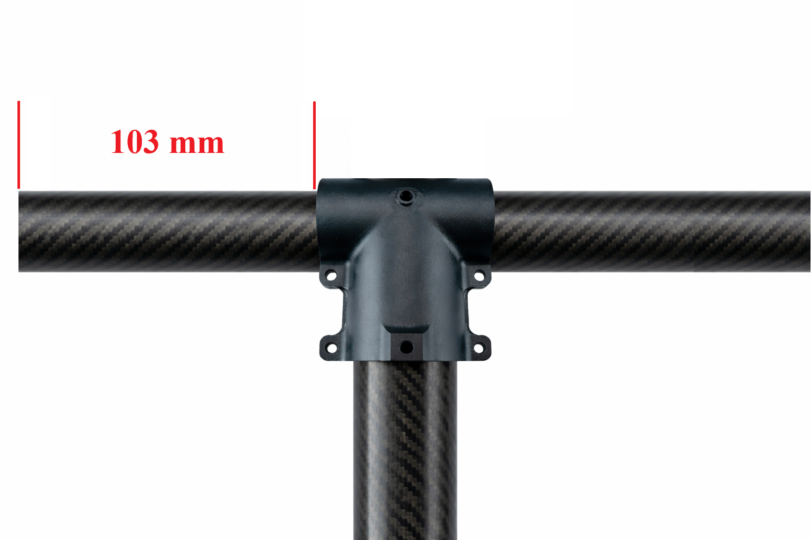|  |

> [!NOTE]
>
> Due to the lack of the landing gear tee joint geometry, this image depicts the old joint. It should be updated with a real life image.

- Slide the landing gear foams to the end of the horizontal tubes.

### Step 10. Install Sensor Mount
- Parts needed:
  - 2321 (Sensor Mount)
  - Insert 1 x10 (M3 Threaded Inserts - 5.7 mm)
  - Screw 4 x4 (Socket Head Screw M3x12)
  - Screw 5 x2 (Socket Head Screw M3x8)
  - Washer 1 x6 (M3 General Purpose Washer 3.2 mm ID, 6 mm OD)
  - Nut 1 x4 (Nylon-Insert Locknut M3)
  - Loctite Threadlocker Purple 222

- Place Insert 1 to the holes shown in the picture.
  - Use a soldering iron to place them inside the plastic.
  - 10 in total.

|Insert 1 (5.7 mm) Locations|
|---|
|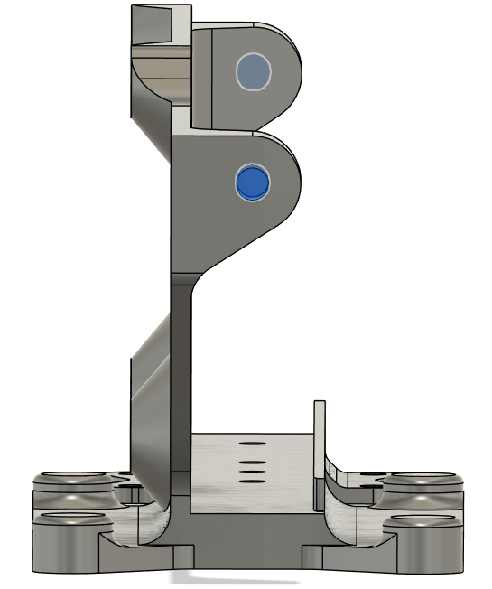|
|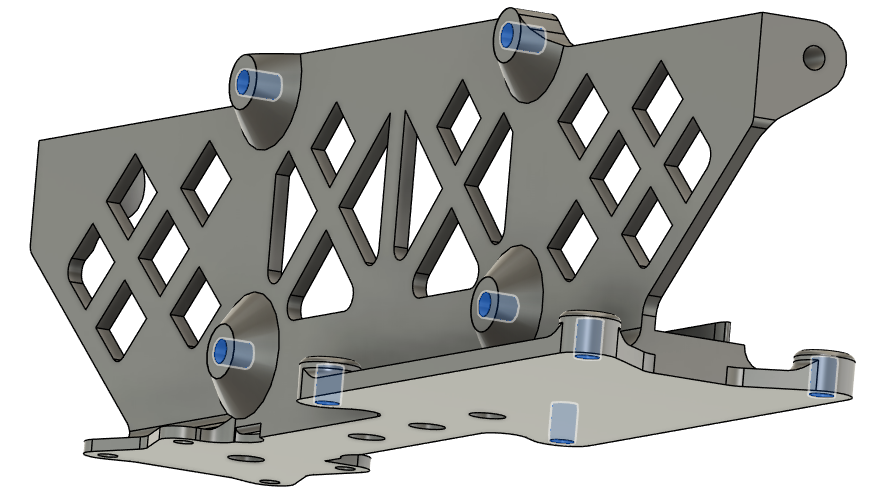|

- Secure the sensor mount on the lower plate.
  - Screw head stays inside the mount.
  - Use Screw 4.
  - Use Washer 1 on the nut side.
  - Use Nut 1.
  - DO NOT use Loctite Threadlocker.

|Lower Plate Fasteners|
|---|
|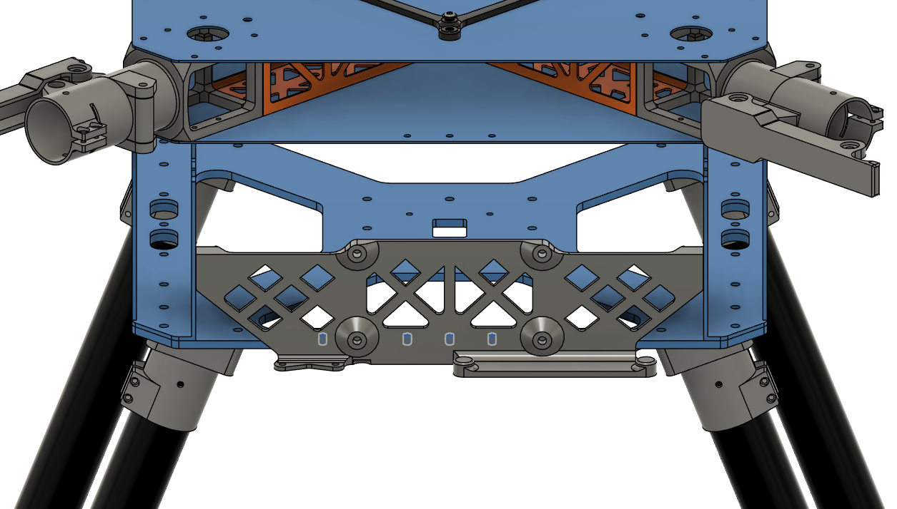|

- Secure the sensor mount on the battery walls.
  - Use Screw 5.
  - Use Washer 1.
  - Use Loctite Threadlocker Purple.

|Battery Wall Fasteners|
|---|
|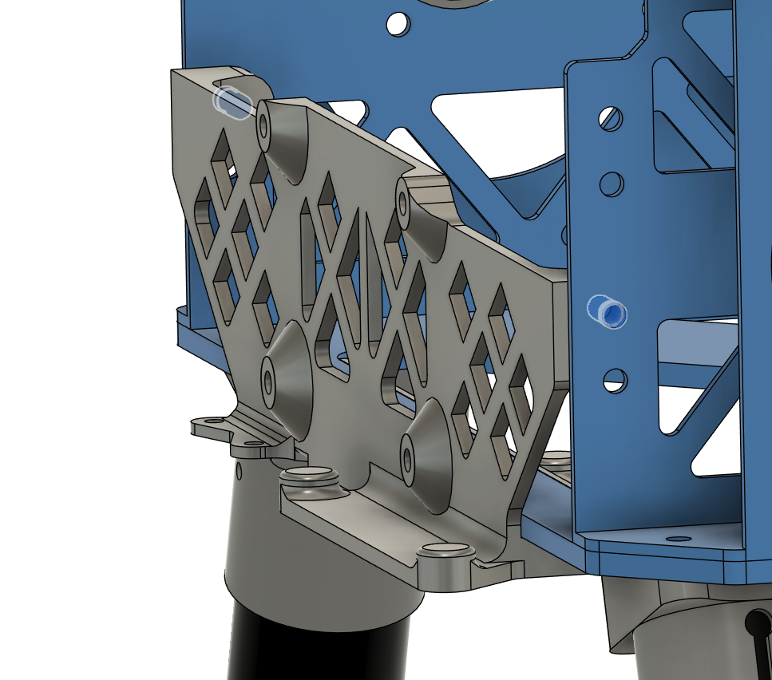|
---

### Step 11. Insert Grommets
- Parts needed:
  - Grommet 1 x4 (Circular Grommet OD: 20 mm)
  - Grommet 2 x12 (Oval Grommet 27x13 mm)

- Insert 4x Grommet 1 into the holes over the motor arm connectors at each corner.

|Grommet 1 Location|
|---|
|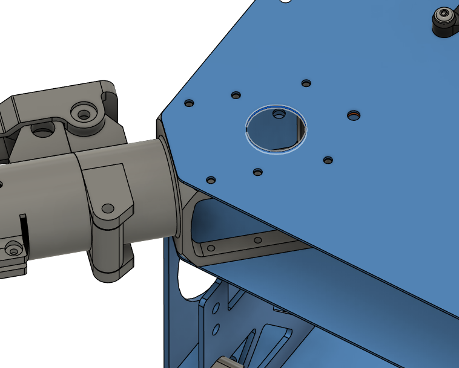|

- Insert 12x Grommet 2 into the holes on the sides of upper, mid and lower plates on each side.

|Grommet 2 Location|
|---|
|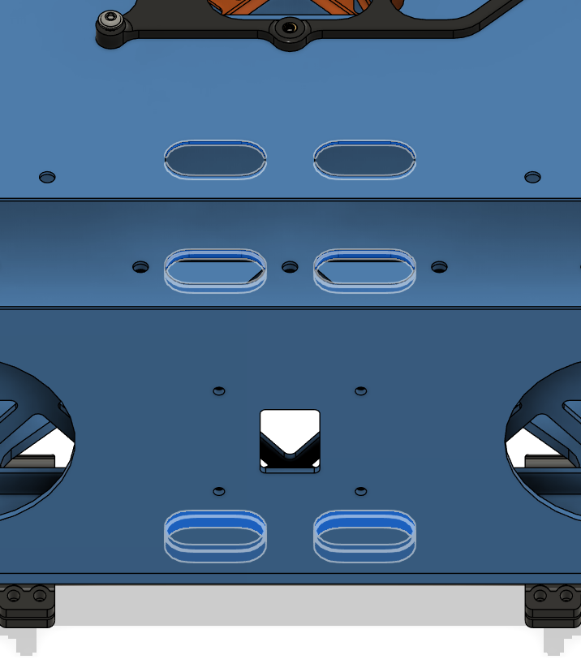|

### Step 12. Install PCBs & Onboard Components
- Parts needed:
  - 2331 (GNSS Mount)
  - 3311 (Main PCB)
  - 3321 (BC PCB)
  - 3331 (FC PCB)
  - 3332 (Flight Controller)
  - 3312 (RPI 5)
  - 3313 x2 (GigaBlox Nano Ethernet Switch)
  - 3315 (Mateksys GNSS M9N-G4-3100)
  - 3251 (RTK GNSS)
  - Screw 4 x4 (Socket Head Screw M3x12)
  - Screw 11 x14 (Flanged Button Head Hex-Drive Screw M3x6)
  - Screw 12 x4 (Socket Head Hex-Drive Screw M2x5)
  - Screw 13 x4 (Socket Head Hex-Drive Screw M2.5x8)
  - Screw 14 x4 (Socket Head Hex-Drive Screw M2x10)
  - Washer 3 x12 (M2 Nylon Washer 2.2 mm ID, 5 mm OD)
  - Washer 4 x4 (M2.5 Nylon Washer 2.7 mm ID, 5.6 mm OD)
  - Washer 5 x4 (M3 Nylon Washer 3.2 mm ID, 6 mm OD)
  - Loctite Threadlocker Purple 222
  - Loctite Threadlocker Blue 242

- Place the Battery Connector PCB as shown in the picture.
  - Apply Thermal Paste to the Heatsink.
  - Secure it with 3x Screw 11.

|BC PCB & Bolt Locations|
|---|
|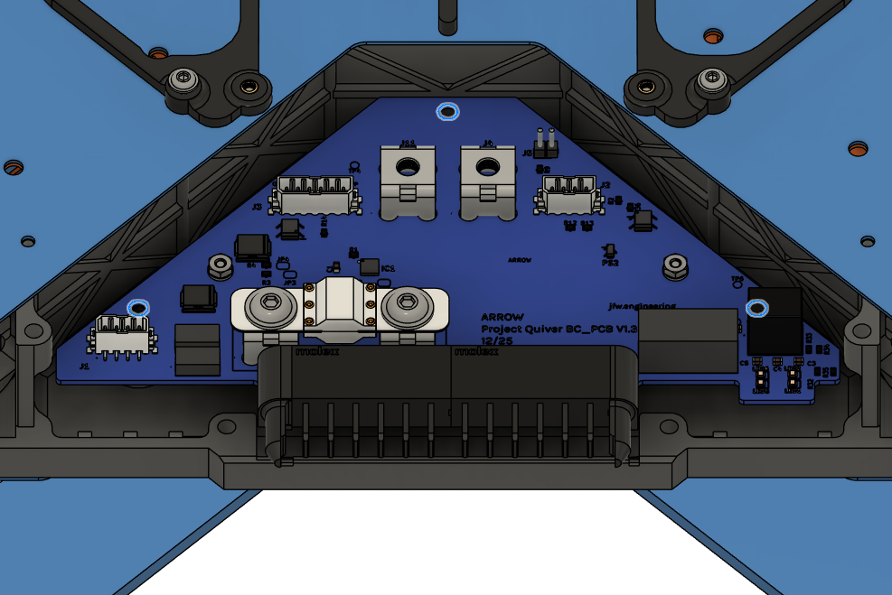|

- Place the Main PCB as shown in the picture.
  - See the warning before installation.
  - Secure it with 7x Screw 11.

> [!CAUTION]
> **CRITICAL: Trim DC-DC Converter Pins**
> 
> Before mounting the Main PCB, the through-hole pins of the DC-DC converters **must** be trimmed on the underside of the board. They extend too far and may puncture the mount or short against the frame.
> See the reference image for the required clearance.

|Main PCB & Bolt Locations| Through-hole Pin Trim|
|---|---|
|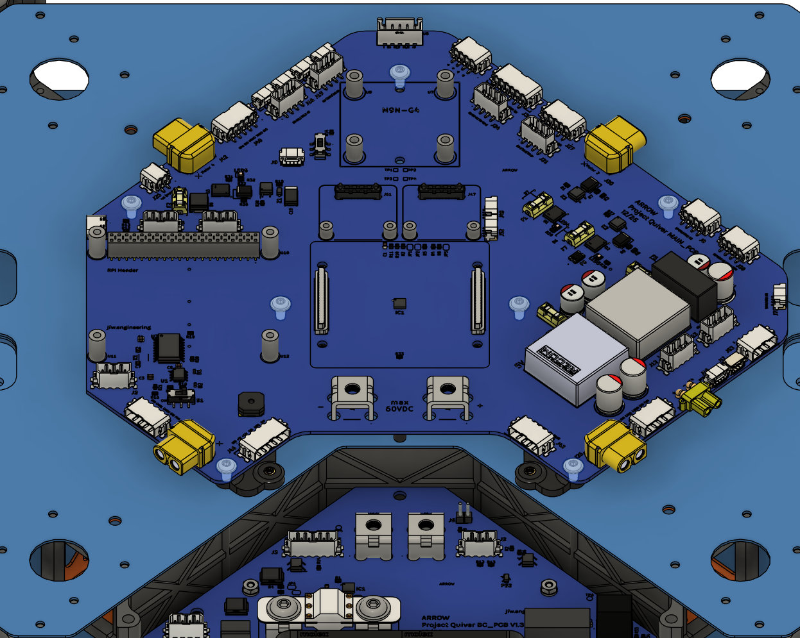||

- Place Ethernet Switches on the Main PCB slots, as shown in the picture.
  - Securely plug the connectors.
  - Use 4x Screw 12 and 4x Washer 3 on the bolt holes.
    - Use Loctite Threadlocker Purple.
 
|Ethernet Switch Locations|
|--|
|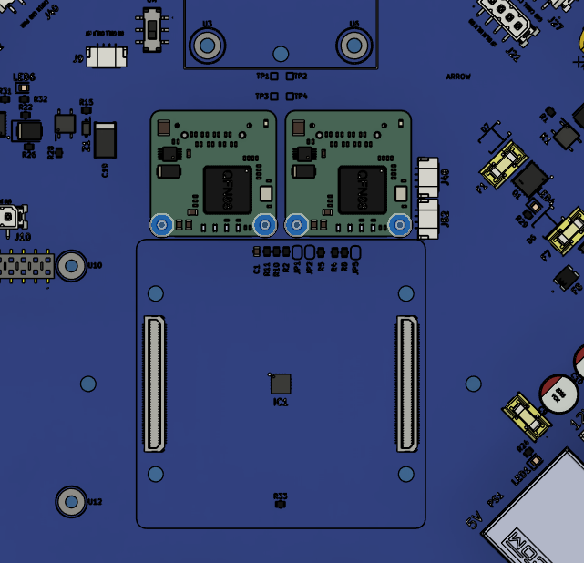|

- Place the Flight Controller on the FC PCB.
  - Pay extreme attention to the orientation shown in the images.
  - Make sure the connectors are securely connected.
  - Use 4x Screw 12 and 4x Washer 3 from under the PCB to secure the Flight Controller.
    - Use Loctite Threadlocker Purple.
 
|FC & FC PCB Orientation ||
|--|--|
|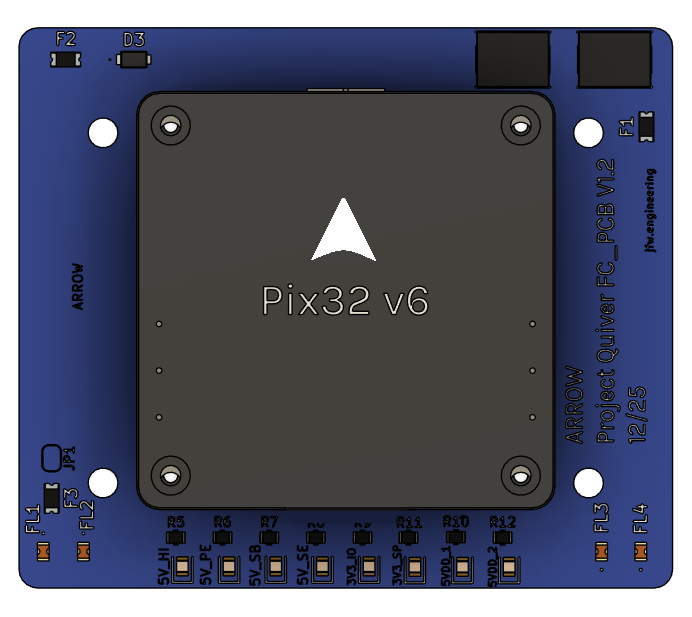|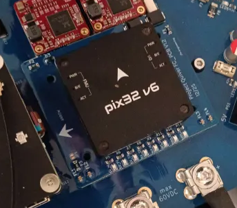|

- Place F9P NEO RTK GNSS on the GNSS Mount.
  - The direction of the arrow on the RTK GNSS should match the one provided in the picture.
  - Secure it with Screw 14 and Washer 3 under the mount.
    - Use Loctite Threadlocker Purple.

|GNSS Orientation|
|--|
|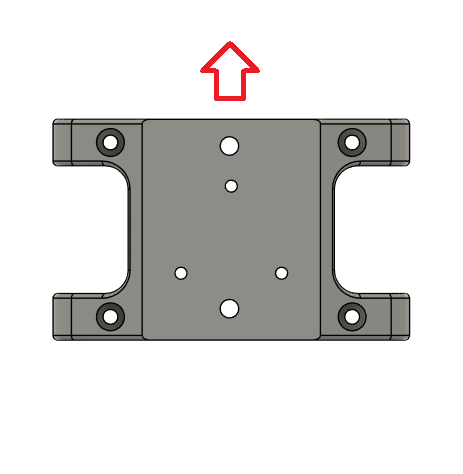|

- Place the FC PCB into the GNSS Mount.
- Place the FC PCB and GNSS Mount on the Main PCB.
  - The arrow on the Flight Controller must point toward the front of the drone, i.e., opposite to the side where the BC PCB is located.
  - The arrow on the RTK GNSS must point toward the front of the drone, i.e., opposite to the side where the BC PCB is located.
- Secure the FC PCB on the Main PCB using the holes shown in the image.
  - Use 4x Screw 4 and 4x Washer 5.
  - Use Loctite Threadlocker Purple.

|Flight Controller Orientation | GNSS Mount Orientation | Installation Holes |
|--|--|--|
|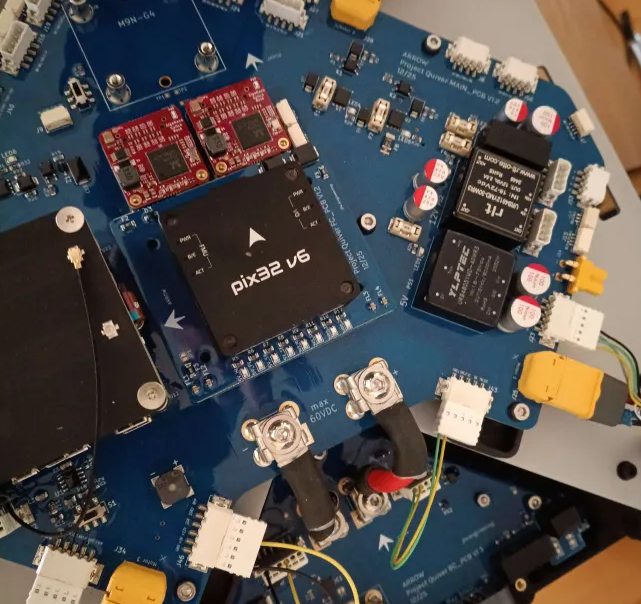| 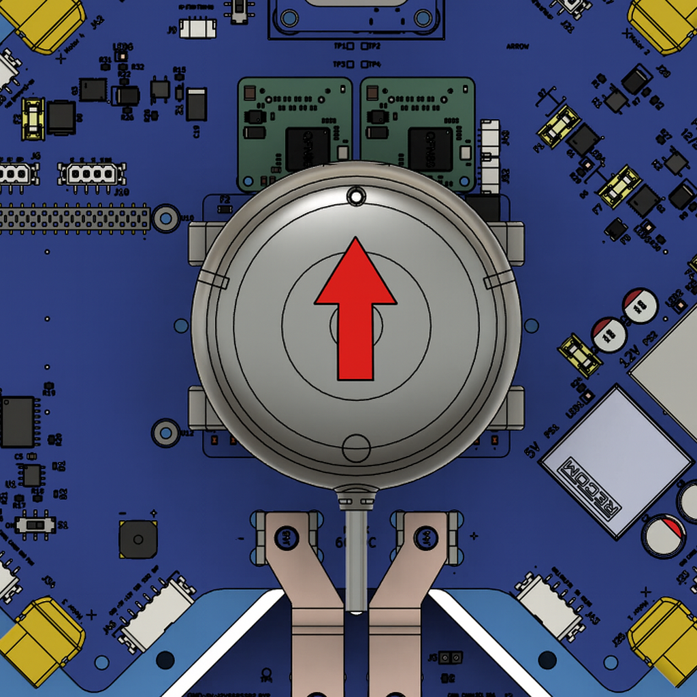 | 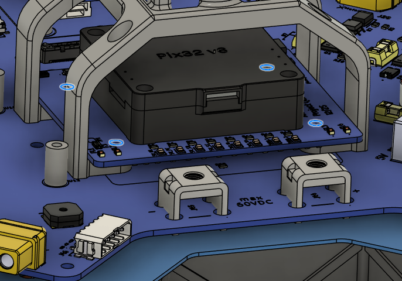 

- Place RPI 5 on the Main PCB slot, as shown in the picture.
  - Securely plug the connectors.
  - Use 4x Screw 13 and 4x Washer 4 on the bolt holes.
 
|RPI 5 Installation|
|--|
|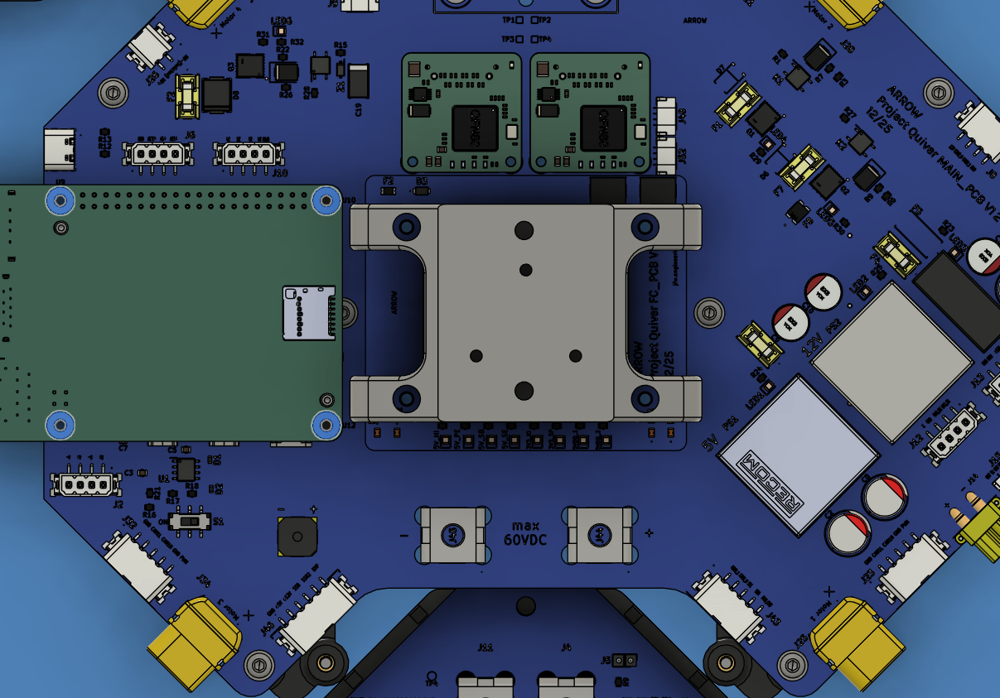|

- Place Mateksys GNSS on the Main PCB slot, as shown in the picture.
  - Securely plug the connectors.
  - Use 4x Screw 11.
    - Use Loctite Threadlocker Blue.
 
|Mateksys GNSS Installation|
|--|
|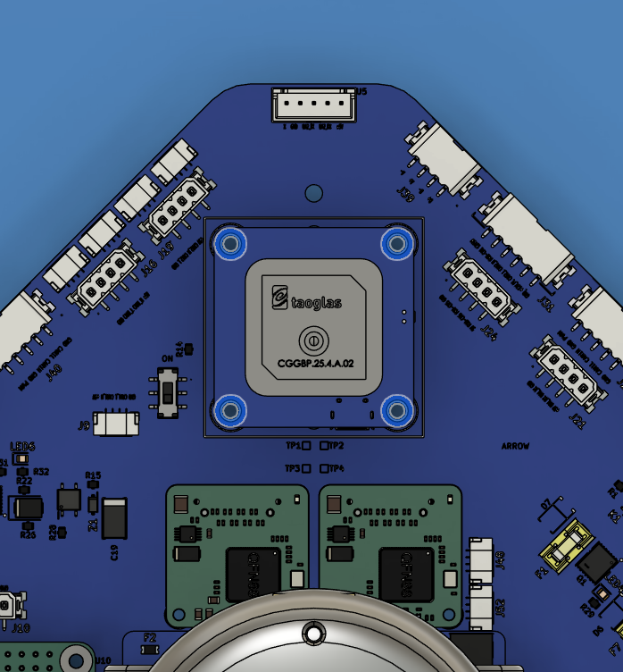|

---
### Step 13. Install Busbars
- Parts needed:
  - 3322 (Busbar Positive)
  - 3323 (Busbar Negative)
  - Screw 15 x4 (Socket Head Hex-Drive Screw M5x8)
  - Washer 6 x4 (M5 General Purpose Washer 5.3 mm ID, 10 mm OD)
  - Loctite Threadlocker Blue 242

- Place the Busbar Positive (Right) and Busbar Negative (Left) on the Main and BC PCBs as shown in the picture.
  - Use Loctite Threadlocker Blue on the threads of 4x Screw 15.
  - Secure the busbars on the terminals with Screw 15 and Washer 6.

|Busbar Installation|
|--|
|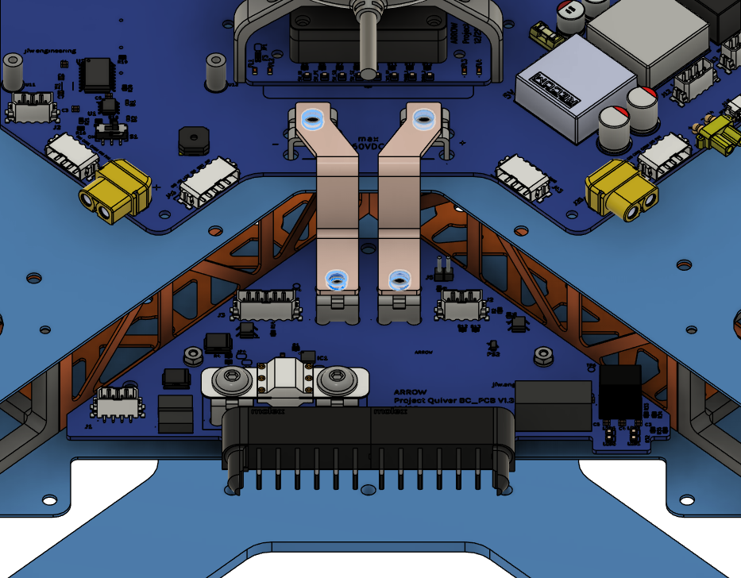|
  
---
### Step 14. Install BC PCB Cover
- Parts needed:
  - 2313 (BC PCB Cover)
  - Insert 1 x2 (M3 Threaded Inserts - 5.7 mm)
  - Screw 5 x4 (Socket Head Screw M3x8)
  - Washer 1 x4 (M3 General Purpose Washer 3.2 mm ID, 6 mm OD)
  - Loctite Threadlocker Purple 222

- Place Insert 1 to the holes shown in the picture.
  - Use a soldering iron to place them inside the plastic.
  - 2 in total.

- Use Screw 5 and Washer 1 to secure the BC PCB Cover in place.
  - Use Loctite Threadlocker Purple.

| Insert 1 Locations | Screw Locations |
|--|--|
|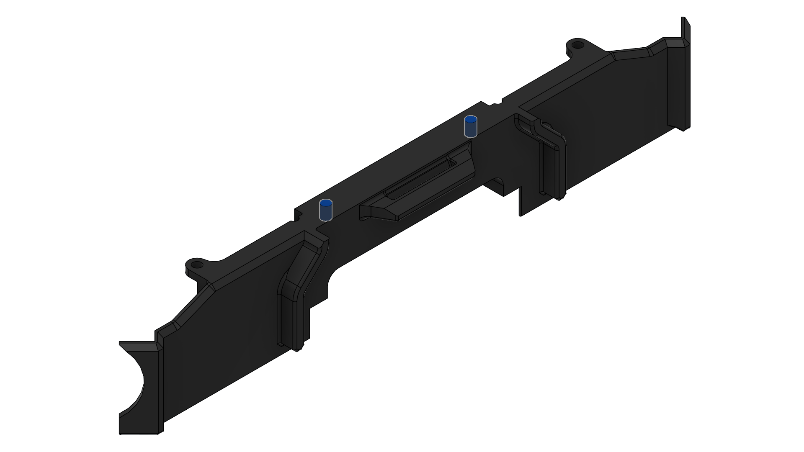|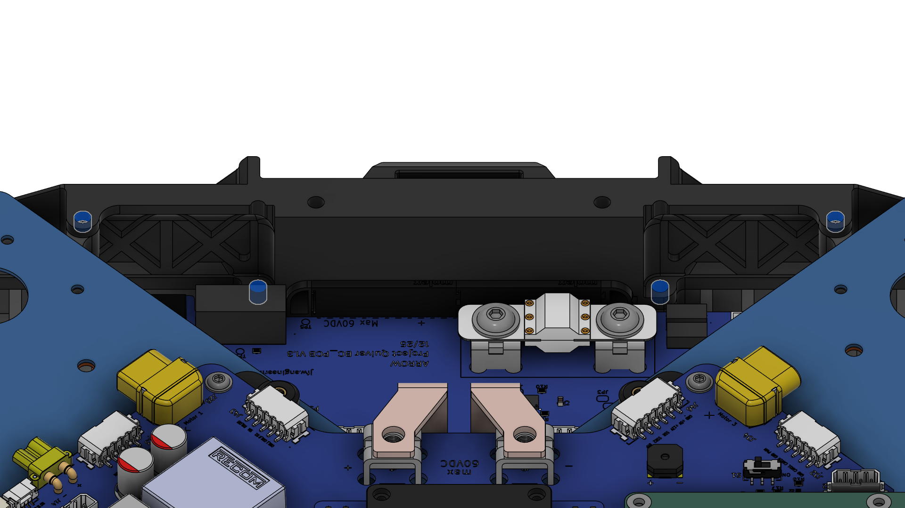|

---
### Step 15. Install Attachment Interfaces
- Parts needed:
  - 2111, 2121 & 2131 (Attachment Interface Spacers)
  - 2112, 2122 & 2132 (Attachment Interfaces)
  - Screw 6 x8 (Socket Head Screw M3x40)
  - Screw 16 x4 (Button Head Hex Drive Screw M3x40)
  - Washer 1 x12 (M3 General Purpose Washer 3.2 mm ID, 6 mm OD)
  - Loctite Threadlocker Blue 242

- Place and secure the side attachment interfaces and the spacers as shown in the pictures.
  - Make sure the rectangular holes are aligned with the holes on the battery walls.
  - Make sure the notch on the attachment interface is on top, as shown in the image.
  - Use the screwdriver holes inside the battery compartment to place the screws and the screwdriver.
  - Use 8x Screw 6.
  - Use 8x Washer 1.
  - Use Loctite Threadlocker Blue.

|Positioning|Installation Holes| Notch Orientation|
|--|--|--|
||  | 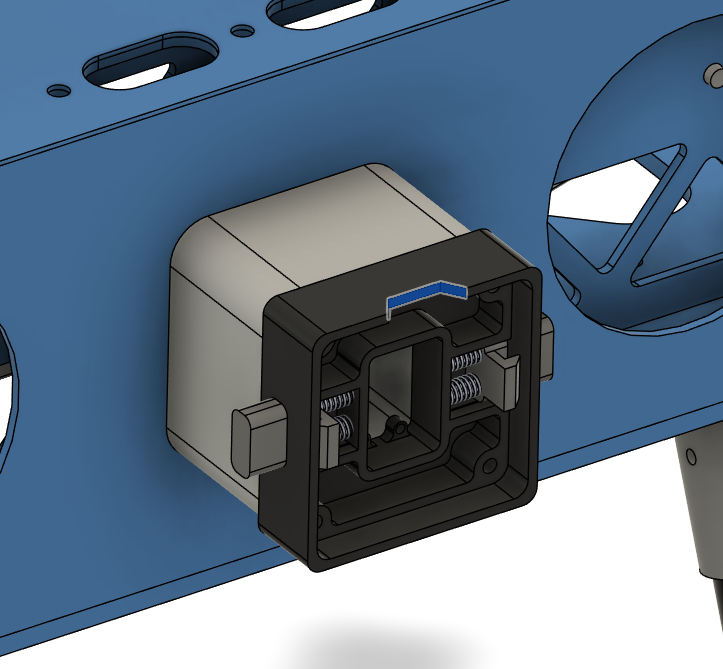 |

- Place and secure the bottom attachment interface and the spacer as shown in the pictures.
  - Make sure the rectangular holes are aligned with the holes on the battery walls.
  - Make sure the cable tray on the spacer points towards the front, i.e. the sensor mount.
  - Make sure the notch on the attachment interface points towards the front, i.e. the sensor mount.
  - Use 4x Screw 16.
  - Use 4x Washer 1.
  - Use Loctite Threadlocker Blue.

|Positioning, Cable & Notch Orientation|Installation Holes|
|--|--|
|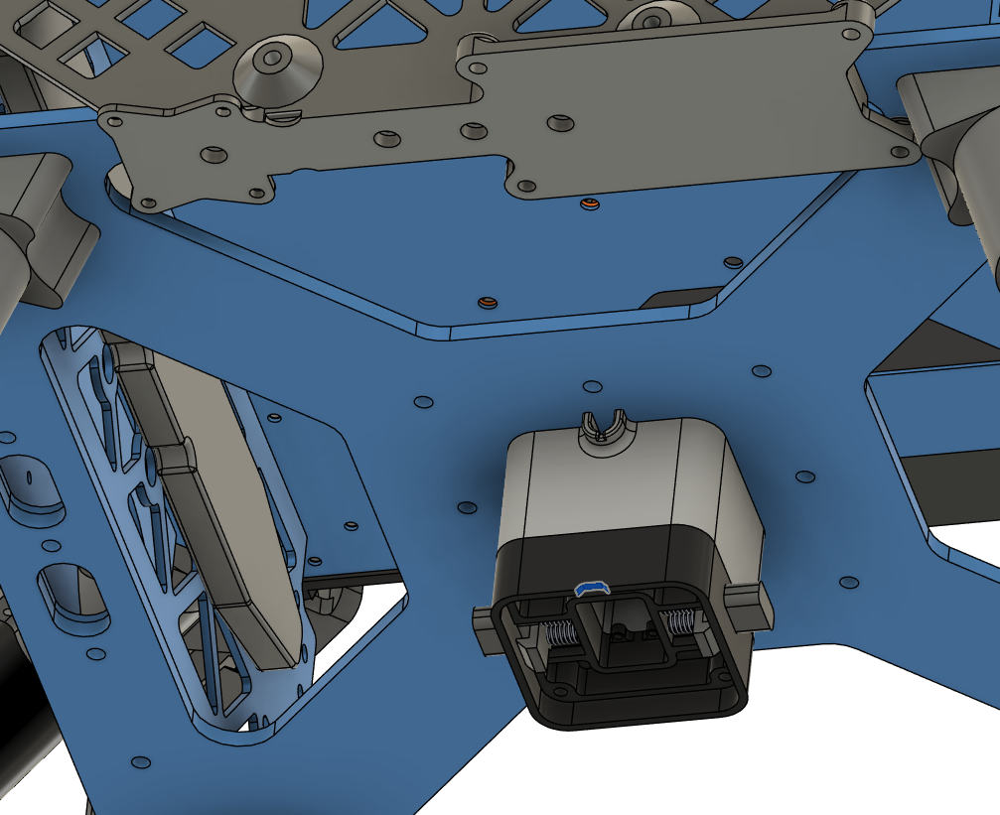| 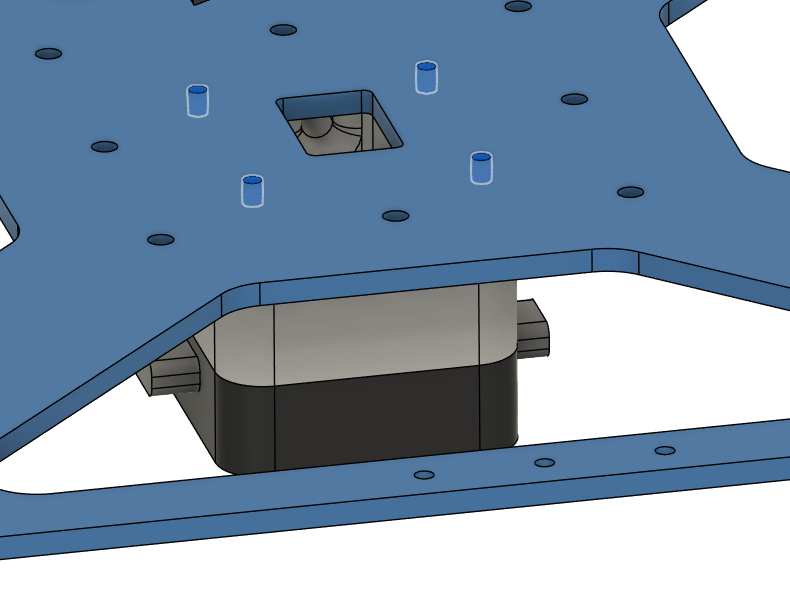 |

---
### Step 16. Install Radar Sensors
- Parts needed:
  - 3212 (Obstacle Avoidance Radar, Nanoradar MR82)
  - 3213 (Radar Altimeter, Nanoradar NRA15)
  - Screw 11 x8 (Flanged Button Head Hex-Drive Screw M3x6)
  - Loctite Threadlocker Purple 222

- Secure Nanoradar MR82 in front of the drone, as shown in the image.
  - Use 4x Screw 11.
  - Use Loctite Threadlocker Purple.
  - Mind the direction of the cable.

|Obstacle Avoidance Installation|
|--|
|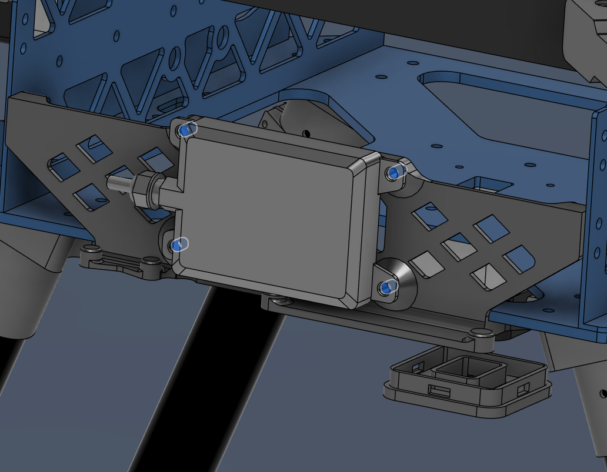|
 
- Secure Nanoradar NRA15 in front-bottom corner of the drone, as shown in the image.
  - Use 4x Screw 11.
  - Use Loctite Threadlocker Purple.
  - Mind the direction of the cable.

|Radar Altimeter Installation|
|--|
|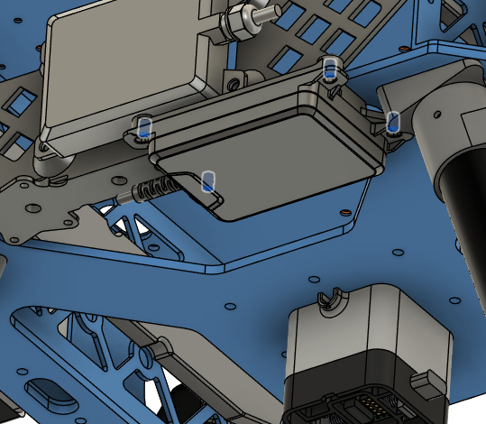|

---
### Step 17. Install Camera
- Parts needed:
  - 3241 (SIYI A8 Mini Gimbal Camera)
  - Screw 7 x4 (Hex Drive Flat Head Screw M3x8)
  - Washer 1 x8 (M3 General Purpose Washer 3.2 mm ID, 6 mm OD)
  - Nut 1 x4 (Nylon-Insert Locknut M3)

- Secure SIYI A8 Mini Gimbal Camera in front-bottom corner of the drone, as shown in the image.
  - Use 4x Screw 7.
  - Use 4x Washer 1.
  - Use 4x Nut 1.
  - DO NOT use Loctite Threadlocker.
  - Mind the orientation of the camera, make sure the gimbal center points forward, i.e. away from the drone.

| Camera Installation Holes | Camera Orientation |
|--|--|
|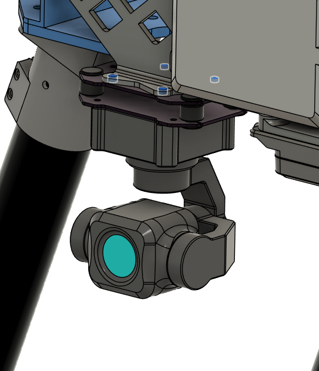|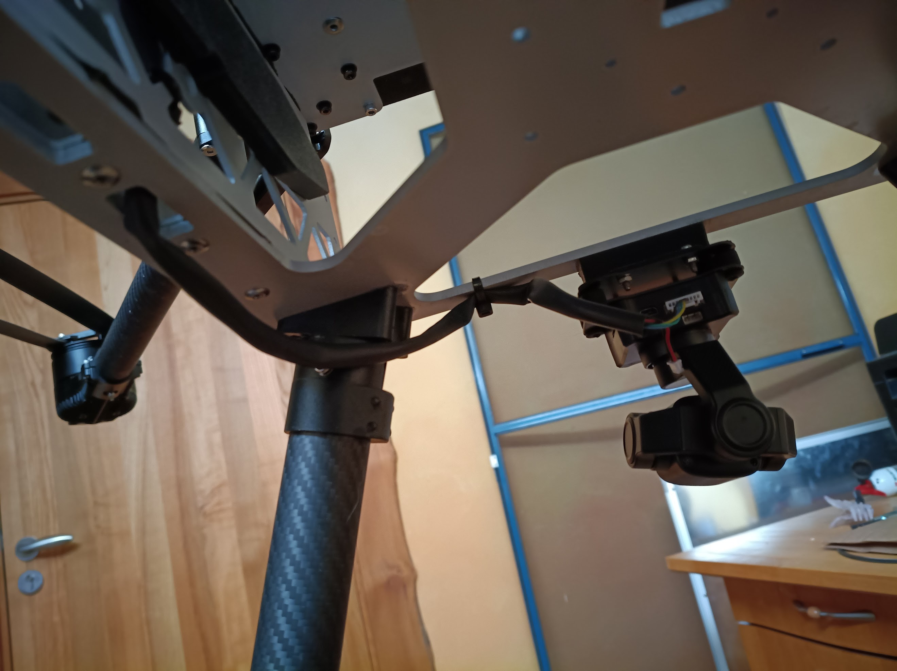|

---
### Step 18. Install Motor Arm Tubes & Motors
- Parts needed:
  - 14X2 (4x Motor Arm Tubes)
  - 31X1 (4x Hobbywing X6 Plus Motors)
  - Screw 6 x8
  - Washer 1 x16
  - Nut 1 x8
  - Loctite Threadlocker Blue 242

- Drill holes on the motor arm tubes for assembly.
  - Pay close attention to hole alignment. Both longitudinal (axial) and radial (rotational) alignment must be maintained.
  - See the image for distancing.
  - Use 3 mm drill bit.
  - This step is critical. Improper hole alignment may result in thrust imbalance.
    - A drill jig may be used to ensure proper alignment.

|Motor Arm Tube Hole Drilling Layout|
|--|
|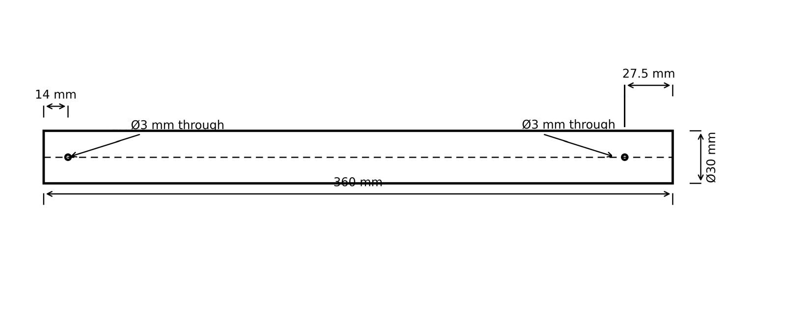|

- Slide a tube inside each motor tube clamp.
  - Orient the tube so that the motor is installed on the end with the shorter hole-to-end distance.
  - Route the motor & ESC cables through the inside of the tube.
  - Make sure the tubes are inserted all the way.
  - Use Screw 6 to fix the tube in place.
  - Use Washer 1 on each side.
  - Use Nut 1.
  - Do not apply more than 0.6 Nm of torque. 

- Tighten the clamps with the screws provided in the motor package.
- Use Loctite Threadlocker Blue to secure the screws.

|Motor Installation|
|--|
|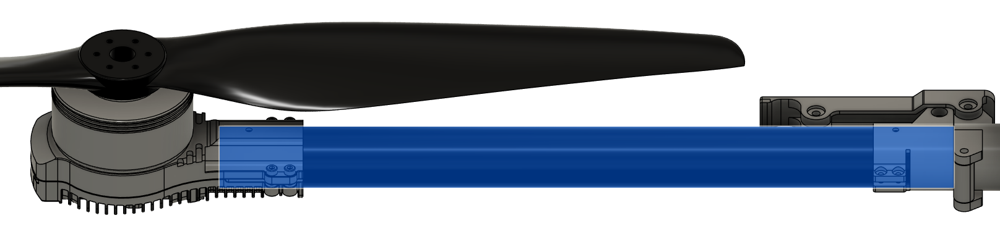|

- Install the motor arms on the motor arm connectors.
  - Mind the motor spin directions. Use **Ardupilot Quad X** motor layout. See the image for reference. The front of the drone is where the radar sensors are.
  - Make sure the tubes are inserted all the way.
  - Route the cables from inside the tube, through the cable exit hole on top of the motor arm connector.
  - Use Screw 6 to fix the tube in place.
  - Use Washer 1 on each side.
  - Use Nut 1.
  - Do not apply more than 0.6 Nm of torque.

- Tighten the clamps with the screws provided in the motor arm connector package.
- Use Loctite Threadlocker Blue to secure the screws.

|Motor Arm Installation| Motor Cable Routing|
|--|--|
|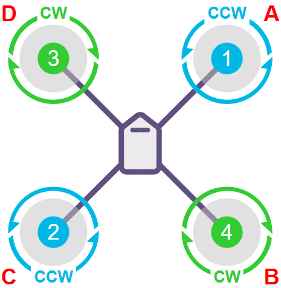|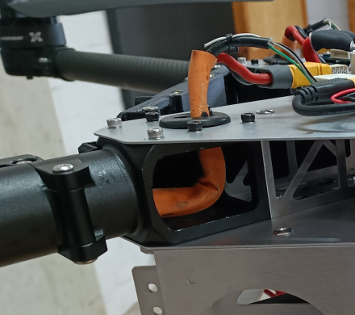|
 
- Set the LED colors at each end of the motors.
  - LEDs on the left side motors (Motors 2 & 3, C & D) should be **RED**.
  - LEDs on the right side motors (Motors 1 & 4, A & B) should be **GREEN**.
  - Use the [motor user manual](https://www.hobbywing.com/en/uploads/file/20230530/4b6e40b9a412b8675f68c065aece5644.pdf) to set the colors.

|Adjusting LED Color Instructions|
|--|
|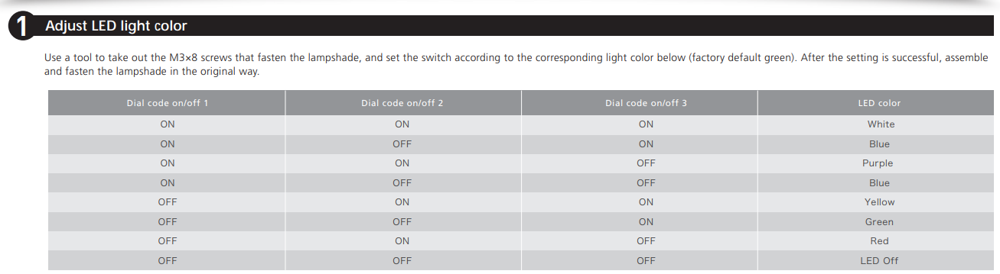|

---

### Step 19. Install Telemetry Air Unit & Attachment Interface PCBs
- Parts needed:
  - 3223 (HM30 Telemetry Air Unit)
  - 3341, 3342, 3343 (Attachment Interface PCBs)
  - Screw 3 x12 (Button Head Hex-Drive Screw M2x4)
  - Loctite Threadlocker Purple 222
  - Double-Sided Tape

- Install the HM30 air unit on the right side of the drone.
  - Secure tightly with double-sided tape.
  - Mind the orientation.

|HM30 Air Unit installation|
|--|
|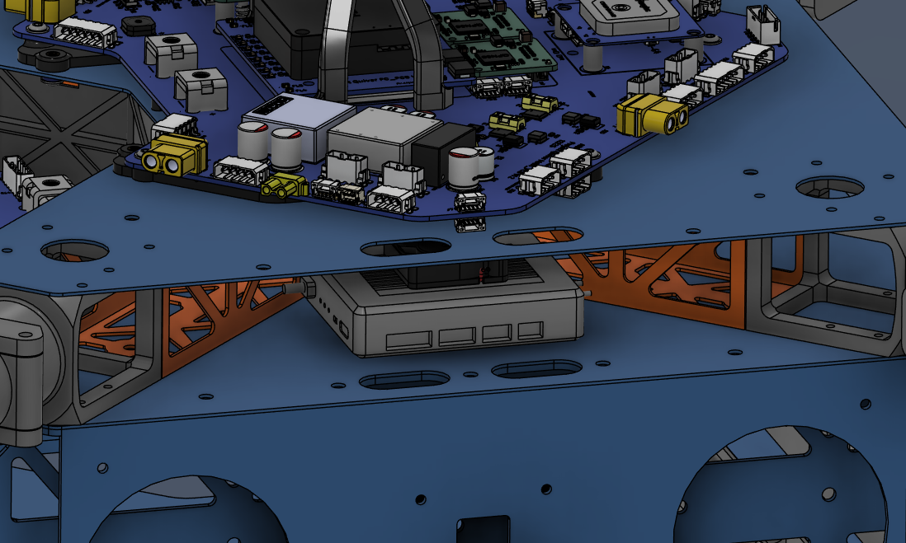|

- Install the attachment interface PCBs on all three attachment interfaces.
  - The pin side will face outward, while the connector side will stay inside.
  - Make sure the side with the notch mark will be on the notch side of the attachment interface. (See Step 15 for notch reference)
  - Secure them with Screw 3.
    - Use Loctite Threadlocker Purple.

|Attachment Interface PCB Orientation| PCB Location |
|--|--|
|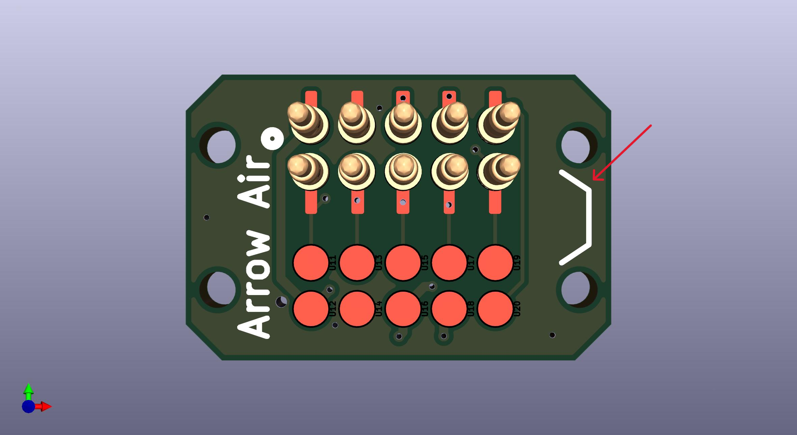|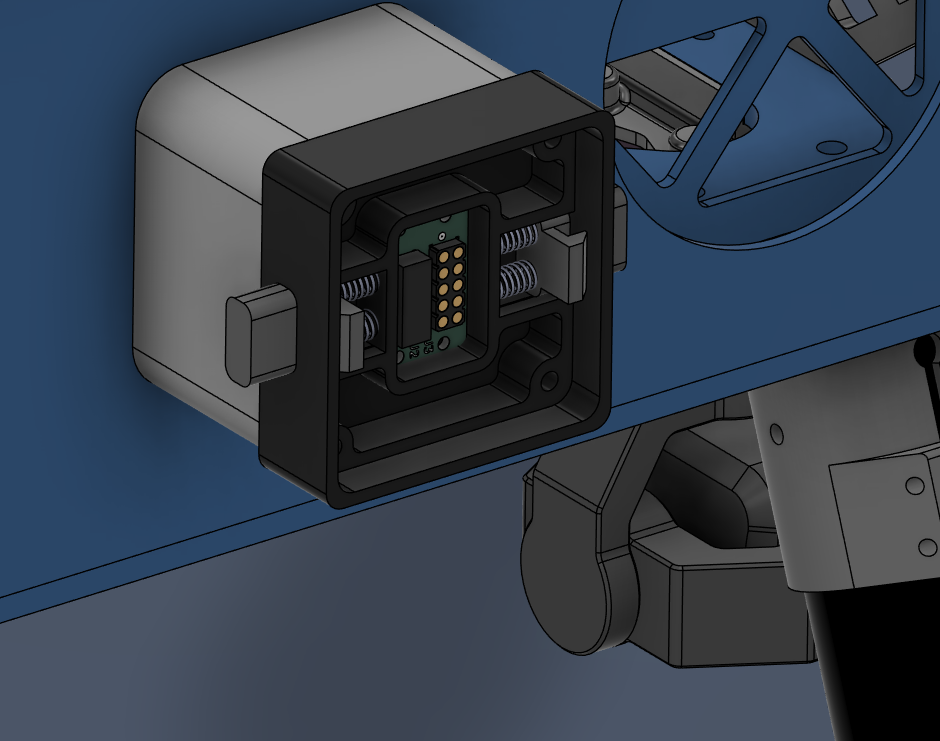|

---

### Step 20. Install Main Enclosure & Top Cap
- Parts needed:
  - 2411 (Main Enclosure)
  - 2412 (Top Cap)
  - 2421 & 2422 (Enclosure Hinges)
  - 2431 & 2432 (Enclosure Latches)  
  - Insert 1 x28 (M3 Threaded Inserts - 5.7 mm)
  - Silicone Foam Seal Strip (OD: 8 mm)
  - Screw 5 x4 (Socket Head Screw M3x8)
  - Screw 8 x8 (Hex Drive Flat Head Screw M3x10)
  - Screw 17 x8 (Socket Head Screw M3x6)
  - Washer 1 x4 (M3 General Purpose Washer 3.2 mm ID, 6 mm OD)
  - Loctite Threadlocker Purple 222
  - Würth Super RTV Silicone Black

- Place Insert 1 to the holes shown in the picture on the main enclosure.
  - Use a soldering iron to place them inside the plastic.
  - 16 in total.

|Insert 1 (5.7 mm) Locations|
|---|
|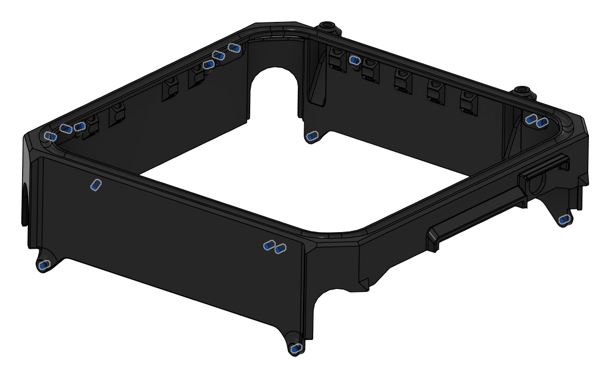|

- Place Insert 1 to the holes shown in the picture on the top cap.
  - Use a soldering iron to place them inside the plastic.
  - 12 in total.

|Insert 1 (5.7 mm) Locations|
|---|
|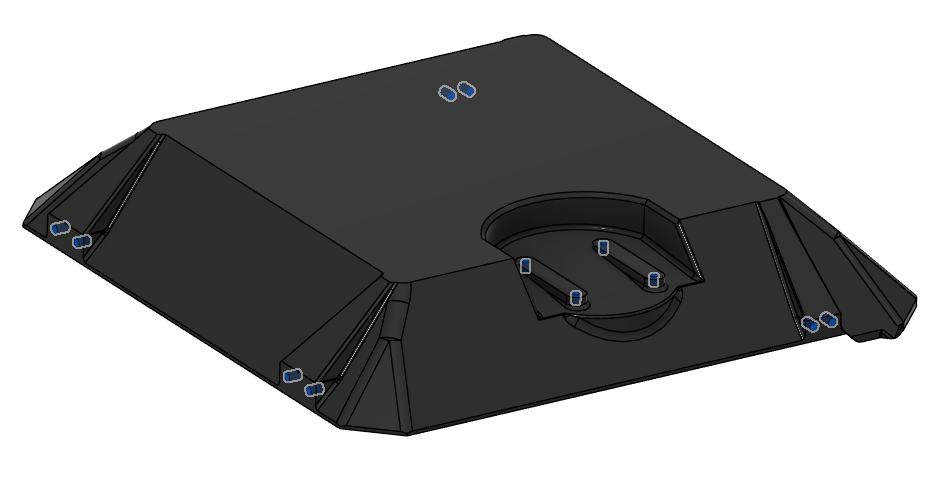|

- Place Silicone Foam Seal Strip in the groove on the main enclosure.
  - Cut the seal strip to length that minimizes the gap between the ends.
  - Use Würth Super RTV Silicone Black to install it in the groove.
  - Seal the gap between the ends of the strip with Würth Super RTV Silicone Black.

|Silicone Foam Seal Strip Location|
|---|
|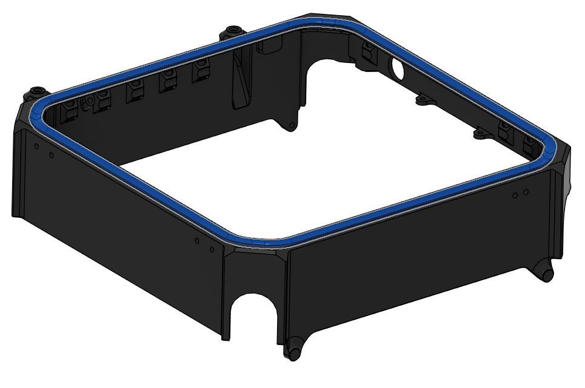|

- Install the hinges and latches on the main enclosure and the top cap. 
  - Use Screw 8 for the hinges.
  - Use Screw 17 for the latches.
  - Use Loctite Threadlocker Purple.

|Hinge & Latch Installation|
|---|
|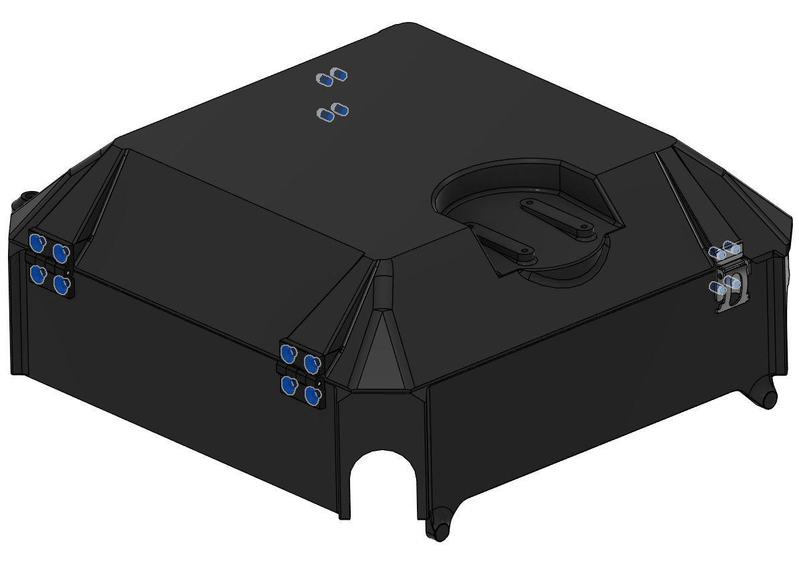|

- Place the main enclosure and the top cap on the aircraft.
  - Apply Würth Super RTV Silicone Black on the contact surface between the BC-PCB cover and the main enclosure, as shown in the image.
  - Make sure the antenna cables stay over the upper plate, as they will be hard to grab afterwards.

|Würth Super RTV Silicone Black Application|
|---|
||

- Secure the main enclosure on each corner using the hole shown in the image.
  - 4 locations in total.
  - Use Screw 5.
  - Use Washer 1. 
  - Use Loctite Threadlocker Purple. 

|Main Enclosure Installation Hole|
|---|
|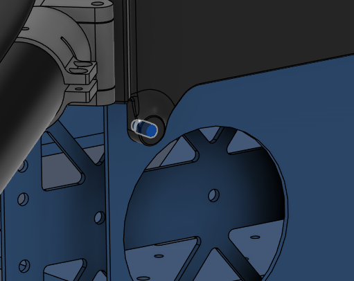|

### Step 21. Install the Push Button, Antennas & LIDAR
- Parts needed:
  - 3211 (Obstacle Avoidance Lidar S2L)
  - 3221, 3222 (Front & Rear Telemetry Antennas)
  - 3231 (Power Switch)
  - Screw 5 x4 (Socket Head Screw M3x8)
  - Washer 1 x4 (M3 General Purpose Washer 3.2 mm ID, 6 mm OD)
  - Würth Super RTV Silicone Black
  - Loctite Threadlocker Purple 222

- Remove the marked nuts from the antenna cables.
- Insert the antenna cables through the holes shown in the picture.
- Secure the antenna cables from outside with the nuts that were removed.
- Install the antennas on the outside.

|Antenna Cable Nut| Antenna Cable Locations| Antenna Placement|
|--|--|--|
|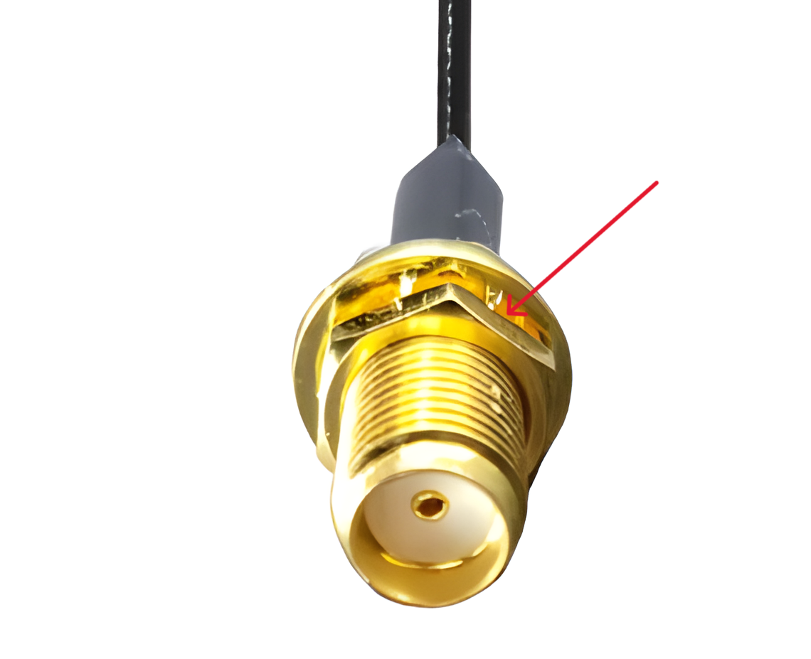|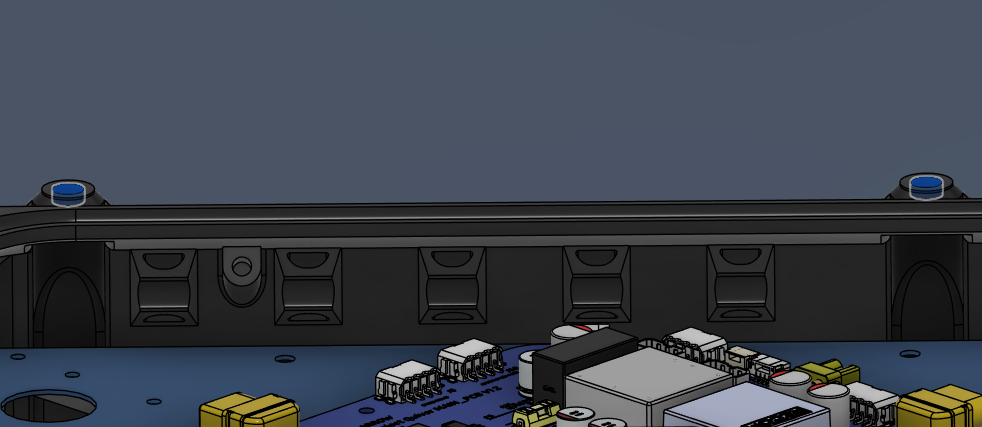|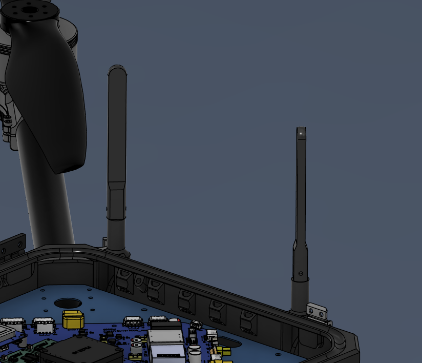|

- Remove the marked nut from the push button.
- Insert the push button in its location on the main enclosure.
- Secure it with the nut from inside.

|Push Button Nut| Push Button Location|
|--|--|
|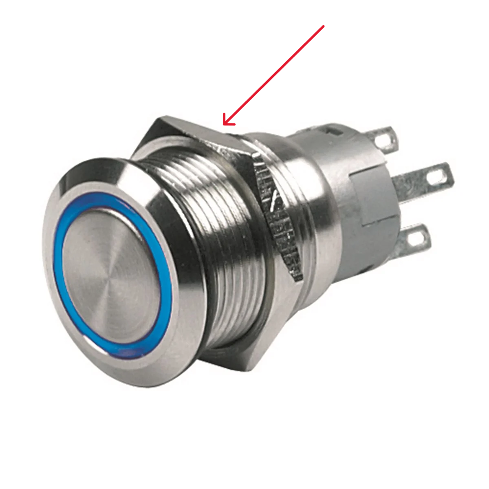|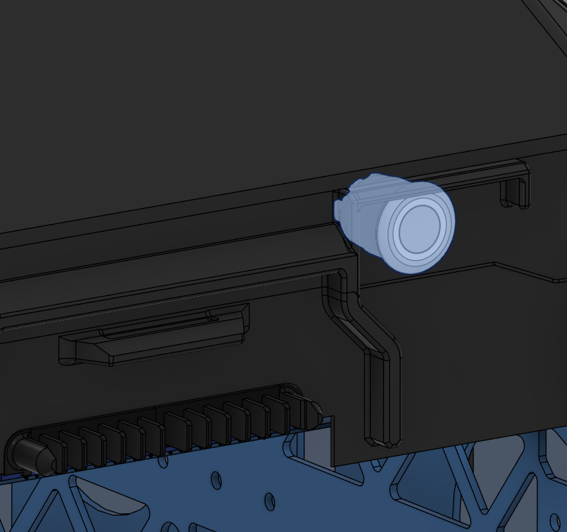|

- Place the Lidar in its slot over the top cap.
  - Mind the orientation of the cable. It should go through the hole on the top cap. 
- Secure with Screw 5 and Washer 1. 
- Use Loctite Threadlocker Purple.
- Seal the gap around the cable with Würth Super RTV Silicone Black.

|Lidar Installation|
|---|
|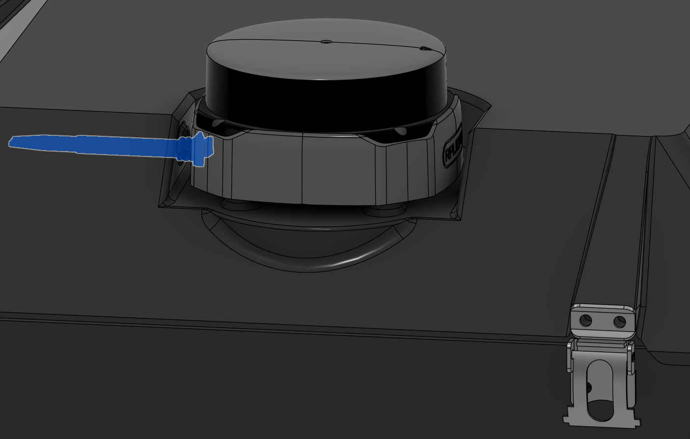|

---

### Step 22. Install the PPP Adapter & Beacon
- Parts needed:
  - 2341 (PPP Adapter & Beacon Mount)
  - 3261 (Remote ID Beacon)
  - 3271 (PPP Adapter)
  - Screw 5 x2 (Socket Head Screw M3x8)
  - Screw 10 x4 (Socket Head Screw M2x6)
  - Washer 1 x2 (M3 General Purpose Washer 3.2 mm ID, 6 mm OD)
  - Insert 3 x4 (M2 Threaded Inserts)
  - Loctite Threadlocker Purple 222
  - Double-Sided Tape

- Place Insert 3 to the holes shown in the picture on the PPP Adapter & Beacon Mount.
  - Use a soldering iron to place them inside the plastic.
  - 4 in total.

|Insert 3 Locations|
|---|
|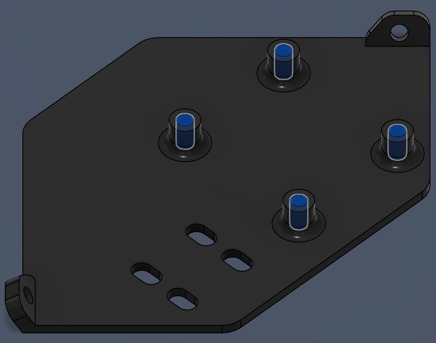|

- Place the PPP Adapter & Beacon Mount inside the main enclosure, as shown in the picture.
  - Secure it with Screw 5 and Washer 1.
  - Use Loctite Threadlocker Purple.

|PPP Adapter & Beacon Mount Location|
|---|
|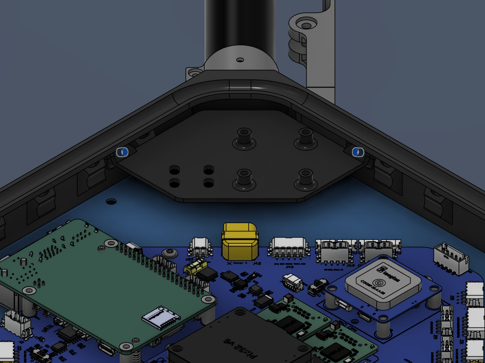|

- Place the PPP Adapter & Beacon on the mount, as shown in the picture.
  - Secure the Beacon with Screw 10, use Loctite Threadlocker Purple.
  - Secure the PPP Adapter on the mount with double-sided tape.

|PPP Adapter & Beacon Mount Installation|
|---|
|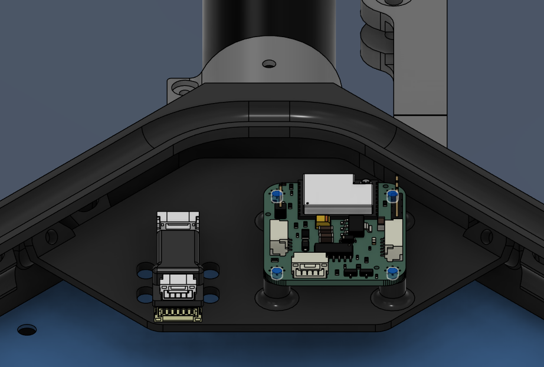|

-----

