# Attachment Developer Guide

If you are designing or building a hardware attachment for Quiver, this guide covers everything you need: how the attachment mounts to the airframe, what off-the-shelf parts to order, how the electrical connectors mate, and how to safely wire power, CAN, PWM, and Ethernet.

For software integration (using the Quiver SDK, writing a payload app, and communicating with the ground station), see the companion [Quiver SDK Developer Guide](./Quiver-SDK-Developer-Guide.md).

---

## Quick Start: The Mental Model

If you have never seen a Quiver aircraft before, here is how the physical and electrical systems connect.

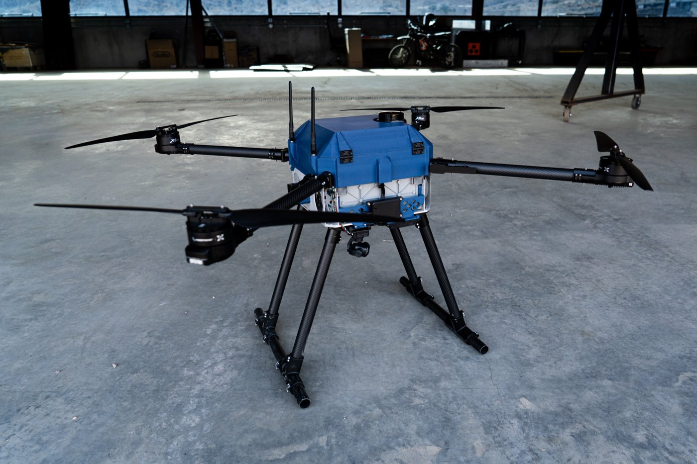
*Figure 1: Quiver multirotor drone in flight service.*

### The Drone

Quiver is an industrial multirotor drone built around a central motherboard called the Main PCB. The airframe provides **three external payload bays**:
- **Bottom Bay:** Facing straight down under the fuselage.
- **Side 1 Bay (Right / Starboard):** Facing outward to the right.
- **Side 2 Bay (Left / Port):** Facing outward to the left.

Each bay has the same standardized mounting footprint and electrical connection.

### How an Attachment Mates

Connecting an attachment to Quiver involves two parts: a mechanical clamp and a blind-mate circuit board.

1. **Mechanical Clamp:** You mount your payload to the drone using an off-the-shelf aluminum quick-release clamp plate pair (BOM 2112, 50 x 50 mm). The drone carries the fixed half with release levers; your payload carries the sliding base half. No tools are needed to latch or unlatch the payload once installed.
2. **Blind-Mate Interface PCB:** Recessed inside the clamp plate is a small circuit board called the **Attachment Interface PCB** ([`QuiverAttachPCB.kicad_pcb`](../../src/pcb/attach_pcb/QuiverAttachPCB.kicad_pcb)). The drone side has spring-loaded pogo pins (`U1` to `U10`). Your payload carries an identical board populated with flat copper landing pads (`U11` to `U20`). When you slide and latch the quick-release clamp, the drone's pogo pins press against your board's landing pads.
3. **Internal Wiring:** **You do not solder or wire to the pogo pins or landing pads.** On the back face of the provided payload PCB is a 12-pin locking Molex connector (**J1**). All of your internal sensors, servos, cameras, and microcontrollers plug into this Molex connector via a simple wire harness.

```
[ AIRCRAFT AIRFRAME ]
         │
         ▼
[ Carbon-PETG Spacer ]         (30 mm standoff on sides; wiring notch on bottom)
         │
         ▼
[ Fixed Quick-Release Plate ]  (Drone half with release pins, BOM 2112)
         │
 [ Aircraft PCB ]              (Populated with male Pogo Pins U1 to U10)
═════════╪══════════════════════════════════════════════════════════════════ BLIND-MATE CONTACT PLANE
 [ Payload PCB ]               (Provided to you; populated with flat pads U11 to U20)
         │
         ▼
[ Sliding Base Plate ]         (Payload half of BOM 2112 clamp plate)
         │
 [ Molex J1 Header ]           (12-pin locking header on rear of Payload PCB)
         │
         ▼
[ Your Payload Wire Harness ]  (Mates with Molex 2045231201 plug)
         │
         ▼
[ YOUR PAYLOAD HARDWARE ]
```

### Key Terms

| Term | What It Means |
|---|---|
| **Attachment Interface PCB** | The compact 23.5 x 15.8 mm board ([`QuiverAttachPCB`](../../src/pcb/attach_pcb/QuiverAttachPCB.kicad_pcb)) that sits inside the quick-release plate. |
| **Pogo Pins (`U1` to `U10`)** | Spring-loaded brass pins on the **drone-side** board. |
| **Landing Pads (`U11` to `U20`)** | Flat circular copper pads on the **payload-side** board that contact the drone pogo pins. |
| **Molex J1** | The 12-pin locking connector (Molex part 2077601281) on the back of the payload board. This is where your harness plugs in. |
| **CAN2** | The onboard vehicle CAN bus running at 500 kbit/s. All three payload bays connect to CAN2. CAN1 is kept separate for flight-critical motor controllers (ESCs) and GPS. |
| **DroneCAN** | The standard open communication protocol running on CAN2. Microcontrollers on your payload join as DroneCAN nodes. |
| **FMU** | Flight Management Unit (the ArduPilot flight controller). Each bay gets an auxiliary PWM/GPIO line from the FMU. |
| **Switched 12V (`+12V_PL`)** | The shared 12V payload power rail (pin 10 on Molex J1), controlled by solid-state relay U5 (`FMU_CH4`). All three bays share roughly 13W total. |
| **Motor 12V (`12VSW`)** | A secondary 12V line on the **bottom bay only** (pins 2 and 4 on Molex J1), controlled by solid-state relay K1 (`FMU_CH2`). Dedicated to driving the brush bullet DC motor payload. |
| **Switched HV (`J26`)** | Raw 14S battery power (~50V to 58.8V) from a dedicated 2-pin connector on the Main PCB for power-hungry attachments exceeding 13W. |

---

## 1. What is a Quiver Attachment?

A Quiver attachment is an interchangeable hardware module that clicks into one of the three bay locations on the drone:

| Bay Location | Physical Position | Facing Direction | Typical Payloads |
|---|---|---|---|
| **Bottom** | Underside of lower chassis plate | Facing straight down (-Z) | Gimbal cameras, LiDAR scanners, drop mechanisms, brush bullet actuators |
| **Side 1 (Right)** | Starboard battery wall | Facing outward right (+X) | Inspection cameras, atmospheric sensors, radio links, spotlight pods |
| **Side 2 (Left)** | Port battery wall | Facing outward left (-X) | Starlink Mini terminals, radar units, environmental air samplers |

### Where the Bays Sit on the Aircraft

The three bays are integrated into the fuselage structure:

| Rear View (Bay Locations) | Side View (Port Offsets) |
|:---:|:---:|
| 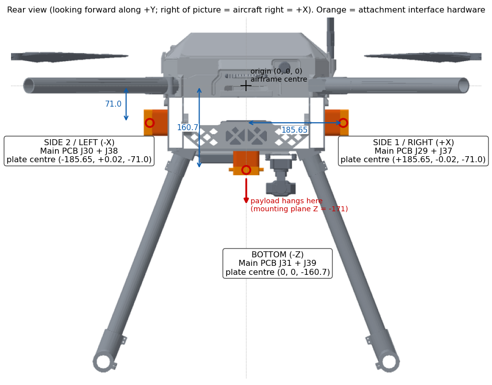 | 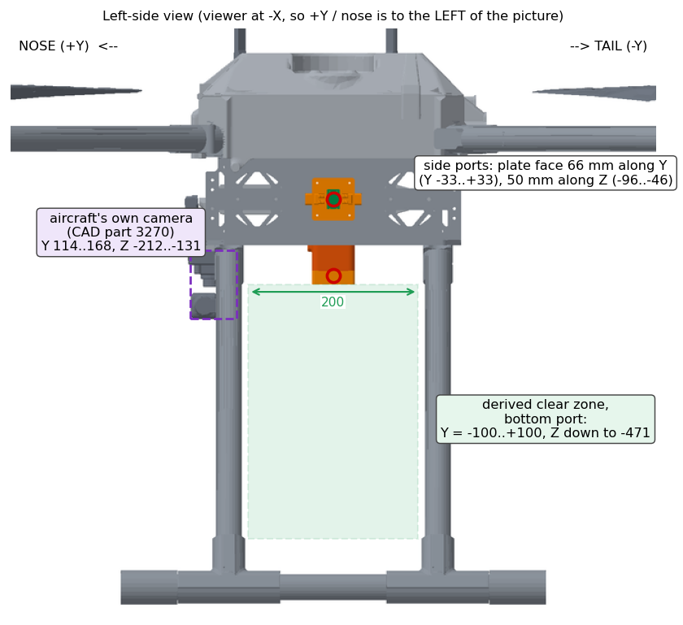 |
| *Figure 2: Payload bays viewed from the rear.* | *Figure 3: Payload bays viewed from the side.* |

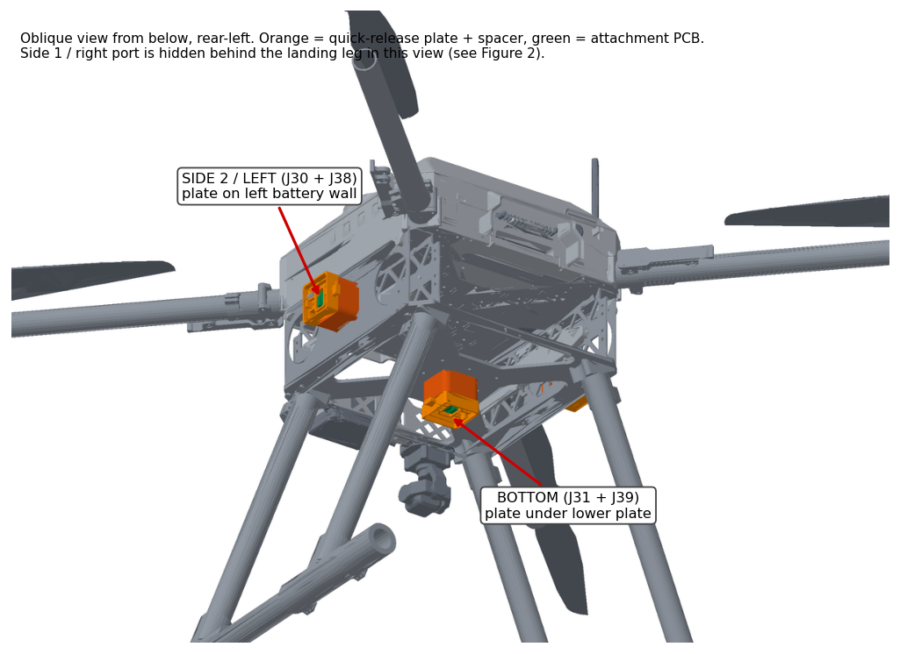
*Figure 4: Payload bays in 3D perspective showing the outward-facing mounting plates.*

### Practical Rules Before You Build

- **Power Off When Connecting (No Hot-Swapping):** Always power down the aircraft before attaching or detaching a payload. Inrush current and pogo pin contact bounce during hot-plugging can trip onboard fuses or cause microcontrollers to brown out. Treat the interface as **connect-only-when-unpowered**.
- **Real Examples in Service:**
  1. **Brush Bullet Actuator:** Uses the dedicated `12VSW` line on the bottom bay to drive a 12V DC motor, switched directly by the flight controller via relay channel `FMU_CH2`.
  2. **Payload Release Latch:** A servo-actuated release hook triggered by a PWM pulse on `FMU_CH1`, using a small 12V-to-6V onboard regulator.
  3. **Multispectral NIR Camera:** Receives shutter trigger pulses via PWM and transmits telemetry over CAN2.
  4. **Starlink Mini Terminal:** Mounted to the Side 2 bay, streaming data over the 100BASE-TX Ethernet connection.

---

## 2. Mechanical Interface

This chapter gives you the physical dimensions, hole locations, fastener specs, and clearance envelopes needed to design an attachment that bolts on cleanly.

### 2.1 Coordinate Frame and Bay Locations

Quiver uses standard aircraft coordinates with the origin `(0, 0, 0)` at the center of the fuselage interior:
- **+X:** To the right (Starboard)
- **+Y:** Forward toward the nose
- **+Z:** Upward toward the top lid

```
                        +Z (Up)
                           ▲
                           │
       Side 2 (Left)       │       Side 1 (Right)
       [-X bay]            │            [+X bay]
      [===]──────────[ FUSELAGE ]──────────[===]
                           │
                           │
                           ▼ -Z (Down)
                         [===]
                      Bottom bay
```

| Bay | Mounting Plate Center (X, Y, Z) | Facing Direction | Mounting Hardware on Aircraft |
|---|---|---|---|
| **Bottom** | `(0.00, 0.00, -160.70) mm` | Down (-Z) | Bolts beneath lower chassis plate via spacer [`2131`](../../src/quiver/supporting_structure/attachment_interface/steps/2131_attach_spacer_bottom.step) |
| **Side 1 (Right)** | `(+185.65, -0.02, -71.00) mm` | Right (+X) | Bolts to starboard battery wall via spacer [`2111`](../../src/quiver/supporting_structure/attachment_interface/steps/2111_attach_spacer.step) |
| **Side 2 (Left)** | `(-185.65, +0.02, -71.00) mm` | Left (-X) | Bolts to port battery wall via spacer [`2111`](../../src/quiver/supporting_structure/attachment_interface/steps/2111_attach_spacer.step) |

### 2.2 Drone-Side Hardware and Spacers

To give your payload proper clearance from the aircraft body and make assembly easy, the drone uses carbon-fiber reinforced PETG spacers at each bay:

| Bottom Interface Assembly | Side Interface Exploded View |
|:---:|:---:|
| 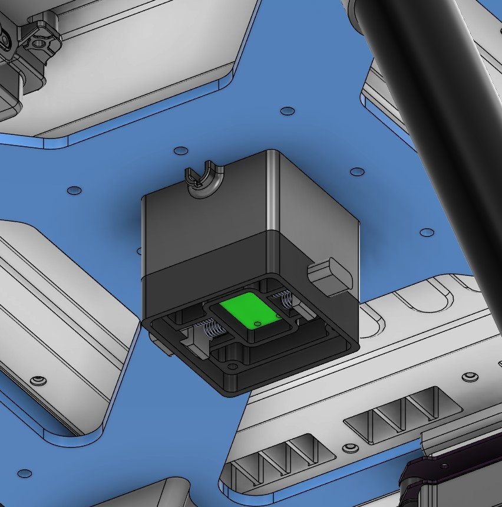 | 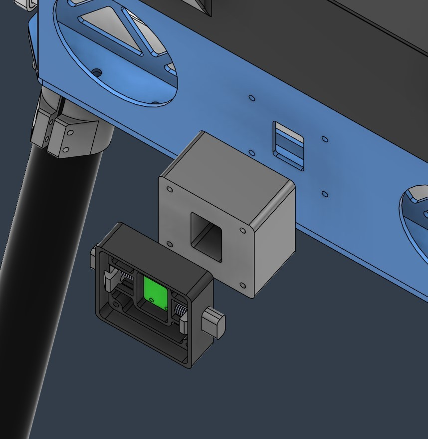 |
| *Figure 5a: Bottom interface assembly showing the wire notch.* | *Figure 5b: Side interface exploded view showing the 30 mm spacer.* |

- **Side Ports (Right and Left):** Each side bay uses spacer `2111` ([`2111_attach_spacer.step`](../../src/quiver/supporting_structure/attachment_interface/steps/2111_attach_spacer.step)), which provides a **30 mm standoff** from the battery wall. This offset ensures your payload will not collide with the side frame plates or the battery slider mechanism. Holes inside the battery compartment let you reach the M3 mounting screws with a standard screwdriver.
- **Bottom Port:** The bottom bay uses spacer `2131` ([`2131_attach_spacer_bottom.step`](../../src/quiver/supporting_structure/attachment_interface/steps/2131_attach_spacer_bottom.step)). It includes a **side-facing wire exit notch**. This routes the wiring harness out horizontally rather than downward, protecting cables from getting snagged or damaged during takeoff and landing.

| Side Spacer (`2111_attach_spacer`) | Bottom Spacer with Notch (`2131_attach_spacer_bottom`) |
|:---:|:---:|
|  |  |

### 2.3 The Quick-Release Clamp Plate (BOM 2112)

Mechanically, your payload attaches via an off-the-shelf CNC aluminum quick-release clamp assembly (BOM 2112, based on the JMRRC 50 x 50 mm quick-release clamp spec):


*Figure 6: Quick-release clamp plate assembly (BOM 2112).*

- **Footprint:** 50.0 mm x 50.0 mm square.
- **Mated Thickness:** 10.5 mm total thickness when latched together.
- **Aircraft Half (Fixed Base):** Stays bolted to the drone's spacer with four M3 socket-head screws. Contains spring press-pins for latching.
- **Payload Half (Replaceable Base Plate):** Screws onto your attachment. It has beveled edges that slide into the aircraft base and snap firmly into place without tools.
- **Z-Clearance:** On the bottom port, the top mounting plane of your payload sits at `Z = -171.0 mm` (the drone-side plate and spacer assembly adds roughly 10.3 mm below the spacer center).

### 2.4 Attachment Interface PCB Dimensions

The electrical connection is made by the **Quiver Attachment Interface PCB** ([`src/pcb/attach_pcb/QuiverAttachPCB.kicad_pcb`](../../src/pcb/attach_pcb/QuiverAttachPCB.kicad_pcb)), which sits nested inside the quick-release plate:

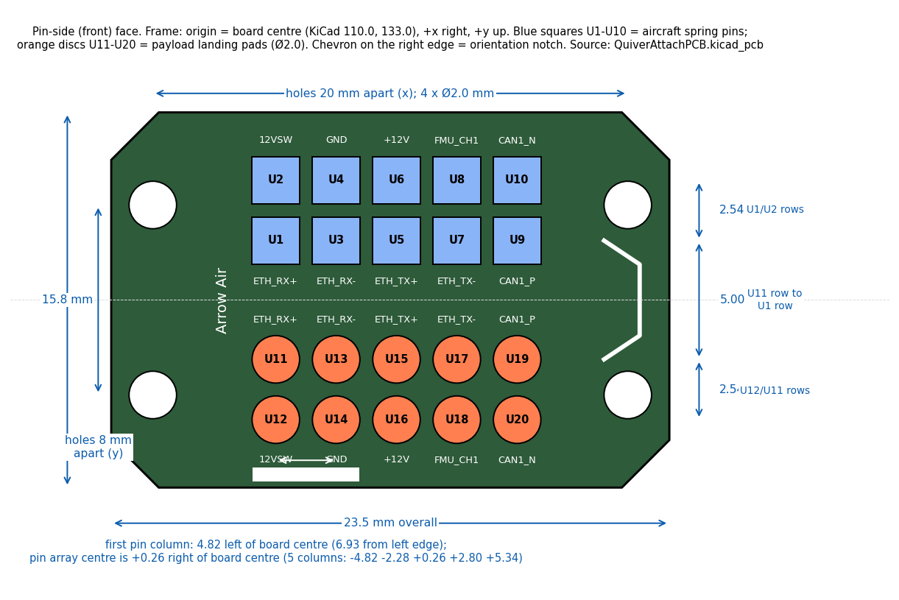
*Figure 7: PCB layout dimensions and mounting hole grid.*

- **Outer Dimensions:** 23.50 mm wide x 15.80 mm high.
- **Board Thickness:** **1.20 mm FR4** (do not use standard 1.6 mm board stock; 1.2 mm is required to sit flush inside the plate pocket).
- **Mounting Holes:** 4x M2 threaded holes arranged in a rectangle:
  - Horizontal spacing (X axis): **20.00 mm** center-to-center.
  - Vertical spacing (Y axis): **8.00 mm** center-to-center.
  - Local board coordinates: `(100.0, 129.0)`, `(120.0, 129.0)`, `(100.0, 137.0)`, `(120.0, 137.0)`.
- **Fasteners:** 4x M2 machine screws. Hand-tighten with a small manual screwdriver only; never use power drivers.
- **Orientation Keying:** The board has asymmetric 45-degree chamfered corners and a silkscreen alignment notch on the top edge. These match the cavity in the quick-release plate so the board cannot be installed backward.

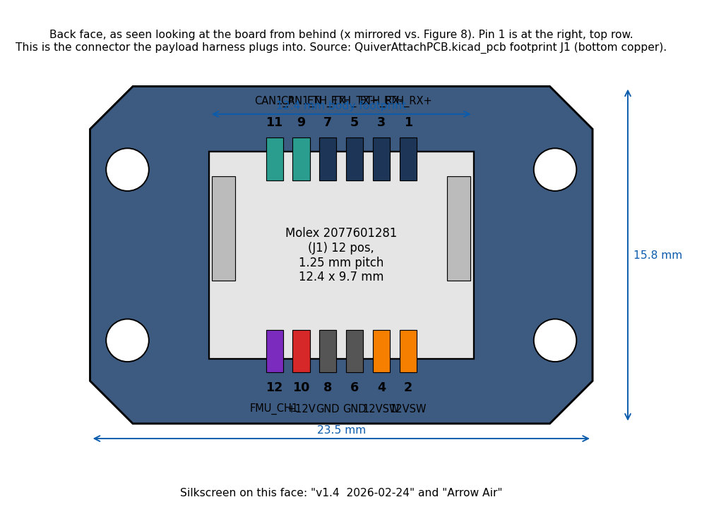
*Figure 8: Rear face of the payload board showing the 12-pin Molex J1 connector.*

### 2.5 How the Boards Mate vs. How You Wire

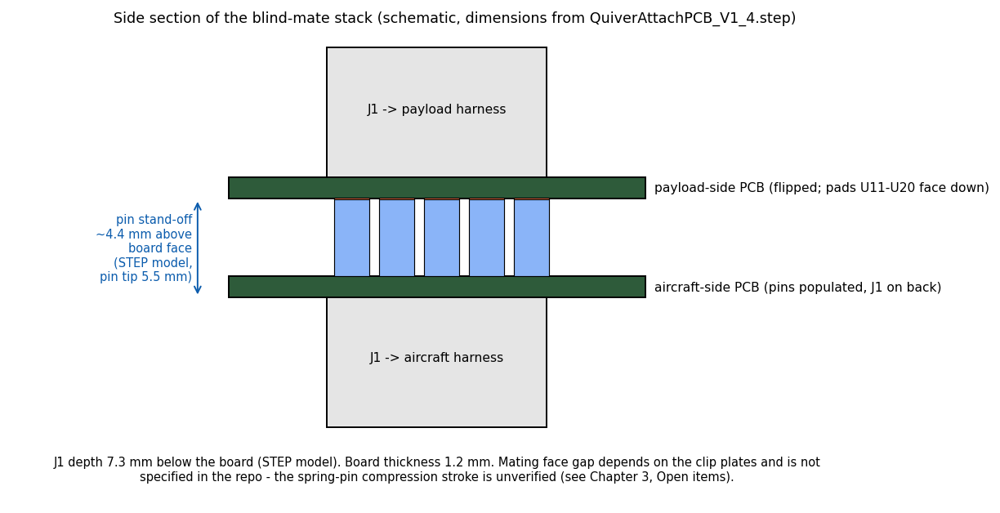
*Figure 9: Cross-section showing drone pogo pins contacting payload pads, and your harness connecting to Molex J1.*

A single board design serves both sides of the interface by populating different parts:

| Drone-Side Board | Payload-Side Board (Provided to You) |
|---|---|
| Populated with 10 male spring-loaded pogo pins (`U1` to `U10`, LCSC part `C2826546` / `BWCD-L4.5W2.0H2.3`). | Populated with 10 flat circular copper landing pads (`U11` to `U20`, 2.0 mm diameter). |
| The pogo pins face outward toward the docking bay. | The landing pads face inward toward the aircraft. |
| Rear Molex J1 connects to the aircraft internal avionics harness. | Rear Molex J1 connects to your payload internal electronics. |

| Physical PCB: Mating Face | Physical PCB: Rear Connector Face |
|:---:|:---:|
| 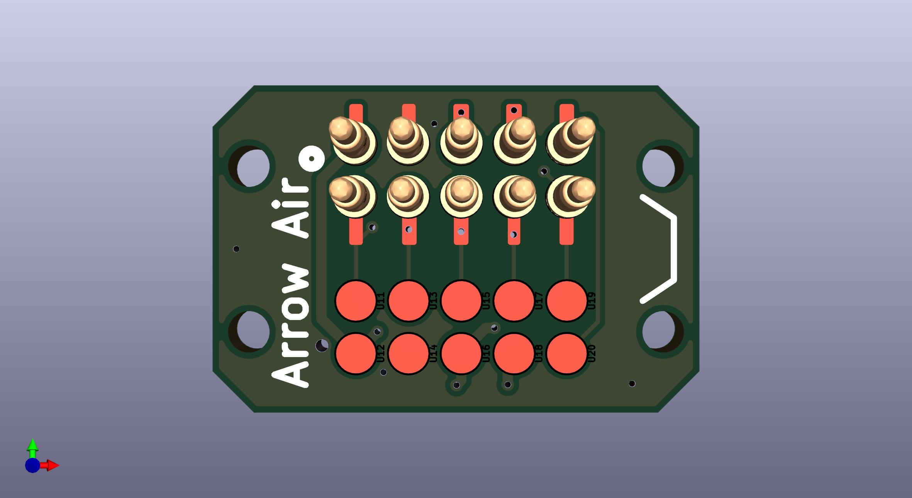 | 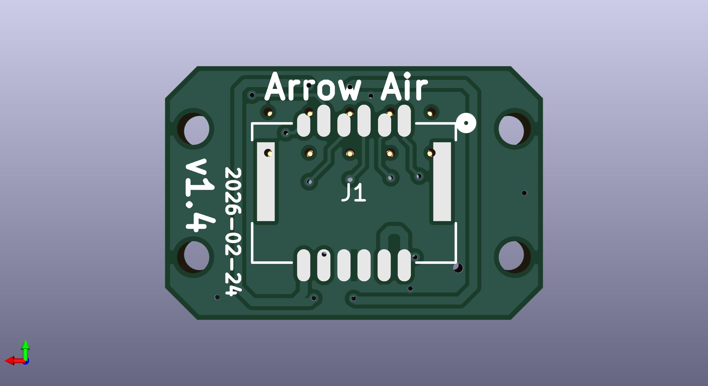 |

> [!WARNING]
> **Important wiring rule:**
> 1. Pogo pins `U1` to `U10` and landing pads `U11` to `U20` are **not redundant backup pins**. `U1` to `U10` are male pins on the aircraft board; `U11` to `U20` are flat pads on your board. They are mirrored so that when the boards touch, pin U1 hits pad U11, U2 hits U12, and so on.
> 2. You receive an assembled payload board with the landing pads already populated. You do **not** solder or attach wires to the pogo pins or pads.
> 3. Never try to bridge or wire both sets of contacts. Doing so will short power directly to ground and damage the board.
> 4. All of your attachment wiring connects exclusively through the **12-pin Molex J1 connector** on the back of the board.

---

## 3. Electrical Contract

Every voltage, rail limit, pinout, and signal in this chapter is verified against the official KiCad hardware design files:
- Main PCB Schematic: [`src/pcb/main_pcb/Quiver_PT3_Main_PCB.kicad_sch`](../../src/pcb/main_pcb/Quiver_PT3_Main_PCB.kicad_sch)
- Main PCB Layout: [`src/pcb/main_pcb/Quiver_PT3_Main_PCB.kicad_pcb`](../../src/pcb/main_pcb/Quiver_PT3_Main_PCB.kicad_pcb)
- Main PCB CAN Circuitry: [`src/pcb/main_pcb/CAN circuit.kicad_sch`](../../src/pcb/main_pcb/CAN%20circuit.kicad_sch)
- Main PCB Ethernet Circuitry: [`src/pcb/main_pcb/ETHERNET.kicad_sch`](../../src/pcb/main_pcb/ETHERNET.kicad_sch)
- Attachment PCB Schematic and Layout: [`src/pcb/attach_pcb/QuiverAttachPCB.kicad_sch`](../../src/pcb/attach_pcb/QuiverAttachPCB.kicad_sch) and [`QuiverAttachPCB.kicad_pcb`](../../src/pcb/attach_pcb/QuiverAttachPCB.kicad_pcb)

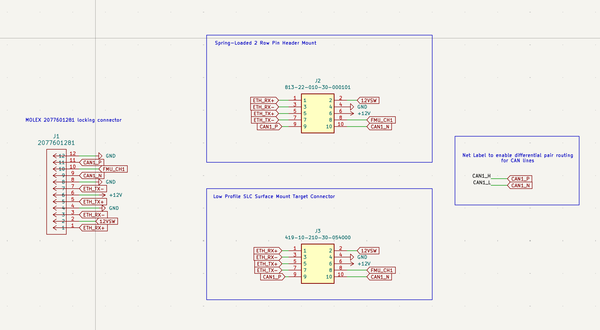

### 3.1 Port Capability Matrix

The three bays share power and CAN, but have different auxiliary lines:

| Capability | Bottom Bay | Side 1 / Right Bay | Side 2 / Left Bay | Source Citation |
|---|---|---|---|---|
| **Main 12V Rail (`+12V_PL`)** | **Switched** (SSR U5) | **Switched** (SSR U5) | **Switched** (SSR U5) | [`Quiver_PT3_Main_PCB.kicad_sch`](../../src/pcb/main_pcb/Quiver_PT3_Main_PCB.kicad_sch) line 10733 |
| **Motor 12V Rail (`12VSW`)** | **Switched** (SSR K1) | **No Connect (NC)** | **No Connect (NC)** | [`Quiver_PT3_Main_PCB.kicad_sch`](../../src/pcb/main_pcb/Quiver_PT3_Main_PCB.kicad_sch) lines 10713, 10817 |
| **CAN Bus** | **CAN2** (500 kbit/s) | **CAN2** (500 kbit/s) | **CAN2** (500 kbit/s) | [`Quiver_PT3_Main_PCB.kicad_pcb`](../../src/pcb/main_pcb/Quiver_PT3_Main_PCB.kicad_pcb) (J29, J30, J31) |
| **Ethernet 100BASE-TX** | Yes (Switch 1, J48) | Yes (Switch 1, J48) | Yes (Switch 2, J52) | [`ETHERNET.kicad_sch`](../../src/pcb/main_pcb/ETHERNET.kicad_sch) lines 3288, 3877 |
| **FMU Aux PWM/GPIO** | `FMU_CH1` (Servo 9) | `FMU_CH7` (Servo 15) | `FMU_CH8` (Servo 16) | [`Quiver_PT3_Main_PCB.kicad_sch`](../../src/pcb/main_pcb/Quiver_PT3_Main_PCB.kicad_sch) lines 10827 to 11340 |
| **Main PCB Header** | `J31` (PTSM 1814951) | `J29` (PTSM 1778735) | `J30` (PTSM 1778735) | [`Quiver_PT3_Main_PCB.kicad_pcb`](../../src/pcb/main_pcb/Quiver_PT3_Main_PCB.kicad_pcb) |
| **Default Static IP** | `192.168.144.100` | `192.168.144.101` | `192.168.144.102` | Network Topology Spec |

### 3.2 Main PCB Payload Headers (J29, J30, J31)

On the aircraft's Main PCB, each payload bay connects to a 6-pin Phoenix Contact PTSM connector:

| Pin | Bottom Bay (`J31`) Net | Side 1 Bay (`J29`) Net | Side 2 Bay (`J30`) Net | Function |
|:---:|---|---|---|---|
| **1** | `GND` (net 1) | `GND` (net 1) | `GND` (net 1) | Ground reference |
| **2** | `+12V_PL` (net 142) | `+12V_PL` (net 142) | `+12V_PL` (net 142) | Switched 12V payload rail (via relay U5) |
| **3** | `/CAN2_L` (net 90) | `/CAN2_L` (net 90) | `/CAN2_L` (net 90) | CAN2 bus Low (500 kbit/s) |
| **4** | `/CAN2_H` (net 85) | `/CAN2_H` (net 85) | `/CAN2_H` (net 85) | CAN2 bus High (500 kbit/s) |
| **5** | `/FMU_CH1` (net 116) | `/FMU_CH7` (net 100) | `/FMU_CH8` (net 101) | Dedicated flight controller PWM or GPIO pin |
| **6** | `/12VSW` (net 117) | *No Connect* (net 259) | *No Connect* (net 260) | Switched 12V motor line (**Bottom bay only**, via relay K1) |

*(Verified in [`src/pcb/main_pcb/Quiver_PT3_Main_PCB.kicad_pcb`](../../src/pcb/main_pcb/Quiver_PT3_Main_PCB.kicad_pcb): footprint lines 12113 to 12505 for J31, 38937 to 39250 for J29, 38297 to 38610 for J30).*

### 3.3 Payload Harness Connector: Molex J1 Pinout

The **12-pin Molex connector (J1)** on the back of your payload board is where your attachment wiring connects:
- **Board Header (J1):** Molex part `2077601281` (12-circuit, 1.25 mm pitch, right-angle locking connector).
- **Mating Cable Plug:** Molex housing `2045231201` with gold-plated crimp terminals `2045250001`.

| Pin | Signal Name | Type | Electrical Rating | Description |
|:---:|---|---|---|---|
| **1** | `ETH_RX+` | Input | 100BASE-TX diff pair | Ethernet Receive positive (from onboard switch J47) |
| **2** | `12VSW` | Power | +12V DC, 2A fused | **Bottom bay only:** Switched 12V line for brush bullet motor (relay K1). Unconnected on Side 1 and Side 2. |
| **3** | `ETH_RX-` | Input | 100BASE-TX diff pair | Ethernet Receive negative (from onboard switch J47) |
| **4** | `12VSW` | Power | +12V DC, 2A fused | Paralleled with pin 2 for extra current handling (Bottom bay only). |
| **5** | `ETH_TX+` | Output | 100BASE-TX diff pair | Ethernet Transmit positive (to onboard switch J47) |
| **6** | `GND` | Ground | 0V Reference | Power and signal ground return |
| **7** | `ETH_TX-` | Output | 100BASE-TX diff pair | Ethernet Transmit negative (to onboard switch J47) |
| **8** | `GND` | Ground | 0V Reference | Power ground return (doubled pin for current capacity) |
| **9** | `CAN_L` | I/O | ISO 11898-2 CAN Low | Aircraft **CAN2_L** (500 kbit/s). *(Board silkscreen says `CAN1_N`)* |
| **10** | `+12V` | Power | +12V DC, ~1.1A hold | Main switched payload rail `+12V_PL` (relay U5, `12V Pay`) |
| **11** | `CAN_H` | I/O | ISO 11898-2 CAN High | Aircraft **CAN2_H** (500 kbit/s). *(Board silkscreen says `CAN1_P`)* |
| **12** | `FMU_AUX` | I/O | 3.3V Logic PWM / GPIO | Bay auxiliary pin: **Bottom:** `FMU_CH1`, **Side 1:** `FMU_CH7`, **Side 2:** `FMU_CH8` |

*(Verified in [`src/pcb/attach_pcb/QuiverAttachPCB.kicad_pcb`](../../src/pcb/attach_pcb/QuiverAttachPCB.kicad_pcb) lines 6210 to 6580; [`QuiverAttachPCB.kicad_sch`](../../src/pcb/attach_pcb/QuiverAttachPCB.kicad_sch) lines 4358 to 4456).*

### 3.4 Pogo Pin and Landing Pad Map

When you check electrical continuity with a multimeter, here is how the 10 contact pads across the mating plane match up:

| Signal Name | Drone Pogo Pin (`U1` to `U10`) | Payload Landing Pad (`U11` to `U20`) | Mated Signal Function |
|---|:---:|:---:|---|
| `ETH_RX+` | `U1` | `U11` | Ethernet RX+ differential line |
| `12VSW` | `U2` | `U12` | Switched DC motor rail (Bottom bay only; NC on sides) |
| `ETH_RX-` | `U3` | `U13` | Ethernet RX- differential line |
| `GND` | `U4` | `U14` | System ground reference |
| `ETH_TX+` | `U5` | `U15` | Ethernet TX+ differential line |
| `+12V` | `U6` | `U16` | Main switched 12V payload rail (`+12V_PL`) |
| `ETH_TX-` | `U7` | `U17` | Ethernet TX- differential line |
| `FMU_AUX` | `U8` | `U18` | Auxiliary PWM/GPIO (`FMU_CH1` / `FMU_CH7` / `FMU_CH8`) |
| `CAN_H` | `U9` | `U19` | Vehicle **CAN2_H** (500 kbit/s) |
| `CAN_L` | `U10` | `U20` | Vehicle **CAN2_L** (500 kbit/s) |

*(Verified in [`src/pcb/attach_pcb/QuiverAttachPCB.kicad_sch`](../../src/pcb/attach_pcb/QuiverAttachPCB.kicad_sch) lines 2848 to 5464).*

### 3.5 Network and Ethernet Routing


*Figure 10: Quiver network routing showing Ethernet switches and CAN separation.*

If your payload uses high-bandwidth data (video streams, raw point clouds, or network links like Starlink), use the 100BASE-TX Ethernet connection:
- **Switch Hardware:** The Main PCB includes a BotBlox GigaBlox Nano module (`J47`, Samtec LSHM header) providing managed Ethernet switching.
- **Port Assignment:**
  - Bottom Bay and Side 1 Bay route to Switch 1 (`J48`, 4-pin JST-GH SM04B-GHS-TB).
  - Side 2 Bay routes to Switch 2 (`J52`, 4-pin JST-GH SM04B-GHS-TB).
- **Wiring to the Bay:** The harness carries the `ETH_TX` and `ETH_RX` pairs straight to pins 1, 3, 5, and 7 on Molex J1.

### 3.6 CAN Bus Architecture


*Figure 11: Main PCB CAN schematic showing bus isolation.*

Quiver keeps its vehicle traffic strictly separated across two independent CAN buses:

1. **CAN1 (Flight-Critical Avionics at 1 Mbit/s):**
   - Connects the flight controller to the motor ESCs, RTK-GNSS receivers, and Remote ID broadcast module.
   - **No payload bay connects to CAN1.** This guarantees that a misbehaving or flooding payload node cannot interfere with motor control or flight telemetry.
2. **CAN2 (Payload and Sensor Bus at 500 kbit/s):**
   - **All three payload bays (Bottom J31, Side 1 J29, Side 2 J30) connect to CAN2** (`/CAN2_H` and `/CAN2_L`).
   - Shared only with the two NanoRadar obstacle avoidance sensors.
   - Operates DroneCAN protocol at 500 kbit/s.

> [!NOTE]
> **Why the Attachment Board Silkscreen Says `CAN1_P / CAN1_N`:**
> The Attachment Interface PCB was created as a standalone board before the Main PCB finalized its vehicle net labels. While the attachment silkscreen says `CAN1_P` and `CAN1_N`, the aircraft Main PCB wiring ([`Quiver_PT3_Main_PCB.kicad_pcb`](../../src/pcb/main_pcb/Quiver_PT3_Main_PCB.kicad_pcb)) routes all three payload ports to vehicle bus **CAN2**.

- **Bus Termination:** The Main PCB already provides a switchable 120 ohm termination resistor (R14 via dip-switch S2). **Do not install a 120 ohm termination resistor inside your attachment.**

### 3.7 Power Delivery and Switching Rules

Quiver does not provide an always-on, unswitched battery feed on the attachment connectors. Every power rail is controlled by an electronic switch.

```
[ 14S LiPo Flight Battery (~50V to 58.8V) ]
         │
         ├───> [ Fuse F4 (5A) ] ───> [ Isolated DC-DC Converter (30W / 2.5A) ]
         │                                       │
         │                                       ▼ (+12V avionics supply)
         │                           [ Relay U5 (CPC1907B) ] <── Toggled by FMU_CH4 ("12V Pay")
         │                                       │
         │                                       ▼
         │                           [ PTC F8 (1.1A) + Fuse F7 (2A) ]
         │                                       │
         │                                       ├───> J31 Pin 2 (+12V_PL, Bottom)
         │                                       ├───> J29 Pin 2 (+12V_PL, Side 1)
         │                                       └───> J30 Pin 2 (+12V_PL, Side 2)
         │
         ├───> [ Relay K1 (CPC1019N) ] <── Toggled by FMU_CH2 ("12V switch for payload DC motor")
         │              │
         │              ▼
         │         [ Fuse F1 (2A) ] ───> J31 Pin 6 (12VSW, Bottom ONLY for Brush Bullet)
         │
         └───> [ Relay U4 (CPC1907B) ] <── Toggled by FMU_CH3 ("Add HV")
                        │
                        ▼
                   [ Fuse F2 (5A) ] ───> J26 Pin 2 (Switched High-Voltage Port)
```

#### A. Main 12V Payload Rail (`+12V_PL`)
- **Available on:** All three bays (Molex J1 pin 10; Pogo pin U6/U16).
- **Electronic Switch:** Solid-state relay **U5 (CPC1907B)** on the Main PCB ([`Quiver_PT3_Main_PCB.kicad_sch`](../../src/pcb/main_pcb/Quiver_PT3_Main_PCB.kicad_sch) line 10733).
- **Control Signal:** Flight controller channel **`FMU_CH4`**, labeled **`12V Pay`** in ground control software.
- **Protection:** Protected by fast fuse **F7** (2A) and self-resetting PTC **F8** (Littelfuse `1812L110`, ~1.1A hold current, ~2.2A trip current).
- **Safe Power Budget:** The shared `+12V_PL` rail supplies roughly **13W total continuous power combined across all three bays**. Drawing more than ~1.1A total trips PTC F8.
- **Upstream Converter Limit:** The 12V supply comes from a single 30W RECOM isolated converter (`REC30K-4812SZ`, 2.5A total). This converter also powers the companion computer, SIYI video transmitter, and core flight telemetry. Exceeding 13W on the payload rail risks browning out video and telemetry links.

#### B. Switched 12V Motor Rail (`12VSW`) for Brush Bullet Payloads
- **Available on:** **Bottom bay only** (Molex J1 pins 2 and 4; Pogo pin U2/U12). On Side 1 (`J29`) and Side 2 (`J30`), this pin is not connected.
- **Purpose:** Specifically wired to drive the **brush bullet attachment** (payload DC drive motor).
- **Electronic Switch:** Solid-state relay **K1 (CPC1019N)** on the Main PCB ([`Quiver_PT3_Main_PCB.kicad_sch`](../../src/pcb/main_pcb/Quiver_PT3_Main_PCB.kicad_sch) lines 10713 and 299212).
- **Control Signal:** Flight controller channel **`FMU_CH2`**, labeled `"12V switch for payload DC motor"`.
- **Protection:** Fast fuse **F1** (2A rating).

#### C. High-Power Attachments (>13W)
If your payload requires more than 13W (such as spray pumps, high-power floodlights, or high-throughput radios), **do not draw from `+12V_PL`**.

- **Dedicated Switched HV Port (J26):**
  - High-power attachments tap direct flight battery power from **J26** on the Main PCB (Phoenix Contact PTSM 2-pin connector, part `1814919`).
  - Provides full 14S LiPo battery voltage (~50.0V to 58.8V DC).
  - Switched by solid-state relay **U4 (CPC1907B)** and protected by a **5A fuse (F2)**. Controlled by relay channel `FMU_CH3` (`Add HV`).
- **Never Tap the ESC Connectors:**
  - Connectors **J25, J28, J34, and J42** (yellow XT60PW-F sockets) on the Main PCB are **strictly for motor ESCs**. Never tap or connect payloads to these ports.
- **Local Voltage Step-Down:** High-power attachments must bring their own onboard DC-DC converter to step down the 50V battery rail to whatever local voltages their electronics need.

---

## 4. Pre-Flight Checklist

Before you fly your design, check these practical items:

- [ ] **Mating Base Plate:** Your attachment has the female clamp half of the 50 x 50 mm quick-release clamp (BOM 2112) installed and securely screwed down.
- [ ] **Interface PCB:** Your attachment carries the payload-side Attachment PCB ([`QuiverAttachPCB`](../../src/pcb/attach_pcb/QuiverAttachPCB.kicad_pcb)) with the flat copper pads (`U11` to `U20`) facing out toward the drone.
- [ ] **Wiring Harness:** Your internal electronics connect via Molex plug `2045231201` into header J1 (`2077601281`). No wires are soldered directly to pogo pins or pads.
- [ ] **CAN Bitrate:** Your payload's DroneCAN node is configured for **500 kbit/s** (CAN2 speed). No 120 ohm termination resistor is added on your board.
- [ ] **12V Power Draw:** Continuous draw on Molex J1 pin 10 (`+12V_PL`) is measured and verified below **1.1A (~13W)**. If you need more, you are using the switched HV port J26 with your own step-down converter.
- [ ] **Motor Line Check:** If using the bottom port's `12VSW` line for a brush bullet motor, verify draw does not exceed 2A (fuse F1 rating) and is toggled via `FMU_CH2`.
- [ ] **Mechanical Clearances:** Verify your attachment clears the 30 mm fuselage offset on the side bays, clears ground height on the bottom bay, and stays out of the propeller disk.

---

## Quick Reference

### Connectors You Need to Know

| Designator | Component Part Number | Location | What It Does |
|---|---|---|---|
| **J1** | Molex `2077601281` | Payload PCB (rear) | 12-pin locking header. Mates with cable housing Molex `2045231201`. |
| **U1 to U10** | LCSC `C2826546` | Drone PCB (front) | 10 male spring-loaded pogo pins. Mates with U11 to U20. |
| **U11 to U20** | 2.0 mm Copper Pads | Payload PCB (front) | 10 flat circular landing pads. Mates with U1 to U10. |
| **J31** | Phoenix PTSM `1814951` | Main PCB | Bottom bay avionics header (6-pin SMT). |
| **J29** | Phoenix PTSM `1778735` | Main PCB | Side 1 (Right) bay avionics header (6-pin SMT). |
| **J30** | Phoenix PTSM `1778735` | Main PCB | Side 2 (Left) bay avionics header (6-pin SMT). |
| **J26** | Phoenix PTSM `1814919` | Main PCB | Switched High-Voltage (HV) payload port (2-pin SMT, 5A fused). |
| **J47** | GigaBlox Nano Module | Main PCB | Onboard 100BASE-TX Ethernet switch. Routes to J48 and J52. |
| **J25, 28, 34, 42** | Amass XT60PW-F | Main PCB | **Exclusively for Motor ESC power.** Do not connect attachments here. |

### Relays and Control Channels

| Flight Controller Channel | Solid-State Relay | Rail Controlled | Function |
|---|---|---|---|
| **`FMU_CH4`** (`12V Pay`) | SSR U5 (`CPC1907B`) | `+12V_PL` | Main 12V payload rail across all 3 bays. Protected by F7 (2A) and PTC F8 (1.1A hold). |
| **`FMU_CH2`** | SSR K1 (`CPC1019N`) | `12VSW` | Switched 12V motor power for **brush bullet payload** (Bottom bay J31 only). Protected by F1 (2A). |
| **`FMU_CH3`** (`Add HV`) | SSR U4 (`CPC1907B`) | `HV` on J26 | Switched direct battery power (~50V to 58.8V) for high-power payloads. Protected by F2 (5A). |
| **`FMU_CH1`** | Flight Controller | PWM / GPIO | Bottom bay auxiliary signal (Servo 9 in ArduPilot). |
| **`FMU_CH7`** | Flight Controller | PWM / GPIO | Side 1 (Right) bay auxiliary signal (Servo 15 in ArduPilot). |
| **`FMU_CH8`** | Flight Controller | PWM / GPIO | Side 2 (Left) bay auxiliary signal (Servo 16 in ArduPilot). |

### Official Board and Design Files

| Path | What It Defines |
|---|---|
| [`src/pcb/attach_pcb/QuiverAttachPCB.kicad_pcb`](../../src/pcb/attach_pcb/QuiverAttachPCB.kicad_pcb) | Physical board layout: 23.5 x 15.8 x 1.2 mm outline, pad locations, Molex J1 footprint. |
| [`src/pcb/attach_pcb/QuiverAttachPCB.kicad_sch`](../../src/pcb/attach_pcb/QuiverAttachPCB.kicad_sch) | Attachment board schematic and pinout mapping. |
| [`src/pcb/main_pcb/Quiver_PT3_Main_PCB.kicad_pcb`](../../src/pcb/main_pcb/Quiver_PT3_Main_PCB.kicad_pcb) | Main aircraft board routing: J29, J30, J31 pinouts confirming all bays on CAN2. |
| [`src/pcb/main_pcb/Quiver_PT3_Main_PCB.kicad_sch`](../../src/pcb/main_pcb/Quiver_PT3_Main_PCB.kicad_sch) | Main board schematic: U5, K1, U4 relays; F1, F2, F7, F8 fuses; FMU channel wiring. |
| [`src/pcb/main_pcb/CAN circuit.kicad_sch`](../../src/pcb/main_pcb/CAN%20circuit.kicad_sch) | Bus separation circuitry: CAN1 flight-critical bus vs CAN2 payload bus. |
| [`src/pcb/main_pcb/ETHERNET.kicad_sch`](../../src/pcb/main_pcb/ETHERNET.kicad_sch) | GigaBlox switch routing to the payload bay headers. |
| [`src/quiver/supporting_structure/attachment_interface/steps/`](../../src/quiver/supporting_structure/attachment_interface/steps/) | STEP files for `2111_attach_spacer.step`, `2112_attach_plate.step`, and `2131_attach_spacer_bottom.step`. |
