# Attachment Developer Guide

If you are designing or building a hardware attachment for Quiver, this guide covers everything you need: how the attachment mounts to the airframe, what off-the-shelf parts to order, how the electrical connectors mate, and how to safely wire power, CAN, PWM, and Ethernet.

For software integration (using the Quiver SDK, writing a payload app, and communicating with the ground station), see the companion [Quiver SDK Developer Guide](./Quiver-SDK-Developer-Guide.md).

---

## Quick Start: The Mental Model

This guide summarizes the checked-in Quiver attachment design. Board routing and CAD geometry are distinguished from values that still need measurement or system-level validation:

- the attachment uses the BOM 2112 quick-release interface plate and its associated spacers,
- each bay uses the same pogo-pin contact interface, but the aux line is different per bay,
- all three bays share the same CAN2 bus, and all three share the same switched 12V payload rail,
- the bottom bay has an extra dedicated `12VSW` motor line,
- the high-power path is the switched HV line on the Main PCB, not the shared 12V payload rail.

The electrical descriptions below are checked against the current Main PCB V1.2 and Attachment Interface PCB V1.4 source files. The V1.4 update note still calls for electrical and mechanical validation, so source-file design intent is not treated as proof of tested operating behavior.

### Builder-First Summary

A developer should be able to answer the following without opening any other document:

- the payload bay layout and where the three ports sit on the aircraft,
- the PCB dimensions present in the current KiCad layout and the attachment CAD assembly placement,
- what the payload-side board looks like and how the pogo-pin / landing-pad pairing works,
- the bay-by-bay electrical contract for power, CAN, PWM, and Ethernet,
- which values are currently hardware-verified and which remain open engineering questions.

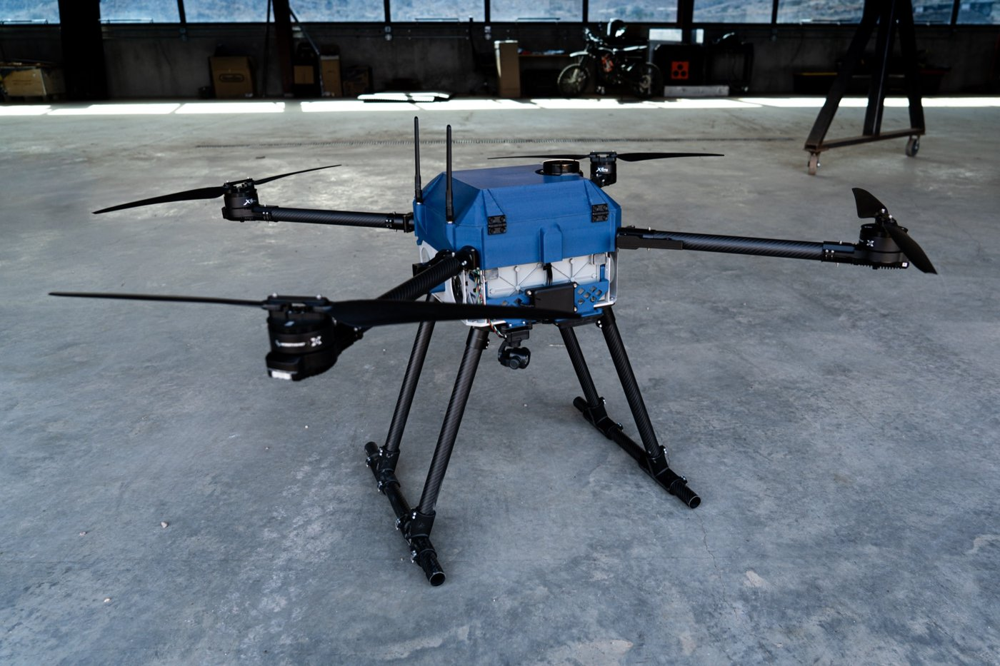
*Figure 1: Project Quiver multirotor drone.*

### The Drone

Project Quiver is an **open-source, modular quadcopter platform for developers and operators**. It is a 25 kg MTOW drone with 5-8 kg payload capacity and three quick-release attachment interfaces: bottom, left, and right. The aircraft is built around a central motherboard called the Main PCB.
- **Bottom Bay:** Facing straight down under the fuselage.
- **Side 1 Bay (Right / Starboard):** Facing outward to the right.
- **Side 2 Bay (Left / Port):** Facing outward to the left.

Each bay uses the same mechanical interface and contact layout; auxiliary signals differ by bay, and the bottom bay alone has the additional `12VSW` rail.

### How an Attachment Mates

Connecting an attachment to Quiver involves two parts: a mechanical clamp and an Attachment Interface PCB.

1. **Mechanical Interface:** The aircraft CAD assembly uses BOM 2112 quick-release interface plates. The repository does not provide complete payload-side clamp dimensions or a load rating; use current supplier drawings or physical measurements for mating geometry.
2. **Pogo-Pin Contact Interface:** The current V1.4 Attachment Interface PCB design has spring-loaded pin positions (`U1` to `U10`) and corresponding pad positions (`U11` to `U20`). The update note describes these as spring-loaded pin headers and enlarged solder pads.
3. **Internal Wiring:** **You do not solder or wire to the pogo pins or landing pads.** On the back face of the provided payload PCB is a 12-pin locking Molex connector (**J1**). All of your internal sensors, servos, cameras, and microcontrollers plug into this Molex connector via a simple wire harness.

```
[ AIRCRAFT AIRFRAME ]
         │
         ▼
[ PETG Spacer ]                (side spacers; wiring notch on bottom spacer)
         │
         ▼
[ Quick-Release Interface ]    (BOM 2112; aircraft-side CAD model)
         │
 [ Aircraft PCB ]              (Populated with male Pogo Pins U1 to U10)
═════════╪══════════════════════════════════════════════════════════════════ POGO-PIN / PAD CONTACT INTERFACE
 [ Payload PCB ]               (Provided to you; populated with flat pads U11 to U20)
         │
         ▼
[ Payload Mounting Plate ]     (mating hardware dimensions per current supplier drawing)
         │
 [ Molex J1 Header ]           (12-pin locking header on rear of Payload PCB)
         │
         ▼
[ Your Payload Wire Harness ]  (Mates with Molex 2045231201 plug)
         │
         ▼
[ YOUR PAYLOAD HARDWARE ]
```

### Key Terms

> [!IMPORTANT]
> Board routing and nominal geometry below are taken from the current V1.4 Attachment Interface PCB and V1.2 Main PCB design files. The V1.4 update note calls for electrical and mechanical validation; design files alone are not operational test results.

| Term | What It Means |
|---|---|
| **Attachment Interface PCB** | The compact 23.5 x 15.8 mm board ([`QuiverAttachPCB`](../../src/pcb/attach_pcb/QuiverAttachPCB.kicad_pcb)) that sits inside the quick-release plate. |
| **Pogo Pins (`U1` to `U10`)** | Spring-loaded brass pins on the **drone-side** board. |
| **Landing Pads (`U11` to `U20`)** | Flat circular copper pads on the **payload-side** board that contact the drone pogo pins. |
| **Molex J1** | The 12-pin locking connector (Molex part 2077601281) on the back of the payload board. This is where your harness plugs in. |
| **CAN2** | The Main PCB routes all three payload bays to CAN2. The NanoRadar integration note specifies 500 kbit/s for its device; verify the deployed bus rate and protocol against the aircraft configuration. |
| **DroneCAN** | A supported CAN protocol; the current Main PCB routes payload CAN pins to CAN2, but simultaneous DroneCAN and NanoRadar operation is not validated in the checked-in integration note. |
| **FMU** | Flight Management Unit (the ArduPilot flight controller). Each bay has a routed FMU signal net; waveform and output configuration require aircraft-specific verification. |
| **Switched 12V (`+12V_PL`)** | The shared 12V payload power rail (pin 10 on Molex J1), switched by SSR K2 (CPC1019N) driving MOSFET Q2, controlled via `FMU_CH4`. The F8 hold rating implies about 13W at nominal 12V; this is an estimate, not a measured system budget. |
| **Motor 12V (`12VSW`)** | A secondary 12V line on the **bottom bay only** (pins 2 and 4 on Molex J1). SSR K1 controls MOSFET Q1, which switches regulated `+12V` onto this line; K1 is controlled via `FMU_CH2`. Dedicated to the brush bullet DC motor payload. |
| **Switched HV (`J26`)** | Switched flight-battery power from a dedicated 2-pin connector on the Main PCB, controlled by `IO_CH7` through K3/Q3. Select the power path using measured payload demand and aircraft limits; the board files do not establish a 13 W crossover. |

---

## 1. What is a Quiver Attachment?

A Quiver attachment is a hardware module mounted at one of the three bay locations on the drone:

| Bay Location | Physical Position | Facing Direction | Typical Payloads |
|---|---|---|---|
| **Bottom** | Underside of lower chassis plate | Facing straight down (-Z) | Gimbal cameras, LiDAR scanners, drop mechanisms, brush bullet actuators |
| **Side 1 (Right)** | Starboard battery wall | Facing outward right (+X) | Inspection cameras, atmospheric sensors, radio links, spotlight pods |
| **Side 2 (Left)** | Port battery wall | Facing outward left (-X) | Starlink Mini terminals, radar units, environmental air samplers |

### Where the Bays Sit on the Aircraft

The three bays are integrated into the fuselage structure:

| Rear View (Bay Locations) | Side View (Port Offsets) |
|:---:|:---:|
| 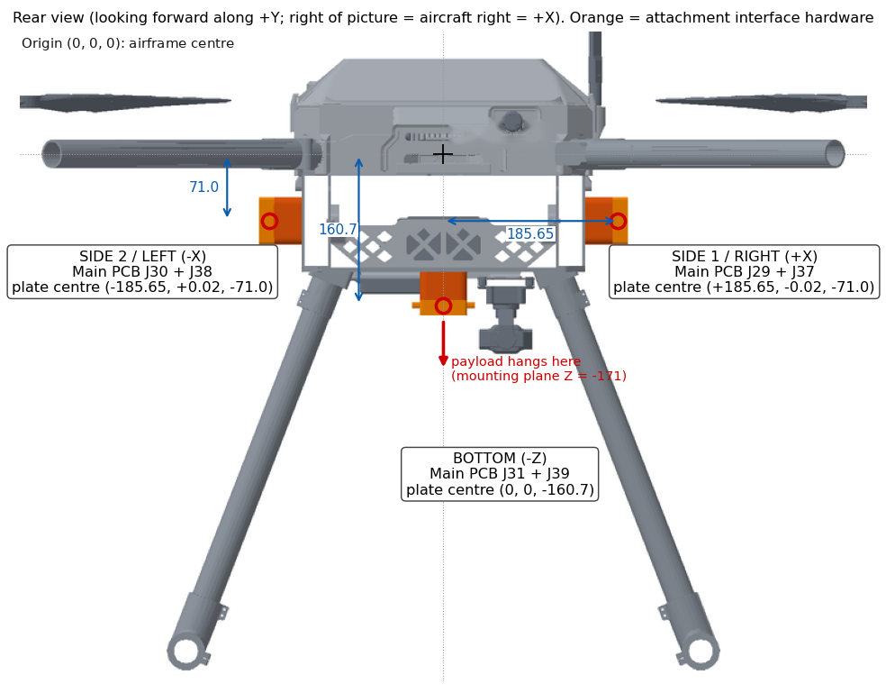 | 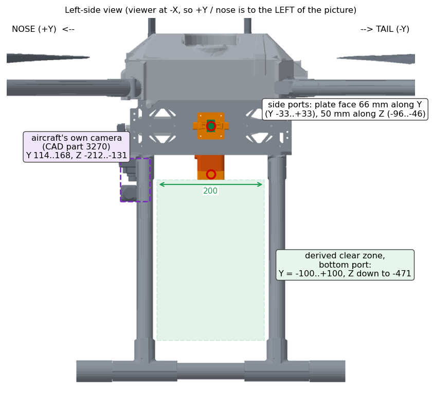 |
| *Figure 2: Payload bays viewed from the rear. Origin is at the airframe centre; image right is aircraft right (+X). Orange denotes attachment interface hardware.* | *Figure 3: Payload bays viewed from the side.* |

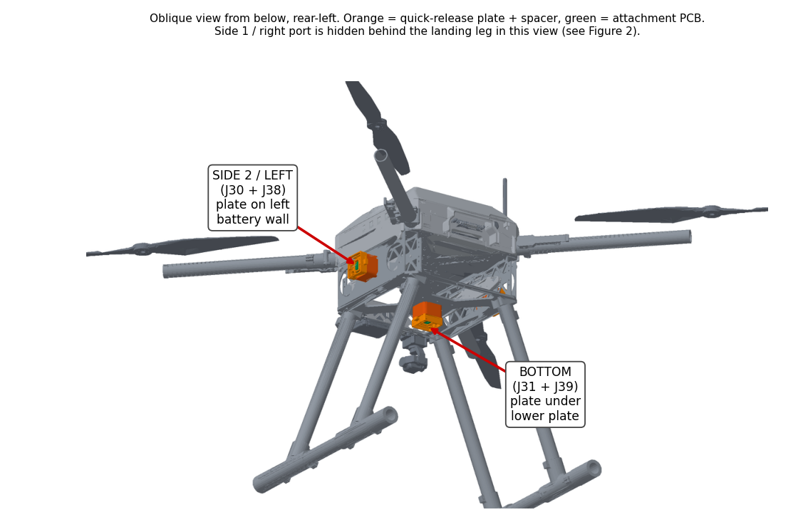
*Figure 4: Oblique view from below and rear-left. Orange indicates the quick-release plate and spacer; the green Attachment Interface PCB is visible at the left bay. The right-side bay is hidden behind a leg.*

### Practical Rules Before You Build

- **Hot-Swap Status:** PT3 and Dev-Kit engineering reports describe hot-swapping as a design capability, but the current V1.4 attachment-board update note still lists electrical validation as outstanding. Do not assume live connection is validated for a particular aircraft and payload combination; follow the aircraft operator's approved procedure until testing confirms otherwise.
- **Do Not Treat Old Schematic Notes as Fresh Hardware Truth:** Older PT3 and stale `.net` exports are not used as the current source of truth for the attachment contract. Any value that has not been checked against the current Main PCB V1.2 copper or the V1.4 attachment PCB is treated as a design intent note and not as a confirmed spec.
- **Example Integration Patterns:** An actuator may use a bay aux signal and its own local regulation; a data payload may use the routed CAN or Ethernet pairs. Confirm protocol compatibility, signal levels, power draw, and physical fit on the actual assembly before flight.

---

## 2. Mechanical Interface

This chapter is intentionally written as a stand-alone build document. A payload developer should not need to open a different drawing package, a KiCad file, or a separate issue to answer the basic questions: what the attachment plate looks like, what the bay spacing is, what the mating PCB dimensions are, and where the payload ports sit on the aircraft.

The following facts are restated here because they are part of the actual build contract for a payload. If a value has not been verified against the current board hardware, it is called out as an open question instead of being presented as a requirement.

### 2.1 Coordinate Frame and Bay Locations

The CAD assembly places the three attachment-plate STEP models at the coordinates below. In `attachment_interface/assembly.py`, the constants are explicitly described as center-of-mass placement coordinates from the Fusion reference model; they are not identified as mounting-hole centers or validated clearance limits.

Quiver uses standard aircraft coordinates with the origin `(0, 0, 0)` at the center of the fuselage interior:
- **+X:** To the right (Starboard)
- **+Y:** Forward toward the nose
- **+Z:** Upward toward the top lid

```
                        +Z (Up)
                           ▲
                           │
       Side 2 (Left)       │       Side 1 (Right)
       [-X bay]            │            [+X bay]
      [===]──────────[ FUSELAGE ]──────────[===]
                           │
                           │
                           ▼ -Z (Down)
                         [===]
                      Bottom bay
```

| Bay | Plate Model Center-of-Mass Placement (X, Y, Z) | Facing Direction in Assembly | Mounting Hardware on Aircraft |
|---|---|---|---|
| **Bottom** | `(0.00, 0.00, -160.70) mm` | Down (-Z) | Assembly includes spacer `2131` and interface plate `2112` |
| **Side 1 (Right)** | `(+185.65, -0.02, -71.00) mm` | Right (+X) | Assembly includes spacer `2111` and interface plate `2112` |
| **Side 2 (Left)** | `(-185.65, +0.02, -71.00) mm` | Left (-X) | Assembly includes spacer `2111` and interface plate `2112` |

The `assembly.py` module overview also gives approximate interface locations at X = ±150 mm and Z = -125 mm without defining them as the same datum. Resolve that datum difference against the master mechanical model before using either set for payload clearance design.

### 2.2 Drone-Side Hardware and Spacers

The checked-in CAD assembly contains the drone-side interface plate and spacers. The BOM identifies three quick-release interface plates (2112), two side spacers (2111), and one bottom spacer (2131). The assembly source does not define a payload mass rating or a validated clearance envelope.

The builder should be able to answer these questions from this section alone:
- what the payload side and drone side mating hardware look like,
- which spacer is used at each bay,
- what the thickness and envelope are,
- whether the bottom or side bays have a different wiring exit requirement.

The assembly uses PETG spacers at the attachment locations:

| Bottom Interface Assembly | Side Interface Exploded View |
|:---:|:---:|
| 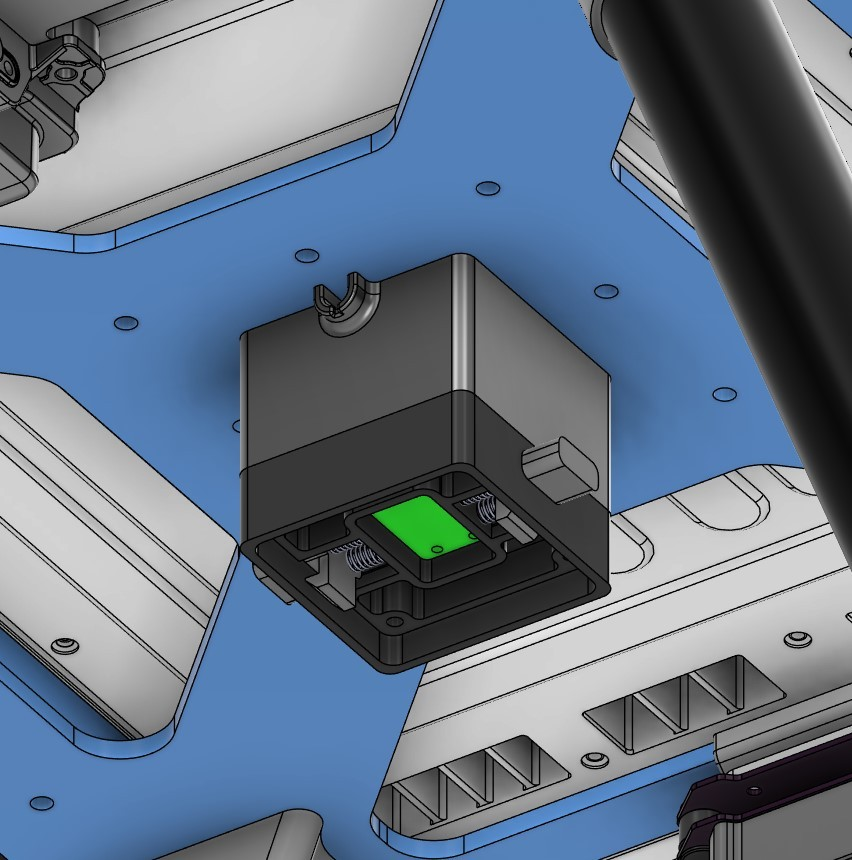 | 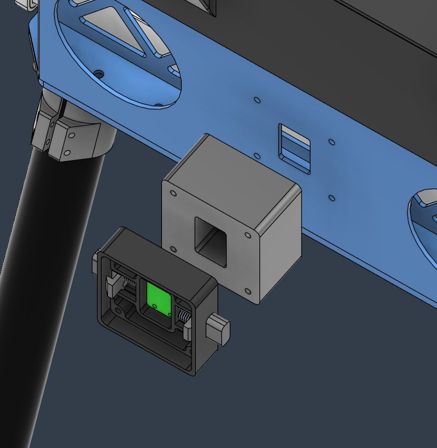 |
| *Figure 5a: Bottom interface assembly showing the wire notch.* | *Figure 5b: Side interface exploded view showing the 30 mm spacer.* |

- **Side Ports (Right and Left):** Each side bay uses spacer `2111` ([`2111_attach_spacer.step`](../../src/quiver/supporting_structure/attachment_interface/steps/2111_attach_spacer.step)). The Dev-Kit engineering report describes a 30 mm side-interface extension adapter; verify the assembled dimension against the aircraft model before designing the payload envelope.
- **Bottom Port:** The bottom bay uses spacer `2131` ([`2131_attach_spacer_bottom.step`](../../src/quiver/supporting_structure/attachment_interface/steps/2131_attach_spacer_bottom.step)), which the CAD assembly source identifies as having a wiring notch.

| Side Spacer (`2111_attach_spacer`) | Bottom Spacer with Notch (`2131_attach_spacer_bottom`) |
|:---:|:---:|
| 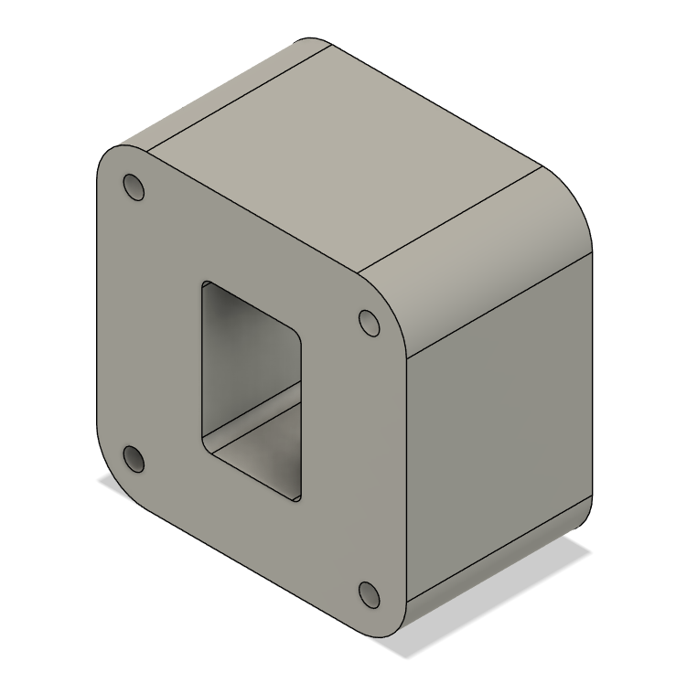 | 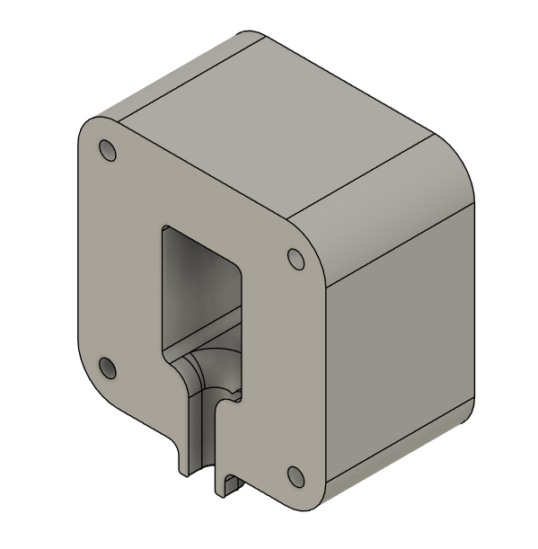 |

### 2.3 The Quick-Release Clamp Plate (BOM 2112)

The repository BOM identifies part 2112 as a quick-release interface plate, quantity three, aluminum, and points to a supplier listing. The checked-in STEP model is the aircraft-side portion used in the CAD assembly; it does not establish all dimensions or ratings of the supplied plate pair.

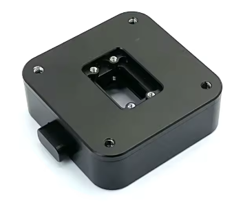

*Figure 6: Quick-release clamp plate assembly (BOM 2112).*

Use the supplied hardware and its current manufacturer drawing or physical measurements to determine the payload-side mating geometry, fasteners, thickness, and load limits. Those values are not specified by the checked-in BOM or the drone-side STEP model.

### 2.4 Attachment Interface PCB Dimensions

This section describes the current V1.4 Attachment Interface PCB layout. Confirm the supplied payload-side assembly and mechanical fit before manufacturing an attachment.

This section is intentionally self-contained so a developer can design the payload board, enclosure, or cable route without leaving the guide. The builder should be able to extract from this section:
- the mating PCB outer dimensions,
- the board thickness and edge-cut hole geometry,
- the PCB outline and silkscreen orientation features,
- the fact that the payload-side board is the board you install, not the drone-side pogo board.

The electrical connection is made by the **Quiver Attachment Interface PCB** ([`src/pcb/attach_pcb/QuiverAttachPCB.kicad_pcb`](../../src/pcb/attach_pcb/QuiverAttachPCB.kicad_pcb)); verify its installed position using the current mechanical assembly:

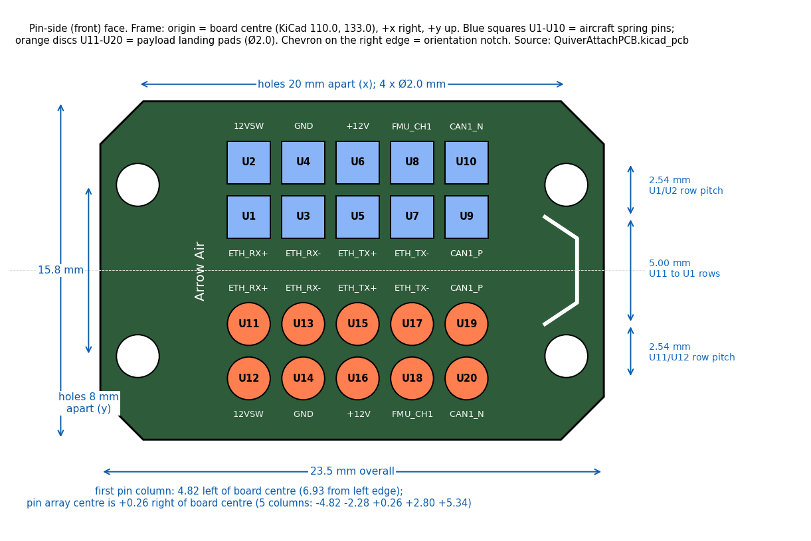
*Figure 7: PCB layout dimensions and edge-cut hole pattern. Right-side labels show the 2.54 mm pin-row pitch and 5.00 mm offset between aircraft pins and payload pads.*

- **Outer Dimensions:** 23.50 mm wide x 15.80 mm high.
- **Board Thickness:** **1.20 mm FR4**, as specified by the current KiCad layout. Confirm receiving-pocket clearance against the current mechanical assembly.
- **Edge-Cut Holes:** 4 circular cut-outs arranged in a rectangle:
  - Horizontal spacing (X axis): **20.00 mm** center-to-center.
  - Vertical spacing (Y axis): **8.00 mm** center-to-center.
  - KiCad board coordinates: `(100.0, 129.0)`, `(120.0, 129.0)`, `(100.0, 137.0)`, `(120.0, 137.0)`.
  - The KiCad outline defines the holes as 2.00 mm diameter; it does not specify threaded holes or fasteners.
- **Orientation:** The board outline has chamfered corners and the V1.4 design note identifies a silkscreen orientation notch. Use the released assembly drawing to determine installation orientation; the PCB file alone does not establish the clamp cavity fit.

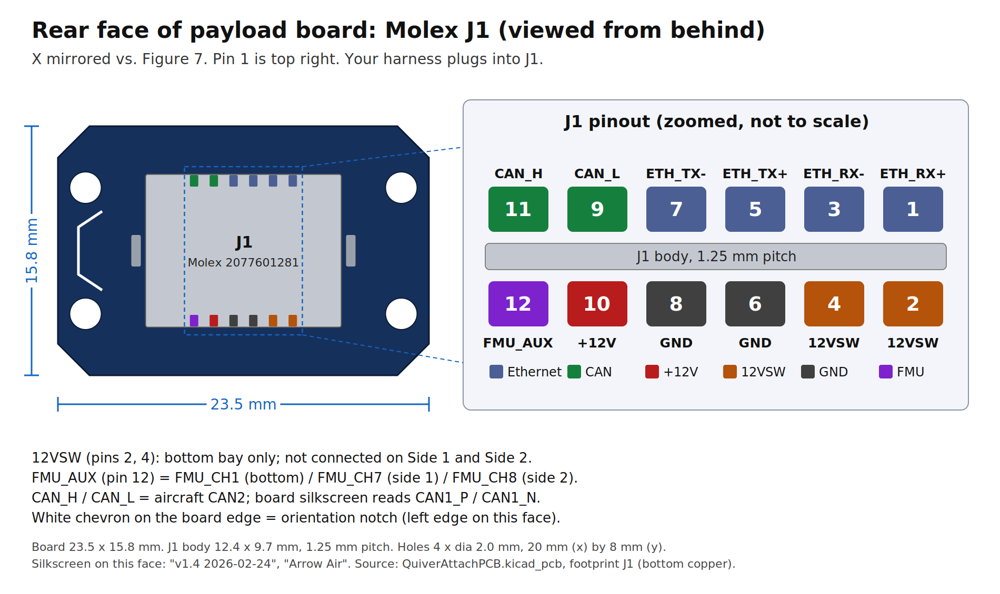
*Figure 8: Rear face of the payload board showing the 12-pin Molex J1 connector.*

### 2.5 How the Boards Mate vs. How You Wire

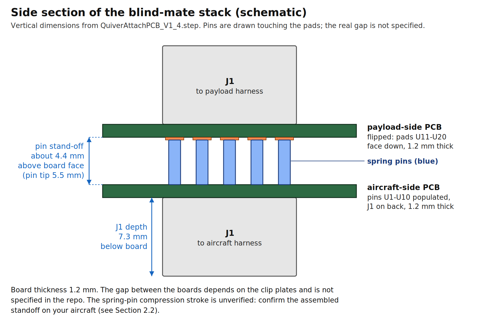
*Figure 9: Cross-section showing drone pogo pins contacting payload pads, and your harness connecting to Molex J1.*

A single board design serves both sides of the interface by populating different parts:

| Drone-Side Board | Payload-Side Board (Provided to You) |
|---|---|
| Populated with 10 male spring-loaded pogo pins (`U1` to `U10`, LCSC part `C2826546` / `BWCD-L4.5W2.0H2.3`). | Populated with 10 flat circular copper landing pads (`U11` to `U20`, 2.0 mm diameter). |
| The pogo pins face outward toward the docking bay. | The landing pads face inward toward the aircraft. |
| Rear Molex J1 connects to the aircraft internal avionics harness. | Rear Molex J1 connects to your payload internal electronics. |

| Physical PCB: Mating Face | Physical PCB: Rear Connector Face |
|:---:|:---:|
| 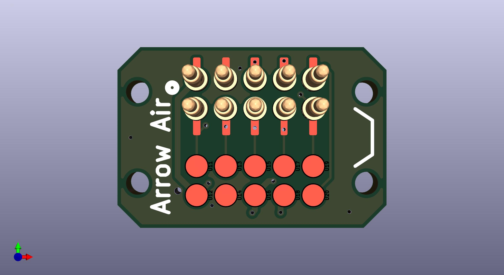 | 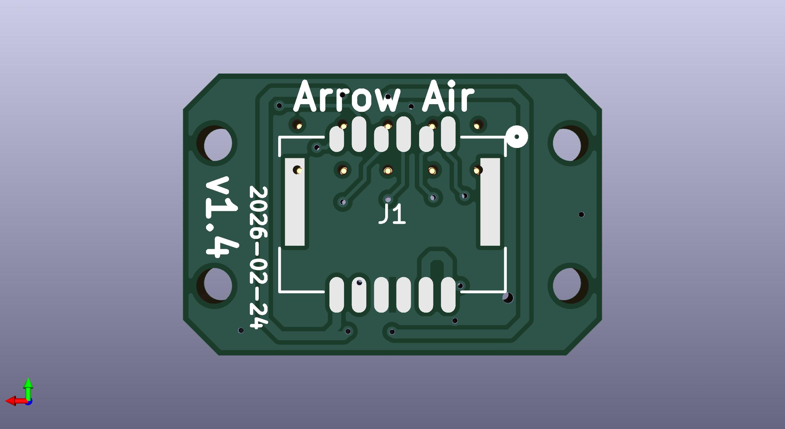 |

> [!WARNING]
> **Wiring rule:** The V1.4 design note describes U1–U10 as spring-loaded pins and U11–U20 as enlarged contact pads. Use the released assembly configuration for the aircraft or payload side. Connect payload wiring through Molex J1, not directly to the contact positions.

---

## 3. Electrical Contract

This section summarizes routing in the current board designs and separates it from firmware configuration and system behavior that require separate validation.

The current design references are the board layouts and schematics for the Main PCB and Attachment Interface PCB:
- Main PCB: [`Quiver_PT3_Main_PCB-rounded.kicad_pcb`](../../src/pcb/main_pcb/Quiver_PT3_Main_PCB-rounded.kicad_pcb) and [`Quiver_PT3_Main_PCB-rounded.kicad_sch`](../../src/pcb/main_pcb/Quiver_PT3_Main_PCB-rounded.kicad_sch)
- Attachment Interface PCB: [`QuiverAttachPCB.kicad_pcb`](../../src/pcb/attach_pcb/QuiverAttachPCB.kicad_pcb) and [`QuiverAttachPCB.kicad_sch`](../../src/pcb/attach_pcb/QuiverAttachPCB.kicad_sch)

### 3.1 Port Capability Matrix

The three bays share power and CAN, but have different auxiliary lines:

| Capability | Bottom Bay | Side 1 / Right Bay | Side 2 / Left Bay | Source Citation |
|---|---|---|---|---|
| **Main 12V Rail (`+12V_PL`)** | **Switched** (K2→Q2) | **Switched** (K2→Q2) | **Switched** (K2→Q2) | Main PCB layout and schematic |
| **Motor 12V Rail (`12VSW`)** | **Switched** (+12V via Q1; K1 controlled by `FMU_CH2`) | **No Connect (NC)** | **No Connect (NC)** | Main PCB layout and schematic |
| **CAN pair routing** | **CAN2** | **CAN2** | **CAN2** | Main PCB layout; verify bitrate and protocol against aircraft configuration |
| **Ethernet pairs** | Routed via J39 to onboard switch | Routed via J37 to onboard switch | Routed via J38 to onboard switch | Main PCB layout and schematic |
| **FMU Aux signal net** | `FMU_CH1` | `FMU_CH7` | `FMU_CH8` | Main PCB layout and schematic |
| **Avionics Header** | `J31` (PTSM 1814951) | `J29` (PTSM 1778735) | `J30` (PTSM 1778735) | [`Quiver_PT3_Main_PCB-rounded.kicad_pcb`](../../src/pcb/main_pcb/Quiver_PT3_Main_PCB-rounded.kicad_pcb) |
| **Ethernet Header** | `J39` (PTSM 1814935) | `J37` (PTSM 1778719) | `J38` (PTSM 1778719) | Main PCB layout and schematic |
| **Recommended payload IP** | `192.168.144.100` | `192.168.144.101` | `192.168.144.102` | Dev-Kit report and SDK guide |

### 3.2 Main PCB Payload Headers (J29, J30, J31) and Ethernet Connectors (J37, J38, J39)

On the aircraft's Main PCB, each payload bay connects to a 6-pin Phoenix Contact PTSM connector for power, CAN, and FMU signals, and to a separate 4-pin Phoenix Contact PTSM Ethernet header routed to an onboard switch:

| Bay | Avionics Header (power + CAN + FMU) | Ethernet Header |
|---|---|---|
| **Bottom** | `J31` (PTSM `1814951`, 6-pin) | `J39` (Phoenix PTSM `1814935`, 4-pin) |
| **Side 1 (Right)** | `J29` (PTSM `1778735`, 6-pin) | `J37` (PTSM `1778719`, 4-pin) |
| **Side 2 (Left)** | `J30` (PTSM `1778735`, 6-pin) | `J38` (PTSM `1778719`, 4-pin) |

The avionics (J29/J30/J31) and Ethernet (J37/J38/J39) headers are internal to the aircraft harness; your attachment only sees the signals arriving at Molex J1 on the Attachment Interface PCB. The PCB files establish pair routing, not a negotiated Ethernet link speed.

**Avionics headers pinout (J29, J30, J31):**

| Pin | Bottom Bay (`J31`) Net | Side 1 Bay (`J29`) Net | Side 2 Bay (`J30`) Net | Function |
|:---:|---|---|---|---|
| **1** | `GND` | `GND` | `GND` | Ground reference |
| **2** | `+12V_PL` | `+12V_PL` | `+12V_PL` | Shared switched 12V payload rail (K2 controls Q2) |
| **3** | `/CAN2_L` | `/CAN2_L` | `/CAN2_L` | CAN2 Low; verify bitrate and protocol on aircraft |
| **4** | `/CAN2_H` | `/CAN2_H` | `/CAN2_H` | CAN2 High; verify bitrate and protocol on aircraft |
| **5** | `/FMU_CH1` | `/FMU_CH7` | `/FMU_CH8` | FMU signal net; verify output function and electrical levels |
| **6** | `/12VSW` | *No Connect* | *No Connect* | Switched regulated 12V motor line (**Bottom bay only**; Q1 controlled by K1) |

The current Main PCB layout defines these pins on J31, J29, and J30. Signal names are shown without KiCad-internal net numbers, which can change between revisions.

### 3.3 Payload Harness Connector: Molex J1 Pinout

The **12-pin Molex connector (J1)** on the back of your payload board is where your attachment wiring connects:
- **Board Header (J1):** Molex part `2077601281` (12-circuit, 1.25 mm pitch, vertical locking connector).
- **Mating Cable Plug:** Molex housing `2045231201` with gold-plated crimp terminals `2045250001`.

| Pin | Signal Name | Type | Electrical Rating | Description |
|:---:|---|---|---|---|
| **1** | `ETH_RX+` | Input | Ethernet pair | Ethernet Receive positive (from the onboard Ethernet switch) |
| **2** | `12VSW` | Power | +12V DC, 2A fused | **Bottom bay only:** Q1-switched regulated 12V line for the brush bullet motor. K1 controls Q1; F1 protects the line. Unconnected on Side 1 and Side 2. |
| **3** | `ETH_RX-` | Input | Ethernet pair | Ethernet Receive negative (from the onboard Ethernet switch) |
| **4** | `12VSW` | Power | +12V DC, 2A fused | Paralleled with pin 2 for extra current handling (Bottom bay only). |
| **5** | `ETH_TX+` | Output | Ethernet pair | Ethernet Transmit positive (to the onboard Ethernet switch) |
| **6** | `GND` | Ground | 0V Reference | Power and signal ground return |
| **7** | `ETH_TX-` | Output | Ethernet pair | Ethernet Transmit negative (to the onboard Ethernet switch) |
| **8** | `GND` | Ground | 0V Reference | Power ground return (doubled pin for current capacity) |
| **9** | `CAN_L` | I/O | CAN low | Aircraft **CAN2_L**. *(Board silkscreen says `CAN1_N`)* |
| **10** | `+12V` | Power | +12V DC, ~1.1A hold | Main switched payload rail `+12V_PL` (K2 controls Q2; `12V Pay`) |
| **11** | `CAN_H` | I/O | CAN high | Aircraft **CAN2_H**. *(Board silkscreen says `CAN1_P`)* |
| **12** | `FMU_AUX` | I/O | FMU signal; verify voltage and waveform on aircraft | Bay auxiliary net: **Bottom:** `FMU_CH1`, **Side 1:** `FMU_CH7`, **Side 2:** `FMU_CH8` |

*(Pin mapping checked against the current Attachment Interface PCB layout and schematic linked above.)*

### 3.4 Pogo Pin and Landing Pad Map

When you check electrical continuity with a multimeter, here is how the 10 contact pads across the mating plane match up:

| Signal Name | Drone Pogo Pin (`U1` to `U10`) | Payload Landing Pad (`U11` to `U20`) | Mated Signal Function |
|---|:---:|:---:|---|
| `ETH_RX+` | `U1` | `U11` | Ethernet RX+ differential line |
| `12VSW` | `U2` | `U12` | Switched DC motor rail (Bottom bay only; NC on sides) |
| `ETH_RX-` | `U3` | `U13` | Ethernet RX- differential line |
| `GND` | `U4` | `U14` | System ground reference |
| `ETH_TX+` | `U5` | `U15` | Ethernet TX+ differential line |
| `+12V` | `U6` | `U16` | Main switched 12V payload rail (`+12V_PL`) |
| `ETH_TX-` | `U7` | `U17` | Ethernet TX- differential line |
| `FMU_AUX` | `U8` | `U18` | Auxiliary PWM/GPIO (`FMU_CH1` / `FMU_CH7` / `FMU_CH8`) |
| `CAN_H` | `U9` | `U19` | Vehicle CAN2 high pair |
| `CAN_L` | `U10` | `U20` | Vehicle CAN2 low pair |

*(Contact designators and net mapping checked against the current Attachment Interface PCB layout and schematic linked above.)*

### 3.5 Network and Ethernet Routing


*Figure 10: Quiver network routing showing Ethernet switches and CAN separation.*

If your payload uses Ethernet, its differential pairs route through the onboard switch modules. The board files do not specify the link speed negotiated with a payload:
- **Switch Hardware:** Two BotBlox GigaBlox Nano modules are installed on the Main PCB. Their board-mount connectors are internal module mounts, not user-facing payload connectors.
- **Port Assignment:**
  - Switch 1 serves the Bottom and Side 1 bay Ethernet headers.
  - Switch 2 serves the Side 2 bay Ethernet header.
- **Wiring to the Bay:** The harness carries the `ETH_TX` and `ETH_RX` pairs to pins 1, 3, 5, and 7 on Molex J1.

### 3.6 CAN Bus Architecture

The Main PCB design uses two CAN nets; the payload connectors are routed to CAN2:

1. **CAN1:** The Main PCB keeps the payload connector nets off CAN1.
2. **CAN2:** Bottom J31, Side 1 J29, and Side 2 J30 route to `/CAN2_H` and `/CAN2_L`.
  - The obstacle-avoidance note specifies 500 kbit/s and a non-DroneCAN protocol for the NanoRadar MR82. The Dev-Kit report identifies one MR82; its RPLidar S2L connects over serial.
  - The integration note says to isolate the NanoRadar CAN port from DroneCAN nodes while testing. Simultaneous protocol compatibility is not established; validate the deployed firmware and nodes together.

> [!NOTE]
> **Why the Attachment Board Silkscreen Says `CAN1_P / CAN1_N`:**
> The current Attachment Interface PCB layout labels its CAN nets `CAN1_P` and `CAN1_N`. The current Main PCB layout routes the three payload connectors to `CAN2_H` and `CAN2_L`; the hardware routing therefore maps the attachment-board CAN pair to Main PCB CAN2.

- **Bus Termination:** The Main PCB layout includes a 120 ohm resistor (R14) that slide switch S2 can connect across CAN2_H and CAN2_L. Enable it only when the Main PCB is an endpoint in the CAN bus topology. Do not add another terminator inside an attachment by default; account for the complete bus and its two endpoints.

### 3.7 Power Delivery and Switching Rules

Quiver does not provide an always-on, unswitched battery feed on the attachment connectors. Every power rail is controlled by an electronic switch.

```
[ 14S LiPo Flight Battery (~50V to 58.8V) ]
         │
         ├───> [ Fuse F4 (5A) ] ───> [ Isolated DC-DC Converter (30W / 2.5A) ]
         │                                       │
         │                                       ▼ (+12V avionics supply)
         │                                       ├───> [ P-MOSFET Q1 ] ──> [ Fuse F1 (2A) ] ──> J31 Pin 6 (+12VSW)
         │                                       │           ▲
         │                                       │           └── Gate control via SSR K1 (CPC1019N) <── FMU_CH2
         │                                       │
         │                                       └───> [ MOSFET Q2 ] ──> [ PTC F8 (1.1A) + Fuse F7 (2A) ]
         │                                                     ▲                         │
         │                                                     └── Gate control via SSR K2 <── FMU_CH4
         │                                                                               ├──> J31 Pin 2 (+12V_PL, Bottom)
         │                                                                               ├──> J29 Pin 2 (+12V_PL, Side 1)
         │                                                                               └──> J30 Pin 2 (+12V_PL, Side 2)
         │
         └───> [ SSR K3 (CPC1019N) ] <── Toggled by IO_CH7
                        │  (drives gate of MOSFET Q3)
                        ▼
                   [ Fuse F2 (5A) ] ───> J26 Pin 1 (AC_HV−, Switched High-Voltage Port)
```

#### A. Main 12V Payload Rail (`+12V_PL`)
- **Available on:** All three bays (Molex J1 pin 10; Pogo pin U6/U16).
- **Electronic Switch:** SSR **K2 (CPC1019N)** drives MOSFET **Q2 (SIRA99DP-T1-GE3)** on the Main PCB; see the Main PCB schematic linked above.
- **Control Signal:** Flight controller channel **`FMU_CH4`**, labeled **`12V Pay`** in ground control software.
- **Protection:** Protected by fast fuse **F7** (2A) and self-resetting PTC **F8** (Littelfuse `1812L110`, 1.10A hold-current part).
- **Conservative Design Estimate:** The F8 hold rating corresponds to about **13W at nominal 12V** across all three bays. This is not a measured system-level payload budget, and exceeding 1.1A is not the PTC trip specification.
- **Upstream Converter:** The Main PCB power-supply schematic specifies a 30W RECOM isolated converter (`REC30K-4812SZ`, approximately 2.5A at 12V). Other aircraft loads also use the 12V supply, so this rating is not an available payload budget.

#### B. Switched 12V Motor Rail (`12VSW`) for Brush Bullet Payloads
- **Available on:** **Bottom bay only** (Molex J1 pins 2 and 4; Pogo pin U2/U12). On Side 1 (`J29`) and Side 2 (`J30`), this pin is not connected.
- **Purpose:** Specifically wired to drive the **brush bullet attachment** (payload DC drive motor).
- **Electronic Switch:** SSR **K1 (CPC1019N)** controls the gate of P-channel MOSFET **Q1**. Q1 switches the regulated `+12V` supply onto `12VSW`; K1 is in the control path, not the battery or motor-current path.
- **Control Signal:** Flight controller channel **`FMU_CH2`**, labeled `"12V switch for payload DC motor"`.
- **Protection:** Fast fuse **F1** (2A rating).

#### C. High-Power Attachments
The approximate 13W estimate is derived from the F8 hold-current rating, not from a system load test. Do not treat it as a measured capability or a guaranteed trip threshold for `+12V_PL`; validate payload loads on the actual aircraft. The switched HV port J26 is a separate power path that requires payload-side voltage conversion as needed.

- **Dedicated Switched HV Port (J26):**
  - High-power attachments tap direct flight battery power from **J26** on the Main PCB (Phoenix Contact PTSM 2-pin connector, part `1814919`).
  - Provides full 14S LiPo battery voltage (~50.0V to 58.8V DC).
  - Switched by SSR **K3 (CPC1019N)** driving MOSFET **Q3 (SIR570DP-T1-RE3)**, controlled by `IO_CH7`, and protected by a **5A fuse (F2)**.
- **Never Tap the ESC Connectors:**
  - Connectors **J25, J28, J34, and J42** (yellow XT60PW-F sockets) on the Main PCB are **strictly for motor ESCs**. Never tap or connect payloads to these ports.
- **Local Voltage Step-Down:** High-power attachments must bring their own onboard DC-DC converter to step down the 50V battery rail to whatever local voltages their electronics need.

---

## 4. Power Budgeting and Worked Examples

This chapter summarizes source-backed rail routing and an approximate current-derived estimate. The actual continuous payload budget has not been established by a system-level load test.

The aircraft power system is shared. The source-backed information below describes routing and component ratings; it does not establish a measured payload budget:

- `+12V_PL` is a shared 12V rail across all three bays. F8 is a 1.10A hold-current PTC, equivalent to about **13W at nominal 12V**; treat this as a conservative design estimate, not a measured system-level payload budget.
- The 12V rail is protected by PTC F8 and fuse F7. The PTC hold rating is not its trip threshold.
- `12VSW` exists only on the bottom bay and is a dedicated 2A motor path.
- High-power payloads should use the switched HV path at J26 and regulate it locally.

### 4.1 Logic Payload Example

A compact sensor or compute payload that runs a small SBC, a camera, and one or two sensors is generally a **logic payload**. It can often run from the shared 12V payload rail, as long as it stays under the overall budget and has local regulation.

A typical example is a small payload board that draws:

- 5V SBC: 4W to 8W
- Camera module: 1W to 3W
- Sensor bus and LEDs: 0.5W to 2W

This may fit the approximate current-derived estimate if the combined load across all bays is low; measure the actual system before relying on that estimate.

### 4.2 Floodlight Example

A 25W floodlight or similar high-drain payload exceeds the approximately 13W conservative estimate derived from the F8 hold rating. The `+12V_PL` rail has not been validated by a system-level load test.

The correct architecture is:

- connect the payload to the switched HV rail on J26,
- place the payload's own buck or DC-DC converter on the attachment,
- regulate to 12V, 5V, or 24V locally,
- keep the aircraft supply limited to the dedicated HV path and never draw a high-power lamp directly from `+12V_PL`.

This is the design pattern recommended for high-power floodlights, spray pumps, and other actuator-heavy payloads.

### 4.3 Payload Load Validation

The checked-in sources reviewed for this guide do not include a system-level `+12V_PL` load-test result. Measure the combined rail draw on the specific aircraft and compare it with the component ratings and approved operating limits; do not treat the 13W arithmetic estimate as a validated budget.

---

## 5. Control and Data Paths

This section is the payload builder's electrical routing guide. It tells you which signal path to choose for triggers, sensors, and telemetry, and it is written to stand on its own so a developer does not have to infer the contract from separate hardware notes or legacy board silkscreen guesses.

Quiver gives each payload a specific job based on what it needs to do. In practice, the rule is simple:

- use the auxiliary PWM/GPIO line for an actuator or trigger signal,
- use CAN2 for bus devices and low-bandwidth telemetry,
- use Ethernet for high-bandwidth payload data or networked devices.

### 5.1 When to Use Each Path

| Need | Correct Path | Typical Use | Notes |
|---|---|---|---|
| Trigger or actuator control | Bay FMU signal net | Payload-specific control input | Electrical levels and ArduPilot output setup require system verification |
| CAN device | CAN2 pair at the payload port | Protocol-compatible CAN device | Do not assume simultaneous DroneCAN and NanoRadar compatibility |
| Networked device | Ethernet pairs at the payload port | Payload Ethernet interface | Board routing does not specify negotiated link speed |

### 5.2 Aux Signal Mapping and PWM Rules

The Main PCB routes a different FMU net to each bay:

| Bay | FMU signal net |
|---|---|
| Bottom | `FMU_CH1` |
| Side 1 | `FMU_CH7` |
| Side 2 | `FMU_CH8` |

The PCB files establish the routed signal nets, not their configured waveform, voltage level, or ArduPilot servo-output number. The checked-in parameter set includes `SERVO_GPIO_MASK`; choose and validate the correct flight-controller output configuration on the aircraft before connecting a payload.

### 5.3 CAN2 Rules

The Main PCB routes all three payload connectors to the shared vehicle bus **CAN2**:

- bitrate: the NanoRadar integration note specifies **500 kbit/s** for the MR82; confirm the configured rate for each aircraft use
- bus: the Dev-Kit obstacle-avoidance configuration includes one NanoRadar MR82 using a non-DroneCAN CAN protocol
- protocol compatibility: not established for simultaneous NanoRadar and DroneCAN payload traffic; the NanoRadar integration note says to keep its CAN port isolated from DroneCAN nodes while testing
- termination: Main PCB R14 is selectable with S2; configure it only if the Main PCB is a bus endpoint. Do not add an attachment terminator by default; the complete bus should have termination at its two physical endpoints.

The board files establish the routing, not protocol interoperability. Validate the deployed firmware and all attached CAN nodes as one system before flight.

### 5.4 Ethernet Paths and Network Conventions

If your attachment uses Ethernet, its pairs route through the onboard switches. The Quiver SDK guide documents the payload address range and recommended per-port addresses below:

- `192.168.144.100` to `192.168.144.199`
- bottom bay default is `192.168.144.100`
- side 1 default is `192.168.144.101`
- side 2 default is `192.168.144.102`

The Dev-Kit report and SDK guide agree that the Raspberry Pi uses `192.168.144.50`. The Dev-Kit report lists the CubeNode ETH adapter at `.10`; this guide does not infer infrastructure assignments from PCB routing.

| Device | Address in Dev-Kit Report |
|---|---|
| Raspberry Pi (companion computer) | `192.168.144.50` |
| CubeNode ETH adapter | `192.168.144.10` |
| Flight controller | `192.168.144.51` |

Use the operational configuration for the specific aircraft; these addresses are reported software/network configuration, not facts established by the PCB design files.

### 5.5 The Standard Payload Network Table

| Function | Address in Dev-Kit Report / SDK Guide | Notes |
|---|---|---|
| Companion computer | `192.168.144.50` | Pi on the drone network |
| CubeNode ETH | `192.168.144.10` | Dev-Kit report assignment |
| Flight controller | `192.168.144.51` | ArduPilot MAVLink endpoint |
| Payload bottom | `192.168.144.100` | Default bottom port payload |
| Payload side 1 | `192.168.144.101` | Default right-side payload |
| Payload side 2 | `192.168.144.102` | Default left-side payload |
| Payload reserved range | `192.168.144.100`–`192.168.144.199` | Developer-assigned static range |

Use static addressing within the payload range and do not rely on DHCP. The network is intentionally flat and is shared across the drone's onboard switch fabric.

---

## 6. Flight Controller Integration

This section is the flight-controller contract a payload engineer must follow when wiring the bay. The important point is that the guide intentionally repeats the operational semantics here so the developer can design and validate the payload without relying on hidden assumptions from the Pilot Handbook or other source documents.

The flight controller does not treat the attachment as a generic consumer. It provides power timing, aux signals, and bus routing under a few explicit rules that the developer must respect.

### 6.1 Relay Labels and Power Semantics

The current Main PCB design and firmware documentation use these control labels:

- `12V Pay` = `FMU_CH4` drives the shared `+12V_PL` rail.
- `Add HV` = the switched high-voltage battery line for power-hungry attachments.

The sequence matters. The switched high-voltage path is the highest-power path and is treated as a deliberate, explicitly enabled device path. The shared 12V payload rail is a lower-power general service path. The bottom bay's `12VSW` motor line is a dedicated motor path and is not a general purpose rail.

### 6.2 SSR Power Hierarchy

The system power hierarchy is:

1. `12V Pay` for the shared low-power payload rail on all bays.
2. `12VSW` for the bottom-bay dedicated motor line.
3. `Add HV` for high-power payloads that need direct flight-battery power.

This hierarchy is not arbitrary. It is the documented safety behavior meant to prevent the small shared payload rail from becoming the sink for every attachment, which would quickly push the aircraft toward a brownout.

### 6.3 Arming, Disarming, and Hot-Swap Rules

The engineering reports describe hot-swapping as an intended capability, but current V1.4 documentation still calls for electrical validation. Follow the approved aircraft procedure and do not assume live attachment or removal is validated until it has been tested on the relevant aircraft and payload.

Practical rules:

- never hot-plug a payload while the aircraft is armed or the power rails are alive,
- do not rely on the attachment board to absorb inrush current,
- measure the combined payload rail draw before takeoff,
- select the power path based on measured load and the aircraft's approved operating limits.

### 6.4 Direct Flight Controller Wiring for a Servo or Latch

The auxiliary nets connect to flight-controller channels, but the PCB files do not establish output waveform, voltage, or servo-function configuration. Treat the electrical interface as requiring aircraft-specific verification before connecting an actuator.

The basic pattern is:

- reserve a bay-specific aux output (`FMU_CH1`, `FMU_CH7`, or `FMU_CH8`),
- configure the relevant ArduPilot output for the intended function,
- validate the waveform at the payload connector before flight.

This is the recommended path for a latch, release mechanism, or shutter trigger.

---

## 7. Software Handoff

The attachment itself is only half of the system. The companion computer and the Hub software provide the operational layer that turns the electrical interface into a working payload.

### 7.1 Start with the SDK and Template

The software side already has a clear path:

- use the Quiver SDK for the Python-side hardware abstraction,
- use the payload template repository as the starting point for a new payload app,
- keep the payload app isolated from the aircraft flight stack while still exposing a clean interface to the Hub.

This is the correct pattern for payload authors. The attachment hardware contract is documented here; the software contract is kept in the software guide.

### 7.2 Recommended Handoff Pattern

1. Build a payload application that opens a local service on the payload device.
2. Expose a controlled API over Ethernet or an onboard serial/CAN service.
3. Let the companion computer forward telemetry or video into the central Quiver Hub flow.
4. Keep the onboard payload logic local and keep the vehicle-level control logic in the flight controller and companion computer.

This allows the payload to remain independent while still integrating with the wider aircraft system.

### 7.3 Hub and Companion Interaction

The companion computer is the bridge between the flight controller and the payload. It hosts the services that relay telemetry, logs, and app jobs, and it exposes the payload to the ground station through the Hub ecosystem.

Avoid building a direct, ad hoc control path from the payload to the ground station. The architecture is intentionally layered:

- flight controller handles flight control,
- companion computer handles payload network and telemetry,
- Hub handles operator visibility and control,
- the payload app handles its own local sensor or actuator function.

---

## 8. Validation Checklist and Flight Rules

This checklist is written so you can use it on a bench or in a hangar without reading the rest of the guide.

### 8.1 Bench Validation Checklist

- [ ] **Connector orientation:** The payload-side attachment board is installed with the copper pads facing the aircraft and the J1 connector on the rear face.
- [ ] **No direct soldering to pogo pins:** All payload wiring is terminated only on Molex J1.
- [ ] **Power check:** Measure `+12V_PL` current on the aircraft and compare it with the conservative 1.10A F8 hold-current rating and the approved system limit.
- [ ] **Fuse and protection check:** The payload does not exceed the fuse and PTC limits for the rail being used.
- [ ] **PWM check:** The aux signal is measured on the actual bay connector and the correct output is confirmed for the bay (`FMU_CH1`, `FMU_CH7`, or `FMU_CH8`).
- [ ] **CAN validation:** Verify bitrate, node protocol compatibility, and termination on the complete bus; account for Main PCB R14/S2 and the NanoRadar integration note.
- [ ] **Ethernet validation:** Confirm the payload link comes up and the Tx/Rx pairs are wired correctly; the PCB source does not specify negotiated link speed.
- [ ] **No rail sag:** The payload does not pull the avionics rail down under normal operation.
- [ ] **Mechanical fit:** The payload clears the bay envelope and does not interfere with propeller clearance, battery motion, or harness routing.

### 8.2 Flight Rules

- never arm a payload that is drawing more than the allowed rail budget,
- never use the shared 12V payload rail for a high-power payload,
- never use the bottom bay's `12VSW` line for a general purpose bus,
- do not attach or remove a powered payload unless that live operation has been validated and is allowed by the aircraft procedure,
- if the payload fails to enumerate on CAN2 or fails to show a stable PWM waveform, do not fly it.

Use the aircraft-specific operating procedure and record test results for the deployed configuration.

---

## 9. Lessons Learned from the Builds

The Dev-Kit engineering report lists an actuated payload latch and a multispectral camera payload as work in progress, not completed operational examples. Treat them as development efforts rather than validated reference builds. The current Attachment Interface PCB V1.4 update note also calls for electrical and mechanical validation.

---

## Quick Reference

### Connectors You Need to Know

| Designator | Component Part Number | Location | What It Does |
|---|---|---|---|
| **J1** | Molex `2077601281` | Payload PCB (rear) | 12-pin locking header. Mates with cable housing Molex `2045231201`. |
| **U1 to U10** | LCSC `C2826546` | Drone PCB (front) | 10 male spring-loaded pogo pins. Mates with U11 to U20. |
| **U11 to U20** | 2.0 mm Copper Pads | Payload PCB (front) | 10 flat circular landing pads. Mates with U1 to U10. |
| **J31** | Phoenix PTSM `1814951` | Main PCB | Bottom bay avionics header (6-pin SMT). |
| **J29** | Phoenix PTSM `1778735` | Main PCB | Side 1 (Right) bay avionics header (6-pin SMT). |
| **J30** | Phoenix PTSM `1778735` | Main PCB | Side 2 (Left) bay avionics header (6-pin SMT). |
| **J39** | Phoenix PTSM `1814935` | Main PCB | Bottom bay Ethernet header routed to an onboard switch. |
| **J37** | Phoenix PTSM `1778719` | Main PCB | Side 1 (Right) bay Ethernet header routed to an onboard switch. |
| **J38** | Phoenix PTSM `1778719` | Main PCB | Side 2 (Left) bay Ethernet header routed to an onboard switch. |
| **J26** | Phoenix PTSM `1814919` | Main PCB | Switched High-Voltage (HV) payload port (2-pin SMT, 5A fused). |
| **J25, 28, 34, 42** | Amass XT60PW-F | Main PCB | **Exclusively for Motor ESC power.** Do not connect attachments here. |

### Relays and Control Channels

| Control Signal | SSR (Gate Driver) | MOSFET | Rail Controlled | Function |
|---|---|---|---|---|
| **`FMU_CH4`** (`12V Pay`) | K2 (`CPC1019N`) | Q2 (`SIRA99DP`) | `+12V_PL` | Main 12V payload rail across all 3 bays. Protected by F7 (2A) and PTC F8 (1.1A hold). |
| **`FMU_CH2`** | K1 (`CPC1019N`) | Q1 (`SIRA99DP`) | `12VSW` | K1 controls Q1, which switches regulated 12V motor power for the **brush bullet payload** (Bottom bay J31 only). Protected by F1 (2A). |
| **`IO_CH7`** | K3 (`CPC1019N`) | Q3 (`SIR570DP`) | `AC_HV−` on J26 | Switched direct battery power (~50V to 58.8V) for high-power payloads. Protected by F2 (5A). |
| **`FMU_CH1`** | Flight-controller channel | — | Auxiliary signal net | Routed to Bottom bay; waveform and output configuration must be verified on the aircraft. |
| **`FMU_CH7`** | Flight-controller channel | — | Auxiliary signal net | Routed to Side 1; waveform and output configuration must be verified on the aircraft. |
| **`FMU_CH8`** | Flight-controller channel | — | Auxiliary signal net | Routed to Side 2; waveform and output configuration must be verified on the aircraft. |

### Official Board and Design Files

| Path | What It Defines |
|---|---|
| [`src/pcb/main_pcb/Quiver_PT3_Main_PCB-rounded.kicad_pcb`](../../src/pcb/main_pcb/Quiver_PT3_Main_PCB-rounded.kicad_pcb) | Main PCB layout. |
| [`src/pcb/main_pcb/Quiver_PT3_Main_PCB-rounded.kicad_sch`](../../src/pcb/main_pcb/Quiver_PT3_Main_PCB-rounded.kicad_sch) | Main PCB schematic. |
| [`src/pcb/attach_pcb/QuiverAttachPCB.kicad_pcb`](../../src/pcb/attach_pcb/QuiverAttachPCB.kicad_pcb) | Attachment Interface PCB layout. |
| [`src/pcb/attach_pcb/QuiverAttachPCB.kicad_sch`](../../src/pcb/attach_pcb/QuiverAttachPCB.kicad_sch) | Attachment Interface PCB schematic and pin mapping. |
