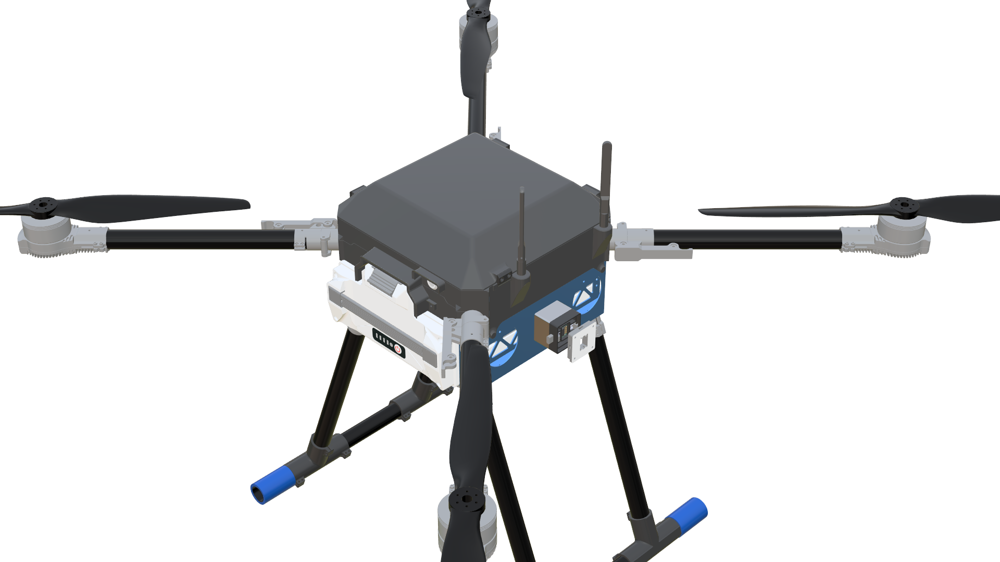
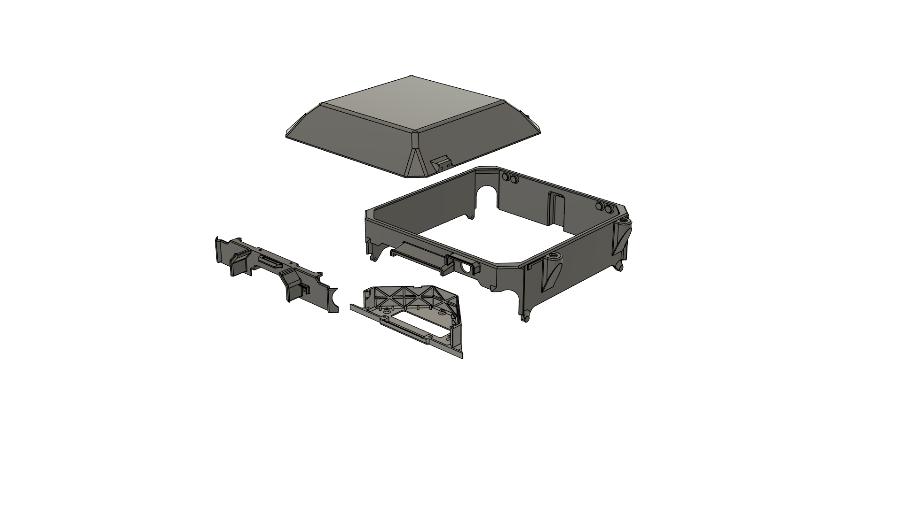
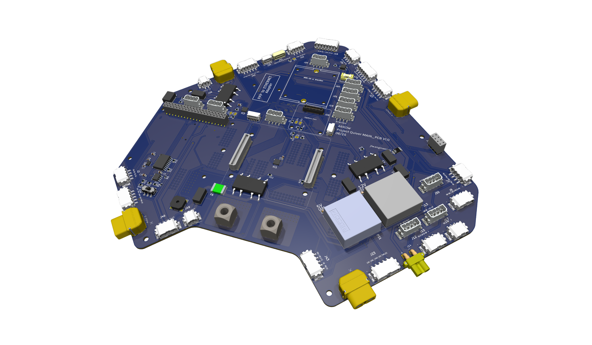
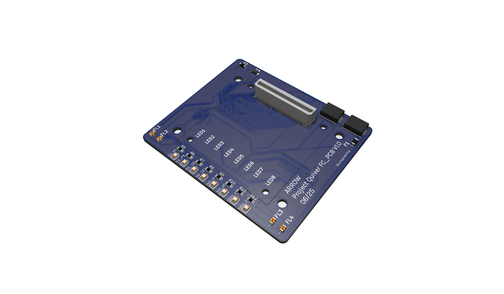

# Project Quiver PT3 Engineering Report

## Executive Summary

Building upon the designs of PT1 and PT2, Quiver PT3 represents a leap forward in design and manufacturing quality.  Significant advancements were made to enhance the reliability, modularity, and operational capabilities based on the lessons learned from building and testing the previous prototypes.  PT3 included a comprehensive redesign to structural components, payload integration, PCBs, navigation accuracy, and sensing technology.  Developments include multiple custom PCBs, redundant GNSS with RTK capabilities, dual radar and LiDAR altimeters, expanded payload interfaces, and various airframe changes that have improved the assembly, maintenance, and  expanded the operational capabilities of PT3.  These improvements have resulted in an acceleration towards the goal a multipurpose UAV platform capable of reliable and flexible operations. 

## Introduction

PT3 continues the goal of creating a multi-purpose multi-rotor UAV suited for various operational scenarios with an emphasis on reliability, robustness, and modularity. PT1 showcased basic capabilities and the initial integration relied on a repurposed PCB mixed with various off the shelf components. The structure used a common quadcopter layout with foldable motor beams and propellers. PT 1.5 introduced an updated PCB, solid state relay (SSR), and updated enclosure design for the battery and flight controller. PT2 introduced major overhauls on the structural components, equipment layout, and PCB design. Many of these changes set the platform for PT3 which allowed the design to leverage the extensive testing and feedback from the previous prototypes. The following areas were targeted for improvement in the PT3 design but are not a complete list of updates:

- Waterproof & dustproof cockpit
- Standardized mission attachment connector
- Flight mission planning & automation
- RTK & Precise GNSS
- PCB with kill switch capabilities
- Refined structure for weight reduction

## Evolution of Project Quiver

### Prototype Comparison

| Feature | PT1 | PT2 | PT3 |
| --- | --- | --- | --- |
| Airframe Material | Aluminum/CF/3D prints | Aluminum/CF/3D prints | Aluminum/CF/3D prints |
| Water proof/Dust Proof | No | No | Yes |
| Payload Interfaces | One | One  | Three |
| GNSS System | Basic | Initial RTK | Dual RTK (Holybro DroneCAN H-RTK F9P Rover & Systork Wren Mini), Backup GNSS (Mateksys M9N-G4-3100) |
| Flight Controller | Pixhawk 6X | Mateksys H743 | Pix32 V6 with plans for Pixhawk 6X/Cube Orange |
| PCB Strategy | Repurposed from Feather Testbed | Custom main PCB  | Multiple custom PCBs |
| Battery Management | Contactor controlled by Arduino  | SSR & Pre-charge | Battery PCB with temperature monitoring and kill switch |
| Altimeter Sensors | Radar altimeter | LiDAR | Ainstein US-D1 Radar, Benewake TF03-180 LiDAR |
| Communication  | CAN, Serial, Analog | CAN, Serial, Analog | CAN, Serial, Analog, & Ethernet |
| Raspberry Pi Integration | None | Optional | Optional |
| Testing sites | US | Germany | US & Germany  |

## Airframe CAD Architecture

The PT3 airframe CAD model introduces weight optimizations, multiple features for ease of maintenance, and additional quick-release attachment interfaces compared to earlier prototypes. The design was developed in Fusion 360 and informed by mechanical reasoning, lessons learned from past prototype failures, and FEA insights.

A detailed part list and link to the .step file can be found in the information note included in the report appendix. 

## Detailed Technical Improvements (PT3)

This portion of the report will highlight and summarize the modifications to PT3. For additional details please refer to the appendix of the report. 

### Airframe & Structural Improvements

The PT3 structural design is an evolution of the PT2 airframe, preserving core geometries while incorporating modifications to resolve limitations observed during PT2 operations. These enhancements address environmental sealing, increased payload mounting provisions, structural mass optimization, additional cable routing provisions, and mitigations for electromagnetic interference.  The following sections will cover the various airframe modifications targeted for PT3.

**Enclosure Assembly** 

Total|Explode 
:-:|:-:
 | 

A comprehensive redesign of the battery and avionics enclosures in PT3 added weather resistance, improved heat management, and enhanced PCB structural support without sacrificing the maintainability achieved in PT2. The enclosure assemblies are divided into four primary components: the Battery PCB enclosure, the Main enclosure, the Front lid, and the Top cap.

Multiple design techniques were applied to protect the electronics weatherproof from rain and dust. Openings to the electrical compartments feature integrated rain canopies and drip-proof structures, while enclosure gaps and edges use reverse slope geometries to further improve water resistance. A dedicated enclosure was developed for the Battery PCB, incorporating a heat sync that interfaces with the aluminum airframe for heat dissipation. Additionally, mechanical reinforcements were added for the PCB while minimizing the mass of non load bearing sections.

The main enclosure includes a reserved RP-SMA mounting bracket for the telemetry antenna, ensuring robust mechanical support and straightforward integration. The top cap retains the hinged operation of PT2 but has been completely reshaped and resized to provide the clearance required for the RTK-GNSS receiver located in the cockpit.

**GNSS Stand**

The GNSS receiver is mounted 2 cm above the FCU enclosure to reduce EMI, supported by a custom arch bracket that provides stability without contacting the FC or its PCB.

**Attachment Interface** 

PT3 retains the quick release  mechanism from previous prototypes while expanding capacity to support three payloads. Each interface is mounted on a modified plate with dedicated screw and cable openings, and fitted with a 3 cm extension adapter to improve clearance from the aircraft body and ease maintenance. Side facing cable ports prevent abrasion and water ingress, enhancing durability in operational environments

**Sensor Mounting Frame** 

**THIS SECTION REQUIRES UPDATED IMAGES AND TEXT TO INCLUDE RADAR, LIDAR, AND GIMBAL CAMERA**

**Battery Wall Modifications**

The PT3 battery walls retain PT2’s core geometry, with modifications improving attachment integration, cable management, and maintenance access.  M3 screw holes were added on each side to accommodate the payload clearance adapters. Larger clearance holes were incorporated to allow a screwdriver to pass through for direct access to the fasteners, simplifying installation and removal without disassembling surrounding components. Chamfered access holes and extended cutouts simplify motor arm connector screw replacement, and additional harness cutouts on the top and bottom surfaces enable cleaner routing of cables between layers.

**Battery Slider Modification**

The battery slider was updated to align with the larger clearances on the PT3 battery walls. Recesses were added in line with the side attachment interface mounting holes to provide screwdriver access, and ~~one of the slider’s mounting holes was relocated so it can be reached directly through the attachment interface opening.~~

**Harness Cutouts on the Plates**

Routing provisions added to route cables between layers. 

**Main PCB Mount**

Main PCB holder was modified so that the holes are aligned with PCB installation holes. Additional anchors were created for the flight controller and Raspberry Pi.

**Cockpit Support Beams**

Cutouts on the cockpit support beams are created for weight reduction of 200 g.

### Electronics Integration

PT3 moves away from the single, centralized PCB approach of PT2 in favor of a distributed architecture built around four custom boards: the Battery PCB, Main PCB, Flight Controller (FC) PCB, and Attachment Interface PCB. This modular layout allows each board to be optimized for its specific role, reducing interdependencies and simplifying maintenance. PT3 improves redundancy in critical systems and creates flexibility for integrating different payloads, sensors, and other equipment. The design also enhances troubleshooting and upgrade workflows, as individual PCBs can be serviced or replaced without disturbing unrelated subsystems. To further aid diagnostics and field servicing, various probe points and status LEDs have been incorporated, providing users with accessible test locations and clear visual indicators of system status.

A brief summary is provided below of the PCBs and their functionality. Detailed description of their operation, components, and manufacturing can be found in their respective information notes, which are included in the appendix of this report.

***ALL CAD FILES NEED TO BE UPLOADED TO GITHUB***

### Battery PCB

The newly designed Battery PCB is responsible for managing, protecting, and monitoring the primary power flow from the Tattu Smart Battery to the Main PCB. It integrates power switching, pre-charge control with a bypass, and telemetry functions into a single board, using a combination of MOSFETs, SSRs, voltage regulators, fuses, TVS diodes, temperature sensors, and indicator LEDs.

Key functions include safe ESC pre-charge, over current protection via high capacity fuses, and  telemetry. Battery status is transmitted over CAN, while temperature data is sent over I²C. Status LEDs and dedicated probe points are positioned to give clear visual indicators and accessible test locations for diagnostics in the field.

The PCB design supports both pre-charge and full-power states. Custom high current Molex connectors handle the main power path, while Eurostyle connectors provide interface points for the flight controller and auxiliary systems. The board’s 4-layer FR-4 construction, ENIG finish, and robust copper weight ensure durability under high load conditions. The design also incorporates mechanical reinforcement and a heat-sinking interface to the airframe for thermal management. Multiple test points allow quick verification of voltages, gate signals, and system readiness.

By combining critical protection, switching, and monitoring functions into a dedicated module, the Battery PCB reduces wiring complexity, improves maintainability, and enhances operational reliability in PT3.

### Main PCB

The PT3 Main PCB serves as the primary hub for distributing power, data, and control signals between the flight controller and the aircraft’s major subsystems. Its design is heavily based on the PT2 Main PCB, retaining the overall functional block layout and many proven interconnection schemes, but with a number of targeted upgrades to improve flexibility, serviceability, and system integration.

One of the many significant changes from PT2 is the replacement of Euro style terminal blocks with Phoenix connectors, enabling faster prototyping and more reliable field connections. The PT3 board also introduces an additional high voltage output port rated for 60 V or less, three dedicated payload connectors for the bottom and both side attachment interfaces, and provisions for a secondary backup GNSS receiver. Ethernet, CAN, and UART routing have been expanded to accommodate a wider range of payloads and sensors, including the Ainstein US-D1 radar altimeter and Benewake TF03 LiDAR.

The Main PCB also incorporates dedicated stacking connectors that allow the Flight Controller PCB to mount directly on top, forming a compact and serviceable electronics stack. Like the other PT3 PCBs, it integrates probe points and LED indicators throughout the board to provide clear visual feedback and accessible test locations for power rails, control signals, and subsystem health.

In addition to payload integration improvements, the board maintains robust power management features from PT2, including dedicated 5 V and 12 V DC-DC converters, SSR controlled payload power switching, and pre-charge bypass control. Expanded CAN and Ethernet interfaces allow for more complex networked subsystems, while the improved interconnect layout enhances both assembly efficiency and in-field maintainability.

The Main PCB functions as a central hub, managing power and communication between subsystems, including Ethernet and advanced CAN networks. The Flight Controller PCB accommodates the Pix32 V6 and includes advanced EMI filtering and power protection features, as discussed during the selection phase.

### FC PCB

The FC PCB is an adapter board for the Pix 32 V6 flight controller. It includes breakouts for the various PWM, GPIO, GPS, I²C, CAN, S.BUS, and power pins on the flight controller. Various components were included based on the documentation provided by Holybro for the Pix32 V6 Schematic. Diagnostic LEDs indicate FC power state and sensor activity, while probe points facilitate troubleshooting without interrupting harness connections.

### Attachment Interface PCB

Provides the electrical interface for modular payloads through the aircraft’s quick-release attachment system. It routes regulated power and data lines from the Main PCB to the payload and supports multiple communication standards to accommodate different equipment types. The design allows hot-swapping of payloads without disturbing the main PCB.

### Flight Controller Selection & Integration

| Flight Controller | Key Features | Pros | Cons |
| --- | --- | --- | --- |
| Pixhawk 6X / 6X Pro | Expanded IO, Pro has better sensors & loop performance | Robust, extensible, familiar system | Higher cost, Pro version significantly more expensive |
| CubePilot+ | Redundant FCs and more IMUs | Feature-rich, aerospace-grade | ~$200 more expensive than 6X Pro |
| uAvionix George | Manned aircraft-grade with FAA cert-ready architecture | Extensive integration potential | Overkill for current unmanned use |
| Auterion Skynode | Full-stack system with CC and LTE | Plug-and-play, high-end | Overkill for current needs, less transparency |
| Mateksys H743-SLIM V3 | Minimalistic, low-cost, ArduPilot compatible | Extremely cheap, small form factor | Manual wiring required, reliability concerns |
| Pix32 V6 | Modular design, no onboard Ethernet | Affordable, flexible PCB integration | Requires adapter for Ethernet, breakout board needed |

The flight controller for PT3 was selected after an evaluation of available autopilot boards.  Candidates included the Pixhawk 6 X, 6 X Pro, Cube Pilot Plus, H743‑Slim V3, uAvionix George and Auterion Skynode.  After weighing cost, sensor quality, interface support and redundancy, the **Pix32 V6** was selected as the baseline FC for PT3.  This choice balances performance and affordability for prototyping while providing a clear upgrade path to a Pixhawk 6 X or Cube Orange in later iterations. The Pix32 V6 offers a well documented software stack and a various form factors that integrates easily with the Main PCB. 

***INCLUDE IMAGE OF PIX32 V6 VARIANT USED***

### Navigation and Altimetry Systems

PT3 introduces a redundant navigation system composed of dual real time kinematic (RTK) GNSS modules and complementary altitude sensors. The primary GNSS solution uses either the **Holybro DroneCAN H‑RTK F9P Rover** or the **Systork Wren Mini.** Both are built around the u‑blox F9P receiver and communicate over DroneCAN. To ensure redundancy, a **Mateksys M9N‑G4‑3100** provides an affordable backup. The primary GNSS unit is mounted on a custom 3D printed arch bracket that raises it by 2 cm above the flight controller, reducing electromagnetic interference and giving a clean line of sight to staellites. The Mateksys module has a dedicated mounting location on the Main PCB. The autopilot blends data from these GNSS sources and promotes the backup if the primary fails.

Altitude measurement in PT3 combines the strengths of radar and LiDAR. Where PT1 used an **Ainstein US‑D1 radar altimeter** and PT2 relied on a **Benewake TF03‑180 LiDAR**, PT3 accommodates both to ensure accurate altitude sensing across varied terrain. The US‑D1 provides reliable readings from 5 m up to 400 m using a 24 GHz radar that is unaffected by fog, dust or rain. The TF03‑180 LiDAR delivers high‑resolution measurements from 0.1 m to 180 m for precise low‑altitude hovering and terrain following. Both sensors are mounted on a dedicated bracket on one front of the airframe. The custom designed bracket spaces them to prevent interference and angles them downward to measure ground clearance directly beneath the aircraft. The sensors connect to the flight controller via CAN and their outputs are fused by the autopilot to maintain accurate altitude control across a wide range of operating conditions.

### Raspberry Pi and Communication Systems

A Raspberry Pi companion computer is integrated into PT3 to handle tasks that exceed the Pix32 V6’s onboard processing, such as computer vision, advanced autonomy algorithms and high rate data logging. The Pi connects to the Main PCB via Ethernet and a regulated power line, and communicates with the flight controller over MAVLink. It also interfaces directly with payload sensors and cameras, allowing real time image processing and mission planning. Flight critical functions remain on the Pix32 V6, while the Pi executes non critical scripts and other workloads.

**PT3’s communication systems** integrates multiple physical links for operational resilience. A SIYI telemetry air unit, similar to the one fielded on PT1, streams HD video and telemetry to the ground station over MAVLink. Internally, a combination of CAN and Ethernet networks link the Main PCB, Flight Controller PCB, altimeters, GNSS modules, and payload ports, ensuring reliable data exchange across subsystems.

Although not included in the baseline configuration, the Main PCB incorporates a reserved interface for a Mateksys telemetry unit, allowing rapid integration of an additional radio if operational requirements change. By combining multiple systems with hard-wired digital buses, PT3 maintains robust communications across diverse mission profiles and environmental conditions.

## Testing, Validation & Results

- Modular Test Strategy
- Key Performance Metrics
- Results Summary (brief table highlighting major outcomes)

***WILL BE UPDATED AFTER PUBLISHED TEST REPORTS***

## Performance Metrics & Comparative Analysis

PT3 performance evaluation follows a standardized methodology for comparing prototypes across control behavior, stability, efficiency, and navigation accuracy. Metrics are extracted from ArduPilot flight logs using Mission Planner, MAVExplorer, and custom scripts. Tests cover rate tracking error, vibration analysis, power efficiency, climb performance, yaw authority, waypoint tracking, and glide capability. Results are collected under consistent environmental and configuration conditions to ensure fair comparisons. The full methodology, including calculation formulas and evaluation criteria, is provided in the appendix.

## Conclusions & Future Recommendations

PT3 represents a substantial advancement in the Project Quiver series. It introduces a distributed electronics architecture with four custom PCBs, dual GNSS and dual altitude sensors, three modular payload interfaces, and a refined airframe that balances weight reduction with improved durability. These upgrades yield better navigation accuracy, smoother flight, shorter maintenance times and greater mission versatility than previous prototypes. The modular design also facilitates rapid prototyping of new payloads and subsystem upgrades.

Future work should focus on further increasing computing power by migrating to a Pixhawk 6 X or Cube Orange flight controller, developing a standard gimbal for imaging payloads, and expanding the test campaign to include complex mission profiles. Performing finite element analysis and destructive testing on 3D printed structures will validate the weight reduction strategy. Additional automation of mission planning using the Raspberry Pi’s computer vision capabilities and integration of obstacle‑avoidance sensors will enhance autonomy. Refinement of manufacturing processes and documentation will streamline assembly for production scale builds.

## Appendices (Detailed references)

### Electronics
- [Battery PCB Information Note](https://github.com/Arrow-air/project-quiver/blob/main/task-grant-bounty/pt3/electronics/0002-Battery-PCB/information-note.md)
- [Attachment Interface PCB Information Note](https://github.com/Arrow-air/project-quiver/tree/main/task-grant-bounty/pt3/electronics/0003-Attachment-Interface-PCB)
- [Rangefinder Information Note](https://github.com/Arrow-air/project-quiver/blob/main/task-grant-bounty/pt3/electronics/0005-Rangefinder/information-note.md)
- [GNSS Information Note](https://github.com/Arrow-air/project-quiver/blob/main/task-grant-bounty/pt3/electronics/0006-GNSS/information-note.md)
- [Main PCB Information Note](https://github.com/Arrow-air/project-quiver/blob/main/task-grant-bounty/pt3/electronics/0007-Main-PCB/information_note.md)
- [FC Information Note](https://github.com/Arrow-air/project-quiver/blob/main/task-grant-bounty/pt3/electronics/0008-FC-PCB/information_note.md)

### Flight Controller
- [FC Roadmap Information Note](https://github.com/Arrow-air/project-quiver/blob/main/task-grant-bounty/pt3/flight-controller/0001-fc-roadmap/information-note.md)
- [FC Setup Guide](https://github.com/Arrow-air/project-quiver/blob/main/task-grant-bounty/pt3/flight-controller/0002-flight-controller-setup/information-note.md)

### Airframe
- [PT3 Airframe Modifciations Information Note](https://github.com/Arrow-air/project-quiver/blob/main/task-grant-bounty/pt3/structural/0001-comprehensive_airframe_modification/information-note.md)
- [Airframe CAD Architecture Information Note](https://github.com/Arrow-air/project-quiver/blob/main/task-grant-bounty/pt3/structural/0002-Airframe-CAD-Architecture.md)

### Assembly Guides
- [All](https://github.com/Arrow-air/project-quiver/tree/main/docs/assembly-guides/PT3)

### Misc
- [Performance Metrics Information Note](https://github.com/Arrow-air/project-quiver/blob/main/task-grant-bounty/Tools/Performance-Metrics/information-note.md)

