# Harness Manufacturing Guide

## Purpose

This guide explains how to manufacture and assemble the wiring harnesses for all of the components present on the dev kit build. Modifications include custom cut spool cables, pre made cables, pre crimped cables, and reducing length of default connectors.

Use the following wiring table for all of the connections TO/FROM for all of the dev kit’s systems: [Dev Kit Wire Data](https://docs.google.com/spreadsheets/d/1U9Jd1zW-IGLvGdLw63Ius3nsfnPE6wN_-VjMNnLCjd8/edit?gid=2139598833#gid=2139598833)
The spreadsheet gives the full view of all connectors, mating connectors, wire gauge, estimated length, and suggested/default wire colors.

## How To Use This Guide

This guide is the canonical reference for harness fabrication: nailboard diagrams, BOMs, wire prep, termination, and pinout maps. Vehicle-side installation and photo-based routing walkthroughs are covered in the [Dev-Kit Manufacturing Guide](./Manufacturing-Guide.md), where each harness is placed in the assembly step that needs it.

## Vehicle Routing Quick Reference

Use this table only as a harness-side checklist for endpoints and major routing constraints. For the canonical route order, photos, and installation details, see the harness routing notes in the [Dev-Kit Manufacturing Guide](./Manufacturing-Guide.md).

| Harness | Source | Destination | Quick routing note |
| :--- | :--- | :--- | :--- |
| HAR-0001 Pushbutton | Bat_PCB J1 | Pushbutton | Route over the Battery PCB; use the marked zip-tie provision. |
| HAR-0002 BC_PCB Signal | Bat_PCB J2 | Main_PCB J43 | Direct PCB interconnect. |
| HAR-0003 BC_PCB SSR | Bat_PCB J3 | Main_PCB J46 | Direct PCB interconnect. |
| HAR-0004 / HAR-0005 / HAR-0006 / HAR-0007 ESC Power | Main_PCB J27 | ESC power leads | Route through the circular upper-plate opening to the middle plate. |
| HAR-0008 / HAR-0009 / HAR-0010 / HAR-0011 ESC Signal | Bat_PCB J2 | Main_PCB J43 | No special routing constraint currently noted. |
| HAR-0012 / HAR-0013 Side Payloads | Main_PCB J29, J37 | ATT_INT right/left | Route under the Main PCB to the side circular openings; watch telemetry air-unit clearance. |
| HAR-0014 Bottom Payload | Main_PCB J31, J39 | ATT_INT bottom | Route through the right-side and mid-plate openings to the underside; watch cable crowding and zip-tie points. |
| HAR-0015 Altimeter | Main PCB J8 | NRA15 | Route from the right-side top-plate entry to the bottom plate; watch other cables and marked zip tie. |
| HAR-0016 360 LIDAR | Main PCB U5 | S2L LIDAR | Route downward toward the connector; use the marked zip tie. |
| HAR-0017 Front Radar | Main PCB J49 | Front radar | Route from the right-side top-plate entry to the bottom plate; watch other cables and marked zip tie. |
| HAR-0018 HM30 Power | Main_PCB J27 | HM30 power | Route through the right-side top-plate opening. |
| HAR-0019 / HAR-0020 HM30 Signal | Bat_PCB J15, J17 | HM30 | Route through the right-side top-plate opening; watch other cables and secure with zip ties. |
| HAR-0021 / HAR-0022 Navigation | Main_PCB J7, J9 | F9P/Here 4, Mateksys | Route immediately to the right. |
| HAR-0023 / HAR-0024 / HAR-0025 PPP2ETH | Main_PCB J35, J36, J41 | PPP2ETH | Direct connections; HAR-0024 routes under the PPP/beacon mount and uses the marked zip tie. |
| HAR-0026 Remote ID | Main_PCB J20 | Remote ID beacon | Direct connection. |
| HAR-0027 SIYI Camera | HM30 LAN and power | SIYI A8 | Route through the right-side middle-plate opening to the underside; watch other cables and use zip ties as needed. |
| HAR-0028 Antenna | Antenna | HM30 | Route through the enclosure provisions to the middle plate. |

## Tools Required
* Soldering iron with hot air rework station
* Solder
* Wire stripper
* Wire cutter
* Heat shrink
* Heat shrink solder connectors
* Flathead screwdriver (1.5mm)
* Pliers
* Multimeter

## Quality Assurance (QC) Checklist
- [ ] **Visual:** Check for exposed strands or damaged insulation.
- [ ] **Mechanical:** Pull-test all crimps lightly to ensure retention.
- [ ] **Continuity:** Probe Pin 1 to Pin 1 (Tone check).
- [ ] **Polarity:** Verify Red is Positive, Black is Ground.

## HAR-0001 Pushbutton
| **FROM**    | **TO**  |
| ------------| ------- |
| BC_PCB J25|Pushbutton |

<Steps>

  <Step title="Nailboard">

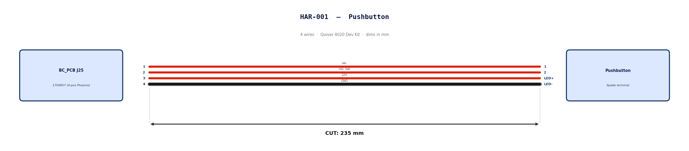

  </Step>

  <Step title="Bill of Materials (Kitting)">

*Gather these parts before starting the build.*

| Item Type | Part Number | Description / Spec | Qty Needed |
| :--- | :--- | :--- | :--- |
| **Connector A** | 1704857 | 4-Pos Phoenix | 1 |
| **Terminals A** | Wire | Bare wire, twisted end | 4 |
| **Connector B** | Spade | Spade terminal | 4 |
| **Terminals B** | Wire | Bare wire | 4 |
| **Wire** | 18 AWG | Silicon |940mm |
| **Sleeving** | Optional| Mesh | 180 mm|

  </Step>

  <Step title="Wire Prep (Cut &amp; Strip)">

*Prepare all wires before assembly.*

| Wire ID | Color | Gauge | Cut Length | Strip A  | Strip B  |
| :--- | :--- | :--- | :--- | :--- | :--- |
| **W1** | Red | 18 AWG | 235mm | 6mm  | 6mm |
| **W2** | Red | 18 AWG | 235mm | 6mm | 6mm |
| **W3** | Red | 18 AWG | 235mm | 6mm | 6mm |
| **W4** | Black | 18 AWG | 235mm | 6mm | 6mm |

  </Step>

  <Step title="Termination &amp; Pinout Map">

*Connect End A to End B following this chart.*

| Wire ID | Color | From: 1704857  | To: Spade | Function / Signal |
| :--- | :--- | :--- | :--- | :--- |
| **W1** | Red | **Pin 1** | 1 | HV- |
| **W2** | Red | **Pin 2** | 2 | HV- SW |
| **W3** | Red | **Pin 3** | LED+| 12V |
| **W4** | Black | **Pin 4** | LED- | GND |

  </Step>

  <Step title="Assembly Instructions">

1.  **Prep:** Cut wires to length and strip insulation per Section 3.
2.  **Label:** Install identification markers per Section 5. *Do not shrink yet.*
4.  **Populate A:** Insert contacts into Connector A housing. *Verify "Click" and perform pull-back test.*
5.  **Crimp Side B:** Terminate Side B using crimping tool.
6.  **Populate B:** Insert contacts into Connector B housing.

  </Step>

</Steps>

## HAR-0002 BC_PCB Signal
| **FROM**    | **TO**  |
| ------------| ------- |
| BC_PCB J25|Main_PCB J43 |

<Steps>

  <Step title="Nailboard">

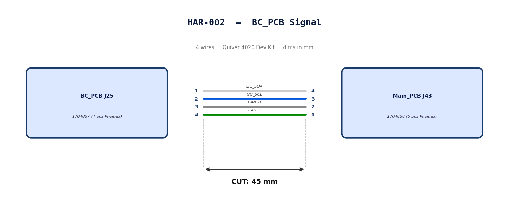

  </Step>

  <Step title="Bill of Materials (Kitting)">

*Gather these parts before starting the build.*

| Item Type | Part Number | Description / Spec | Qty Needed |
| :--- | :--- | :--- | :--- |
| **Connector A** | 1704857 | 4-Pos Phoenix | 1 |
| **Terminals A** | Wire | Bare wire, twisted end | 4 |
| **Connector B** | 1704858 | 5-Pos Phoenix | 1 |
| **Terminals B** | Wire | Bare wire, twisted end | 4 |
| **Wire** | 20 AWG | Silicon | 240mm |
| **Sleeving** | Optional| Mesh | N/A|

  </Step>

  <Step title="Wire Prep (Cut &amp; Strip)">

*Prepare all wires before assembly.*

| Wire ID | Color | Gauge | Cut Length | Strip A  | Strip B  |
| :--- | :--- | :--- | :--- | :--- | :--- |
| **W1** | White | 20 AWG | 56mm | 6mm  | 6mm |
| **W2** | Blue | 20 AWG | 56mm | 6mm | 6mm |
| **W3** | Gray | 20 AWG | 56mm | 6mm | 6mm |
| **W4** | Green | 20 AWG | 56mm | 6mm | 6mm |

  </Step>

  <Step title="Termination &amp; Pinout Map">

*Connect End A to End B following this chart.*

| Wire ID | Color | From: 1704857  | To: 1704858 | Function / Signal |
| :--- | :--- | :--- | :--- | :--- |
| **W1** | White | **Pin 1** | 4 | I2C_SDA |
| **W2** | Blue | **Pin 2** | 3 | I2C_SCL |
| **W3** | Gray | **Pin 3** | 2| CAN_H |
| **W4** | Green | **Pin 4** | 1 | CAN_L |

  </Step>

  <Step title="Assembly Instructions">

1.  **Prep:** Cut wires to length and strip insulation per Section
4.  **Populate A:** Insert contacts into Connector A housing. *Verify "Click" and perform pull-back test.*
6.  **Populate B:** Insert contacts into Connector B housing.*Verify "Click" and perform pull-back test.*

  </Step>

</Steps>

## HAR-0003 BC_PCB SSR
| **FROM**    | **TO**  |
| ------------| ------- |
| BC_PCB J25|Main_PCB J46 |

<Steps>

  <Step title="Nailboard">

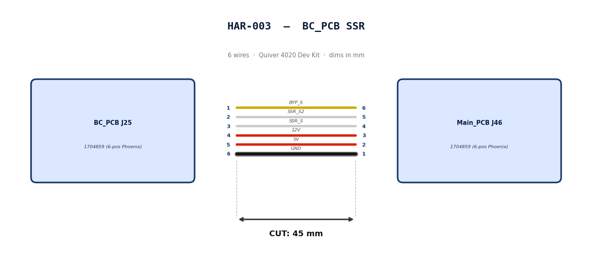

  </Step>

  <Step title="Bill of Materials (Kitting)">

*Gather these parts before starting the build.*

| Item Type | Part Number | Description / Spec | Qty Needed |
| :--- | :--- | :--- | :--- |
| **Connector A** | 1704859| 6-Pos Phoenix | 1 |
| **Terminals A** | Wire | Bare wire, twisted end | 6|
| **Connector B** | 1704859| 6-Pos Phoenix | 1 |
| **Terminals B** | Wire | Bare wire, twisted end | 6|
| **Wire** | 20 AWG | Silicon | 50mm |
| **Sleeving** | Optional| Mesh | xx mm|

  </Step>

  <Step title="Wire Prep (Cut &amp; Strip)">

*Prepare all wires before assembly.*

| Wire ID | Color | Gauge | Cut Length | Strip A  | Strip B  |
| :--- | :--- | :--- | :--- | :--- | :--- |
| **W1** | Yellow| 20 AWG | 56mm | 6mm  | 6mm |
| **W2** | White| 20 AWG | 56mm | 6mm | 6mm |
| **W3** | White| 20 AWG | 56mm | 6mm | 6mm |
| **W4** | Red| 20 AWG | 56mm | 6mm | 6mm |
| **W5** | Red| 20 AWG | 56mm | 6mm | 6mm |
| **W6** | Black | 20 AWG | 56mm | 6mm | 6mm |

  </Step>

  <Step title="Termination &amp; Pinout Map">

*Connect End A to End B following this chart.*

| Wire ID | Color | From: 1704859| To: 1704859| Function / Signal |
| :--- | :--- | :--- | :--- | :--- |
| **W1** | Yellow| **Pin 1** | 6 | BYP_S|
| **W2** | White | **Pin 2** | 5 | SSR_S2|
| **W3** | White | **Pin 3** | 4| SSR_S|
| **W4** | Red | **Pin 4** | 3 | 12V|
| **W5** | Red | **Pin 5** | 2 | 5V|
| **W6** | Black | **Pin 6** | 1 | GND|

  </Step>

  <Step title="Assembly Instructions">

1.  **Prep:** Cut wires to length and strip insulation per Section
4.  **Populate A:** Insert contacts into Connector A housing. *Verify "Click" and perform pull-back test.*
6.  **Populate B:** Insert contacts into Connector B housing.*Verify "Click" and perform pull-back test.*

  </Step>

</Steps>

## HAR-0004 -> HAR-007 ESC Power
| **FROM**    | **TO**  |
| ------------| ------- |
| Main_PCB J25|ESC1 PWR |
| Main_PCB J28|ESC2 PWR |
| Main_PCB J34|ESC3 PWR |
| Main_PCB J42|ESC4 PWR |

<Steps>

  <Step title="Nailboard">

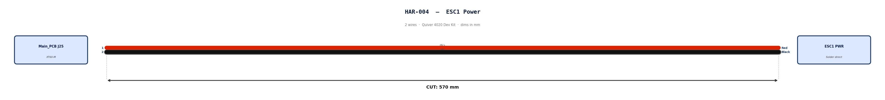

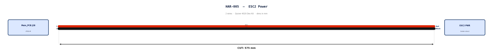

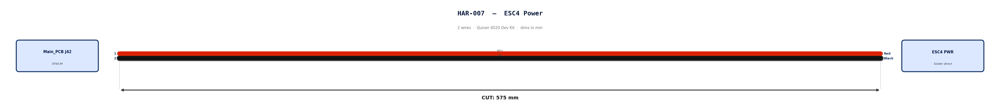

  </Step>

  <Step title="Bill of Materials (Kitting)">

*Gather these parts before starting the build.*

| Item Type | Part Number | Description / Spec | Qty Needed |
| :--- | :--- | :--- | :--- |
| **Connector A** | XT60-M| 2-Pos XT-60| 1 |
| **Terminals A** | Wire | Solder | 2|
| **Wire** | 6 AWG | Silicon | 490mm |
| **Sleeving** | Required| 9.5mm ID heatshrink at motor arm bend | 7cm |

  </Step>

  <Step title="Wire Prep (Cut &amp; Strip)">

*Prepare all wires before assembly.*

| Wire ID | Color | Gauge | Cut Length | Strip A  | Strip B  |
| :--- | :--- | :--- | :--- | :--- | :--- |
| **W1** | Red| 6 AWG | 490mm | 4mm  | N/A |
| **W2** | Black| 6 AWG | 490mm | 4mm | N/A|

  </Step>

  <Step title="Termination &amp; Pinout Map">

*Connect End A to End B following this chart.*

| Wire ID | Color | From: XT60-M| To: ESC1| Function / Signal |
| :--- | :--- | :--- | :--- | :--- |
| **W1** | Red| **Pin 1** | Red| HV+|
| **W2** | Black| **Pin 2** | Black| HV-|

  </Step>

  <Step title="Assembly Instructions (Not finished)">

1.  **Prep:** Cut wires to length and strip insulation per Section 3.
4.  **Populate A:** Solder cables into Connector A housing.
6.  **Heatshrink:** Apply a 7cm 9.5mm ID heatshrink at the motor arm bend location. This heatshrink will protect the ESC Power and signal cables*

  </Step>

</Steps>

## HAR-0008 -> HAR-0011
| **FROM**    | **TO**  |
| ------------| ------- |
| Main_PCB J23|ESC1 Signal |
| Main_PCB J27|ESC2 Signal |
| Main_PCB J32|ESC3 Signal |
| Main_PCB J40|ESC4 Signal |

<Steps>

  <Step title="Nailboard">

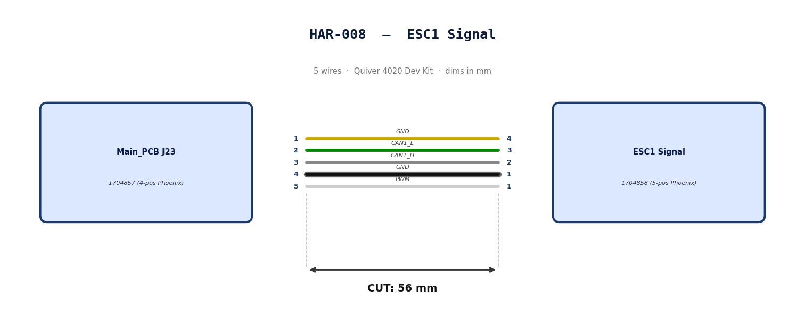

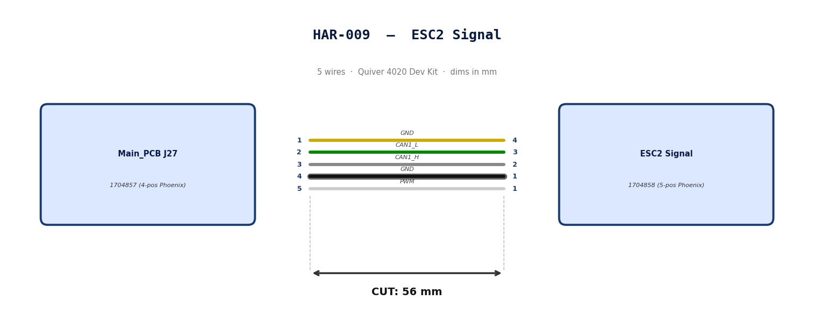

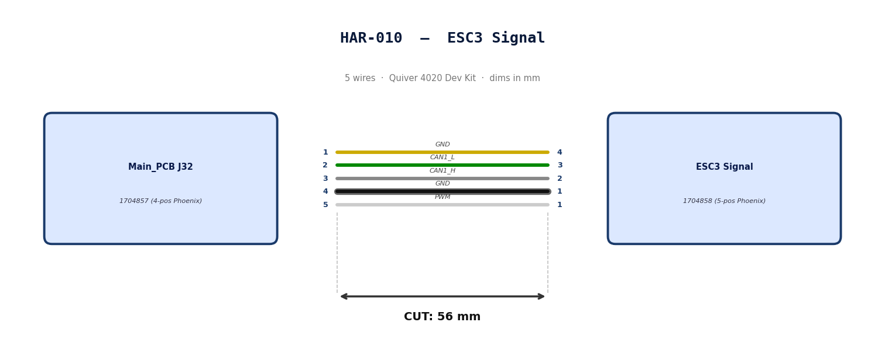

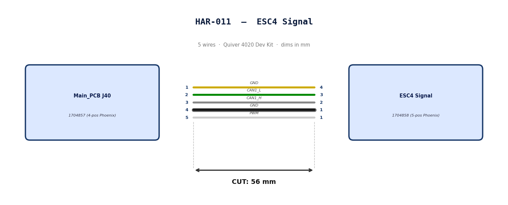

  </Step>

  <Step title="Bill of Materials (Kitting)">

*Gather these parts before starting the build.*

| Item Type | Part Number | Description / Spec | Qty Needed |
| :--- | :--- | :--- | :--- |
| **Connector A** | 1704858 | 5-Pos Phoenix | 1 |
| **Terminals A** | Wire | Bare wire, twisted end | 5 |
| **Wire** | 20 AWG | Silicon | 240mm |
| **Sleeving** | Required| 9.5mm ID Heatshrink at motor arm bend | 7cm |

  </Step>

  <Step title="Wire Prep (Cut &amp; Strip)">

*Prepare all wires before assembly.*

| Wire ID | Color | Gauge | Cut Length | Strip A  | Strip B  |
| :--- | :--- | :--- | :--- | :--- | :--- |
| **W1** | Yellow | 20 AWG | 56mm | 6mm  | 6mm |
| **W2** | Green | 20 AWG | 56mm | 6mm | 6mm |
| **W3** | Gray | 20 AWG | 56mm | 6mm | 6mm |
| **W4** | Black | 20 AWG | 56mm | 6mm | 6mm |
| **W5** | White | 20 AWG | 56mm | 6mm | 6mm |

  </Step>

  <Step title="Termination &amp; Pinout Map">

*Connect End A to End B following this chart.*

| Wire ID | Color | From: 1704857  | To: 1704858 | Function / Signal |
| :--- | :--- | :--- | :--- | :--- |
| **W1** | Yellow | **Pin 1** | 4 | GND |
| **W2** | Green | **Pin 2** | 3 | CAN1_L |
| **W3** | Gray | **Pin 3** | 2| CAN1_H |
| **W4** | Black | **Pin 4** | 1 | GND |
| **W5** | White | **Pin 5** | 1 | PWM  |

  </Step>

  <Step title="Assembly Instructions">

1.  **Prep:** Cut wires to length and strip insulation per Section
4.  **Populate A:** Insert contacts into Connector A housing. *Verify "Click" and perform pull-back test.*
6.  **Heatshrink:** Apply a 7cm 9.5mm ID Heatshrink at the motor arm bend location. This heatshrink will protect the ESC Power and signal cables*

  </Step>

</Steps>

## HAR-0012 -> HAR-0013 Side Payloads
| **FROM**    | **TO**  |
| ------------| ------- |
| Main_PCB J29, J37|ATT_INT (right) |
| Main_PCB J30, J38|ATT_INT (left) |

<Steps>

  <Step title="Nailboard">

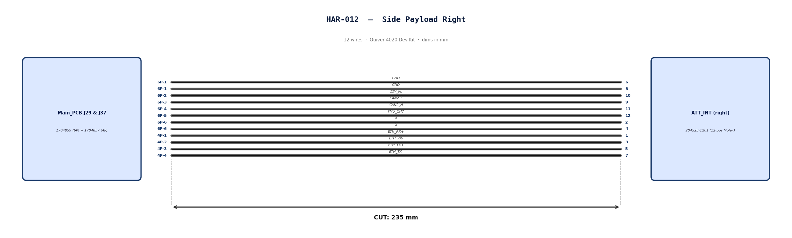

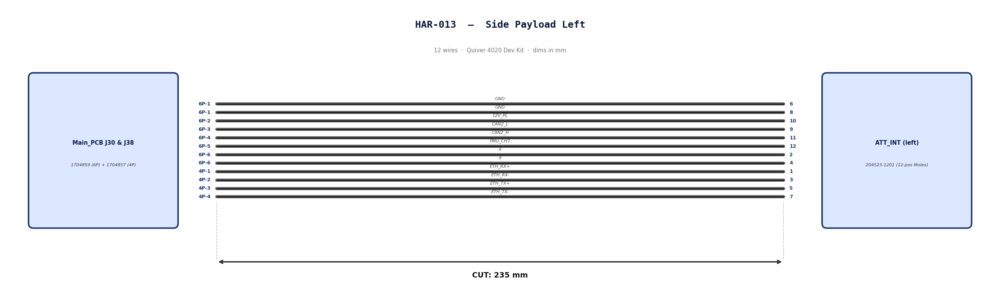

  </Step>

  <Step title="Bill of Materials (Kitting)">

*Gather these parts before starting the build.*

| Item Type | Part Number | Description / Spec | Qty Needed |
| :--- | :--- | :--- | :--- |
|  **Connector A**  | 1704859| 6-Pos Phoenix | 1 |
|  **Terminals A**  | Wire | Pre-crimped | 8|
|  **Connector B**  | 1704857| 4-Pos Phoenix | 1 |
|  **Terminals B**  | Wire | Pre-crimped | 4|
|  **Connector C**  | 204523-1201| 12-Pos Molex | 1 |
|  **Terminals C**  | Wire | Pre-crimped | 12|
|  **Wire**  | 26 AWG | Pre-Crimped Lead | 235mm |
|  **Sleeving**  | Optional| Mesh | xx mm|

  </Step>

  <Step title="Wire Prep (Cut &amp; Strip)">

*All wires connecting the payload to the PCBs will use pre-crimped jumper wires.*
**Mouser #: 538-79758-1149**

> **Build note:** Save the Molex-terminated cut ends/remnants from HAR-0012 and HAR-0013. These remnants are reused as the Molex tails for HAR-0014.

| Wire ID | Color | Gauge | Cut Length | Strip A  | Strip B  |
| :--- | :--- | :--- | :--- | :--- | :--- |
|  **W1**  | Black| 26 | 235mm | N/A| N/A|
|  **W2**  | Black| 26  | 235mm | N/A| N/A|
|  **W3**  | Black| 26  | 235mm | N/A| N/A|
|  **W4**  | Black| 26  | 235mm | N/A| N/A|
|  **W5**  | Black| 26  | 235mm  | N/A| N/A|
|  **W6**  | Black| 26  | 235mm | N/A| N/A|
|  **W7**  | Black| 26  | 235mm  | N/A| N/A|
|  **W8**  | Black| 26  | 235mm  | N/A| N/A|
|  **W9**  | Black| 26  | 235mm | N/A| N/A|
|  **W10**  | Black| 26  | 235mm | N/A| N/A|
|  **W11**  | Black| 26  | 235mm | N/A| N/A|
|  **W12**  | Black| 26  | 235mm  | N/A| N/A|

  </Step>

  <Step title="Termination &amp; Pinout Map">

*Connect End A or B to End C following this chart.*

| Wire ID | Color | From: 1704859| To: 204523-1201| Function / Signal |
| :--- | :--- | :--- | :--- | :--- |
|  **W1**  | Black|  **Pin 1**  | 6 | GND|
|  **W2**  | Black|  **Pin 1**  | 8 | GND|
|  **W3**  | Black|  **Pin 2**  | 10 | 12V_PL|
|  **W4**  | Black|  **Pin 3**  | 9| CAN2_L|
|  **W5**  | Black|  **Pin 4**  | 11 | CAN2_H|
|  **W6**  | Black|  **Pin 5**  | 12 | FMU_CH7|
|  **W7**  | Black |  **Pin 6**  | 2 | X|
|  **W8**  | Black |  **Pin 6**  | 4 | X|

| Wire ID | Color | From: 1704857| To: 204523-1201| Function / Signal |
| :--- | :--- | :--- | :--- | :--- |
|  **W9**  | Black|  **Pin 1**  | 1 | ETH_RX+|
|  **W10**  | Black|  **Pin 2**  | 3 | ETH_RX-|
|  **W11**  | Black|  **Pin 3**  | 5| ETH_TX+|
|  **W12**  | Black|  **Pin 4**  | 7 | ETH_TX-|

  </Step>

  <Step title="Assembly Instructions">

1.  **Populate A & B:** Insert contacts into Connector A housing. *Verify "Click" and perform pull-back test.*
2.  **Populate C:** Insert contacts into Connector B housing. Verify correct crimp orientation into [housing.](https://www.molex.com/content/dam/molex/molex-dot-com/products/automated/en-us/applicationspecificationspdf/505/505432/5054320000-AS-000.pdf)

  </Step>

</Steps>

## HAR-0014 Bottom Payload
| **FROM**    | **TO**  |
| -----------------| ------- |
| Main_PCB J31, J39|ATT_INT (bottom) |

<DemoImage src="Assembly-Guides/assets/images/Harnessing/HAR-014-reference.jpg" alt="Complete HAR-014 harness reference" caption="Complete HAR-014 bottom payload harness reference" />

<Steps>

  <Step title="Nailboard">

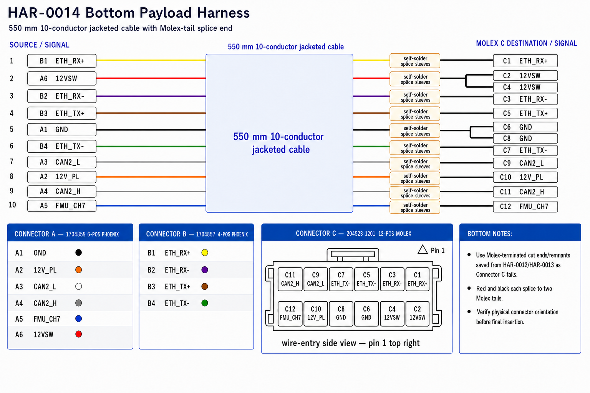

  </Step>

  <Step title="Bill of Materials (Kitting)">

*Gather these parts before starting the build.*

| Item Type | Part Number | Description / Spec | Qty Needed |
| :--- | :--- | :--- | :--- |
|  **Connector A**  | 1704859| 6-Pos Phoenix | 1 |
|  **Terminals A**  | 10-Conductor Cable | Twisted ends | 1 |
|  **Connector B**  | 1704857| 4-Pos Phoenix | 1 |
|  **Terminals B**  | 10-Conductor Cable | Twisted ends | 1 |
|  **Connector C**  | 204523-1201| 12-Pos Molex | 1 |
|  **Cable**  | [Amazon listing](https://www.amazon.com/dp/B0CSD52DL2) | 10-conductor, 26 AWG jacketed cable | 550mm |
|  **Molex tails**  | 538-79758-1149 | Molex-terminated cut ends/remnants saved from HAR-0012/HAR-0013 | 12 |

  </Step>

  <Step title="Wire Prep (Cut &amp; Strip)">

Build HAR-0014 from the 10-conductor jacketed cable and short Molex-terminated lead remnants. The jacketed cable end lands directly in the Phoenix connectors on the Main PCB side. The opposite end is spliced to the pre-crimped Molex tails for the bottom attachment interface.

1. Cut the 10-conductor cable to **550mm**.
2. Strip only enough outer jacket at each end to reach the connectors without stressing the conductors.
3. On the Phoenix end, strip each conductor to the Phoenix terminal requirement. No bare copper should be visible after insertion.
4. On the Molex end, prepare short pre-crimped Molex tails from the remnants created when cutting the side attachment harness leads.
5. Strip **5mm** from each cable conductor and each Molex tail to be spliced.
6. Slide one self-solder heat shrink sleeve onto each splice before joining conductors. For the red and black conductors, place both matching Molex tails into the same sleeve on the Molex side of the splice.

#### Splice procedure

1. Fan out the exposed strands slightly.
2. Push the two stripped ends together inline so the strands interlace. **Do not make a side-by-side pigtail splice.**
3. Twist the joined section lightly so it stays straight and compact.
4. Center the solder ring over the bare copper and position the adhesive rings over insulated wire.
5. Heat the solder ring first until it fully flows, then heat the sleeve ends to seal.
6. Let the splice cool before handling or pull-testing.

#### Final Check

- **Cable Length:** Confirm the jacketed cable was cut to **550mm**.
- **Splices:** Confirm each solder ring fully melted and no bare copper is visible outside the sleeve.
- **Phoenix End:** Confirm all conductors are fully seated and clamped in the Phoenix connectors.
- **Molex End:** Confirm all pre-crimped tails are fully seated in Connector C and pass a light pull test.

---

  </Step>

  <Step title="Termination &amp; Pinout Map">

*Connect the 10-conductor cable to the Phoenix connectors and splice it to the Molex tails following this chart.*

| Cable Color | From: 1704859 | To: 204523-1201 | Function / Signal |
| :--- | :--- | :--- | :--- |
| Black | **Pin 1** | 6 and 8 | GND |
| Orange | **Pin 2** | 10 | 12V_PL |
| White | **Pin 3** | 9 | CAN2_L |
| Gray | **Pin 4** | 11 | CAN2_H |
| Blue | **Pin 5** | 12 | FMU_CH7 |
| Red | **Pin 6** | 2 and 4 | 12VSW |

| Cable Color | From: 1704857 | To: 204523-1201 | Function / Signal |
| :--- | :--- | :--- | :--- |
| Yellow | **Pin 1** | 1 | ETH_RX+ |
| Purple | **Pin 2** | 3 | ETH_RX- |
| Brown | **Pin 3** | 5 | ETH_TX+ |
| Green | **Pin 4** | 7 | ETH_TX- |

> For the duplicated Molex positions, splice the single jacketed-cable conductor to both matching pre-crimped Molex tails in the same solder sleeve: Black to Molex pins 6 and 8, and Red to Molex pins 2 and 4.

  </Step>

  <Step title="Assembly Instructions">

1.  **Prep cable:** Cut the 10-conductor cable to 550mm, strip jacket/conductors, and prepare the Molex tails.
2.  **Splice Molex end:** Use self-solder heat shrink sleeves to connect the cable conductors to the Molex tails per the pinout map.
3.  **Populate Connector C:** Insert the Molex terminals into Connector C. Verify correct crimp orientation into the [housing.](https://www.molex.com/content/dam/molex/molex-dot-com/products/automated/en-us/applicationspecificationspdf/505/505432/5054320000-AS-000.pdf)
4.  **Populate Phoenix connectors:** Insert the bare conductor ends into Connector A and B. Verify the clamp captures the conductor and perform a light pull-back test.
5.  **Label:** Add identification markers as needed so the Phoenix conductors are easy to verify during vehicle integration.

  </Step>

</Steps>

## HAR-0015 Altimeter
| **FROM**     | **TO**   |
| ------------ | -------- |
| Main_PCB J8  | NRA15    |

<Steps>

  <Step title="Nailboard">

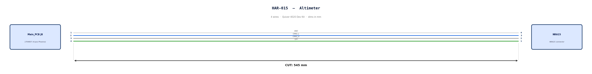

  </Step>

  <Step title="Bill of Materials (Kitting)">

*Gather these parts before starting the build.*

| Item Type       | Part Number | Description / Spec     | Qty Needed |
|:--------------- |:----------- |:---------------------- |:---------- |
| **Connector A** | 1704857     | 4-Pos Phoenix          | 1          |
| **Terminals A** | Wire        | Bare wire, twisted end | 4          |
| **Wire**        | Default     | Silicon                | 190mm      |
| **Sleeving**    | Optional    | Mesh                   | xx mm      |

  </Step>

  <Step title="Wire Prep (Cut &amp; Strip)">

*Prepare all wires before assembly.*

| Wire ID | Color | Gauge | Cut Length | Strip A  | Strip B  |
| :--- | :--- | :--- | :--- | :--- | :--- |
| **W1** | Default| Default | 190mm | 6mm  | N/A|
| **W2** | Default| Default | 190mm | 6mm | N/A|
| **W3** | Default| Default | 190mm | 6mm | N/A|
| **W4** | Default| Default | 190mm | 6mm | N/A|

  </Step>

  <Step title="Termination &amp; Pinout Map">

*Connect End A to End B following this chart.*

| Wire ID | Color | From: 1704857  | To: NRA 15| Function / Signal |
| :--- | :--- | :--- | :--- | :--- |
| **W1** | White | **Pin 1** | 4 | GND|
| **W2** | Blue | **Pin 2** | 3 | CAN2_L|
| **W3** | Gray | **Pin 3** | 2| CAN2_H|
| **W4** | Green | **Pin 4** | 1 | 12V|

  </Step>

  <Step title="Assembly Instructions">

1.  **Prep:** Cut wires to length and strip insulation per Section 3.
3.  **Crimp Side A:** Terminate Side A using [Tool Name/Die].
4.  **Populate A:** Insert contacts into Connector A housing. *Verify "Click" and perform pull-back test.*

  </Step>

</Steps>

## HAR-0016 360 LIDAR
| **FROM**     | **TO**   |
| ------------ | -------- |
| Main_PCB U5  | S2l      |

<Steps>

  <Step title="Nailboard">

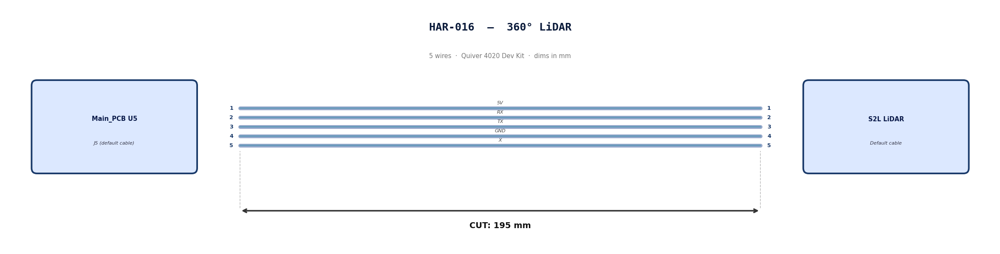

  </Step>

  <Step title="Bill of Materials (Kitting)">

Default cable that comes with 360° Lidar. No modification required

  </Step>

  <Step title="Wire Prep (Cut &amp; Strip)">

*Use the default cable supplied with the 360° LiDAR module.*

| Cable | Required Length (mm) |
| :--- | :--- |
| Default LiDAR cable | 195 |

  </Step>

  <Step title="Termination &amp; Pinout Map">

*Connect End A to End B following this chart.*

| Wire ID | Color | From: J5| To: NRA 15| Function / Signal |
| :--- | :--- | :--- | :--- | :--- |
| **W1** | Default| **Pin 1** | 1| 5V|
| **W2** | Default| **Pin 2** | 2| RX|
| **W3** | Default| **Pin 3** | 3| TX|
| **W4** | Default| **Pin 4** | 4| GND|
| **W4** | Default| **Pin 5** | 5| X|

  </Step>

  <Step title="Assembly Instructions">

N/A

  </Step>

</Steps>

## HAR-0017 Front Radar
| **FROM**     | **TO**      |
| ------------ | ----------- |
| Main_PCB J49 | Front Radar |

<Steps>

  <Step title="Nailboard">

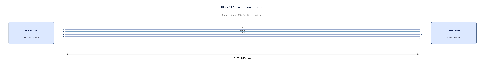

  </Step>

  <Step title="Bill of Materials (Kitting)">

*Gather these parts before starting the build.*

| Item Type | Part Number | Description / Spec | Qty Needed |
| :--- | :--- | :--- | :--- |
| **Connector A** | 1704857 | 4-Pos Phoenix | 1 |
| **Terminals A** | Wire | Bare wire, twisted end | 4 |
| **Wire** | Default | Silicon | 190mm |
| **Sleeving** | Optional| Mesh | xx mm|

  </Step>

  <Step title="Wire Prep (Cut &amp; Strip)">

*Prepare all wires before assembly.*

| Wire ID | Color | Gauge | Cut Length | Strip A  | Strip B  |
| :--- | :--- | :--- | :--- | :--- | :--- |
| **W1** | Default| Default | 485 mm | 6mm  | N/A|
| **W2** | Default| Default | 485 mm | 6mm | N/A|
| **W3** | Default| Default | 485 mm | 6mm | N/A|
| **W4** | Default| Default | 485 mm | 6mm | N/A|

  </Step>

  <Step title="Termination &amp; Pinout Map">

*Connect End A to End B following this chart.*

| Wire ID | Color | From: 1704857  | To: NRA 15| Function / Signal |
| :--- | :--- | :--- | :--- | :--- |
| **W1** | Default| **Pin 1** | 4 | GND|
| **W2** | Default| **Pin 2** | 3 | CAN1_L|
| **W3** | Default| **Pin 3** | 2| CAN1_H|
| **W4** | Default| **Pin 4** | 1 | 12V|

  </Step>

  <Step title="Assembly Instructions">

1.  **Prep:** Cut wires to length and strip insulation per Section 3.
4.  **Populate A:** Insert contacts into Connector A housing. *Verify "Click" and perform pull-back test.*

  </Step>

</Steps>

## HAR-0018 HM30 Power
| **FROM**    | **TO**  |
| ------------| ------- |
| Main_PCB J14|HM30 PWR |

<Steps>

  <Step title="Nailboard">

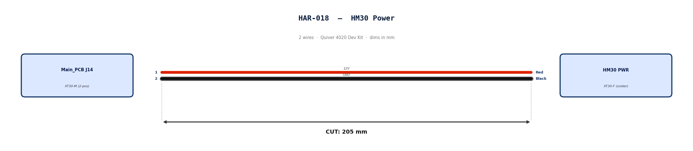

  </Step>

  <Step title="Bill of Materials (Kitting)">

*Gather these parts before starting the build.*

| Item Type | Part Number | Description / Spec | Qty Needed |
| :--- | :--- | :--- | :--- |
| **Connector A** | XT30-M| 2-Pos XT-30| 1 |
| **Terminals A** | Wire | Solder | 2|
| **Wire** | 16 AWG | Silicon | 170mm |
| **Sleeving** | Optional| Mesh|  xx mm|

  </Step>

  <Step title="Wire Prep (Cut &amp; Strip)">

*Prepare all wires before assembly.*

| Wire ID | Color | Gauge | Cut Length | Strip A  | Strip B  |
|:------- |:----- |:--------- |:--------------- |:------------ |
| **W1**  | Red   | **Pin 1** | 185             | 10           |
| **W2**  | Black | **Pin 2** | 185             | 10           |

  </Step>

  <Step title="Termination &amp; Pinout Map">

*Connect End A to End B following this chart.*

| Wire ID | Color | From: 1704857  | To: Spade | Function / Signal |
| :--- | :--- | :--- | :--- | :--- |
| **W1** | Red | **Pin 1** | 1 | 12V |
| **W2** | Red | **Pin 2** | 2 | GND |

  </Step>

  <Step title="Assembly Instructions">

1.  **Prep:** Cut wires to length and strip insulation per Section 3.
3.  **Solder Side A:** Solder cables into housing.

  </Step>

</Steps>

## HAR-0019 -> HAR-0020 HM30 Signal
| **FROM**    | **TO**  |
| ------------| ------- |
| Main_PCB J15|HM30 UART |
| Main_PCB J17|HM30 SBUS |

<Steps>

  <Step title="Nailboard">

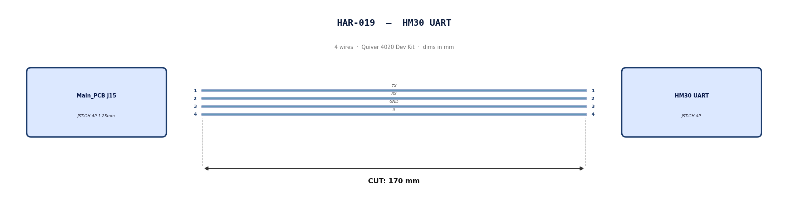

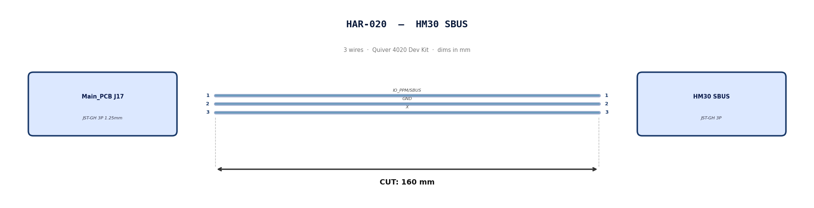

  </Step>

  <Step title="Bill of Materials (Kitting)">

*Gather these parts before starting the build.*

| Item Type | Part Number | Description / Spec | Qty Needed |
| :--- | :--- | :--- | :--- |
|**4 Pin JST Cable** | N/A| JST, GH Connector Housing, 1.25mm Pitch, 4 Way| 1 |
|**3 Pin JST Cable** | N/A| JST, GH Connector Housing, 1.25mm Pitch, 3 Way| 1 |
| **Sleeving** | Optional| Mesh|  xx mm|

  </Step>

  <Step title="Wire Prep (Cut &amp; Strip)">

*Prepare all wires before assembly.*

Pre-made JST-GH cables. No crimping required — source cables at the required lengths below.

| Harness | Connector | Required Length (mm) |
| :--- | :--- | :--- |
| HAR-019 (HM30 UART) | JST-GH 4P | 170 |
| HAR-020 (HM30 SBUS) | JST-GH 3P | 160 |

  </Step>

  <Step title="Termination &amp; Pinout Map">

*Connect End A to End B following this chart.*

| Wire ID | Color | From: J15| To: HM30 UART| Function / Signal |
| :--- | :--- | :--- | :--- | :--- |
| **W1** | Default| **Pin 1** | 1| TX|
| **W2** | Default| **Pin 2** | 2| RX|
| **W1** | Default| **Pin 1** | 3| GND|
| **W2** | Default| **Pin 2** | 4| X|

| Wire ID | Color | From: J17| To: HM30 SBUS| Function / Signal |
| :--- | :--- | :--- | :--- | :--- |
| **W1** | Default| **Pin 1** | 1| IO_PPM_INPUT_AND_SBUS_INPUT|
| **W2** | Default| **Pin 2** | 2| GND|
| **W1** | Default| **Pin 1** | 3| x|

  </Step>

  <Step title="Assembly Instructions">

N/A

  </Step>

</Steps>

## HAR-0021 -> HAR-0022 Navigation
| **FROM**    | **TO**  |
| ------------| ------- |
| Main_PCB J7|F9P |
| Main_PCB J9|Mateksys |

<Steps>

  <Step title="Nailboard">

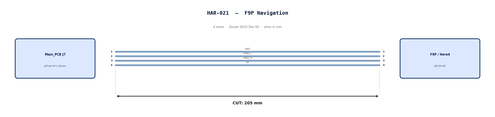

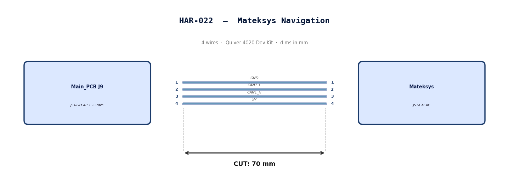

  </Step>

  <Step title="Bill of Materials (Kitting)">

*Gather these parts before starting the build.*

| Item Type | Part Number | Description / Spec | Qty Needed |
| :--- | :--- | :--- | :--- |
|**4 Pin JST Cable** | N/A| JST, GH Connector Housing, 1.25mm Pitch, 4 Way| 2 |
| **Sleeving** | Optional| Mesh|  xx mm|

  </Step>

  <Step title="Wire Prep (Cut &amp; Strip)">

*Prepare all wires before assembly.*

Pre-made JST-GH cables. No crimping required — source cables at the required lengths below.

| Harness | Connector | Required Length  |
| :--- | :--- | :--- |
| HAR-021 (F9P / Here4) | JST-GH 4P | 205mm |
| HAR-022 (Mateksys)    | JST-GH 4P | 70mm  |

  </Step>

  <Step title="Termination &amp; Pinout Map">

*Connect End A to End B following this chart.*

| Wire ID | Color | From: J9| To: M9N| Function / Signal |
| :--- | :--- | :--- | :--- | :--- |
| **W1** | Default| **Pin 1** | 1| GND|
| **W2** | Default| **Pin 2** | 2| CAN1_L|
| **W3** | Default| **Pin 1** | 3| CAN1_H|
| **W4** | Default| **Pin 2** | 4| 5V|

| Wire ID | Color | From: J7| To: F9P| Function / Signal |
| :--- | :--- | :--- | :--- | :--- |
| **W1** | Default| **Pin 1** | 1| GND|
| **W2** | Default| **Pin 2** | 2| CAN1_L|
| **W3** | Default| **Pin 1** | 3| CAN1_H|
| **W4** | Default| **Pin 2** | 4| 5V|

  </Step>

  <Step title="Assembly Instructions">

N/A

  </Step>

</Steps>

## HAR-0023 -> HAR-0025 PPP2ETH
| **FROM**     | **TO**  |
| ------------ | ------- |
| Main_PCB J35 | PPP2ETH |
| Main_PCB J36 | PPP2ETH |
| Main_PCB J41 | PPP2ETH |

<Steps>

  <Step title="Nailboard">

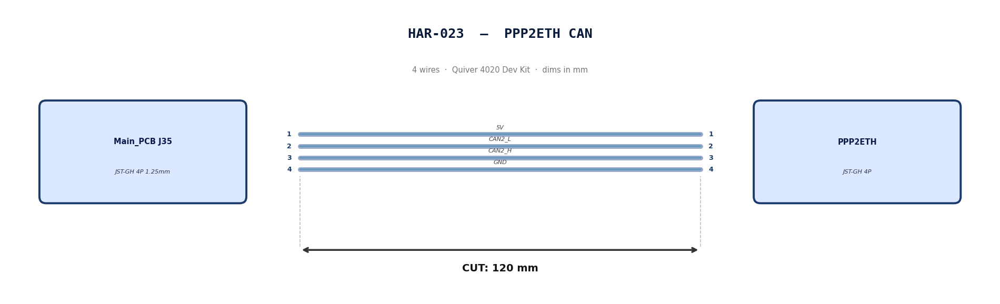

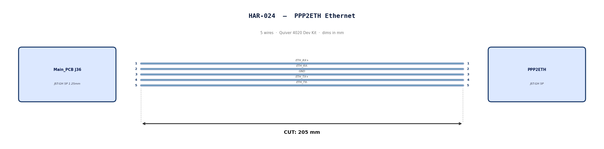

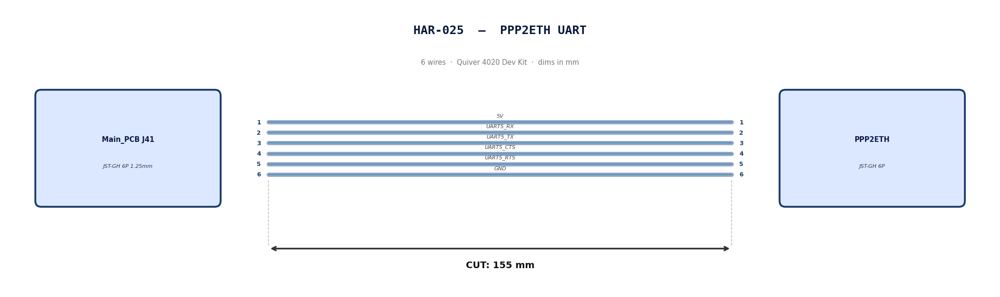

  </Step>

  <Step title="Bill of Materials (Kitting)">

*Gather these parts before starting the build.*

| Item Type | Part Number | Description / Spec | Qty Needed |
| :--- | :--- | :--- | :--- |
|**4 Pin JST Cable** | N/A| JST, GH Connector Housing, 1.25mm Pitch, 4 Way| 1 |
|**5 Pin JST Cable** | N/A| JST, GH Connector Housing, 1.25mm Pitch, 5 Way| 1 |
|**6 Pin JST Cable** | N/A| JST, GH Connector Housing, 1.25mm Pitch, 6 Way| 1 |
| **Sleeving** | Optional| Mesh|  xx mm|

  </Step>

  <Step title="Wire Prep (Cut &amp; Strip)">

*Prepare all wires before assembly.*

Pre-made JST-GH cables. No crimping required — source cables at the required lengths below.

| Harness | Connector | Required Length  |
| :--- | :--- | :--- |
| HAR-023 (PPP2ETH CAN)      | JST-GH 4P | 120mm |
| HAR-024 (PPP2ETH Ethernet) | JST-GH 5P | 205mm |
| HAR-025 (PPP2ETH UART)     | JST-GH 6P | 155mm |

  </Step>

  <Step title="Termination &amp; Pinout Map">

*Connect End A to End B following this chart.*

| Wire ID | Color | From: J35| To: PPP2ETH| Function / Signal |
| :--- | :--- | :--- | :--- | :--- |
| **W1** | Default| **Pin 1** | 1| 5V|
| **W2** | Default| **Pin 2** | 2| CAN2_L|
| **W3** | Default| **Pin 3** | 3| CAN2_H|
| **W4** | Default| **Pin 4** | 4| GND|

| Wire ID | Color | From: J7| To: PPP2ETH| Function / Signal |
| :--- | :--- | :--- | :--- | :--- |
| **W1** | Default| **Pin 1** | 1| ETH_RX+|
| **W2** | Default| **Pin 2** | 2| ETH_RX-|
| **W3** | Default| **Pin 3** | 3| GND|
| **W4** | Default| **Pin 4** | 4| ETH_TX+|
| **W5** | Default| **Pin 5** | 5| ETH_TX-|

| Wire ID | Color | From: J7| To: PPP2ETH| Function / Signal |
| :--- | :--- | :--- | :--- | :--- |
| **W1** | Default| **Pin 1** | 1| 5V|
| **W2** | Default| **Pin 2** | 2| UART5_RX_TEL2|
| **W3** | Default| **Pin 3** | 3| UART5_TX_TEL2|
| **W4** | Default| **Pin 4** | 4| UART5_CTS_TEL2|
| **W5** | Default| **Pin 5** | 5| UART5_RTS_TEL2|
| **W6** | Default| **Pin 6** | 6| GND|

  </Step>

  <Step title="Assembly Instructions">

N/A

  </Step>

</Steps>

## HAR-0026 Remote ID

| **FROM**    | **TO**  |
| ------------| ------- |
| Main_PCB J20|Remote ID CAN |

<Steps>

  <Step title="Nailboard">

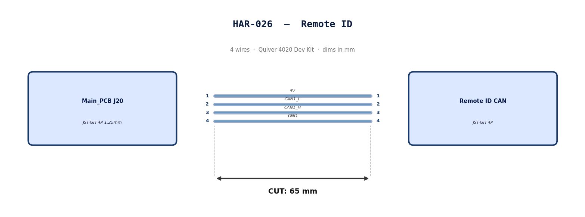

  </Step>

  <Step title="Bill of Materials (Kitting)">

*Gather these parts before starting the build.*

| Item Type | Part Number | Description / Spec | Qty Needed |
| :--- | :--- | :--- | :--- |
|**4 Pin JST Cable** | N/A| JST, GH Connector Housing, 1.25mm Pitch, 4 Way| 1 |
| **Sleeving** | Optional| Mesh|  xx mm|

  </Step>

  <Step title="Wire Prep (Cut &amp; Strip)">

*Prepare all wires before assembly.*

Pre-made JST-GH cable. No crimping required — source cable at the required length below.

| Harness | Connector | Required Length  |
| :--- | :--- | :--- |
| HAR-026 (Remote ID) | JST-GH 4P | 65mm |

  </Step>

  <Step title="Termination &amp; Pinout Map">

*Connect End A to End B following this chart.*

| Wire ID | Color | From: J20| To: RID| Function / Signal |
| :--- | :--- | :--- | :--- | :--- |
| **W1** | Default| **Pin 1** | 1| 5V|
| **W2** | Default| **Pin 2** | 2| CAN1_L|
| **W3** | Default| **Pin 3** | 3| CAN1_H|
| **W4** | Default| **Pin 4** | 4| GND|

  </Step>

  <Step title="Assembly Instructions">

N/A

  </Step>

</Steps>

## HAR-0027 SIYI Camera
| **FROM**    | **TO**  |
| ------------| ------- |
| HM30 LAN & PWR|A8 PWR |
| HM30 LAN & PWR|A8 Video & Protocol |

<Steps>

  <Step title="Nailboard">

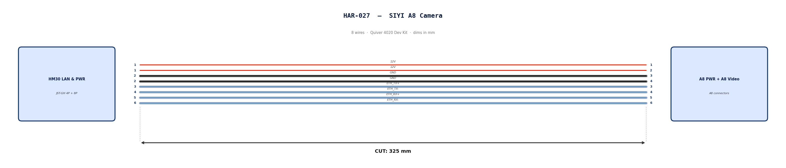

  </Step>

  <Step title="Bill of Materials (Kitting)">

*Gather these parts before starting the build.*

| Item Type | Part Number | Description / Spec | Qty Needed |
| :--- | :--- | :--- | :--- |
|**4 Pin JST Cable** | N/A| JST, GH Connector Housing, 1.25mm Pitch, 4 Way| 1 |
|**8 Pin JST Cable** | N/A| JST, GH Connector Housing, 1.25mm Pitch, 6 Way| 1 |
| **Sleeving** | Optional| Mesh|  xx mm|

  </Step>

  <Step title="Wire Prep (Cut &amp; Strip)">

*Prepare all wires before assembly.*

Pre-made JST-GH cables. No crimping required — source cables at the required lengths below.

| Harness | Connector | Required Length  |
| :--- | :--- | :--- |
| HAR-027 power (4P) | JST-GH 4P | 325mm |
| HAR-027 video (8P) | JST-GH 8P | 325mm |

  </Step>

  <Step title="Termination &amp; Pinout Map">

*Connect End A to End B following this chart.*

| Wire ID | Color | From: HM30 LAN & PWR| To: A8 PWR| Function / Signal |
| :--- | :--- | :--- | :--- | :--- |
| **W1** | Default| **Pin 1** | 1| 12V|
| **W2** | Default| **Pin 1** | 2| 12V|
| **W3** | Default| **Pin 2** | 3| GND|
| **W4** | Default| **Pin 2** | 4| GND|

  

| Wire ID | Color | From: HM30 LAN & PWR| To: A8 Vid| Function / Signal |
| :--- | :--- | :--- | :--- | :--- |
| **W1** | Default| **Pin 3** | 3| ETH_TX+|
| **W2** | Default| **Pin 4** | 4| ETH_TX-|
| **W3** | Default| **Pin 5** | 5| ETH_RX+|
| **W4** | Default| **Pin 6** | 6| ETH_RX-|

  </Step>

  <Step title="Assembly Instructions">

N/A

  </Step>

</Steps>

## HAR-0028 Antenna
| **FROM**    | **TO**  |
| ------------| ------- |
| Antenna 1|HM30 |
| Antenna 2|HM30 |

<Steps>

  <Step title="Nailboard">

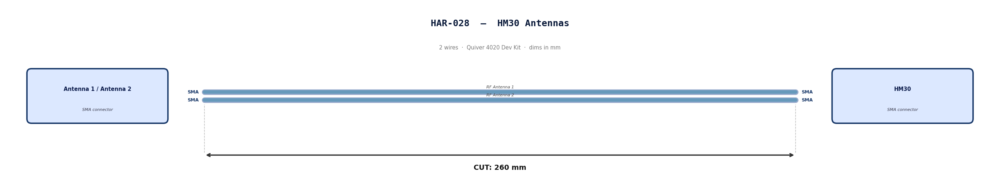

  </Step>

  <Step title="Bill of Materials (Kitting)">

*Gather these parts before starting the build.*

Pre made cables with SMA connector. Length adjustment not required.

  </Step>

  <Step title="Wire Prep (Cut &amp; Strip)">

N/A

  </Step>

  <Step title="Termination &amp; Pinout Map">

N/A

  </Step>

  <Step title="Assembly Instructions">

N/A

  </Step>

</Steps>

