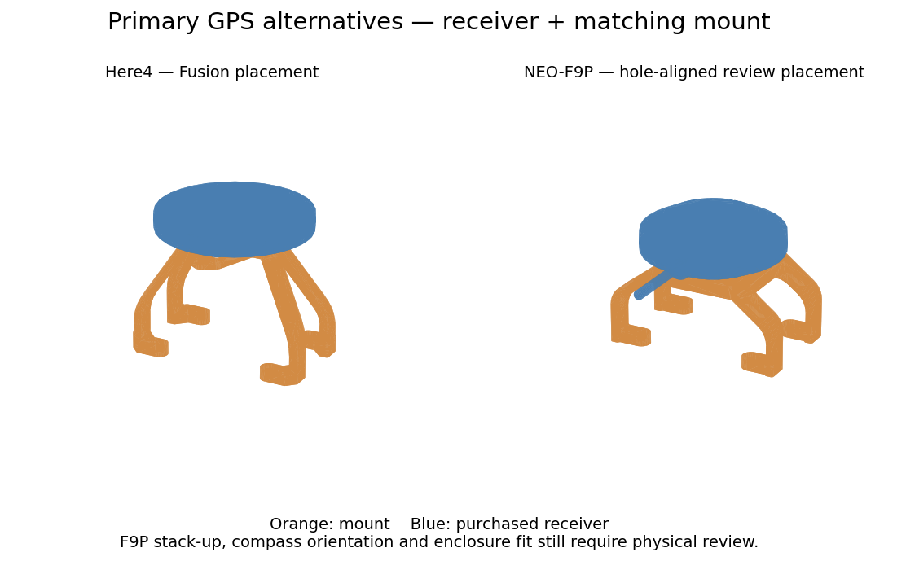

# Primary GPS options — draft review

Quiver uses **one** of these primary GPS receivers. Neither option changes the
Mateksys backup GPS. Wren Mini is retired; its CAD asset and clamp 2332 are removed
from the active assembly and BOM.

| Primary receiver | Mount | CAD selection |
| --- | --- | --- |
| CubePilot Here4 | 2333, from the Fusion v148 master | `--gps here4` (default) |
| Holybro H-RTK NEO-F9P Rover, RM3100 compass, **DroneCAN 4-Pin**, SKU **12072** | Existing 2331 F9P v6 base | `--gps holybro-f9p` |

The Holybro choice is specifically
[product variant 44639194644669](https://holybro.com/products/h-rtk-neo-f9p-rover-rm3100-compass?variant=44639194644669),
not a UART version, ZED-F9P rover, or bare NEO-F9P module. Here4 being the CAD
default reflects the inspected Fusion master, not a preference between the two
supported hardware choices.



## Source geometry and placement

- Here4 is reconstructed from five visible leaf STEP exports and their recorded
  world transforms in `Quiver_PT3_Drone_Assembly` v148 (Here4 linked revision v2).
  Its matching mount is exported from the same master. No guessed offsets are
  added to either world-positioned asset.
- The F9P receiver is the unmodified `H-RTK NEO-F9P Rover Case.stp` supplied on
  [Holybro's NEO-F9P downloads page](https://docs.holybro.com/gps-and-rtk-system/h-rtk-neo-f9p-series-rm3100-compass/downloads).
  It includes internal/reference geometry and a cable segment; it is a purchased
  part, not something to print or use to estimate mass.
- Mount 2331 is preserved byte-for-byte. Its STEP product identifies it as
  `2341-GNSSMount_F9P v6 v1`, also present in the Fusion cloud catalog.
- F9P placement is **derived from mating geometry**, not a newly measured Fusion
  F9P assembly occurrence: rotate the vendor model +90° about X, then translate
  by `(0, -3.125, 79.65)` mm. The case bottom seats on the retained mount's top
  face at Z = 69.65 mm. The three screw axes agree at `(0, 9.375)` and
  `(±10.825, -9.375)` mm in the assembly XY plane. Tests check this interface.
  The existing base's −11.95 mm Z correction is retained pending stack-up review.
- The old clamp 2332 is not part of the F9P screw-mounted interface or the Here4
  mount. Historical geometry remains available in Git history.

See [the provenance manifest](../../src/quiver/gps-provenance.json) for source
identities, transforms, and SHA-256 hashes. The variant selection flows through
both supporting structure and equipment, so a receiver cannot silently retain
the other option's mount.

## Build and review

```bash
PYTHONPATH=src python -m quiver.assembly --gps here4 -o /tmp/quiver-here4.step
PYTHONPATH=src python -m quiver.assembly --gps holybro-f9p -o /tmp/quiver-f9p.step
PYTHONPATH=src python -m pytest src/tests/ -q
PYTHONPATH=src python -m quiver.bom render --check
```

The BOM lists both **alternative** mount entries for traceability. Select only
2331 for Holybro or 2333 for Here4; do not print or purchase both sets for one
aircraft. Receiver 3250 remains quantity one. Its existing cost is a Here4 planning
allowance, not a current price quote for both options.

### Before manufacturing release

- Confirm F9P base-to-PCB stack-up, cable routing, forward-arrow orientation,
  compass orientation/configuration, and enclosure clearance on the actual build.
  Matching screw axes and seating surfaces are not a full aircraft fit check.
- Review Here4 fastening and produce a validated print mesh for mount 2333; this
  draft adds its STEP source, not a qualified manufacturing STL.
- The current assembly-guide photos and fastener instructions describe the F9P
  installation. Do not apply them to Here4 unchanged. Review variant-specific
  fasteners and instructions before release; this draft does not invent quantities.
- This is a CAD/BOM change, not a flight-controller configuration or flight test.
