# **Project Quiver PT3 Structural Assembly Guide**

## BOM for the Assembly

### Table 1. Structure parts

|	Part ID 	|	Part Name	|	 CAD ID  	|	 Material 	|	 Sourcing 	|	 Quantity 
|	 -------- 	|	 ------------------------------------------------------------------------------------------------------------------- 	|	 -------- 	|	 -------- 	|	 -------- 	|	 -------- 
|	1	|	 Upper plate                                                                                        	|	1101	|	Aluminum	|	Laser Cut	|	1
|	2	|	 Middle plate                                                                                     	|	1102	|	Aluminum	|	Laser Cut	|	1
|	3	|	 Lower plate                                                                                	|	1103	|	Aluminum	|	Laser Cut	|	1
|	4	|	 Cockpit Support Beam CW Long                                           	|	1211	|	Aluminum	|	Laser Cut	|	1
|	5	|	 Cockpit Support Beam CCW Back	|	1212	|	Aluminum	|	Laser Cut	|	1
|	6	|	 Cockpit Support Beam CCW Front	|	1213	|	Aluminum	|	Laser Cut	|	1
|	7	|	Battery Wall Left                                               	|	1221	|	Aluminum	|	Laser Cut	|	1
|	8	|	Battery Wall Right                                               	|	1222	|	Aluminum	|	Laser Cut	|	1
|	9	|	 Foldable Motor Arm Connectors	|	14X1	|	Aluminum	|	Off-the-Shelf	|	4
|	10	|	Motor Arm Tubes	|	14X2	|	Carbon-Fiber	|	Cut-to-Length	|	4
|	11	|	Landing Gear Vertical Tubes	|	1310	|	Carbon-Fiber	|	Cut-to-Length	|	4
|	12	|	Landing Gear Horizontal Tubes	|	1320	|	Carbon-Fiber	|	Cut-to-Length	|	2
|	13	|	Landing Gear Main Adapters	|	1330	|	Aluminum	|	Off-the-Shelf	|	4
|	14	|	Enclosure Hinge	|	2430	|	Zinc	|	Off-the-Shelf	|	2
|	15	|	 Landing Gear Tube Joints                                    	|	1340	|	PETG-CF	|	3D Print	|	4
|	16	|	 Battery sliders                                                                                                     	|	2200	|	PETG-CF	|	3D Print	|	2
|	17	|	BC PCB Cover	|	2313	|	PETG-CF	|	3D Print	|	1
|	18	|	Altitude Sensor Mount	|	2330	|	PETG-CF	|	3D Print	|	1
|	19	|	Enclosure Anchors	|	2420	|	PETG-CF	|	3D Print	|	4
|	20	|	Camera Mount	|	2320	|	PETG-CF	|	3D Print	|	1
|	21	|	Attachment Interface Spacer Left	|	2121	|	PETG-CF	|	3D Print	|	1
|	22	|	Attachment Interface Spacer Right	|	2111	|	PETG-CF	|	3D Print	|	1
|	23	|	Attachment Interface Spacer Bottom	|	2131	|	PETG-CF	|	3D Print	|	1
|	24	|	GNSS Mount Base	|	2341	|	PETG	|	3D Print	|	1
|	25	|	GNSS Mount Clamp	|	2342	|	PETG	|	3D Print	|	1
|	26	|	Main PCB Mount	|	2311	|	PETG	|	3D Print	|	1
|	27	|	Main Enclosure	|	2411	|	PETG	|	3D Print	|	1
|	28	|	Enclosure Top Cap	|	2412	|	PETG	|	3D Print	|	1
|	29	|	Enclosure Cap Clips	|	2440	|	PETG	|	3D Print	|	4
|	30	|	BC PCB Mount	|	2312	|	PETG	|	3D Print	|	1
|	31	|	Attachment Interfaces	|	2122	|	Aluminum	|	Off-the-Shelf	|	3

### Table 2. Fasteners
|	Fastener ID	|	Fastener Description	|	Quantity	|	McMaster-Carr Reference	|
|	--	|	--	|	--	|	--	|
|	 Rivet 1	|	4mm Diameter for 1 mm - 2.5 mm thickness	|	18	|	[97525A251](https://www.mcmaster.com/97525A224/)	|
|	 Rivet 2	|	4mm Diameter for 2.5 mm - 4.5 mm thickness	|	18	|	[97525A251](https://www.mcmaster.com/97525A251)	|
|	 Rivet 3	|	4mm Diameter for 4.5 mm - 6.4 mm thickness	|	10	|	[97525A226](https://www.mcmaster.com/97525A226)	|
|	Screw 1	|	Socket Head Screw M3x10	|	48	|	[91290A115](https://www.mcmaster.com/91292A113)	|
|	 Screw 2	|	Flanged Button Head Screw M4x10	|	16	|	[97654A373](https://www.mcmaster.com/92095A190)	|
|	 Screw 3	|	Socket Head Screw M3x16               	|	24	|	[91292A115](https://www.mcmaster.com/91292A115)	|
|	Screw 4	|	Socket Head Screw M3x12	|	12	|	[91290A117](https://www.mcmaster.com/91292A114)	|
|	Screw 5	|	Socket Head Screw M3x8	|	23	|	[91290A113](https://www.mcmaster.com/91292A112)	|
|	Screw 6	|	Socket Head Screw M3x40	|	16	|	[91290A136](https://www.mcmaster.com/91292A024)	|
|	Screw 7	|	Hex Drive Flat Head Screw M3x8	|	8	|	[92125A128](https://www.mcmaster.com/92125A128/)	|
|	Screw 8	|	Hex Drive Flat Head Screw M3x10	|	4	|	[91294A130](https://www.mcmaster.com/92125A130/)	|
|	Screw 9	|	Socket Head Screw M4x8	|	8	|	[91290A140](https://www.mcmaster.com/91292A108)	|
|	Screw 10	|	Hex Drive Flat Head Screw M3x25	|	3	|	[91294A138](https://www.mcmaster.com/92125A138/)	|
| Screw 11  | Flanged Button Head Hex-Drive Screw M3x6   | 5 | [97654A674](https://www.mcmaster.com/products/97654a674/) |
|	Insert 1	|	M3 Threaded Inserts - 6.4 mm	|	42	|	[97163A161](https://www.mcmaster.com/97163A161)	|
|	Insert 2	|	M4 Threaded Inserts	|	8	|	[97163A153](https://www.mcmaster.com/97163A153)	|
|	Insert 3	|	M2.5 Threaded Inserts	|	8	|	[97163A153](https://www.mcmaster.com/97163A153)	|
| Insert 4  | M3 Threaded Inserts - 3.8 mm | 16 | [94180A331](https://www.mcmaster.com/94180A331)
|	Washer 1	|	General Purpose Washer 3.2 mm ID, 6 mm OD	|	158	|	[98689A112](https://www.mcmaster.com/98689A112)	|
|	 Washer 2	|	General Purpose Washer 4.3 mm ID, 9 mm OD	|	8	|	[93475A230](https://www.mcmaster.com/93475A230)	|
|	 Nut 1	|	Nylon-Insert Locknut M3	|	39	|	[90576A811](https://www.mcmaster.com/90576A811)	|
| Vibration Mount | Stretchy Soft M3 Rubber Anti-Vibration Spacer | 5 | [Amazon](https://www.amazon.com/iRCMATRC-Stretchy-Anti-Vibration-Controllers-Accessories/dp/B09KCGKX1F?th=1) | 

-------

## Preparation

### 1111, 1112 & 1113 - Rack Plates
- All three are aluminum 6 series sheets, laser cut, sanded. 
- Bounding box dimension is 300x300 mm for each.
- Qty: 1 each.
- Reference supplier: [Rapiddirect](https://www.rapiddirect.com/)

| | 1111 (Upper Plate) | 1112 (Mid Plate) | 1113 (Lower Plate)|
|--|--|--|--|
|Thickness| 1 mm| 1 mm| 4 mm|
| Image| 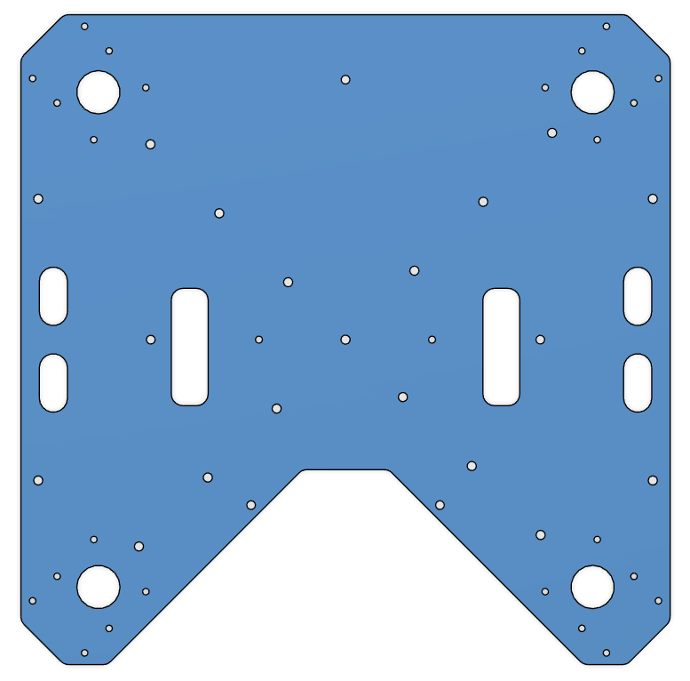 | 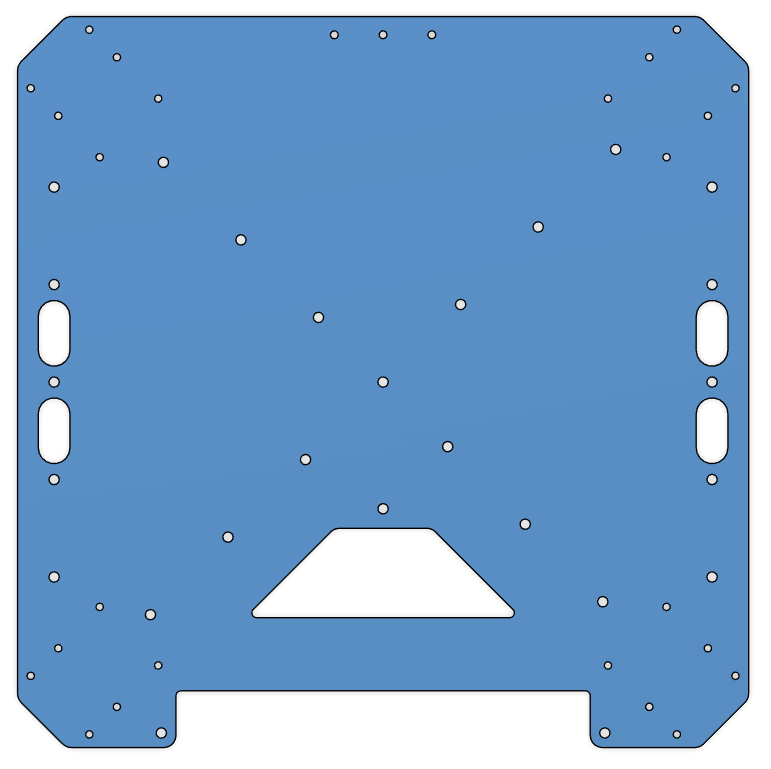 |  |  
| CAD File|[1111](assets/models/1111.step)| [1112](assets/models/1112.step)| [1113](assets/models/1113.step)|
---
### 1211, 1212 & 1213 - Cockpit Support Beams
- All three are aluminum 6 series, 40x40x1 mm square tubes, laser cut, sanded.
- Part 1211; Qty: 1.
- Parts 1212 and 1213 are identical; Qty: 2.
- Reference supplier: [Rapiddirect](https://www.rapiddirect.com/)

| | 1211 (Cockpit Support Beam CW Long) | 1212 & 1213 (Cockpit Support Beam CCW Back & Front) |
|--|--|--|
|Length|289.2 mm|124.2 mm|
| Image|  | 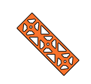 |
| CAD File|[1211](assets/models/1211.step)| [1212 & 1213](assets/models/1212_1213.step)|
---
### 1221 & 1222 - Battery Walls
- Both are aluminum 6 series, 1000x30x2 mm rectangular tubes, laser cut, sanded.
- Length is 300 mm for each.
- Parts are identical; Qty: 2.
- Reference supplier: [Rapiddirect](https://www.rapiddirect.com/)

| | 1221 & 1222 (Battery Wall Left & Right) |
|--|--|
| Image|  |
| CAD File|[1221 & 1222](assets/models/1221_1222.step)|
---
### 1311, 1312, 1313 & 1314 - Landing Gear Vertical Tubes
- Carbon-fiber tubes, 30 mm diameter, 2 mm thickness.
- Length is 400 mm for each.
- Parts are identical; Qty: 4.
  - Note: Order parts pre-cut to the specified length if available; otherwise, cut to length.
---
### 1321 & 1322 - Landing Gear Horizontal Tubes
- Carbon-fiber tubes, 30 mm diameter, 2 mm thickness.
- Length is 500 mm for each.
- Parts are identical; Qty: 4.
  - Note: Order parts pre-cut to the specified length if available; otherwise, cut to length.
---
### 1331, 1332, 1333 & 1334 - Landing Gear Main Adapters
- Custom detachable version for 30 mm tube diameter.
- Contact RJXHobby for the customization.
  - Request 30 mm diameter variant of [this product](https://www.rjxhobby.com/rjx-1pcs-20mm-quick-release-tripod-aluminum-tilt-fixed-seat-landing-gear-connector-1) with bolt pattern of 30 mm version of [this one](https://www.rjxhobby.com/rjxhobby-1pcs-20mm-25mm-30mm-landing-gear-vertical-mount-base-nozzle-connecting-rod-fixing-parts-for-rc-plant-agriculture-uav-drone).
- Parts are identical; Qty: 4.
- **Note:** If detachable landing gear is not favored, you may use 30 mm version of [this product](https://www.rjxhobby.com/rjxhobby-1pcs-20mm-25mm-30mm-landing-gear-vertical-mount-base-nozzle-connecting-rod-fixing-parts-for-rc-plant-agriculture-uav-drone).

| 1331, 1332, 1333 & 1334 (Landing Gear Main Adapter) |
|--|
|  |
---
### 1341, 1342, 1343 & 1344 - Landing Gear Tube Joints
- 3D printed.
- PETG-CF.
- Use 6 wall loops.
- Parts are identical; Qty: 4.

| | 1341, 1342, 1343 & 1344  (Landing Gear Tube Joint) |
|--|--|
| Image|  |
| CAD File|[1221 & 1222](assets/models/134X.step)|
---
### 1351, 1352, 1353 & 1354 - Landing Gear Foam Wraps.
- Pipe insulation foam, 28 mm inner diameter, 46 mm outer diameter.
- Length is 67 mm each.
- Parts are identical; Qty: 4.
- Cut from stock material to length.
- Product Link: [Link](https://a.co/d/06ePWuUq)

| 1351, 1352, 1353 & 1354 (Landing Gear Foam Wrap) |
|--|
| 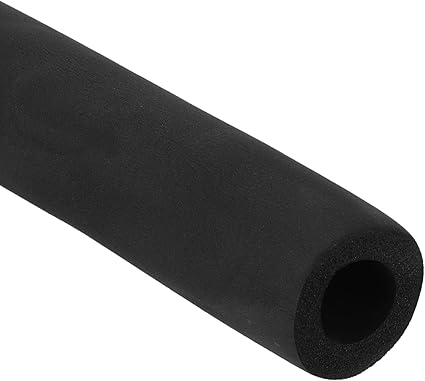 |
---
### 1411, 1421, 1431 & 1441 - Motor Arm Foldable Connectors
- 30 mm tube diameter version.
- Parts are identical; Qty: 4.
- Product Link: [Link](https://www.alibaba.com/product-detail/30-40mm-Folding-arm-tube-Drone_1600762096177.html?spm=a2756.order-detail-ta-bn-b.0.0.78e1f19cegXkOZ)

| 1411, 1421, 1431 & 1441 (Motor Arm Foldable Connectors) |
|--|
| 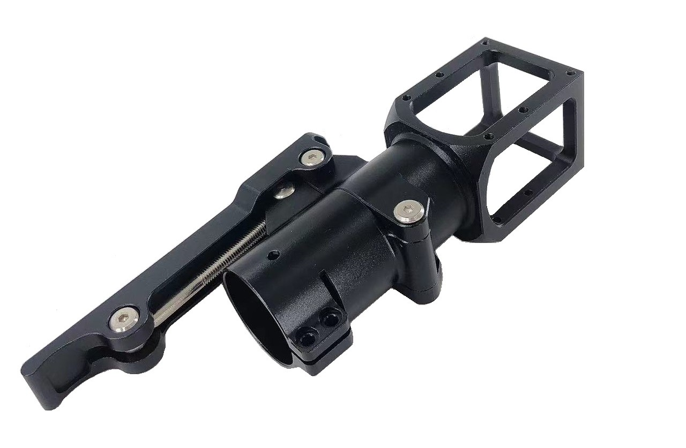 |
---
### 1412, 1422, 1432 & 1442 - Motor Arms
- Carbon-fiber tubes, 30 mm diameter, 2 mm thickness.
- Length is 360 mm for each.
- Parts are identical; Qty: 4.
  - Note: Order parts pre-cut to the specified length if available; otherwise, cut to length.
---
### 2111, 2121 & 2131 - Attachment Interface Spacers
- 3D printed.
- PETG-CF.
- Use 6 wall loops.
- Parts 2111 and 2121 are identical; Qty: 2.
- Part 2131; Qty: 1.

| | 2111 & 2121 (Attachment Interface Spacers, Left and Right) | 2131 (Attachment Interface Spacer, Bottom) |
|--|--|--|
| Image| 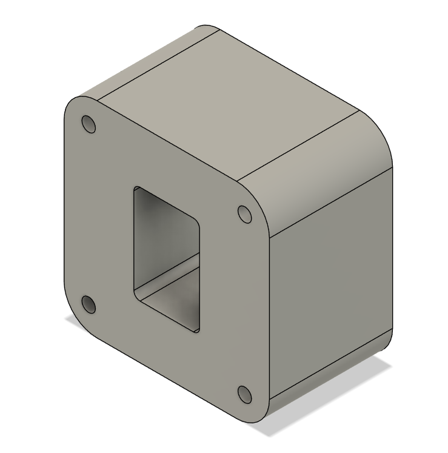 | 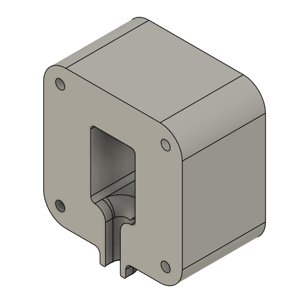 |
| CAD File|[2111 & 2121](assets/models/2111_2121.step)| [2131](assets/models/2131.step)|
---
### 2112, 2122 & 2132 - Attachment Interfaces
- Parts are identical, order 3 parts.
- Select "Without PCB Board" option.
- Product Link: [Link](https://www.alibaba.com/product-detail/Quick-Release-Clip-Plate-Clamp-Quick_1600982145247.html?chatToken=dTVOQ0lHSDBGNnNIYWVkZGdQNnBUSmFhUzNnb3dTTktRdTFiYjZVZzJRb25RRjBPTUs0bVZqdUd5MHUvYWVCblk4R2ZnVHdnREZwTWh3bjZ6bTJmRXYwWXdUVm1sOUd3Sk5YaVRGVWpCK2h4MXlSRkhRcHk0cWI4US9VUDI5R0kmdmVyc2lvbj0xLjAuMA%3D%3D&encryptTargetLoginId=8pctgRBMALNqZAuqE6c17aH4RKPxocV0)

| 2112, 2122 & 2132 (Attachment Interface) |
|--|
|  |
---
### 2211 & 2212 - Battery Sliders
- 3D printed.
- PETG-CF.
- Use 6 wall loops.
- Parts are identical; Qty: 2.

| | 2211 & 2212  (Battery Slider) |
|--|--|
| Image|  |
| CAD File|[2211 & 2212](assets/models/2211_2212.step)|
---
### 2311 - Main PCB Mount
- 3D printed.
- PETG-CF.
- Use 6 wall loops.
- Qty: 1.

| | 2311  (Main PCB Mount) |
|--|--|
| Image| 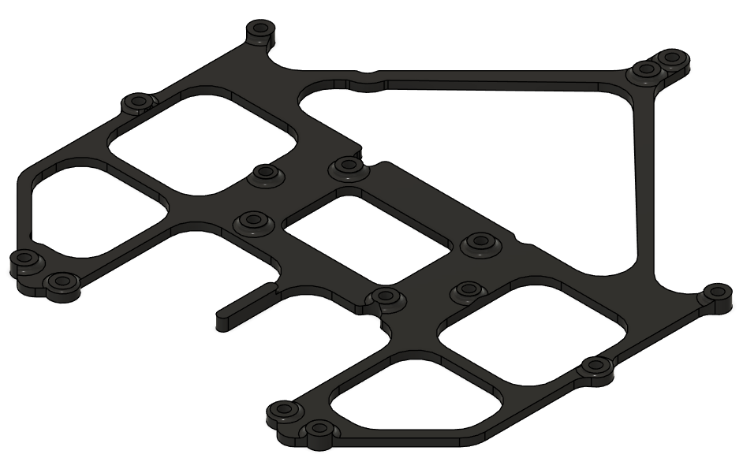 |
| CAD File|[2211 & 2212](assets/models/2311.step)|
---
### 2312 - Battery Connector PCB Mount
- 3D printed.
- PETG-CF.
- Use 6 wall loops.
- Qty: 1.

| | 2312  (BC PCB Mount) |
|--|--|
| Image| 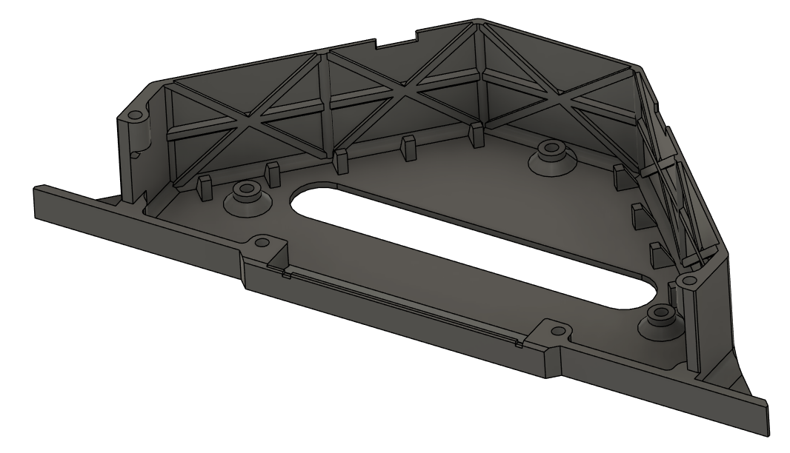 |
| CAD File|[2312](assets/models/2312.step)|
---
### 2313 - Battery Connector PCB Cover
- 3D printed.
- PETG-CF.
- Use 6 wall loops.
- Qty: 1.

| | 2313  (BC PCB Cover) |
|--|--|
| Image|  |
| CAD File|[2313](assets/models/2313.step)|
---
### 2321 - Sensor Mount
- 3D printed.
- PETG-CF.
- Use 6 wall loops.
- Qty: 1.

| | 2321  (Sensor Mount) |
|--|--|
| Image|  |
| CAD File|[2321](assets/models/2321.step)|
---
### 2331 - GNSS Mount
- 3D printed.
- PETG-CF.
- Use 6 wall loops.
- Qty: 1.

| | 2331  (GNSS Mount) |
|--|--|
| Image| 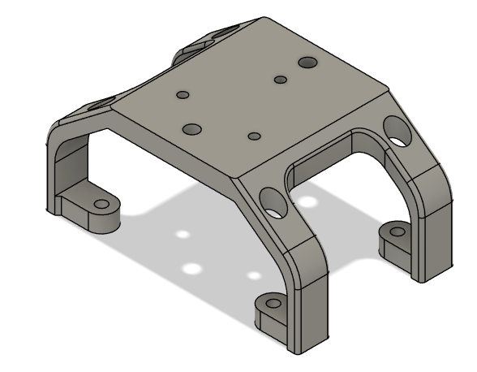 |
| CAD File|[2331](assets/models/2331.step)|
---
### 2341 - PPP & Beacon Mount
- 3D printed.
- PETG-CF.
- Use 6 wall loops.
- Qty: 1.

| | 2341  (PPP & Beacon Mount) |
|--|--|
| Image| 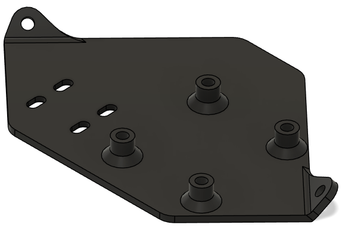 |
| CAD File|[2341](assets/models/2341.step)|
---
### 2411 - Main Enclosure
- 3D printed.
- PETG-CF.
- Use 6 wall loops.
- Qty: 1.

| | 2411  (Main Enclosure) |
|--|--|
| Image|  |
| CAD File|[2411](assets/models/2411.step)|
---
### 2412 - Top Cap
- 3D printed.
- PETG-CF.
- Use 6 wall loops.
- Mind the print orientation as shown.
- Qty: 1.
---
| | 2412  (Top Cap) |
|--|--|
| Image| 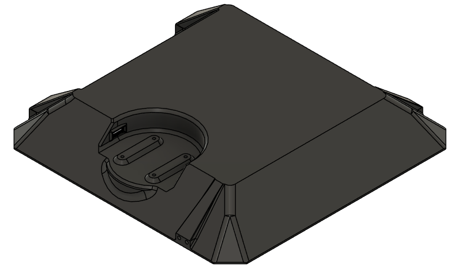 |
| Print Orientation| 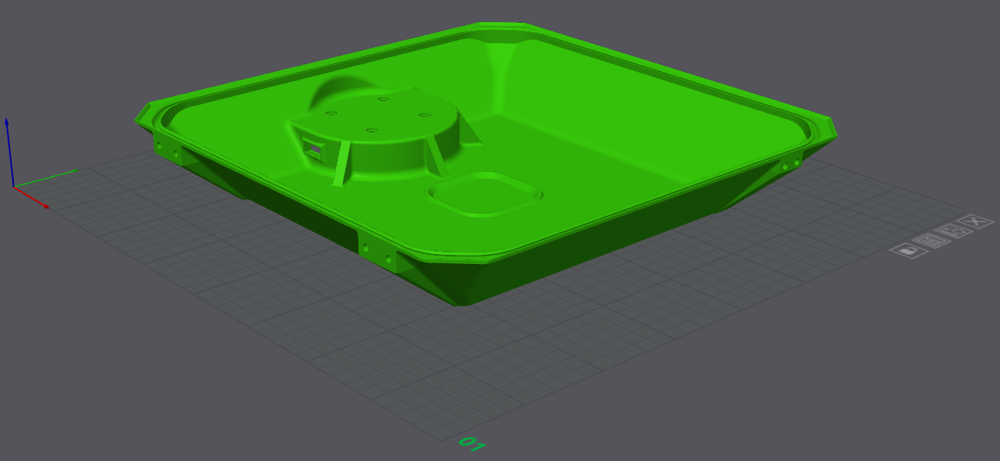 |
| CAD File|[2412](assets/models/2412.step)|
---
### 2421 & 2422 - Enclosure Hinges
- Off-the-shelf component.
- Part Number: GN 237-ZD-30-30-A-SW
- Product Link: [Link](https://www.jwwinco.com/en-us/products/3.3-Hinging-latching-locking-of-doors-and-covers/Hinges/GN-237-Zinc-Die-Cast-or-Aluminum-Hinges-Countersunk-Thru-Holes-or-Threaded-Stud-Type)
- Qty: 2.

| 2421 & 2422  (Enclosure Hinges) |
|--|
|  |
---
### 2431 & 2432 - Enclosure Latches
- Off-the-shelf component.
- Screw on draw latch.
- Parts are identical; Qty: 2.
- Product Link:
  - US: [Link](https://www.mcmaster.com/6082A11/)
  - UK: Latch and catch plate are sold separately.
    - [Latch](https://protex.com/21-1785SS-non-adjustable-toggle-latch-light-duty-stainless-steel-natural)
    - [Catch Plate](https://protex.com/01-1785SS-catch-plate-for-toggle-latch-stainless-steel-natural)
---
### 3322 & 3323 - Busbars
- Both are Copper C110 | CU ETP, laser cut, bent. 
- Bounding box dimension is 300x300 mm for each.
- Qty: 1 each.
- Reference supplier: [Rapiddirect](https://www.rapiddirect.com/)

| | 3322 (Busbar Positive) | 3323 (Busbar Negative) |
|--|--|--|
| Image| 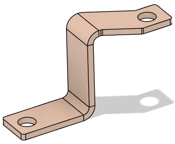 | 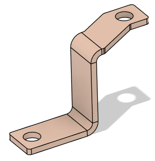 |
| CAD File|[3322](assets/models/3322.step)| [2131](assets/models/3323.step)|
--
### 3324 - BC PCB Heatsink
- Aluminum 6 series, laser cut, sanded.
- Experimental part:
  - Order both 4 mm and 5 mm thickness variants for evaluation.
- Qty: 1 each.
- Reference supplier: [Rapiddirect](https://www.rapiddirect.com/)

| | 3324 (BC PCB Heatsink) |
|--|--|
| Image|  |
| CAD File|[3324 - 4 mm](assets/models/3324.step) , [3324 - 5 mm](assets/models/3324_2.step)|
---

### Tool List

- You need the following tools:
  - Allen key set
  - Wrench set
  - Cordless screwdriver or drill press
  - Riveting tool
  - Loctite Threadlocker Blue 242
  - Adhesive: Loctite Superflex Silicon Sealant Model 593, 6.4 fl. oz.
  - A cleaning agent to prepare the surfaces before adhesive

---------

## Assembly Steps

### Step 1. Assemble the Cockpit Support Beams on Mid Plate
- Parts needed:
  - 1112 (Mid Plate)
  - 1211, 1212 & 1213 (Cockpit Support Beams)
  - Rivet 1 x13 (4mm Diameter for 2mm Thickness)

- Apply adhesive on the cockpit support beams around the holes on the contact side.
- Place the cockpit support beams on the mid plate as shown to the picture.
- Rivet the cockpit support beams from the mid plate on the holes shown in the picture.
  - Make sure you rivet before the adhesive dries.

|Orientation|Adhesive Area|Rivet Holes|
|--|--|--|
|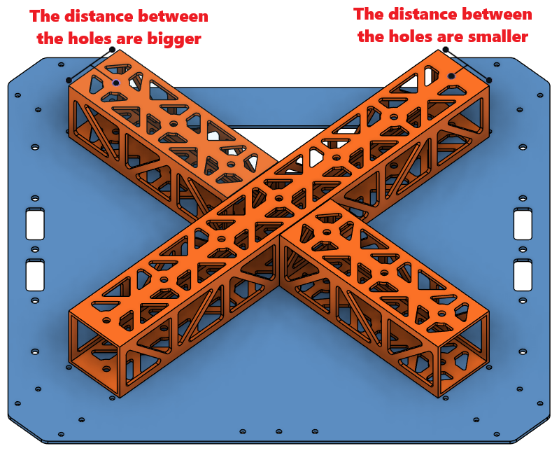|  | 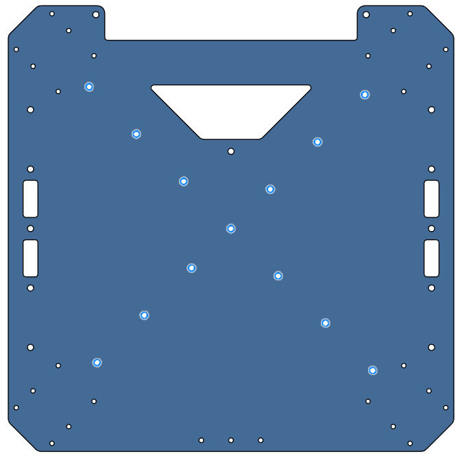 |
---

### Step 2. Install the Battery Walls
- Parts needed:
  - Step 1 chassis
  - 1221 & 1222 (Battery Walls)
  - Rivet 2 x10 (4mm Diameter for 3mm Thickness)
- Apply adhesive on the battery walls around the holes on the contact side.
- Place the battery walls on the sides of the chassis as shown in the picture.
  - Make sure the dented side stays on the chassis side.
- Rivet the battery walls from the mid plate on the holes shown in the picture.
  - Make sure you rivet before the adhesive dries.

|Orientation|Adhesive Area|Rivet Holes|
|--|--|--|
|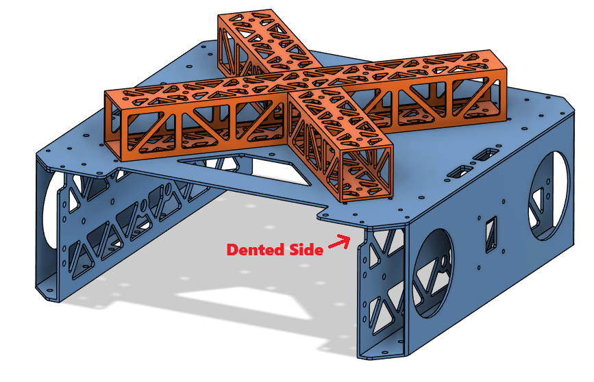| 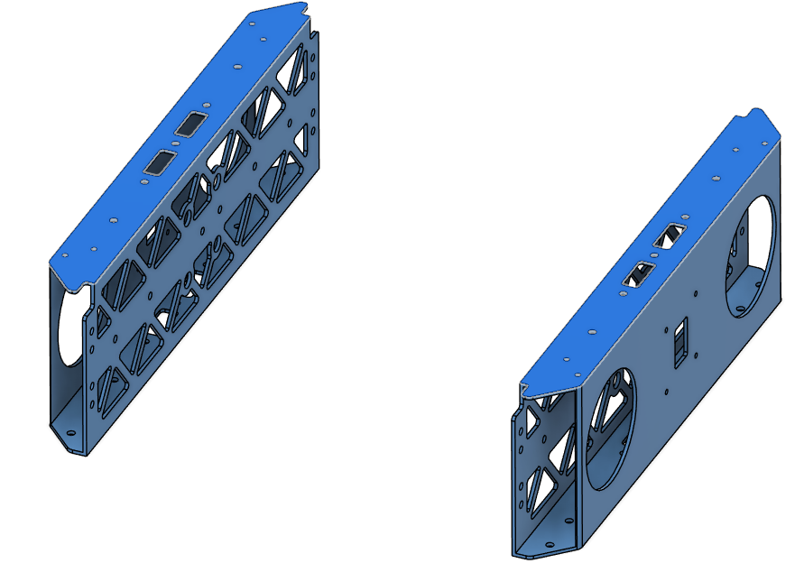 | 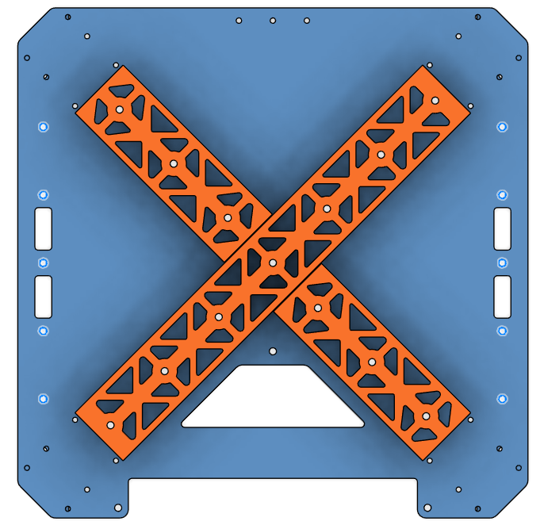 |
---

### Step 3. Install the Motor Arm Connectors
- Parts needed:
  - Step 2 chassis
  - 14X1 x4 (Foldable Motor Arm Connectors)
  - Screw 5 x16 (Socket Head Screw M3x8)
  - Screw 1 x8 (Socket Head Screw M3x10)
  - Washer 1 x24 (M3 General Purpose Washer, OD: 6 mm)
- Remove the fasteners marked in the picture.
  - Apply Loctite Threadlocker on the fasteners.
  - Secure the fasteners back.

| Motor Arm Connector - Loctite Threadlocker Application|
|---|
| 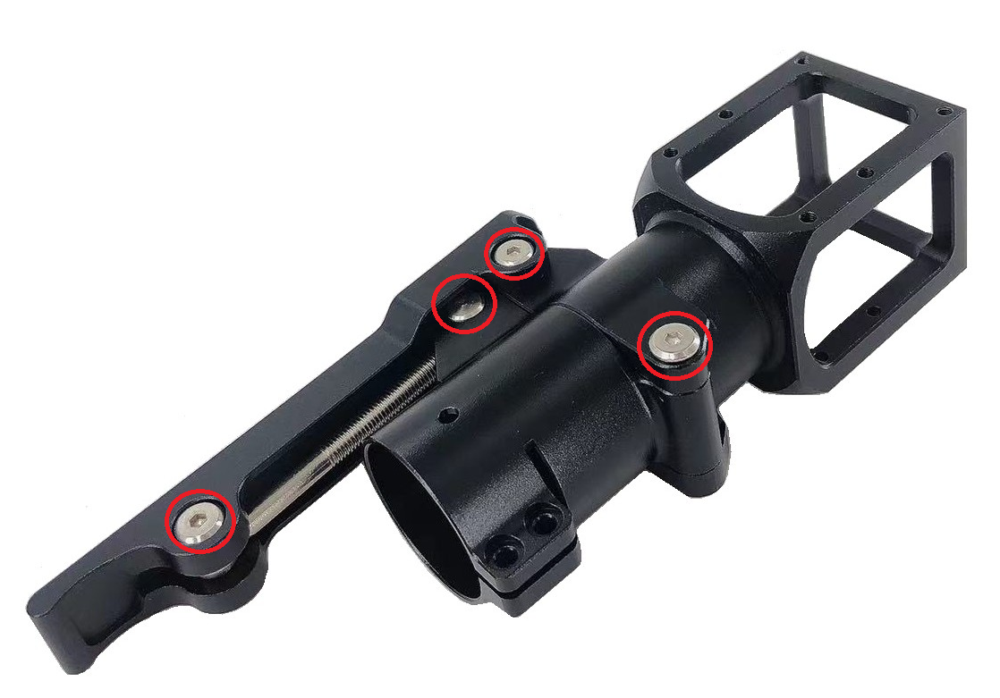|
 
- Place the motor arm connectors on the chassis as shown in the picture.
- Secure the motor arm connectors on the chassis.
  - Use **Screw 5** for **red holes** and **Screw 1** for **green holes**.
  - Use Loctite Threadlocker.
  - Use Washer 1.
  - Use cordless screwdriver where possible, or else an allen key.
 
|Orientation|Screw Holes|
|--|--|
|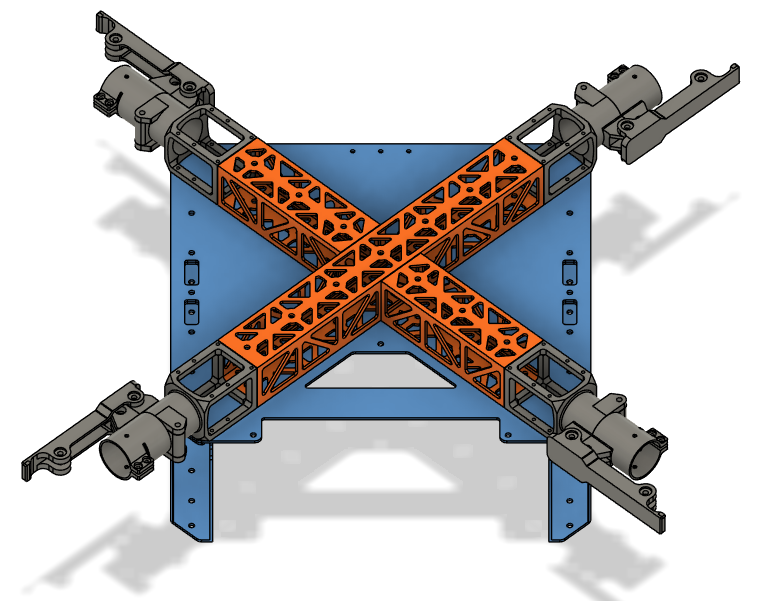|  |
--
### Step 4. Install the Lower Plate
- Parts needed:
  - Step 3 chassis
  - 1113 (Lower Plate)
  - Rivet 3 x10 (4mm Diameter for 6mm Thickness)
- Place the lower plate on the chassis as shown to the picture.
- Apply adhesive on the battery walls around the holes on the contact side.
- Rivet the lower plate to the chassis on the holes shown in the picture.
  - Make sure you rivet before the adhesive dries.

|Orientation|Adhesive Area|Rivet Holes|
|--|--|--|
|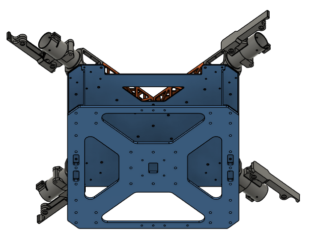| 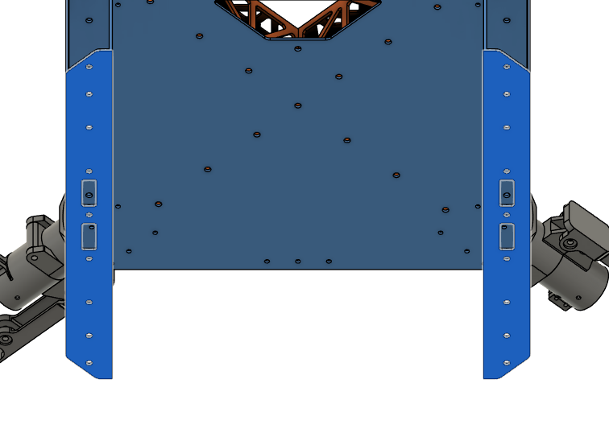 |  |

### Step 5. Install the Upper Plate
- Parts needed:
  - Step 4 chassis
  - 
  - Rivet 1 x13
  - Screw 1 x24
  - Washer 1 x24
  - Screw 11 x5
  - Vibration Mount x5
  - Insert 4 x16

- Place the upper plate over the chassis as shown to the picture.
- Apply adhesive on the cockpit support beams around the holes on the contact side.
- Rivet the cockpit support beams from the upper plate on the holes shown in the picture.
  - Make sure you rivet before the adhesive dries.
- Screw the motor arm connecters from the upper plate with Screw 1.
  - Use Washer 1.
  - Use Loctite Threadlocker.

|Orientation|Adhesive Area|Rivet Holes|
|--|--|--|
|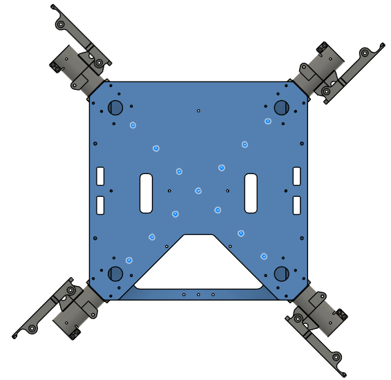|  |  |

### Step 6. Install the Main PCB Mount
- Parts needed:
  - Step 5 chassis
  - Part 26 (Main PCB Mount)
  - Insert 1 x12
  - Insert 3 x8
  - Screw 5 x20
  - Washer 1 x20

- Place Insert 1 to the holes shown in the picture, on the top and bottom sides of the main PCB mount.
  - Use a soldering iron to place them inside the plastic.

|Top|Bottom|
|--|--|
||  |

- Place Insert 3 to the holes shown in the picture, on the top side of the main PCB mount.
  - Use a soldering iron to place them inside the plastic.

|Top|
|--|
|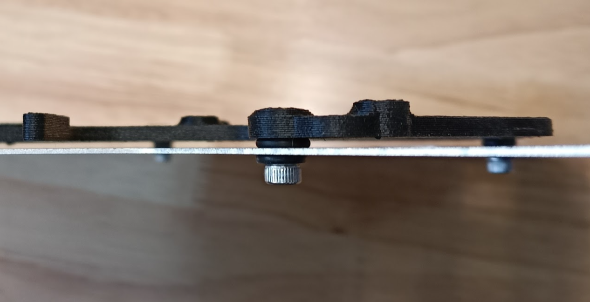|

- Place the main PCB mount over the upper plate.
  - Secure it with 5x Screw 5 in total from below the upper plate on the holes below.
  - Use Washer 1 for the holes.

### Step 7. Install the Battery Connector PCB Mount
- Parts needed:
  - Step 6 chassis
  - Part 30 (BC PCB Mount)
  - Insert 1 x10
  - Screw 5 x3
  - Washer 1 x3

- Place Insert 1 to the holes shown in the picture, on the top and bottom sides of the BC PCB mount.
  - Use a soldering iron to place them inside the plastic.

|Top|Bottom|
|--|--|
|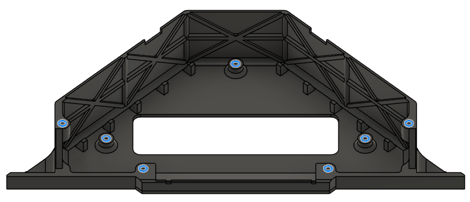|  |

- Place the Battery Connector PCB mount over the mid plate.
  - Secure it with 3x Screw 5 in total from below the mid plate on the holes below.
  - Use Washer 1 for the holes.

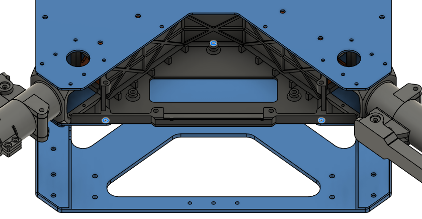

### Step 8. Install the Battery Sliders
- Parts needed:
  - Step 7 chassis
  - Part 16 (Battery Sliders)
  - Insert 2 x8
  - Screw 9 x8
  - Washer 2 x8

- Place Insert 2 to the holes shown in the picture on both of the battery slides.
  - Use a soldering iron to place them inside the plastic.

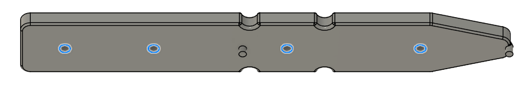

- Place the battery sliders inside the battery compartment.
  - Be careful about the orientation of the angled end, they should point where the cutouts on the plates are.
  - Secure it with 8x Screw 9 in total from the sides of the frame.
  - Use Washer 2 with the screws.

|Orientation|Installation Holes|
|--|--|
||  |

### Step 9. Install the Landing Gear
- Parts needed:
  - Step 8 chassis
  - Part 11, 12 (Landing Gear Horizontal & Vertical Tubes)
  - Part 13 (Landing Gear Main Adapters)
  - Part 15 (Landing Gear Tube Joints)
  - Screw 2 x16
  - Screw 3 x24
  - Washer 1 x56
  - Nut 1 x28
  - Screw 6 x4
- Place the landing gear main adapters below the chassis, as shown in the picture.
  -  The adapters are facing outside to the left and right of the structure.
  -  Screw the adapters with 16x Screw 2 to the chassis.
  -  Use Loctite Threadlocker to secure the screws.

|Orientation|Installation Holes|
|--|--|
|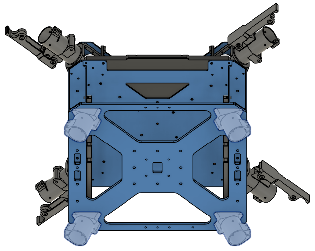| 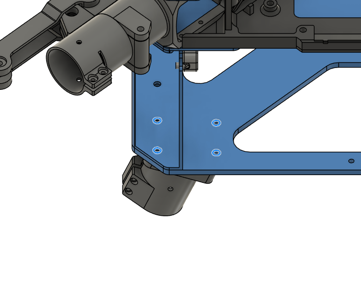 |

- Insert the vertical landing gear tubes inside landing gear main adapters.
  - Make sure the tubes are inserted all the way.
  - Tighten the clamps with the screws provided in the landing gear main adapter package.
  - Use Loctite Threadlocker to secure the screws.

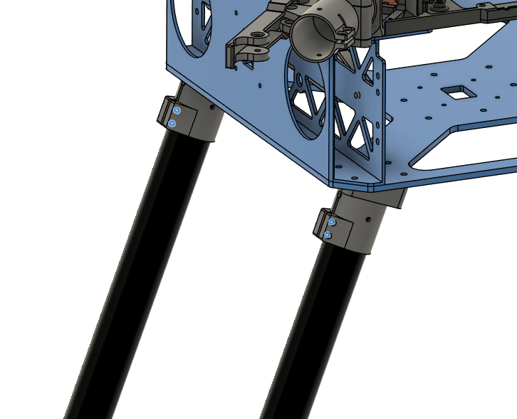

- Make sure the chassis stands level on the ground.
  -  If not, measure and equalize the tube lengths.
  
- Drill the tubes with 3 mm drill bit on the marked holes.
  - Use Screw 6.
  - Use Washer 1 on each side.
  - Use Nut 1.

 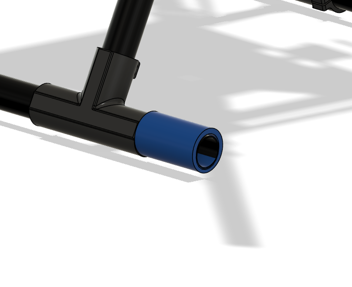

- Assemble landing gear tube joints and the horizontal tubes as shown in the picture.
  - Insert the vertical tubes inside the holes before tightening the screws.
  - Use Screw 3.
  - Use Washer 1 on each side.
  - Use Nut 1.

|Positioning|Installation Holes|
|--|--|
|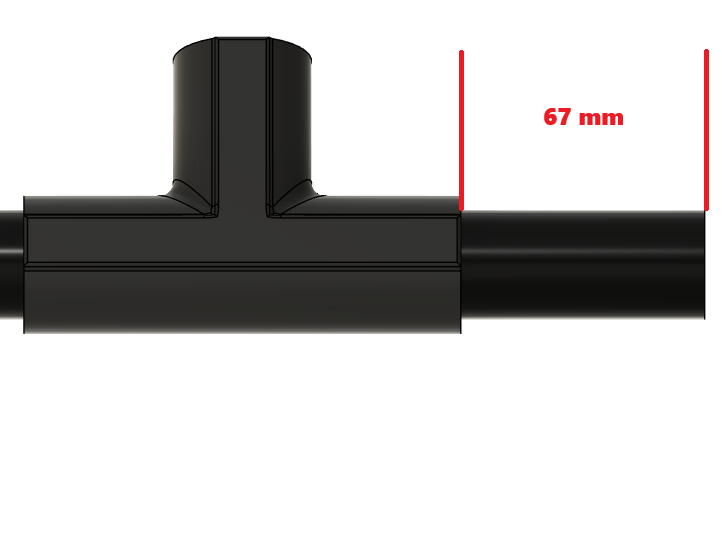| 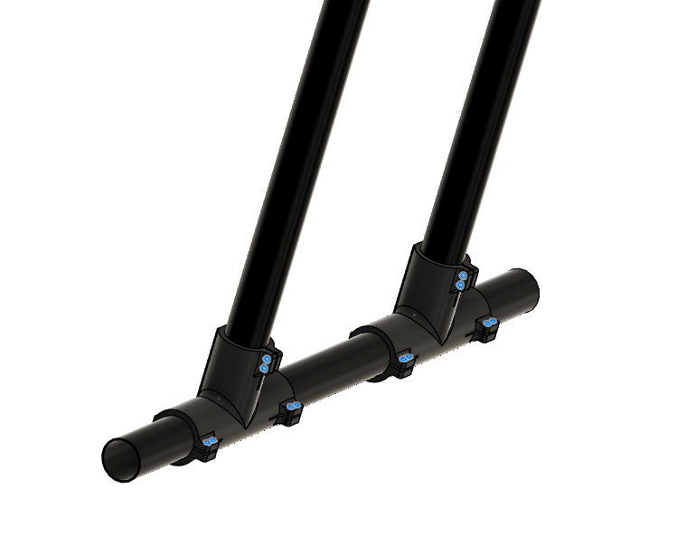 |

### Step 10. Install Side Attachment Interfaces
- Parts needed:
  - Step 9 chassis
  - Part 21, 22 (Side Attachment Interface Spacers)
  - Part 31 (Attachment Interfaces)
  - Screw 6 x8
  - Washer 1 x8

- Place and secure side attachment interfaces and the spacers as shown in the pictures.
  - Make sure the rectangular holes are aligned with the holes on the battery walls.
  - Use the screwdriver holes inside the battery compartment to place the screws and the screwdriver.
  - Use Screw 6.
  - Use Washer 1.
  - Use Loctite Threadlocker.

|Positioning|Installation Holes|
|--|--|
|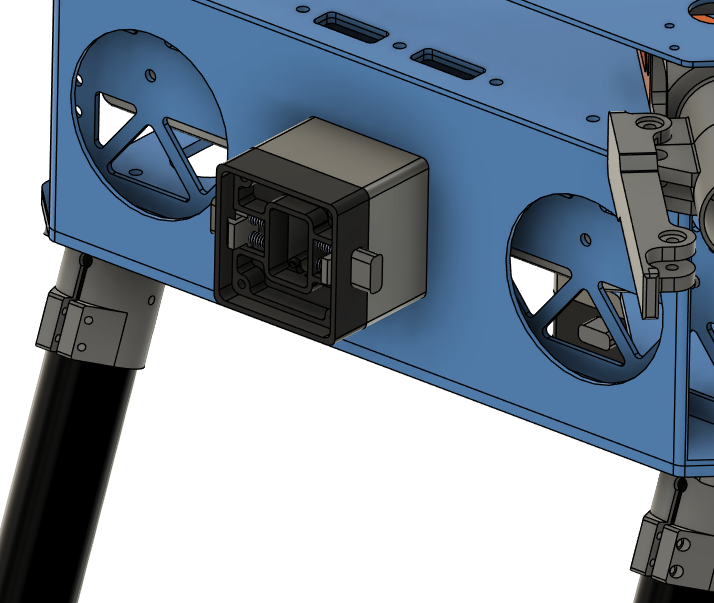| 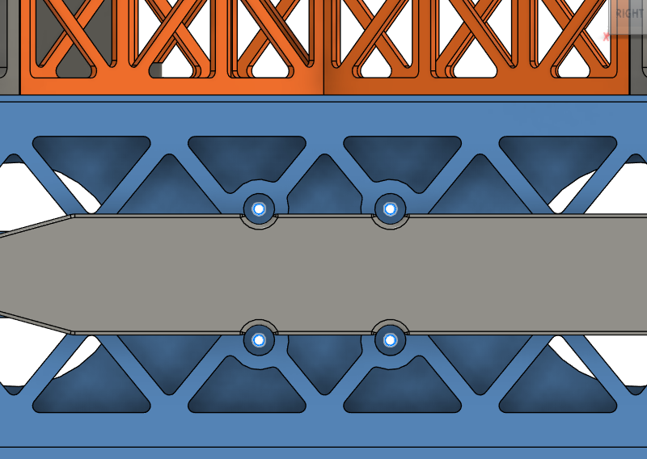 |
  
### Step 11. Install Cockpit Enclosure
- Parts needed:
  - Step 10 chassis
  - Part 27 (Main Enclosure)
  - Part 28 (Enclosure Top Cap)
  - Part 14 (Enclosure Hinge)
  - Part 29 (Enclosure Cap Clips)
  - Part 19 (Enclosure Anchors)
  - Screw 1 x8
  - Screw 7 x8
  - Screw 8 x4
  - Washer 1 x8
  - Insert 1 x20

- Place Insert 1 to the holes shown in the picture from outside on the main enclosure.
  - Use a soldering iron to place them inside the plastic.

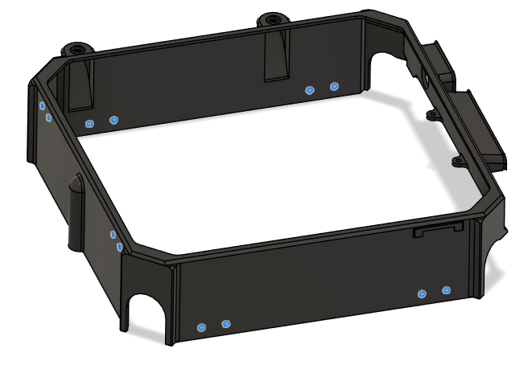 

- Place the enclosure anchors and the main enclosure over the chassis.
  - The anchors will fit on the circular cutouts on the battery walls.
  - Mind the direction of the main enclosure.
  - Screw the anchors to the main enclosure with Screw 1.
    - Use Washer 1.
    - DO NOT use Loctite Threadlocker.

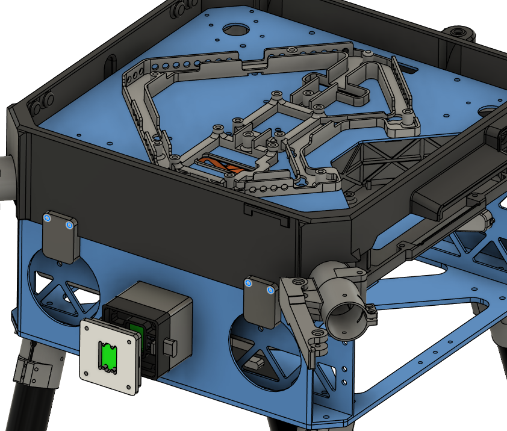 

- Place Insert 1 to the holes shown in the picture from outside on the top cap.
  - Use a soldering iron to place them inside the plastic.

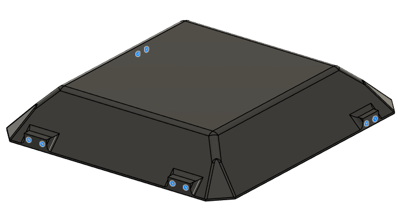

- Place the enclosure clips on the top cap as shown in the picture.
  - Screw the anchors to the main enclosure with Screw 8.
    - DO NOT use Loctite Threadlocker.
   
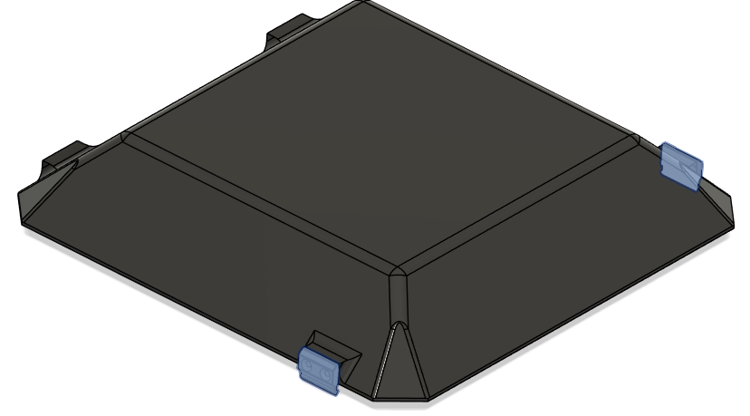

- Place the top cap over the chassis.
- Secure the enclosure hinges on the top cap and the main enclosure.
  - Use Screw 7.
  - DO NOT use Loctite Threadlocker.

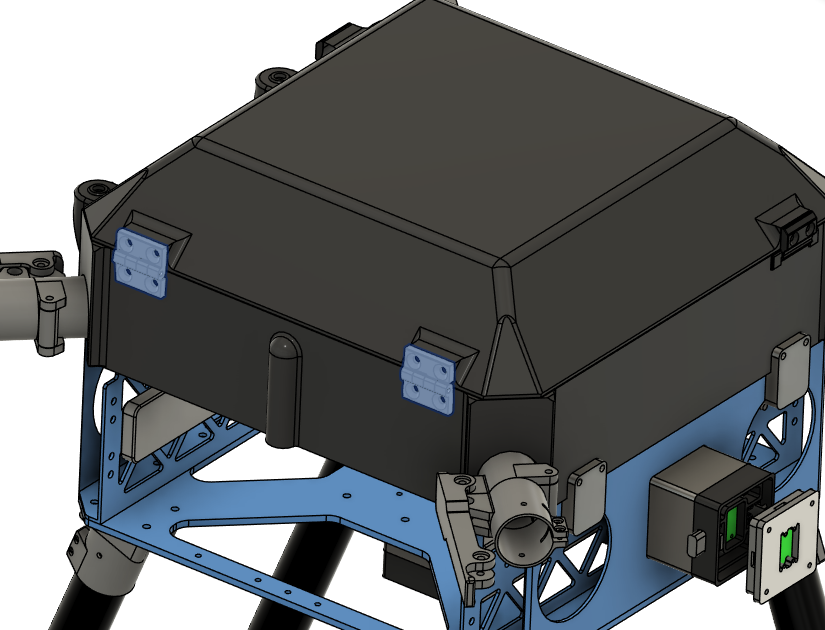

### Step 12. Install Altitude Sensor Mount
- Parts needed:
  - Step 11 chassis
  - Part 18 (Altitude Sensor Mount)
  - Screw 4 x4
  - Washer 1 x4
  - Nut 1 x4

- Place Insert 1 to the holes shown in the picture.
  - Use a soldering iron to place them inside the plastic.

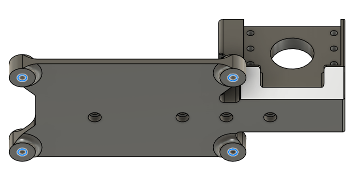

- Secure the altitude sensor mount on the lower plate.
  - Screw head stays inside the mount.
  - Use Screw 3.
  - Use Washer 1 on the nut side.
  - Use Nut 1.
  - DO NOT use Loctite Threadlocker.

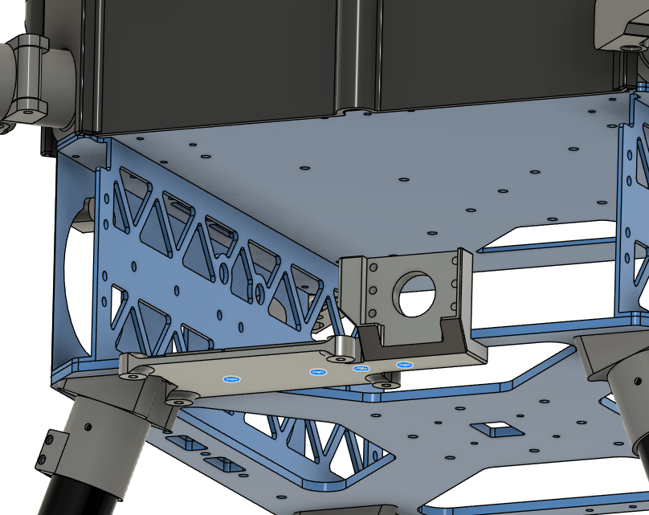  

### Step 13. Install Camera Mount
- Parts needed:
  - Step 12 chassis
  - Part 20 (Camera Mount)
  - Screw 10 x3
  - Washer 1 x3
  - Nut 1 x3

- Secure the altitude sensor mount on the lower plate.
  - Screw head stays under the mount.
  - Use Screw 10.
  - Use Washer 1 on the nut side.
  - Use Nut 1.
  - DO NOT use Loctite Threadlocker.

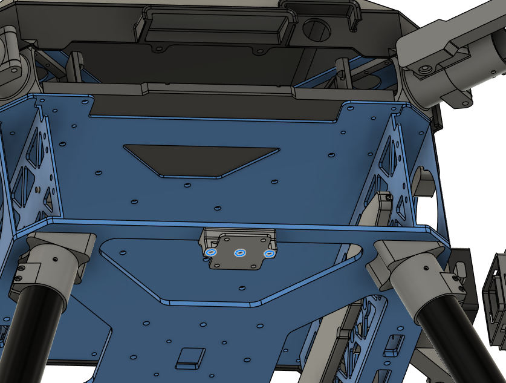  

### Step 14. Install Motor Arm Tubes
- Parts needed:
  - Step 13 chassis
  - Part 10 (Motor Arm Tubes)
  - Screw 6 x4
  - Washer 1 x8
  - Nut 1 x4

- Insert the motor arm tubes inside the motor arm connectors.
  - Make sure the tubes are inserted all the way.
  - Tighten the clamps with the screws provided in the motor arm connector package.
  - Use Loctite Threadlocker to secure the screws.

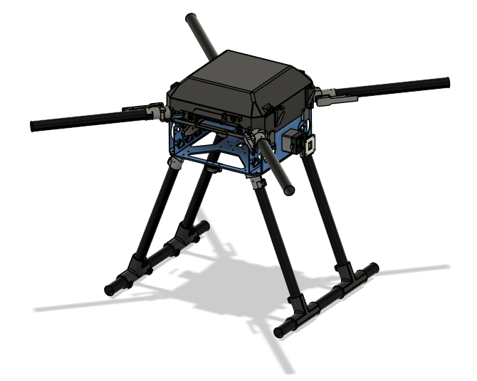

- Drill the tubes with 3 mm drill bit on the marked holes.
  - Use Screw 6.
  - Use Washer 1 on each side.
  - Use Nut 1.
 
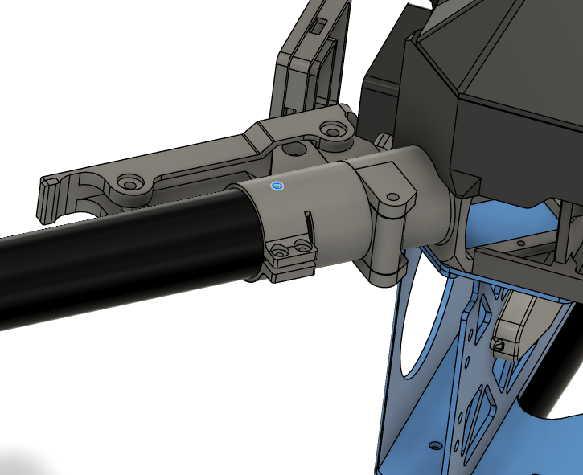

-----

- The structural assembly is completed.
- Keep GNSS mount, GNSS mount clamp and BC PCB cover parts for the general assembly.

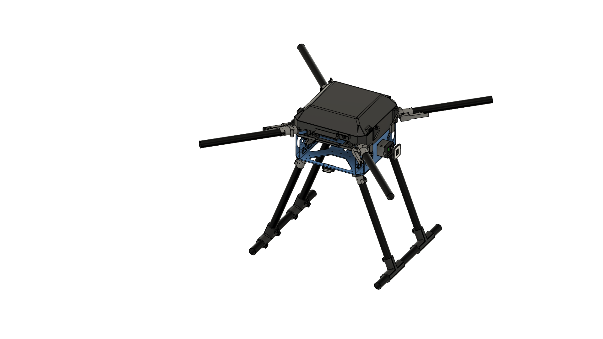
