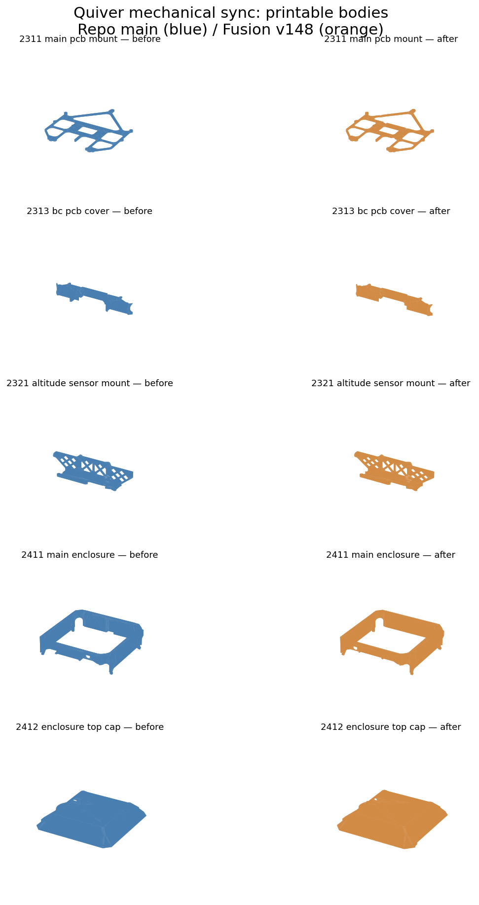

# Fusion v148 mechanical sync — draft review

Source: `Quiver_PT3_Drone_Assembly` v148, saved July 30, 2026 at 17:55:10 UTC.
Compared with repository main `ef316bc9f4e9e001dd5421f8070e54f3180f1600`.
The read-only export was taken September 18, 2026; the Fusion design was not saved
or modified. This is a review snapshot, **not a manufacturing release**.

## Scope

| Part | Change from repository STEP | Fusion reference |
| --- | --- | --- |
| 2311 main PCB adapter | Threaded inserts and screws replace snap-in pins; updated rubber spacers | `New_Main_PCB_Adapter_0226_2`, v4 |
| 2313 battery-PCB cover | Envelope depth 44.09 → 27.35 mm; solid volume −10.94% | `UPDATED_2313 - BCPCBCover.f3d`, v1 |
| 2321 sensor mount | Same envelope; detail geometry changes, volume +0.79% | In-document component |
| 2411 enclosure | Envelope 330.19 × 347.39 × 93.00 → 330.19 × 319.25 × 91.00 mm | `UPDATED_2411-MainEnclosure`, v3 |
| 2412 top cap | Envelope 306.60 × 306.66 × 50.31 → 319.20 × 309.16 × 54.85 mm | `UPDATED_2412-TopCap.f3d`, v1 |
| 2342 PPP/beacon board | Additional 79.19 × 79.19 × 8.00 mm board; retain original 2341 mount | `2340-PPP, Beacon_mounting_board_v3`, v12 |



Dimensions are axis-aligned CAD envelopes, not manufacturing tolerances. Volume
changes are geometric measurements, not weight estimates. Plates, compared cockpit
beams, battery slider, original PPP/beacon mount, and attachment spacers match the
existing STEP geometry and are intentionally unchanged. GPS changes are separate.

## Placement and hardware

The adapter's native export requires a **−7.85 mm Z translation**, measured from
the Fusion occurrence, replacing the old +13.15 mm correction. The other five
updated bodies already contain their world placement. Independent source bounds,
occurrences, linked versions, and file hashes are recorded in
[the provenance manifest](../src/quiver/fusion-mechanical-provenance.json).
Regression tests compare printable-body world bounds with those measurements.

The adapter STEP contains 34 solids, including 12 screws, 16 inserts, and five
rubber spacers. Only its largest solid is the printable adapter. The existing BOM
and Step 6 already describe 16 short inserts (FAST-024) and five rubber spacers
(FAST-033); the 12 modeled screws are part of the existing FAST-014 allocation,
not 12 additional purchases. Hardware names in the source model disagree on
insert length; they are not procurement authority. The BOM specifications remain
unchanged pending physical confirmation.

## Print files and review gates

The repository is a mixed snapshot: several existing, watertight manufacturing
STLs already have the revised envelopes even though their STEP sources were old.
The existing 2311, 2313, 2321, 2411, and 2412 STLs are therefore **not overwritten**.
Envelope agreement alone does not establish detailed mesh equivalence.

- **Correction: the existing 2321 STL is not established to be stale.** Its volume
  is approximately 63,337 mm³; Fusion records 63,327 mm³ and the valid imported
  STEP solid measures 63,332 mm³. The earlier 62,450 mm³ figure came from the
  defective generated mesh, not the STEP solid. The STEP-to-STL mesher skipped
  geometry; that trial was discarded. Keep the existing watertight STL. A direct
  Fusion export remains the preferred way to establish exact revision provenance,
  but these measurements are not evidence that the existing print file is wrong.
- Confirm revision provenance for retained meshes with the revised sources before a new
  print release. They remain the existing manufacturing files, not newly validated
  exports from this PR.
- The new 2342 STL was exported from its single STEP solid with linear tolerance
  0.05 mm and checked as a watertight mesh. Review print orientation and fastening;
  its presence in Fusion does not establish an assembly procedure or fastener BOM.
- Confirm adapter insert lengths and physical stack-up against the current build.
- Review enclosure/hinge/latch fit and sensor clearance; the automated tests check
  source placement and assembly integrity, not every physical interface.

## Validation

With Python 3.12 and `src/constraints.txt` installed:

```bash
PYTHONPATH=src python -m pytest src/tests/ -q
PYTHONPATH=src python -m quiver.bom render --check
PYTHONPATH=src python -m quiver.assembly -o /tmp/quiver-mechanical.step
```

The full-assembly count changes from 1,242 to 1,261 solids: +18 in the adapter
assembly and +1 new board. The outer drone envelope is unchanged.
