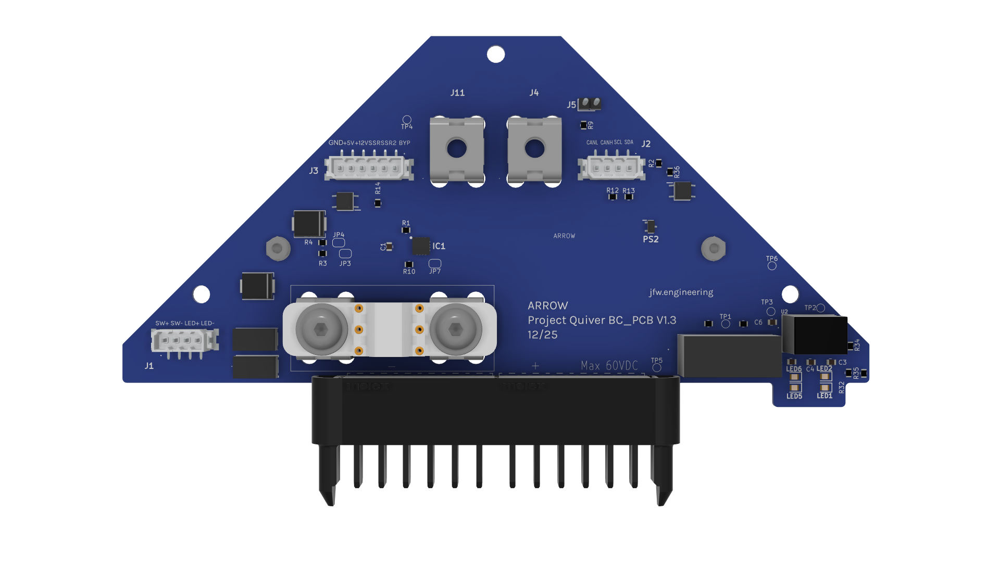
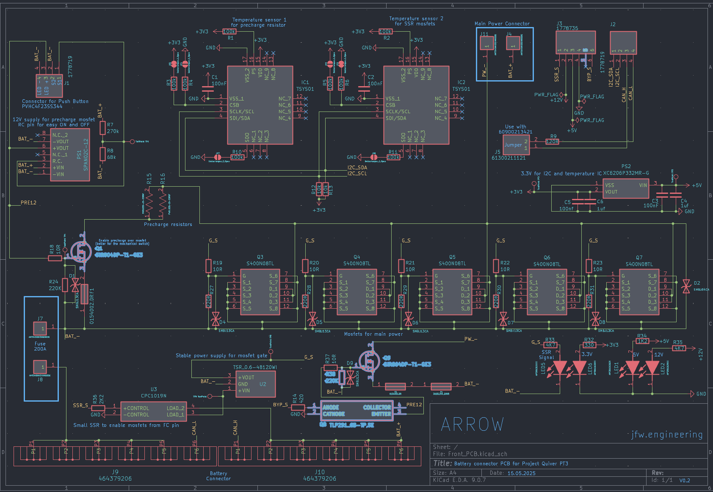
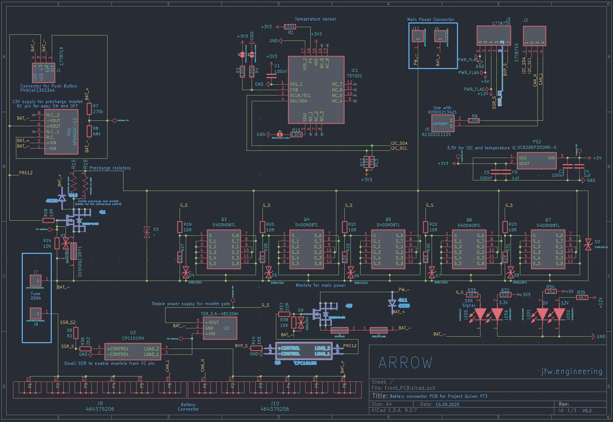
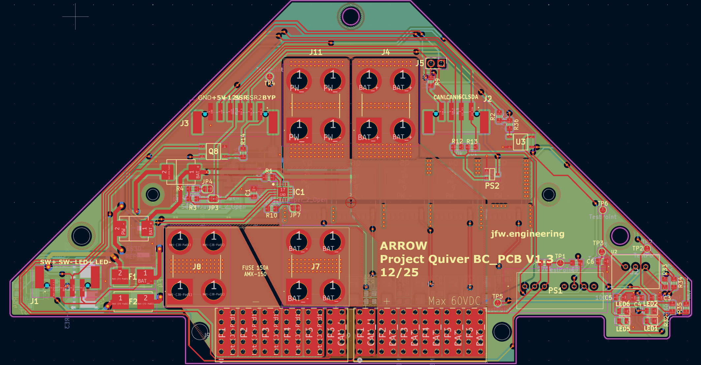
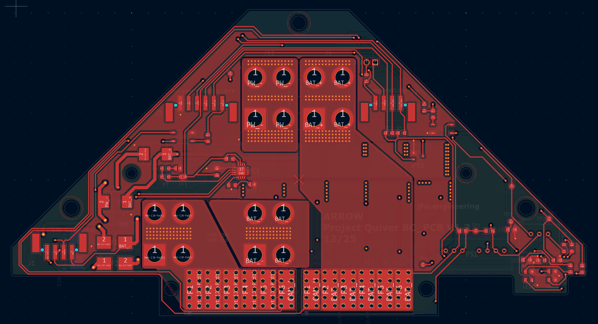
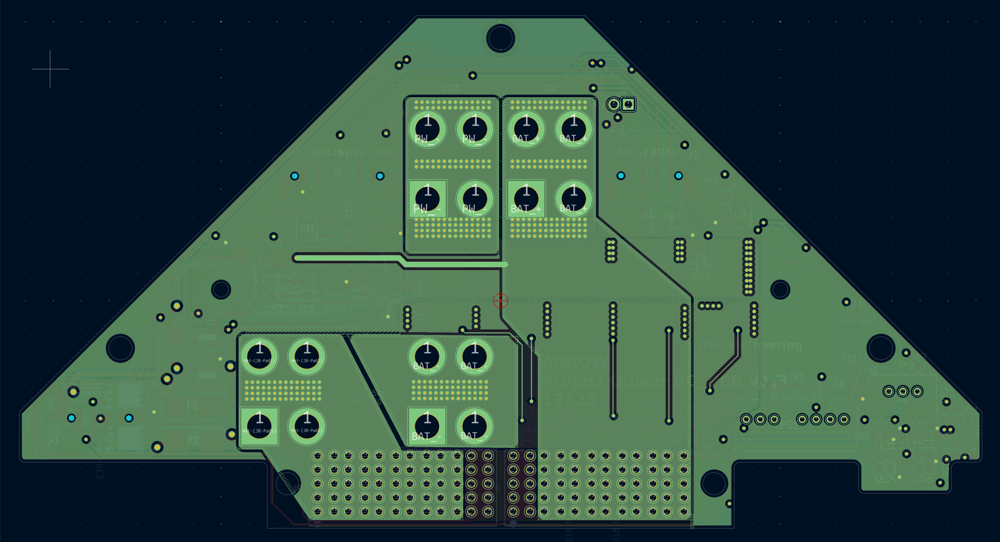
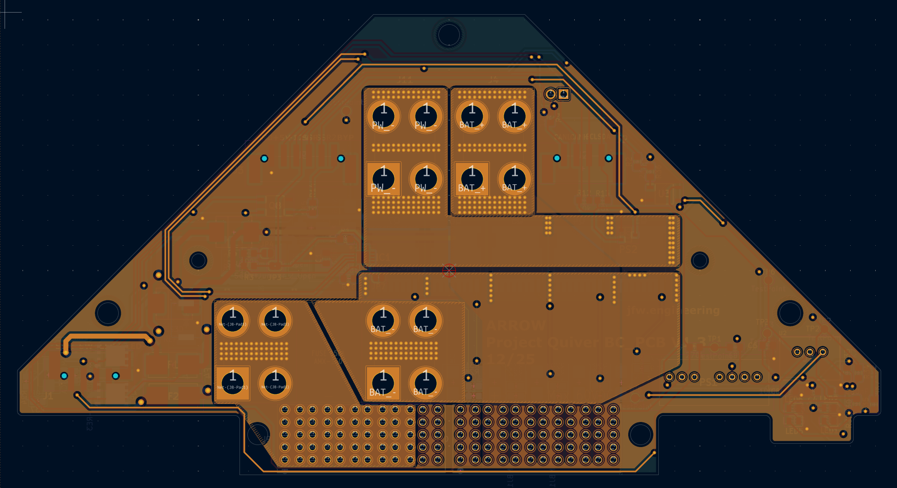
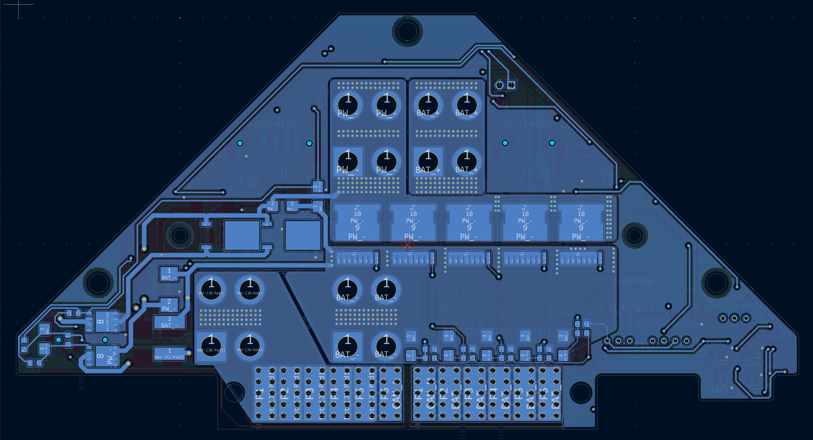

# Dev Kit Battery PCB Updates

# Status

`Valid`

`Revision History: V1`

`Replacement Log: None`

`Reference: PT3 Battery PCB Information Notes`

# Project Description

## PCB Overview

The Battery PCB was updated to include various changes that were noticed during the build and testing process. Most notably, the power rating on various MOSFETs was increased and more protection diodes. 

# Methodology

Updates were collected via the manufacturing, assembly, and testing process of Quiver PT3.

# Results and Deliverables

## Updated Schematics and CAD files

***Previous schematic with highlighted changes***

***Updated schematic with new components highlighted***

| F.CU | In1.CU | In2.CU | B.CU |
|:----:|:------:|:------:|:----:|
|      |        |        |      |

## PCB Updates

- MOSFETs updated for higher power rating
    - Q1 - Pre-charge 
    - Q8 - 12V Control
    - Q9 - Bypass
- Protection diodes added
    - D10 & D11
- Incoming connection updates
    - J3 (1778735)
        - Second SSR signal added
- Main power output cables replaced with bus bars
- Silkscreen updated to reflect correct pushbutton wiring
- Reduced copper plane on In2.CU 

# Remarks

- Design work was conducted by Julius.
- Schematic and CAD files can be find in the Quiver Dev Kit task and bounties directory
- information note prepared by Erick.