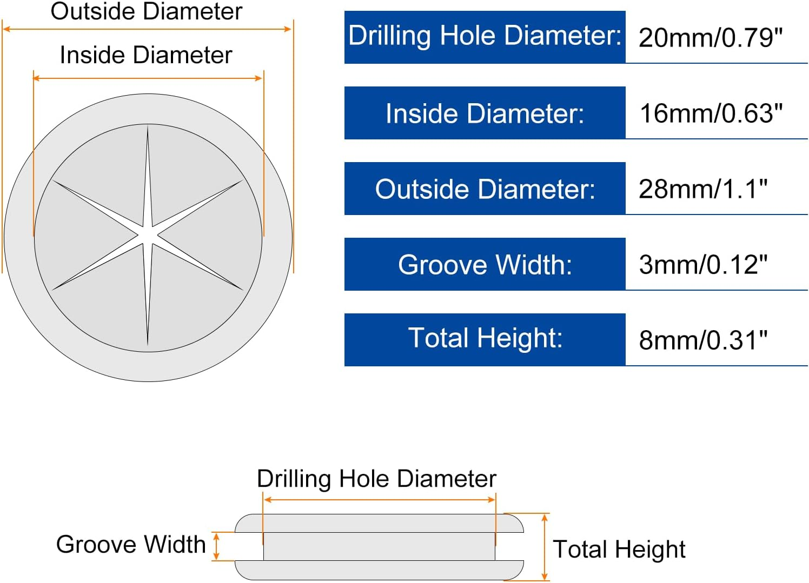
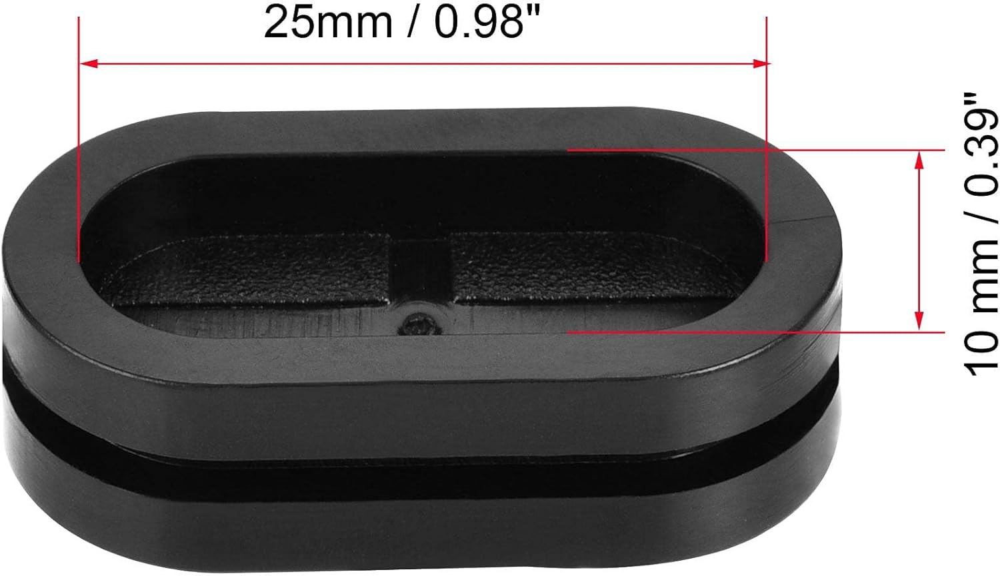
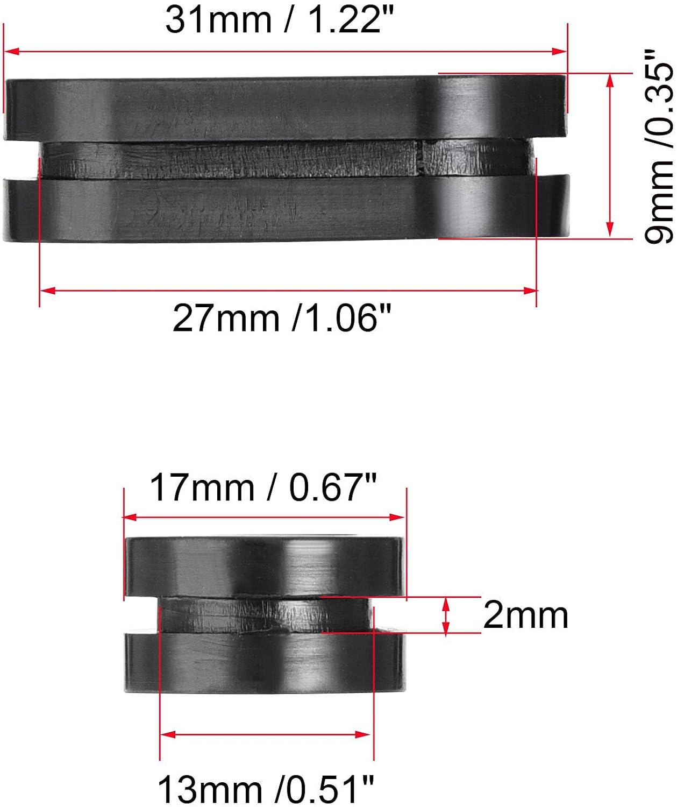
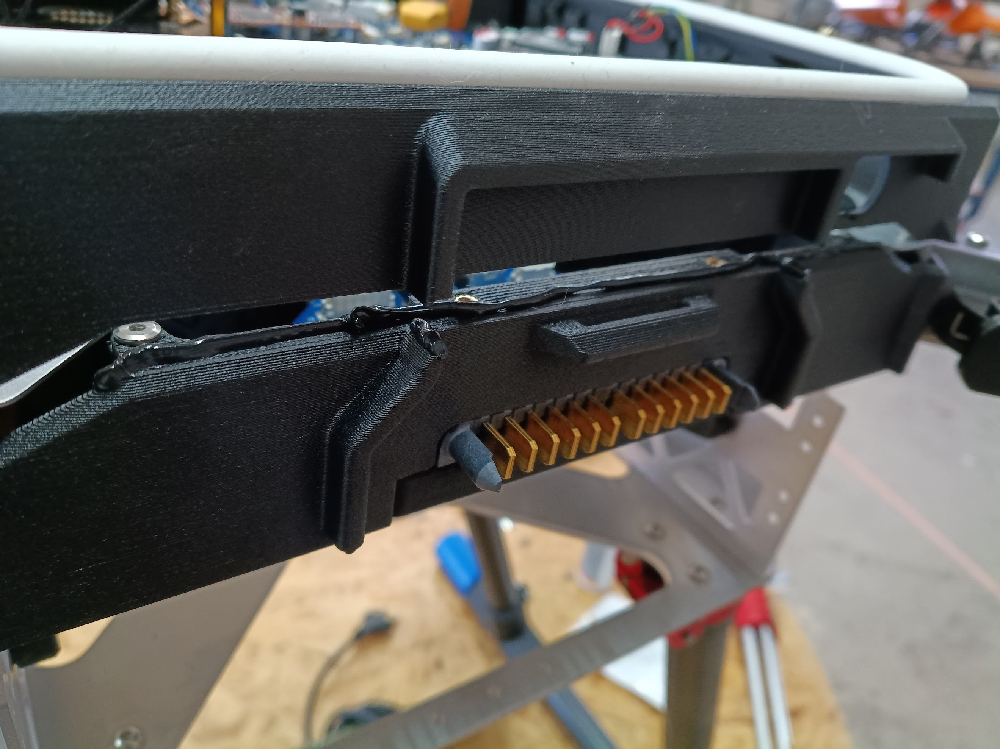

# Information Note - Improvement of dust and water resistance

Quiver Dev-Kit
Heavy-Lift Multipurpose UAV (<25 kg MTOW)

Table of content
[toc]

# Project Description

To better protect the Quiver housing against dust and water, several options are listed and tested here. The ultimate goal is complete water protection so that the drone can fly during rain.

# Methodology 

First, several rubber cable grommets are tested and silicone is applied to specific areas of the housing. This is followed by an initial test of the improvements.

# Results and Deliverables 

Goal: Improved dust and water protection.

## Main areas of the housing that can let in dust and water

1. Area between the lid and the middle housing
2. Round holes for the ESC cables
3. Rectangle holes that go into the battery wall
4. Plate and enclosure gap
5. Front side cable entrance
6. Battery connector PCB compartment gap
7. Lidar cable entrance hole

### 1. Area between the lid and the middle housing
An improved sealing solution was implemented. The gap is now sealed with a silicone sealing strip.

### 2. Round holes for the ESC cables
A rubber grommet is inserted into the holes of the ESC cables. It is not completely waterproof, but it will repel drips and most dust.

### 3. Rectangle holes that go into the battery wall
An oval rubber seal is used. This must be cut to allow cables to pass through. As with the ESC holes, this only repels drips and most dust.

### 4. Plate and enclosure gap
No further action is required. If necessary, the edge will be sealed with silicone.

### 5. Front side cable entrance
Cable entrance got removed from the enclosure.

### 6. Battery connector PCB compartment gap
Seal with removable silicone sealant. For example Würth 08933311.

### 7. Lidar cable entrance hole
Sealing with adhesive silicone sealant. The gap must be properly filled. For example Würth 08901003.

# Remarks 

- A short flight in light rain is feasible with these changes.

(End of document)
