# Dev Kit Main PCB Update

# Status

`Valid`

`Revision History: V1`

`Replacement Log: None`

`Reference: PT3 Main PCB Information Notes`

# Project Description

## PCB Overview

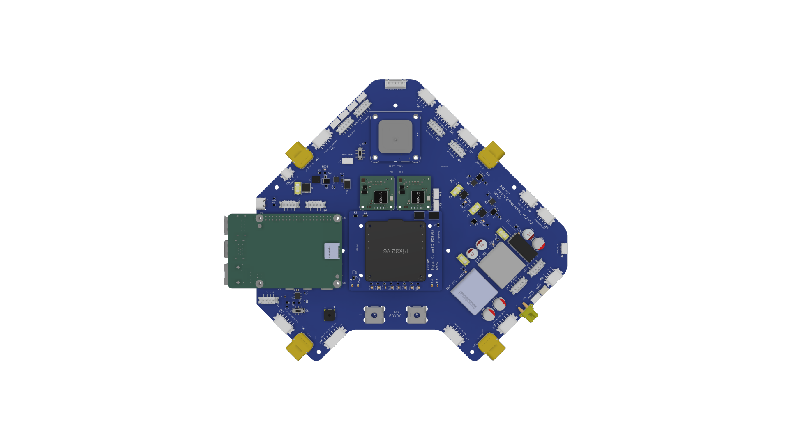 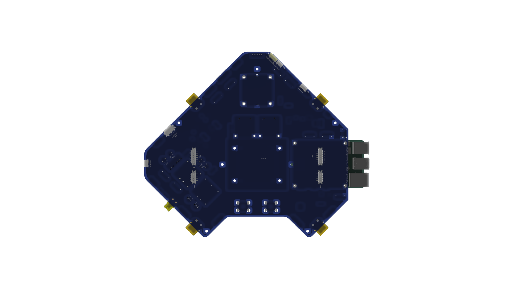

The Main PCB was updated to include various changes that were noticed during the build and testing process. Some changes were made to the components and operation of the PCB. The redesigned connector layout now utilizes default JST connectors and optimized positioning for efficient wiring. Power delivery has been made more robust by an upgraded power supply featuring additional capacitors, a 5V backup for the flight controller, and high power MOSFETs combined with a small SSR for payload and HV switch control. Inductive loads are protected by additional diodes, while the Battery PCB SSR control now includes a redundant connection and trace. Hardware integration now relies on SMD soldered threaded standoffs for mounting the RPi, GPS, and Ethernet switches. For better clarity, schematics are organized with dedicated pages for power distribution, and the physical PCB layout follows a designated layer strategy separating power routing, CAN bus, and Ethernet signals.

# Methodology

Updates were collected via the manufacturing, assembly, and testing process of Quiver PT3.

# Results and Deliverables

## Updated Schematics and CAD files

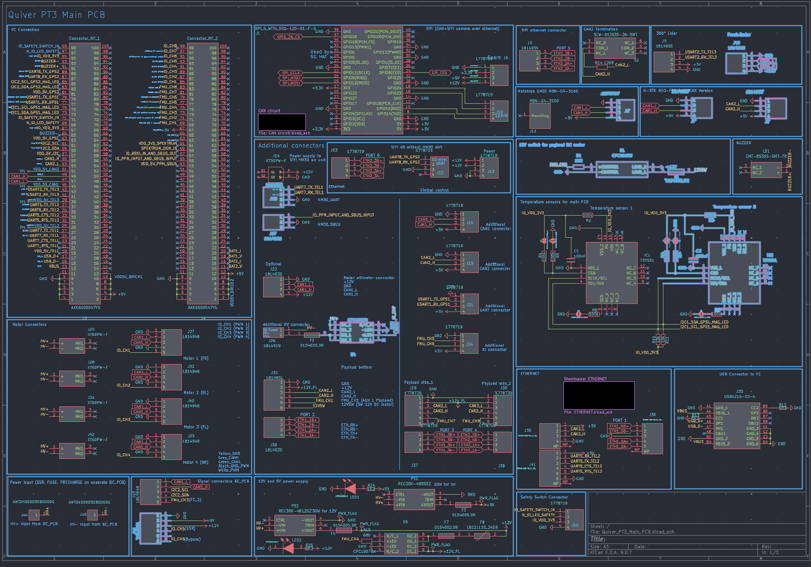

***Previous schematic with highlighted changes***

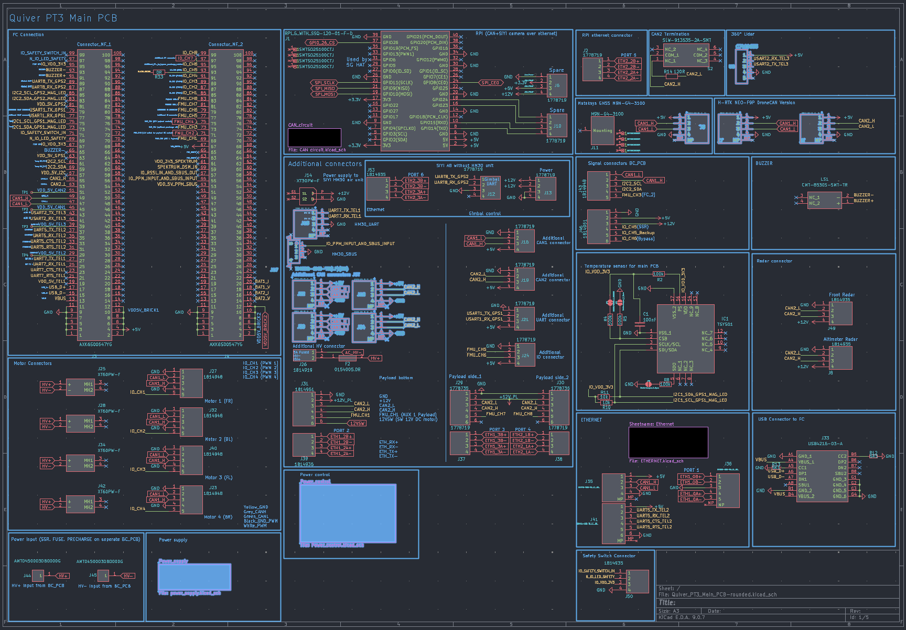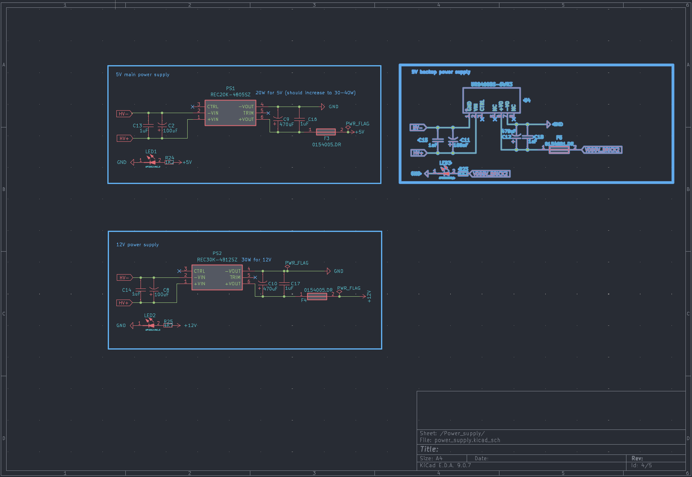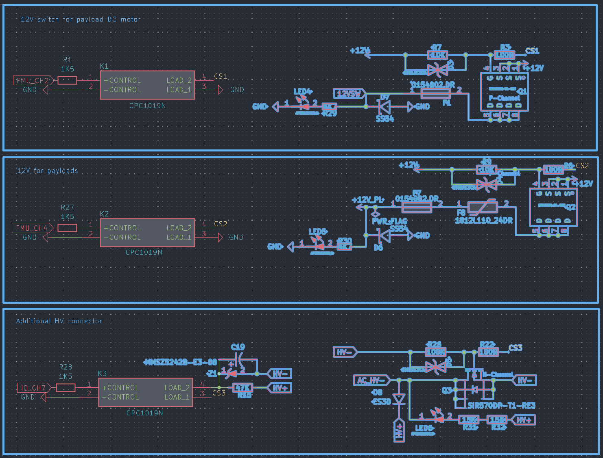
***Updated schematics with new components highlighted***

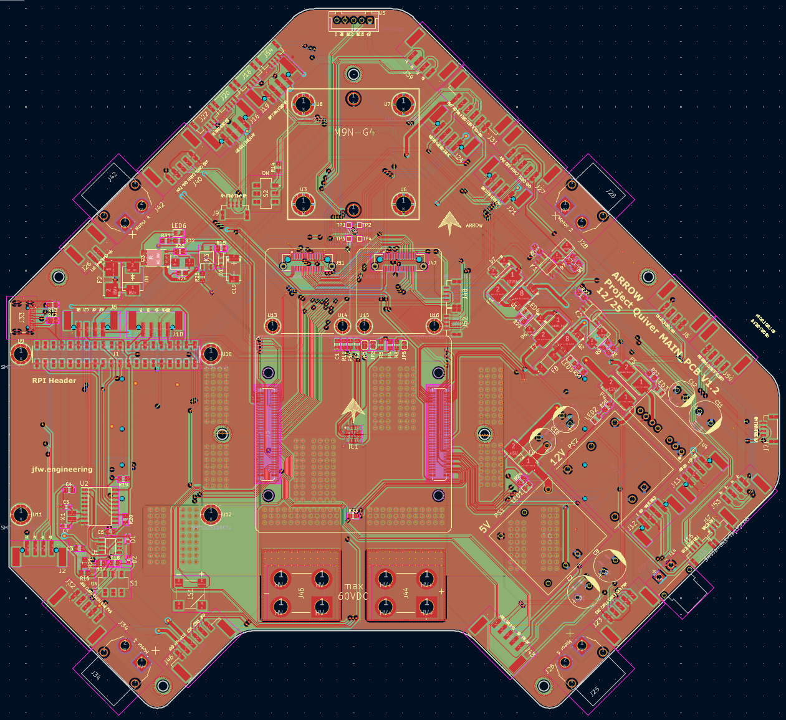

|           F.CU                            |                 In1.CU                      |                      In2.CU                 |                    In3.CU                   |           In4.CU                            |                 B.CU                      |
|:-------------------------------------:|:-------------------------------------:|:-------------------------------------:|:-------------------------------------:|:-------------------------------------:|:-------------------------------------:|
|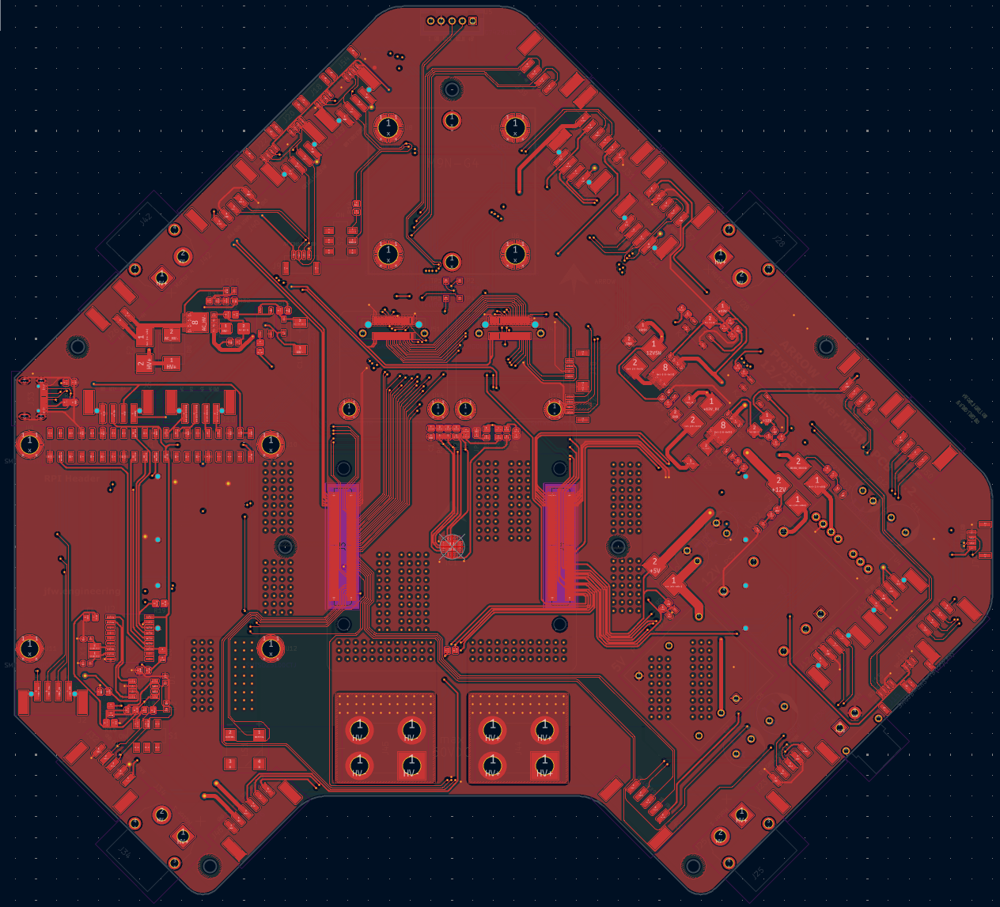 | 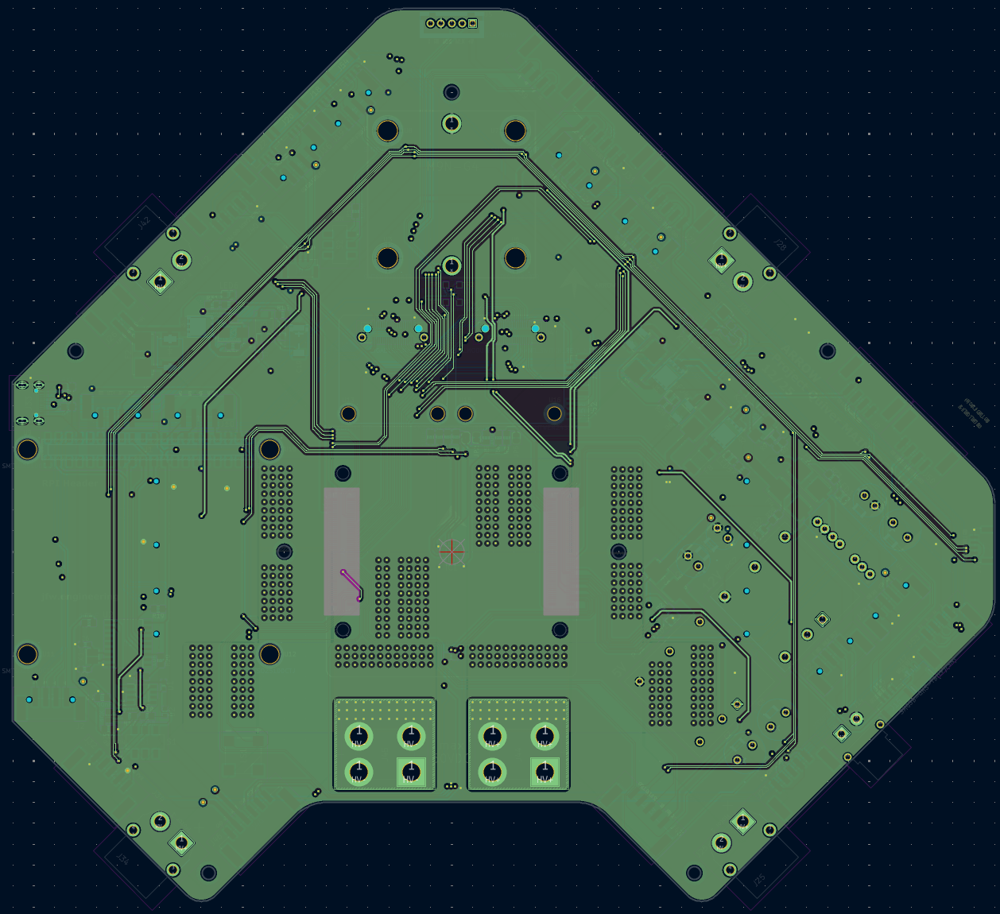| 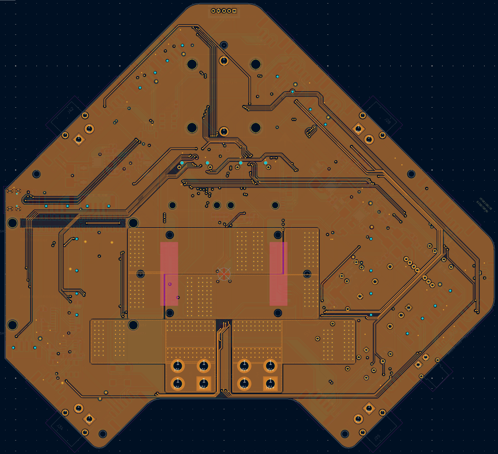|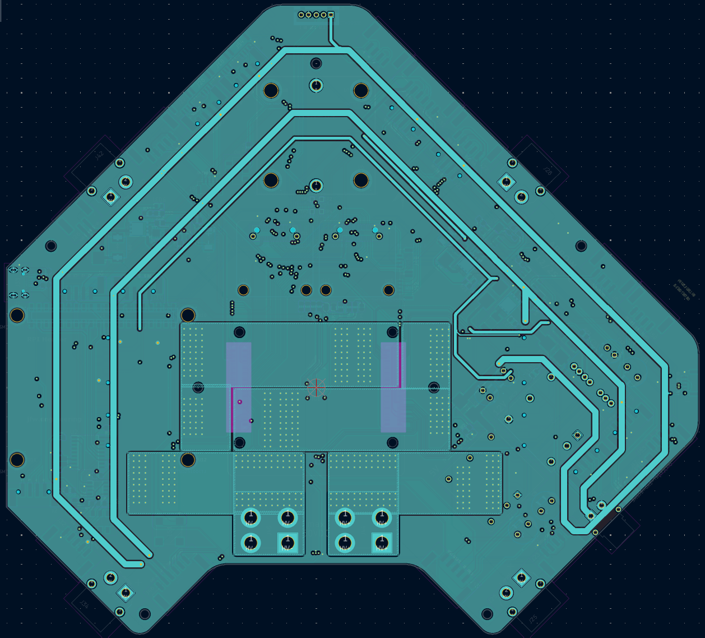|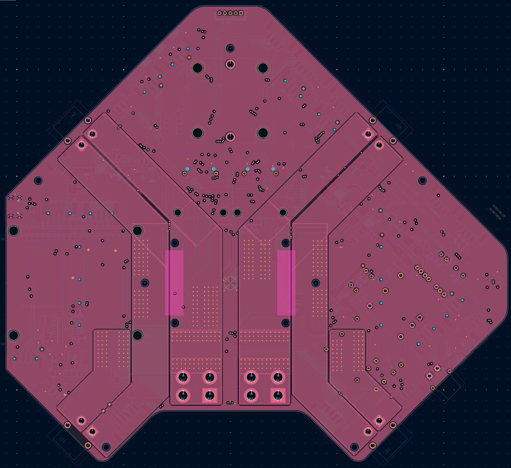 | 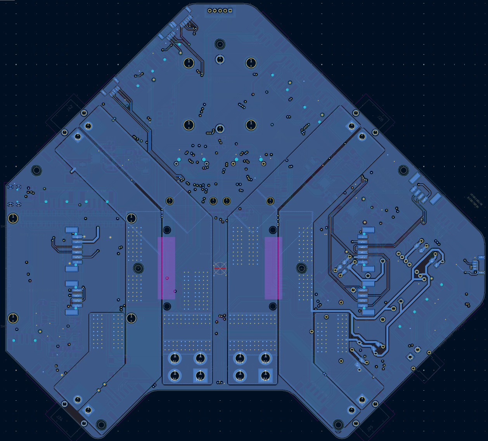 |

## PCB Updates

- Redundant SSR control 
    - backup signal trace on J46, Pin 5 (IO_CH5_Backup) to prevent signal loss.
- Temperature sensor IC2 removed
- Components now using JST-GH connectors
    - HM30 Air Unit (J15 & J17)
    - Aux CAN connections (J18, J20, J22)
    - GNSS (J5 & J7)
- Dedicated 360° Lidar connector (U5) 
- "Power Supply" sheet added to schematic for 5V and 12V supply
    - Capacitors C2, C9, C13, & C16 added to PS1
    - Capacitors C8, C10, C14, & C17 added to PS2
    - Newly added back up 5V supply (U4)
- "Power Control" sheet added to schematic for payload/HV switching
    - Updated control scheme using a lower rated CPC1019N SSR to drive a high power MOSFET
    - Review schematic for all added fuses, protection scheme, LEDs, etc. 
- SMD soldered threaded standoffs
    - GNSS (U3, U6 - U8) 
    - RPI (U9 - U12)
    - Ethernet Switches (U13 - U16) 

### Remarks

- Design work was conducted by Julius.
- Schematic and CAD files can be found in the Quiver PT3 task and bounties directory
- information note prepared by Erick.