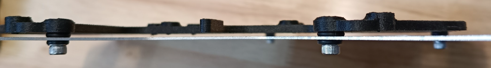
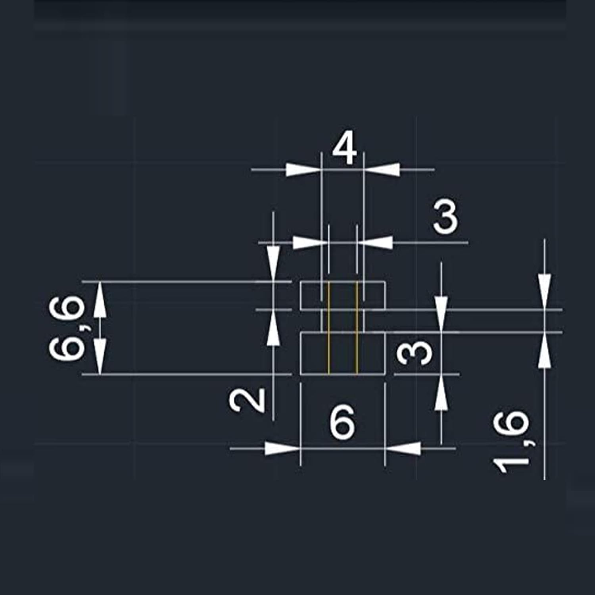
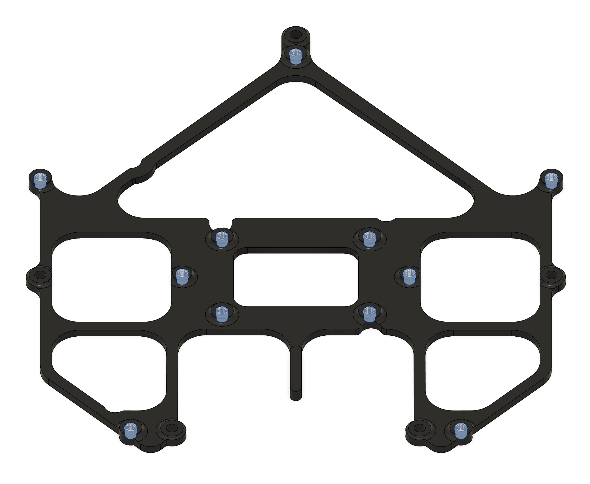
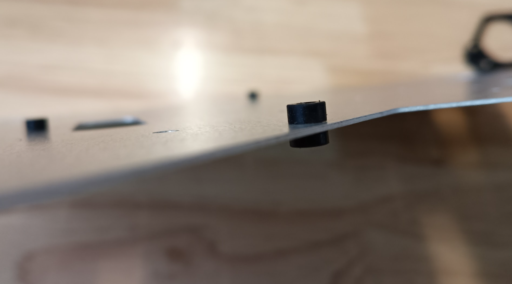
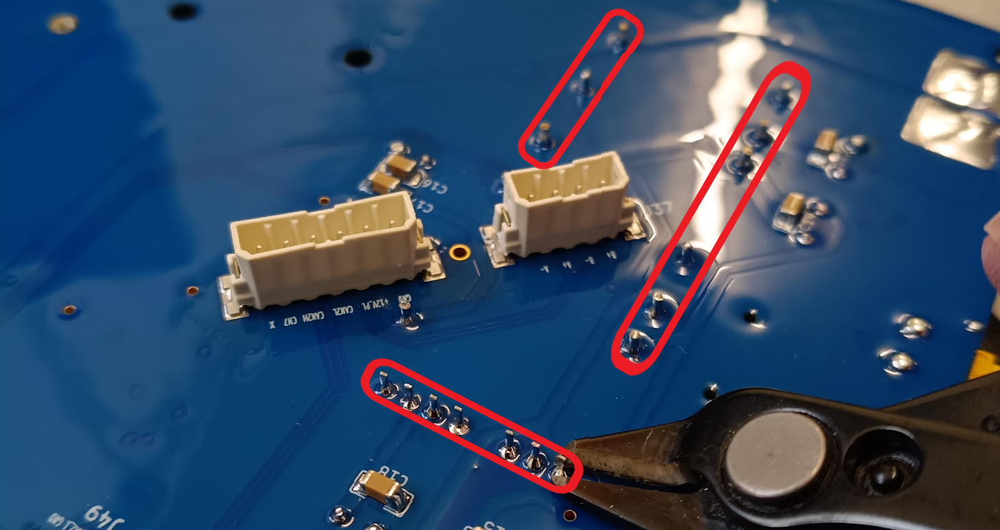

# Information Note - PCB Vibration Mount
**Quiver PT3**
**Heavy-Lift Multipurpose UAV (<25 kg MTOW)**

**Table of Contents**
[toc]

## 1. Overview
The Main PCB is secured to a custom 3D-printed interface, which is subsequently mounted to the airframe using rubber vibration dampeners. This isolation system is designed to minimize high-frequency vibrations transmitted from the frame to the PCB assembly and flight controller sensors.

### 1.1 Bill of Materials (BOM)

The following components are required to assemble the vibration mount:

| Item | Description | Qty | Part Number / Reference | Notes |
| :--- | :--- | :--- | :--- | :--- |
| **1** | 3D Printed PCB Mount | 1 | (Internal Part) | Material: PETG-CF recommended. |
| **2** | Threaded Inserts | 16 | M3 Short (M3x4.0) | **Note:** Must be the "Short" (4mm) version. e.g., [Ruthex M3S](https://www.ruthex.de/en/products/ruthex-gewindeeinsatz-m3s-100stuck-rx-m3x4-0-short-messing-gewindebuchsen-fur-3d-druck) |
| **3** | Mounting Screws | 5 | M3x6 Flat Head (Stainless Steel) | e.g., [McMaster 97654A674](https://www.mcmaster.com/products/97654a674/) |
| **4** | Vibration Dampeners | 5 | M3 Rubber Dampener (6.6mm total length) | e.g., [Flight Controller Anti-Vibration Standoffs](https://www.amazon.com/iRCMATRC-Stretchy-Anti-Vibration-Controllers-Accessories/dp/B09KCGKX1F) |
| **5** | Threadlocker | - | Loctite 242/243 (Medium/Blue) | |

Vibration Dampener Dimensions:

### 1.2 Installation of Threaded Inserts

**1. Top-Side Inserts**
Install **11x M3S** inserts into the top face of the 3D-printed part (as shown below). These inserts will be used for mounting the Main PCB and securing the FC PCB stack.

**2. Bottom-Side Inserts**
Install **5x M3S** inserts into the bottom face of the 3D-printed part (as shown below). These inserts are used to secure the adapter to the airframe via the vibration dampeners.

### 1.3 Installation of Rubber Dampeners

Install the **5x rubber vibration dampeners** into the designated holes on the aluminum upper plate of the airframe.

:::warning
**Orientation:** Ensure the longer side of the rubber dampener (3 mm section) is facing **upwards**, towards where the 3D-printed holder will sit.
:::

### 1.4 Mounting the PCB Holder

1.  Apply a small amount of **Medium (Blue) Loctite** to the threads of the 5x M3x6 flat head screws.
2.  Align the 3D-printed mount over the rubber dampeners.
3.  Insert the M3x6 screws through the center of the rubber dampeners and thread them into the bottom-side inserts of the PCB holder.
4.  **Compression:** Tighten the screws until the rubber dampener is compressed to a height of approximately **2.0 mm**. Refer to the visual guide below.

### 1.5 Final Assembly & Safety Checks

The installation of the vibration mount is now complete. You may proceed with installing the Main PCB using M3x6 stainless steel screws.

:::warning
**Isolation Check:**
Ensure the 3D-printed mount does **not** make direct contact with the aluminum frame at any point. It must float entirely on the rubber dampeners to ensure effective vibration isolation.
:::

:::danger
**CRITICAL: Trim DC-DC Converter Pins**
Before mounting the Main PCB, you **must** trim the through-hole pins of the DC-DC converters on the underside of the board. They extend too far and may puncture the mount or short against the frame.

See the reference images below for the required clearance.
:::

