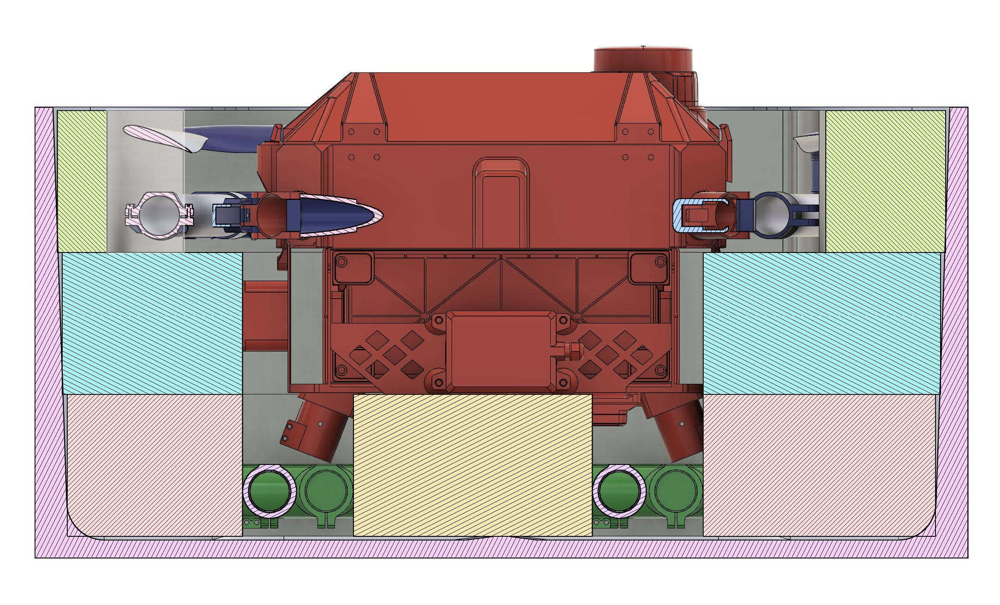
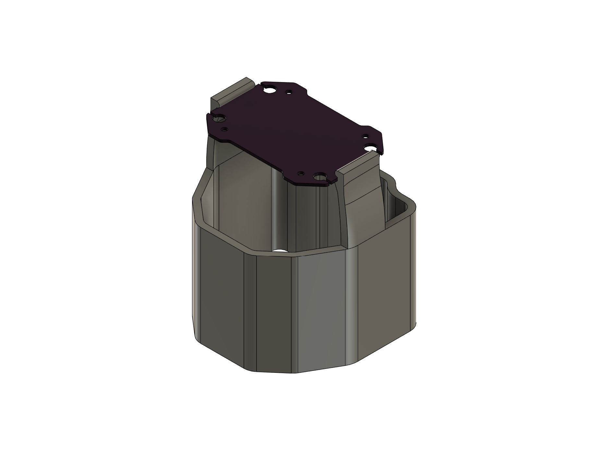
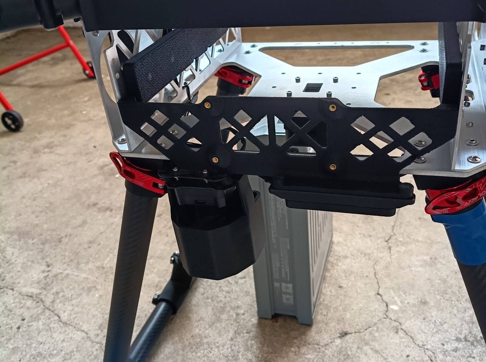
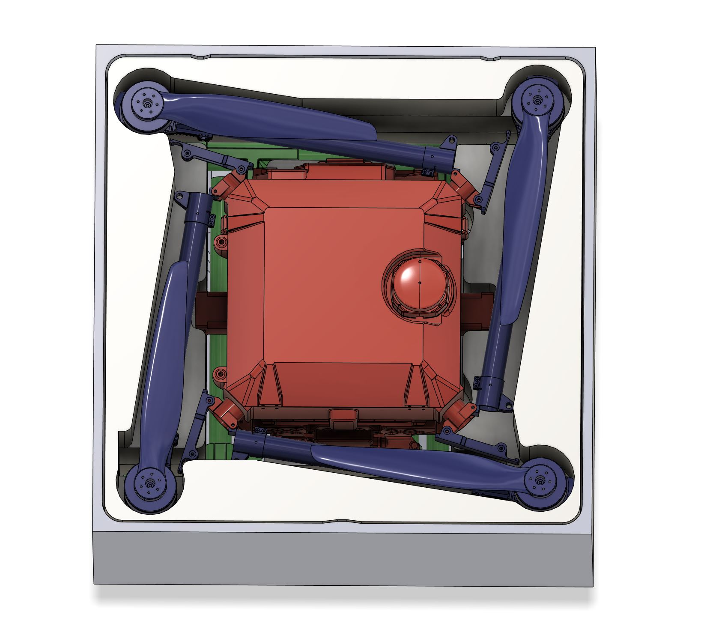
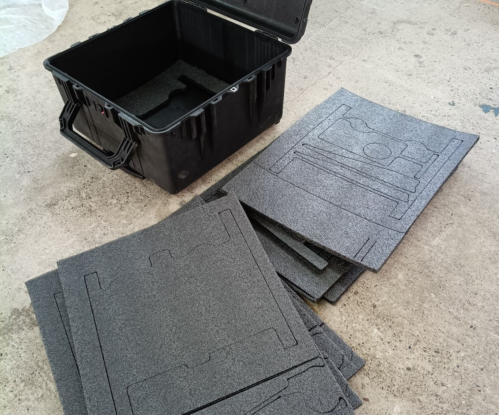
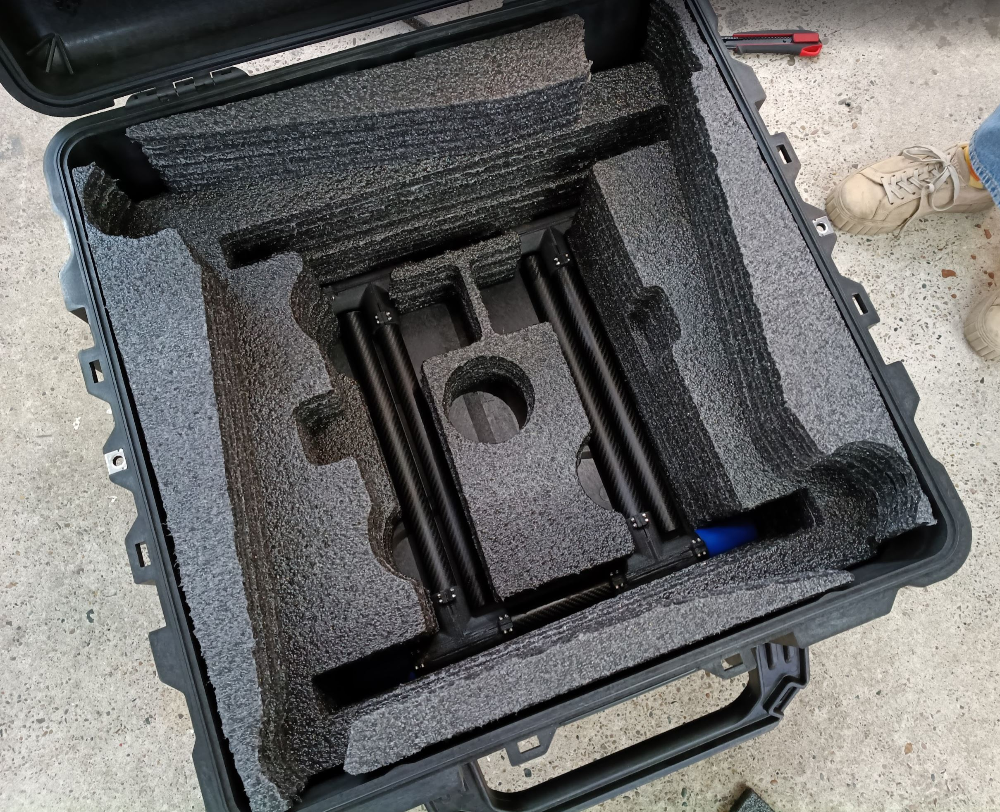
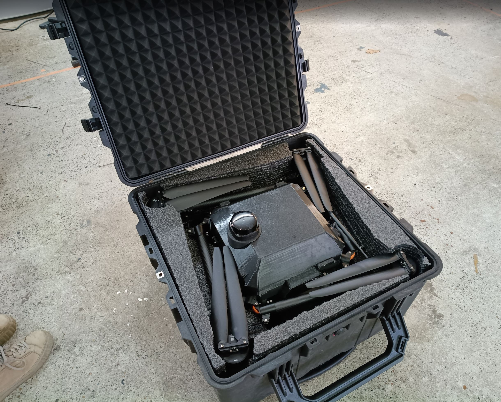

# Status

`Valid`

`Revision History: None`

`Replacement Log: None`

`Reference:` [Issue #192](https://github.com/Arrow-air/project-quiver/issues/192)

# Project Description

A transport case solution for the Quiver drone was needed to safely store and transport the fully assembled aircraft (with detached landing legs) along with motor arms, propellers, and accessories. The project covers the selection of an appropriate case, custom foam insert design and fabrication, and a protective camera cover for the gimbal system.

A Pelican 1640 case (purchased without foam insert) was selected as the transport case. Custom foam inserts were designed in CAD and cut from black PE foam sheets using a diode laser cutter. The foam layout accommodates the drone body, detached landing legs, motor arms, and propellers. A 3D-printed camera cover was also designed to protect the camera and gimbal during insertion and transport.

# Bounty or Grant Proposal Document

**QGB-06: Transport Case**

| | |
|---|---|
| **Type** | Bounty |
| **Status** | Open |
| **Reward** | $1,000 |
| **Description** | Design foam cutouts for the selected Nanuk case to safely transport the Quiver devkit. May include additional protective elements such as a camera cover. |
| **Deliverables** | Foam cutout design files; completed case with drone fitting securely; any additional protective accessories (e.g. camera cover). |

# Methodology

## Foam Insert Design

The design approach focused on creating a multi-layer foam insert that provides secure retention for all Quiver components while using readily available materials and a repeatable fabrication process.

The insert consists of three layers, each 100 mm thick (5 × 20 mm PE foam sheets laminated together):

- **Bottom Layer — Base Support:** Provides the resting surface for the drone body. Contains cutouts to stow the detached landing legs alongside the body.
- **Middle Layer — Body Enclosure:** Surrounds the drone body with a snug cutout. Also includes landing leg cutouts (pass-through), since the legs must be pulled out vertically through all layers.
- **Top Layer — Arm & Propeller Retention:** Only small foam sections remain at the edges, which press against the motor arms and propellers to keep them in place. This layer consists of 4 separate parts (not one solid piece), which made it possible to optimize the DXF layouts for cutting (see Results and Deliverables).
- **Bottom Layer Modification (Not in DXF):** At the very bottom of the Pelican 1640, there are two molded protrusions in the case floor. The bottom-most sheet (lowest 20 mm) of the bottom layer requires two additional small rectangles to be cut out by hand to accommodate these. This is intentionally not included in the DXF files to avoid requiring an additional drawing for a single sheet.

Two versions of the foam insert were designed in Fusion 360:

| Version | Description | Link |
|---|---|---|
| Adjusted (800×600) | Adapted to standard PE foam sheet size (800 × 600 mm). Cost-effective, leaves a small gap at the edges. | [Fusion 360](https://a360.co/4tQBYJ8) |
| Full Width | Slightly wider than 600 mm, fills the complete cross-section of the case without edge gaps. | [Fusion 360](https://a360.co/486vaPc) |

> **Fusion 360 Location:** Project Quiver / General / Casing

## Camera Cover

The camera cover should be mounted before placing the drone into the case. It provides additional protection for the camera and gimbal during insertion and transport, preventing accidental contact with the foam layers. The cover uses two snap-fit locking arms that engage with the camera mounting plate, allowing tool-free installation and removal.

Camera cover CAD: [Fusion 360](https://a360.co/4cMYSeG)

## Manufacturing Process

### Material

| Component | Material | Dimensions | Quantity |
|---|---|---|---|
| Foam layers (3 layers × 5 sheets) | Black PE foam sheet | 800 × 600 × 20 mm | 10× |
| Lid padding base | Black PE foam sheet | 800 × 600 × 10 mm | 1× |
| Lid cushion | Pyramid acoustic foam (TYP 100×100×5) | [Amazon link](https://www.amazon.de/dp/B07Q26QJ7Z) | 1× |

### Laser Cutting

DXF drawings were exported from the CAD model and pieces were arranged to fit into only two sheet layouts. This was possible because the top layer is made of 4 separate parts, allowing shapes from all three layers to be rearranged onto just 2 DXF files:

- `Foam_1.dxf` — Bottom layer + 2 edge pieces of the top layer
- `Foam_2.dxf` — Middle layer + 2 edge pieces of the top layer

Each DXF layout was cut from 20 mm black PE foam sheets on a diode laser. **5 sheets per layout** are required (5 × 20 mm = 100 mm per layer), totaling **10 sheets** for the full insert.

> ⚠️ **Safety Warning:** Laser cutting foam can be hazardous. PVC foam is **extremely toxic** when burned (releases hydrochloric acid). PE foam is the safest choice for laser cutting but will still produce fumes and odor. Always use proper fume extraction or have the cutting done by a professional service.

### Assembly

1. **Laminate each layer:** Glue the 5 PE foam sheets of each layer together using spray adhesive.
2. **Bottom modification:** Cut the two small rectangles from the bottom-most sheet by hand to clear the case floor protrusions.
3. **Install in case:** Glue the three completed layers into the Pelican 1640 using spray adhesive.
4. **Optional finishing:** Apply silicone sealant along the outer gaps at the top for added stability and a clean appearance.
5. **Mount camera cover** on the gimbal before inserting the drone into the case.

### Lid Padding

1. Cut a 10 mm PE foam sheet to fit the inside of the lid by hand.
2. Glue it into the lid.
3. Cut the pyramid foam sheet to size with scissors.
4. Glue the pyramid foam on top of the PE foam base layer in the lid.
5. The pyramid pattern conforms to the drone's shape and applies light pressure to hold it firmly in the case when closed.

# Results and Deliverables

## Foam Insert

## CAD Models

| Component | Link |
|---|---|
| Foam insert — Adjusted (800×600) | [Fusion 360](https://a360.co/4tQBYJ8) |
| Foam insert — Full Width | [Fusion 360](https://a360.co/486vaPc) |
| Camera cover | [Fusion 360](https://a360.co/4cMYSeG) |

> **Fusion 360 Location:** Project Quiver / General / Casing

## DXF Files

| File | Description |
|---|---|
| [`Foam_1.dxf`](data/Foam_1.dxf) | Bottom layer + 2 edge pieces of the top layer |
| [`Foam_2.dxf`](data/Foam_2.dxf) | Middle layer + 2 edge pieces of the top layer |

## Professional Manufacturing Option

The DXF files can be provided to a foam insert manufacturer to have each layer cut as a single piece (e.g., water jet or CNC router from a solid foam block). Quotes from manufacturers are being sourced.

# Remarks

- The multi-layer approach using laminated 20 mm PE foam sheets proved effective and accessible, requiring only a diode laser cutter and spray adhesive. The design can be reproduced by anyone with access to these tools.
- PE foam was chosen over other materials for laser cutting safety — PVC foam releases toxic hydrochloric acid when burned and must be avoided.
- The 4-part top layer design was a key optimization that reduced the number of unique DXF layouts from three to two, simplifying fabrication.
- The camera cover adds meaningful protection during the most vulnerable moment — inserting/removing the drone from the case — and its snap-fit design means no tools are needed.
- Professional manufacturing (water jet or CNC from solid foam blocks) may produce cleaner results and is being explored as an alternative for producing additional cases.
- The Adjusted (800×600) version is recommended for cost efficiency, as it uses standard foam sheet sizes. The small edge gaps do not affect retention.
