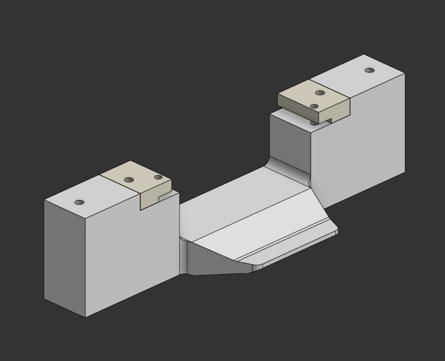
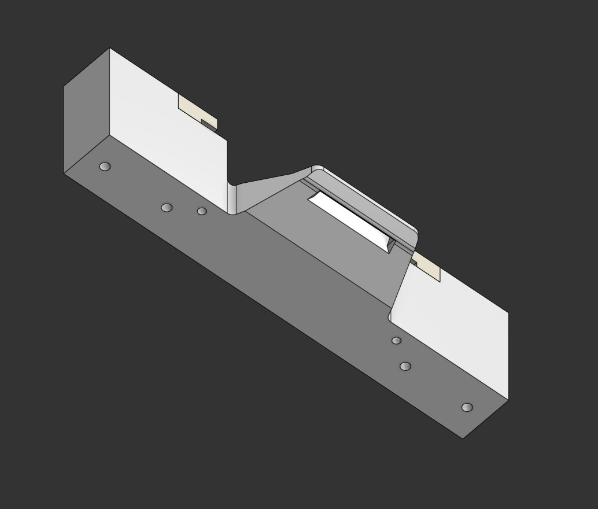

[Chinese language comparison included 包含汉语对照]: #
# Status 
[状态]: #

`Valid`

[有效]: #

# Project Description 
[介绍]: #

Based on recent flight test results and the need to optimize the PT1 3D design workspace, the engineering department has decided to initiate this task in order to improve certain parts of the PT1’s enclosure and structural components.

[基于近期的试飞结果和对pt1三维设计工作空间的优化需求，工程部门决定设立此任务，以便于对pt1的部分外壳和结构做出改进。]: #

The improvements include a new assembly for the battery enclosure, as well as a redesigned mount for the flight controller. Additionally, there is a new plan to develop a protective hatch for the flight controller, though this will proceed only after the current assemblies pass flight testing.

[改进的部分包括新的Battery enclosure的组装件，以及新的飞行控制器安装座的组装件。另有新计划为飞行控制器设计保护舱盖，但此新计划预计将在本次组装件试飞成功后再继续进行。]: #

Furthermore, on a voluntary basis, this project also includes a partial redesign of the latch structure for the Tattu 3.5 battery. The structure has been reinforced to the maximum strength permissible within the available space.

[另外，基于志愿，本次项目还附加了对Tattu 3.5电池卡扣的局部重新设计，其结构强度已强化至可用空间所允许的尽可能高的水平]: #

# Methodology 
[方法]: #

This project flexibly uses Onshape's traditional assembly and unique spatiotemporal association functions: the feature tree of the original single-component workspace is divided, remade, and assembled to transform it into a multi-component assembly space, and new components are designed on the reference primitives at the origin or characteristic spatiotemporal state of this assembly space.

[本项目灵活使用了Onshape的传统装配和特有的时空关联功能：将原有单个部件工作空间的特征树划分、重制、装配后，转变为了多部件装配空间，并在此装配空间的原点或特点时空状态下的参考图元上设计新的部件。]: #

The design results of this battery enclosure are mainly due to a relatively detailed reference to the geometric shape of the battery.

[本次battery enclosure的设计成果，主要是由于对电池的几何外形做了较为详尽的参照而得到的。]: #

## Concept
[概念]: #

### New Battery Enclosure
[新电池仓]: #

- By using both advanced software capabilities and traditional measurement methods, the new battery enclosure retains the original mounting holes and the battery's position relative to the cockpit remains the same.

[- 由于同时使用了先进的软件功能和传统的测量方法，新的battery enclosure得以保留了原有的机身安装孔位，且电池相对于机身的位置关系也维持了原样。]: #

- The homogeneous plane and lightening holes are transformed into a "skeleton-thin plate" hybrid with multiple diagonal layouts, thereby reducing weight, and the "thin plate" also plays a certain degree of dust protection.

[- 将匀质平面和减轻孔转化成了多个对角线布局的“骨骼-薄板”混合体，从而减轻了重量，而“薄板”也起到了一定程度的防尘效果。]: #

- The battery compartment door structure has been removed because its protection performance is currently considered redundant. In addition, it's currently believed that the safety factor of the battery latch meets the needs of fixing the battery.

[- 取消了电池仓舱门结构，因为目前认为其防护性能冗余。另外，目前认为电池连接器卡扣的安全系数已满足固定电池的需求。]: #

### New Flight Controller Mount
[新飞行控制器安装座]: #

- Based on the new layout of the battery enclosure and the extra space it provides, the flight controller mount is designed as a separate frame that can be embedded in the lid of battery enclosure.

[- 基于battery enclosure的新布局以及其所提供的剩余空间。将飞行控制器安装座的设计成了可以嵌入battery enclosure盖子的独立框架。]: #

- The new shock-absorbing structure is an improvement based on the old one, by changing the shock-absorbing method from upper suspension to lower suspension. The purpose is to reduce the installation height of the flight controller, and reserve design space for the subsequent protective hatch.

[- 新减震结构是在旧款基础上的改良成果，将减震的方式由上悬浮式改为了下悬挂式。目的是为了降低飞行控制器的安装高度，并为后续的保护舱盖预留设计空间。]: #

- Should use the same rubber ball as the old shock absorber.

[- 应当使用旧款减震器同款的橡胶球]: #

## Precautions
[注意事项]: #

- Due to the weight reduction design of the battery enclosure, the flight controller and GNSS receiver modules originally installed above it have changed their previous positions. Before intitial test flight with the new battery enclosure, the relative positions parameters of these devices need to be remeasured and edited.

[- 由于本次对battery enclosure的轻量化设计，导致原本安装于其上方的飞行控制器和GNSS接收机模块产生了位置变化，在使用新的battery enclosure进行首次试飞前，需要重新测量并编辑这些设备的相对位置参数。]: #

- Before the flight controller protective hatch is designed and installed, several amount of dust may still enter the battery enclosure through the frame opening of the flight controller mounting base.

[- 在飞行控制器保护舱盖设计安装之前，一定数量的灰尘依然有可能从飞行控制器安装座的框架开口部分进入battery enclosure。]: #

# Results and Deliverables 
[成果和交付]: #

## Link
[链接]: #

Onshape link to the model space: https://cad.onshape.com/documents/54f060b5ab7c1f4bb089b9ff/w/2e87b0a8422e7f67332b038a/e/94a416b6c0e768e8637b1dee

[模型工作空间的Onshape链接：]: #

## Simple Instruction
[简易指导]: # 

*Full view of the new enclosure and flight controller mount (with Pixhawk 6x)*

[新battery enclosure和飞行控制器安装座的全视图（包括Pixhawk 6x）]: #

*Explode view*

[爆炸视图]: #

## Bonus Images of Battery Latch
[电池卡扣附加内容]: #

# Remarks 
[备注]: #

This file contains Chinese original writing comments in code space.

[此文件的代码空间内包含汉语原文注释]: #
