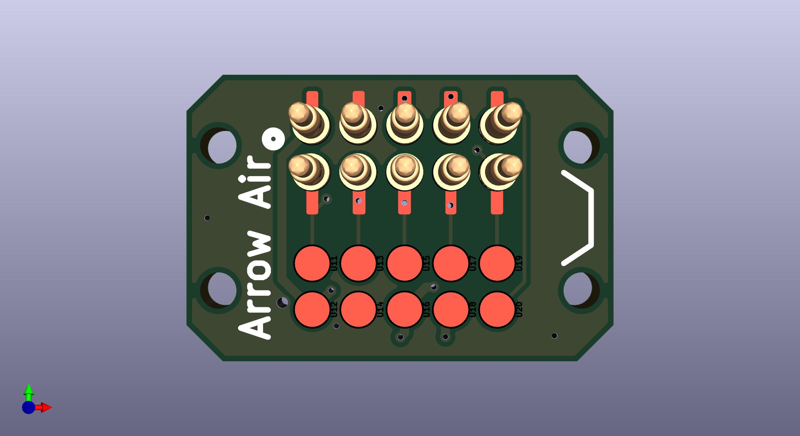
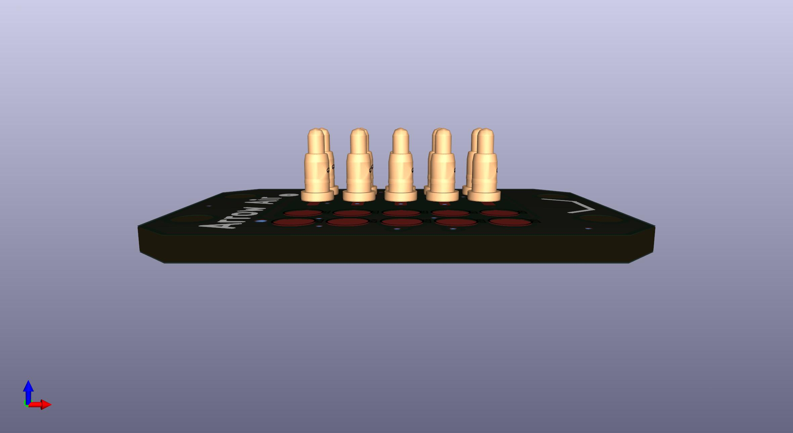
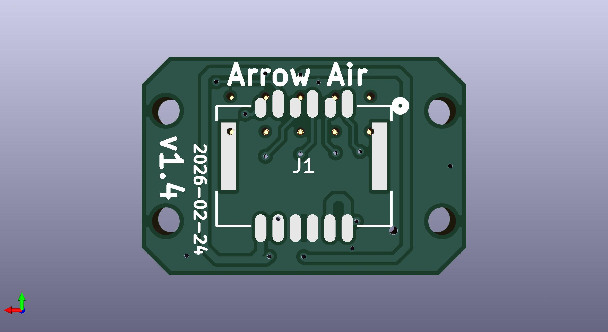

This updated PCB design retains all of the features of the original design with slight modifications. 
Notable updates:
- Front and rear solder pads extended to improve manufacturing 
- J2 and J3 Removed
- J2 replaced with U1 - U10, individual spring loaded pin headers 
- J3 replaced with U11 - U20, larger solder pads to interface with the spring loaded pins
- updated routing with rounded edges
- notch image added to indicate proper orientation relative to the quick release interface 

Design updates by Julius