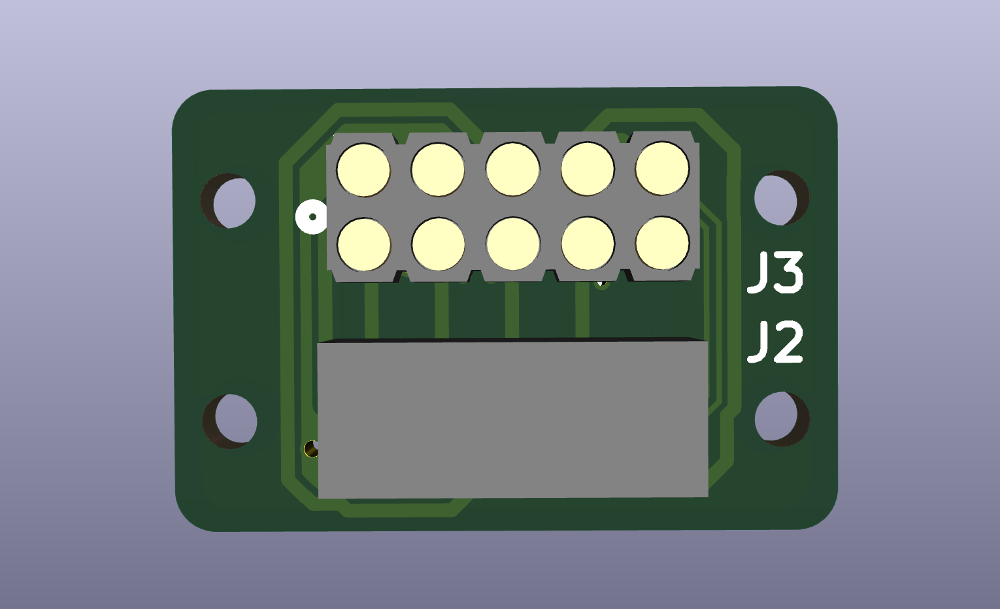

# PT 3 Attachment Interface PCB 

# Status

`Valid`

`Revision History: None`

`Replacement Log: None`

`Reference: https://dao.arrowair.com/t/pt3-attachment-interface-pcb-bounty/124 `

# Project Description

This grant is issued for the design and delivery of a 2-layer Attachment Interface PCB for Project Quiver. The board facilitates modular, standardized payload integration by providing power and signal routing between the main system and swappable attachments. This ensures robust electrical interfacing and mechanical compatibility with the quick-release payload system currently in development.

# Methodology

Simple routing of a 2-layer PCB. This PCB represents both the male and female mating sides such that the single board can be used in either configuration based on which header is populated.

# Results and Deliverables

- **Problem to solve:**  
  Current payloads require hand-wired connections. We want to streamline payload swapping and power/signal delivery with a standard interface.

- **Deliverables:**  
    - KiCAD schematic and layout files (May 29)  
    - Gerber + drill files (May 29)  
    - Final BOM (May 30)  
    - Documentation with renders and integration notes (May 30)  

- **Outcomes:**  
    - A reproducible, reliable hardware interface for payloads
    - Open source documentation and reference materials for future use

## Images
- 
- 
- 
- 

### Design Constraints

- PCB Size
- Component placement
- Enclosure dimensions
- Layers
- Section for manufacturing constraints
  - PCB Trace width
  - Distance between traces 

# Remarks
- This board will include two possible mounting configurations:
    - Pogo pins on one side
    - Solder pads on the mating board
- Reference Molex part #2077601281 and mating part #2045231201
- CAD and physical integration will align with the Quiver quick-release payload plate