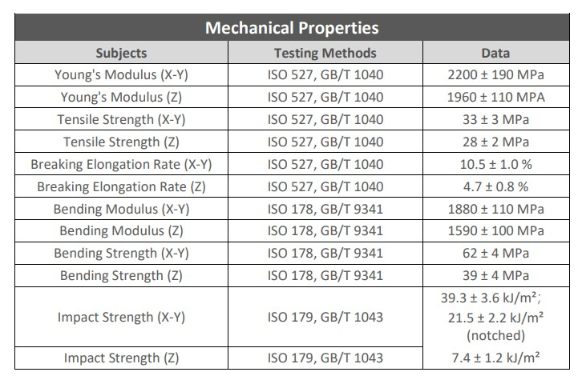

<!--Chinese language comparison included 包含汉语对照-->
# Status 

Draft

# Project Description

由于Quiver项目长期以来使用3D打印方法制作原型和部分产品的结构件，但缺乏对其强度的具体研究，且最初级的FEA（有限元分析）工作流程仅适用于均质部件，无法为3D打印件提供可靠结果。为了解决这个问题，现决定收集并整理一些学术知识，以增进我们对3D打印结构的了解，并在成本可控的前提下改良我们的3D打印结构设计流程。

同时，将收集一些注塑相关的参数，与3D打印件进行比较。

# Methodology 

将结合过往的3D打印操作经验，并在网络上搜索和整理相关的研究成果和论文，同时将收集到的文章和标准交由AI助手ChatGPT-O3进行交叉比对。必要时将使用Inventor或Fusion进行实操和求解。

# Results and Deliverables 

## Overview

通常3D打印（增材制造）部件无法通过使用均质参数的FEA得出正确结果，在宏观方面有以下主要原因：

1. 各类不同的层厚、壁厚和infill密度设计，会直接影响力在部件内的传递。
2. 层内的耗材分子连接连续性好，就像玻璃受热相变后又冷凝为单体。而层间则为强度较弱的二次熔融扩散连接，就像两块一经解冻又再次冷冻在一起的肉，外壁相互之间粘合。这个特征导致部件的XY（层内）与XZ（层间）方向之间强度差别巨大。

这些特性致使3D打印件需要使用正交各向异性的FEA方法来求解，并且各种不同的密度和填充参数均需要定制不同的工作流程。总而言之，相对于均质部件，3D打印部件的FEA流程实际上变化多样。

微观方面则有下列影响，虽然以我们现有技术手段无法对它们进行系统性的分析，但依然值得列出并关注：

1. 切片软件产生的转角、过挤出、欠挤出，以及速度和压力曲线的变化，导致的不均匀线宽、微观间隙、碳化差异等。
2. 长时间打印，不同层之间因为温度梯度而产生的内应力（同时也是部件翘曲的原因）。
3. 在不同环境下保存或不同厂家生产的耗材质量，其中的杂质会对整体强度造成影响，例如水汽等。

## Software Selection

|Software|Functions|Availability|
|-|-|-|
|Fusion|Simulation for homogeneous or isotropic materials|No (Can't match the current needs)|
|Inventor (with Nastran)|Simulations for orthotropic materials|Yes (Cheap and well-functioning|
|Siemens NX|Simulations for orthotropic materials|No (Expensive)|
|Netfabb|Wall/infill preparation and heat/stress simulation for 3D printing process|No (Expensive)|
|Digimat|Representative elementary volume (RVE) microscopic simulation|No (Too micro for current needs)|

目前，大部分支持正交各向异性和微观结构模拟的CAD软件都非常昂贵，所以此information note将主要围绕Fusion或Inventor支持的功能进行解释。

## Material Data Preparation

TBD 正确的参数？

2. 使用兼容的Tensile testing machine
3. 两者需要配合使用

### From Manufacturer's parameter card

不像均质材料的各向同性FEA，正交各向异性FEA所需的参数更多，需要进行大量准备。对于声誉良好且测试环节完善的3D打印耗材丝制造商，通常我们可以在其商品页面找到对应材料的性能表或文档。对于缺乏的材料，需要进行一系列的拉伸、弯曲和剪切试验来取得。

|BASF Ultrafuse ABS|BambuLab ABS|
|-|-|
|||

(This sheet is only applicable for ambient temperature environments or non-thermal analysis workflows)

|#|Item|Symbol (Unit)|Possible Ways To Obtain|
|:-|-:|-|-|
|1|Density of fresh filament|ρ (g/cm3)|Usually provided perfectly|
|2|Young's (Tensile) Modulus X|Ex (Gpa *)|Usually provided|
|3|... Y|Ey|Patterns of parallel traces have no testing standard, usually no Y data provide|
|4|... Z|Ez|Usually provided|
|5|Tensile Strength X|σx (Mpa)|Usually provided|
|6|... Y|σy|Patterns of parallel traces have no testing standard, usually no Y data provide|
|7|... Z|σz|Usually provided|
|8|Shear Modulus XY|Gxy||
|9|... YZ|Gyz||
|10|... XZ|Gxz||
|11|Shear Strength XY|τ12||
|12|... YZ|τ23||
|13|... XZ|τ13||
|14|Poisson’s Ratio XY|νxy||
|15|... YZ|νyz||
|16|... XZ|νxz||

\* Different software and workflows may use different magnitudes of units.

### From Tensile Testing Machine Result

TBD 

对于缺乏的参数，需要参照以下测试标准，将测试条以3种不同的方向打印，并以标准内指定的方式获取参数：

|Standard Name|Specimen|Method|Purpose|
|-|-|-|-|
|ISO 527-2|ASTM D638|Tensile testing by pulling apart|Get Young's modulus / Tensile modulus|
|ISO 178|ASTM D790|Flexural or bending testing by press on center||
|ISO 179-2|ASTM D6110|Charpy impact testing by strike on other side of the notch||

## Shape Preparation

~~在使用FEA求解前，需要手动将模型抽壳至所需壁厚，并将其中填入所需的infill模板。~~

TBD 考虑到ASTM测试条的尺寸难以完整容纳各类infill模板，本次研究可能得出负面结论。

按不同打印层数切片的方式不实际，因为可能产生过大的元素数量，反而导致运算困难。

TBD 模型的UCS定向？

按3D打印的常规理解方式，垂直方向即为正交的Z轴。

TBD 每个元素的细分精度和预计需要的时间？

## Additional Tip For Actual 3D Printing Manufacturing

如果最终FEA结果与测试差异过大（＞ 20 %）或因其他某些原因导致FEA结果无法确信，目前已知只能通过以下方法尝试进一步提高打印强度：

|Procedures|Theory|
|-|-|
|**Design**||
|Use 1.5 ~ 2 times of wall thickness|Increase interlayer connection strength|
|Double the amount of corner braces and reinforce beams|Directly improve overall strength|
|Use chamfered corner design more often|Increase the bending strength around corners|
|**Slicing**||
|Use better force spreading infill patterns|Disperse the load force into different directions or other fasteners|
|Optimizing print direction|Avoid shear and tension between layers by rotate the slicing|
|Enable brick layer slicing|Improve XZ ultimate tensile strength by 5 ~ 10 % during tensile stress test for most filaments|
|**Printing**||
|Increase the nozzle and chamber temperature|Reduce cooling gradient for interlayer fusion connection|
|Reduce cooling effect|Make molecular chains of fresh extruded traces better connecting between neighbor traces|
|Minimize the print layer height|Increase interlayer fusion area|
|**Post Processing**||
|Sufficient annealing treatment|Make molecular chains better connecting in all direction and release internal stress|
|Epoxy resin infill|Simulating the effect of reinforced concrete by taking advantage of the hollow nature of 3D printing|

## Compare To Other Technologies

### ~~Vs Injection Molding~~

TBD 精简此章后删除此表格

|-|FDM 3D Printing|Injection Molding|
|-|-|-|
|Build Pressure|1 ~ 35 Mpa (Gear extrude)|2 ~ 200 Mpa (Hydraulic screw press)|
|XY Tensile Modulus (GPa)|1.6 (80 %)|2.0 (100 %)|
|XZ Tensile Modulus (GPa)|0.8 (40 %)|Isotropic *|
|XY Tensile Strength (MPa)|32 (80 %)|40 (100%)|
|XZ Tensile Strength (MPa)|12 (30 %)|Isotropic *|

### Brief Comparison Of Available Manufacturing Processes

TBD 可以在此加入电子束熔融、气溶胶喷射成型等工艺的表格，列出其所属工艺分类和主要用途，不需要详细比较参数。

 众所周知，使用常见的FDM(Fused Deposition Modeling)3D打印方法，在相同规格下，无论是否使用工业级设备，其产品强度都无法匹敌注塑件，同时3D打印在材料选择上也不具有注塑件的灵活性。
 但FDM 3D打印工艺具有可快速设计、快速迭代的特性，因此在非受力部件的应用上有绝对优势，这又是注塑无法比拟的。
 但是，实际上其他更先进的3D打印技术已经在逐渐逼近注塑级强度，同时还有着远比注塑更加低廉的成本，但材料类型又有限制。以下是一些对比：

（All material values in the table are typical values）

 |-|FDM|SLS (Selective Laser Sintering)|MJF (Multi Jet Fusion)|Injection Molding|Metal SLM (Selective Laser Melting)|CNC Machining|
 |-|-|-|-|-|-|-|
 |Material characteristics|XZ Orthotropic|85 % Isotropic|97 % Isotropic|Isotropic *|90 % Isotropic|Isotropic|
 |Material Source|Common 3d printing plastics|PA11, PA12, PA12-CF/GF, PA-AF(Aluminum-filled), PP, TPU|PA11, PA12, PA12-CF/GF, TPU|Plastic universal|Titanium alloy, 316L, AlSi10Mg alloy|Solid block or sheet object universal|
 |Material Customizability|Single filament|Dyeable|Dyeable|Multi ingredient mixable|Single powder|Single block|
 |Representative Materials|ABS|PA12|PA12|ABS|AlSi10Mg alloy|6061 Aluminum alloy|
 |-|-|-|-|-|-|-|
 |Raw Material Density (g/cm3)|1.05|0.93|1.01|1.03|2.66|2.7|
 |XY Tensile Strength (MPa)|32|45|50|40|360|310|
 |XZ Tensile Strength (MPa)|18|85 % XY|97 % XY|= XY|90 % XY|= XY|
 |-|-|-|-|-|-|-|
 |Dimensional Accuracy (mm)|0.05|0.1|0.05|0.01|0.1|0.01|
 |Design-To-Deliver Time|Hours|Days|Days|Weeks|Days|Weeks|
 |Typical Starting Cost $|0.5|10|8|800|35|50|

  \* Controlled by different injection point designs. May perform simulator with Autodesk Moldflow or similar software.

## Questions & Uncharted Knowledge

- 3D打印件本身是否可以衍生设计作为模具使用？是否可以承受模具所受的温度和压力？
- 是否有可靠的化学凝固的方式可以作为注塑的下位替代品？例如环氧树脂水晶滴胶或光敏树脂？
- 是否可以通过喷涂强化涂料来增加3D打印件外壁强度？
- 是否有小批量且低成本的注塑工艺流程？

# Remarks 
