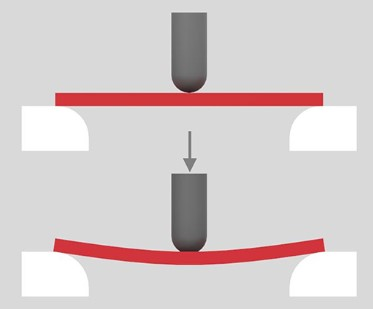
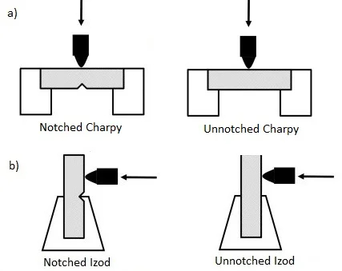
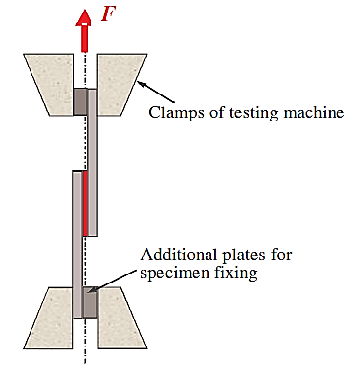
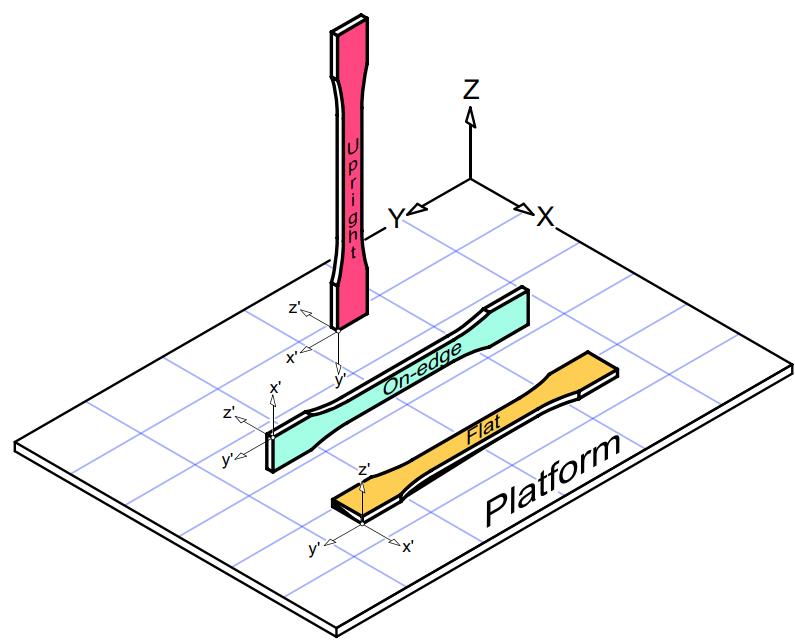

<!--Chinese language comparison included 包含汉语对照-->
# Status 

Draft

# Project Description

Due to Project Quiver has long used **FDM 3D printing** (Fused Deposition Modeling of Additive Manufacturing) to create various prototypes and structural components, but we still lacking specific research into its material strength characteristics. Furthermore, our very basic **FEA** (Finite Element Analysis) workflow can only works for homogeneous parts like injection molding and metal, and cannot provide reliable results for 3D printed parts.

To alleviate this problem, we have decided to collect and organize some academic knowledge and industry standards to begin to enhance our understanding of 3D printing structures and improve our 3D printing structure design process under the premise of controllable costs.

At the same time, this article will also organize some collected relevant parameters of mainstream and experimental component forming technologies and make a simple comparison between them.

<!-- 
由于Project Quiver长期以来使用**FDM 3D打印** (Fused Deposition Modeling of Additive Manufacturing）制作部分原型和结构件，但我们一直缺乏对其材料强度特性的具体研究，且最初级的**FEA**（有限元分析）工作流程仅适用于注塑、金属等均质部件，无法为3D打印件提供可靠结果。

为了缓解这个问题，现决定收集并整理一些学术知识和业界标准，开始增进我们对3D打印结构的了解，并在成本可控的前提下改良我们的3D打印结构设计流程。

同时，还将在这片文章中整理一些收集到的主流和实验性零部件成型技术的相关参数，并在它们之间进行简单对比。
-->

# Methodology 

Based on our past experience in 3D printing parts production, we will search and organize relevant research results and academic papers online. We will then use the AI assistant ChatGPT-o3 to cross-reference and compare these articles and standards (without using less logically rigorous language models like 4o). 

We will use Inventor or Fusion for practical operations and generate solutions when necessary.
<!--
将基于我们过往的3D打印零部件制作经验，在网络上搜索和整理相关的研究成果和学术论文，同时将收集到的文章和标准交由AI助手ChatGPT-o3进行交叉查询和比对（不使用4o等逻辑严密度较低的语言模型）。

必要时我们将使用Inventor或Fusion进行实操并求解。
-->

# Results and Deliverables 

## The Problem

FDM 3D printed parts often fail to produce accurate results using FEA with simple homogeneous parameters. The reasons can be divided into two aspects as Macroscopic and Microscopic. Although our current technical means cannot systematically analyze microscopic characteristics, but it's still worth listing and paying attention to them:

<!--
FDM 3D打印部件通常无法通过使用简单均质参数的FEA得出正确结果，原因则可区分为宏观和微观两大方面。虽然以我们的现有技术手段无法对微观特性进行系统性的分析，但依然值得一并列出并加以关注：
-->

|Conditions|Results|
|-|-|
|**Macroscopic**||
|Various designs of layer thickness, wall thickness and infill percentage|Directly affects the transmission of force inside the component|
|The melting mode of inter-layers is different from in-layers. Which the in-layers is mainly continuous melting, while the inter-layers is secondary melting diffusion|Huge strength difference in between the XY (in-layer) and XZ (inter-layer) directions|
|**Microscopic**||
|Corners, over-extrusion, under-extrusion, and changes in speed and pressure curves generated by different slicing software|Uneven line widths, micro gaps, and even the carbonization differences|
|Long printing time|Internal stress generated between layers due to temperature gradients (also it's the cause of warping)|
|Fliament from different storage environments and different levels of manufacturers|Impurities inside will affect the overall strength, such as water vapor|
|Different device and extruders with different hole diameters can produce different cross-sections|Gaps size between printed tracks are also different, and the sizes are nonlinear|
|...||

These characteristics causes the require of orthotropic FEA methods to solve FDM 3D printed parts, and various infill parameters require various customized workflows. 

In short, compared to homogeneous parts, the FEA process for FDM 3D printed parts is actually more varied and difficult to achieve stable accuracy.

<!--
宏观：
1. 各类不同的层厚、壁厚和infill百分比，会直接影响力在部件内的传递。
2. 层内的耗材分子连接连续性好，就像玻璃受热相变后又冷凝为单体。而层间则为强度较弱的二次熔融扩散连接，就像两块一经解冻又再次冷冻在一起的肉，外壁相互之间粘合。这个特征导致部件的XY（层内）与XZ（层间）方向之间强度差别巨大。（KBM简单注释：层间与层内的熔融方式不同，层内主要为连续熔融，层间则为二次熔融扩散。）

微观：
1. 切片软件产生的转角、过挤出、欠挤出，以及速度和压力曲线的变化，导致的不均匀线宽、微观间隙，甚至是碳化差异等。
2. 长时间打印，不同层之间因为温度梯度而产生的内应力（同时也是翘曲的原因）。
3. 来自不同存放环境和不同级别厂家的耗材，其中的杂质会对整体强度造成影响，例如水汽。
4. 不同设备或不同孔径的挤出机可产生不同截面的打印轨迹，导致打印轨迹之间的空隙大小也不相同，并且呈非线性。
   ...

这些特性导致FDM 3D打印件需要使用正交各向异性的FEA方法来求解，并且各种不同的infill参数均需要定制不同的工作流程。

总而言之，相对于均质部件，FDM 3D打印部件的FEA流程实际上变化多样，很难有稳定的准确率。

-->

## Software Selection

There are many FEA software options on the market, and different software may be targeted at different levels of FEA. We need to choose the right software to perform the required FEA. Some software only works for simple deformation, some are suitable for anisotropy or nonlinearity, and some are even specialized only for microstructure of materials:

<!--
市场上的FEA软件有许多选择，不同软件可能针对不同程度的FEA。我们需要选择合适的软件才能进行所需的FEA。有些软件仅适合简单形变，有些适合各向异性或非线性，甚至有些仅专门针对材料微观结构：
-->

|Software|Simulation Functions|Availability|
|-|-|-|
|Autodesk Fusion|For homogeneous or isotropic materials|No (Below the current need)|
|Autodesk Inventor (with Nastran)|For isotropic, orthotropic, linear or nonlinear methods|**Yes** (Not expensive and well-functioning)|
|Siemens NX|...|No (Expensive)|
|Autodesk Netfabb|Fusion integrable 3D printing infill preparation and heat/stress simulation|No (Not for FDM, also expensive)|
|Digimat|For representative elementary volume (RVE) microscopic such as fabric fiber and micro mechanical|No (Too micro for current needs)|
|...|||

Currently, most CAD software that supports orthotropic FEA methods are very expensive, including those examples in the above list. So this information note will mainly explain the functions supported by two relatively low-cost software: Autodesk Fusion and Autodesk Inventor.

<!--
目前，大部分支持正交各向异性FEA方法的CAD软件都非常昂贵，包括上述列表中的这些例举。所以此information note将主要围绕Fusion和Inventor这两个成本相对较低的软件所支持的功能来进行解释。
-->

## Material Data Preparation

### Start From Manufacturer's Parameter Card

Compared to isotropic FEA for homogeneous materials, orthotropic FEA requires more parameters and takes a certain amount of time to collect characteristic data of the filament.

For filament manufacturers with good reputations and comprehensive testing procedures, we can usually find the performance sheet or document of the corresponding filament on the product webpage, which should include most of the basic parameters, as example shown in the figure below:

<!--
相比于均质材料的各向同性FEA，正交各向异性FEA所需的参数更多，需要花费一定时间收集filament的特性数据。

对于声誉良好且测试环节完善的filament制造商，通常我们可以在其商品页面找到对应filament的性能表或文档，其中应包含大部分基础参数，例如下图所示：
-->

|BASF Ultrafuse ABS|BambuLab ABS|
|-|-|
|||

The following is a material characteristic table required for orthotropic FEA. For some items, the data provided by the manufacturer can be used directly. For some item where the data is missing from manufacturer, it is recommended to conduct a series of tensile and shear tests according to the standards described in the table below to obtain the following data:

<!--
以下是进行正交各向异性FEA所需的材料特征卡，部分项目可以直接使用厂家所提供的数据，对于部分缺乏的数据，则建议按下表内所述的标准，进行一系列的拉伸和剪切试验来取得：
-->

(In order to unify the test environment and values, it is recommended that the entire test process be deployed according to ISO standards, and ASTM standards should only be used in special circumstances. Also, this sheet is only applicable for ambient temperature environments or non-thermal analysis workflows.)

|#|Item|Symbol (Unit)|Possible Ways To Obtain|
|:-|-:|-|-|
|1|Density of fresh filament|ρ (g/cm3)|Usually provided perfectly / Test by ISO 1183-1|
|2|Young's / Tensile Modulus X|Ex (Gpa)|Usually provided / Test by ISO 527-2|
|3|... Y|Ey|Test by ISO 527-2|
|4|... Z|Ez|Usually provided / Test by ISO 527-2|
|5|Shear Modulus XY|Gxy (Gpa)|Test by ISO 4587|
|6|... YZ|Gyz|...|
|7|... XZ|Gxz|...|
|8|Poisson’s Ratio XY|νxy|Test by ISO 527-2 with laterally strain measuring|
|9|... YZ|νyz|...|
|10|... XZ|νxz|...|

We may save the following intermediate results for later use during the test:

<!--
在进行测试时，可以保留以下中间结果，以备后续使用：
-->

|#|Item|Symbol (Unit)|Possible Ways To Obtain|
|:-|-:|-|-|
|1|Tensile Strength X|σx (Mpa)|Usually provided / Test by ISO 527-2|
|2|... Y|σy|Test by ISO 527-2|
|3|... Z|σz|Usually provided / Test by ISO 527-2|
|4|Shear Strength XY|τ12 (Mpa)|Test by ISO 4587|
|5|... YZ|τ23|...|
|6|... XZ|τ13|...|

## To Fullfill By Standard Testing

Additionally, the table below provides an diagram and description of the purpose of all required test standards, including the ISO 178 bend test, which is not strictly required for orthotropic FEA:

<!--
另外，下表是所有所需的测试标准的图解和目的说明，其中包括了对于正交各向异性FEA来说并不严格必需的ISO 178弯曲测试。
-->

|Standard|Diagram|Method|Purpose to get|
|-|-|-|-|
|ISO 178||Flexural testing by press on center of the large surface|Flexural strength and modulus|
|ISO 179-2(a) and ISO 180(b)||Charpy and izod impact testing by strike on two different points of the longitude side|Charpy and izod impact strength|
|ISO 527-2||Slowly pulling apart the bone shaped specimen|Tensile modulus and strength|
|ISO 4587||Slowly pulling apart the single lap shaped specimen|Shear modulus and strength|

## Test The Standard Testing Specimens

When preparing test specimens, 3D-printed models should strictly adhere to the dimensions specified by the respective ISO standards, and any scaling or styling modifications should be avoided.

When slicing, the model should be rotated to generate the specimens G-code in three main axes. This allows the inter-layer performance of the specimen to vary between the XY, XZ, and YZ axes. 

Using ISO 527-2 as an example:

<!--
在准备测试样本时，应严格按照各个ISO标准所规定的尺寸制作3d打印模型，且不应对模型进行任何缩放和造型修改。

在slicing时，要旋转模型，以生成3种主要轴向的样本G-code，用于使样本的inter-layer之间表现出在XY、XZ、YZ三个轴向上的不同性能，以ISO 527-2为例：
-->

The standard tests used by filament manufacturers typically utilize 100% solid-fill specimens to reflect the theoretical optimal performance of their filament.

However, if the project part we plan to perform FEA on is a non-ssolid-fill part with a regular infill pattern inside, we should use the same wall thickness and infill settings as the project part when slicing the specimen, to simulate the internal structure of the project part as accurately as possible.

Furthermore, the size of a standard specimen may not fully accommodate an small ratio infill pattern, so the standard test is only applicable to parts designed with an infill of 20 % or more. And the specimen's wall thickness should be kept within a reasonable range, or it will interrupt on the infill and affect the reliability of the test results. In extreme cases, it's even recommended to omit the top and bottom surfaces of the specimen printings to maintain a simple infill with outer wall structure.

For articles of the deployment test environment and specific test processes, please refer to the respective ISO standard documents.

<!--
Filament制造商所使用的标准测试通常采用 100 % 实心填充的测试条，以体现其filament的理论最佳性能。

但如果计划进行FEA的project零部件是非实心件，且内部为规则的infill模板，则在为测试条slicing时，也需要使用与project零部件相同的壁厚和infill设置，以尽可能准确地模拟project零部件的内部结构。

并且，考虑到标准测试条的尺寸难以完整容纳比例过小的infill模板，所以标准测试仅适用于设计infill ≥ 20 % 的零部件。同时，测试条的壁厚也不能过大，否则会挤占infill的空间，影响测试结果可靠性。在极端情况下，甚至建议适度取消测试条打印件的顶面和底面，以尽量保证infill和外壁结构简单。

关于部署测试环境和具体测试流程的文章，也请另行查阅各ISO标准文件。
-->

## Send The Components To Solve

- 在开始求解前，需要通过手动建模的方式，将project零部件的模型抽壳至设计slicing的壁厚，并将其内部填入slicing时预计使用的infill模板。
  - 设计infill比例应大于 20 %

- 在材料卡内填入所需材料参数（参见[Inventor官方文档](https://help.autodesk.com/view/NINCAD/2025/ENU/?guid=GUID-1379B1A4-009C-4D58-8CF7-CC84D4255B23) ）
  - 应使用infill参数相同的测试条所得出的材料参数。

- 对部件的材料特性进行定向。
  - 按3D打印的常规理解方式，垂直方向即为Z轴，即inter-layer关系，适用于Z轴向上且不需要改变安装方向的部件。
  - 若需要模拟部件在打印后旋转并组装，或任何非inter-layer轴向上的场景，则需要对部件进行UCS定向（参见[Inventor官方文档](https://www.autodesk.com/support/technical/article/caas/sfdcarticles/sfdcarticles/How-to-define-the-material-axes-in-Nastran.html)）

- 对模型进行细分。
  - 应在模型内部进行目视检查，以确定infill已被细分，且包含足够的元素。
  - 可能产生极大的元素数量，预计细分和FEA运算的耗时为各向同性FEA的2~3倍。

- 准备完成后，即可按既有场景开始求解，剩余工作流程类似于各向同性FEA。

- 基于FEA解算结果，即可开始对project零部件进行全方位改良。
  - 改良后的project零部件应经过实地载荷测试、试飞和观察，且实地测试结果和FEA结果之间的理想误差应小于 20 %
  - 在处理误差时，宁可保留冗余结构，也不应精简结构和安全系数。

## Additional Tip For Actual 3D Printing Manufacturing

然而，如果最终FEA结果与测试差异过大（＞ 20 %）或因其他原因导致FEA结果无法确信，目前已知只能通过以下方法尝试进一步提高打印强度：

|Procedures|Theory|
|-|-|
|**Design**||
|Use 1.5 ~ 2 times of wall thickness|Increase interlayer connection strength|
|Double the amount of corner braces and reinforce beams|Directly improve overall strength|
|Use chamfered corner design more often|Increase the bending strength around corners|
|**Slicing**||
|Use better force spreading infill patterns|Disperse the load force into different directions or other fasteners|
|Optimizing print direction|Avoid shear and tension between layers by rotate the slicing|
|Enable brick layer slicing|Improve XZ ultimate tensile strength by 5 ~ 10 % during tensile stress test for most filaments|
|**Print**||
|Increase the nozzle and chamber temperature|Reduce cooling gradient for interlayer fusion connection|
|Reduce cooling effect|Make molecular chains of fresh extruded traces better connecting between neighbor traces|
|Minimize the print layer height|Increase interlayer fusion area|
|**Post Processing**||
|Sufficient annealing treatment|Make molecular chains better connecting in all direction and try release any internal stress|
|Epoxy resin infill|Simulating the effect of reinforced concrete by taking advantage of the hollow nature of 3D printing|

## Brief Comparison Of Available Manufacturing Processes

It's well known, the common FDM 3D printing method, within the same material specifications, regardless of whether industrial-grade equipment is used or whether fiber filaments are involved, the strength of products cannot match that of injection molded parts. And 3D printing also lacks the flexibility of injection molding in terms of material selection. 

However, the FDM 3D printing, with its rapid design and iteration capabilities, offers a clear advantage in the application of non-load-bearing parts, that's something injection molding cannot match.

In reality, there're other more advanced 3D printing technologies are gradually approaching or even surpassing the strength of injection molding, while offering lower costs comparing to molding. However, these technologies also have limitations in terms of material selection. Here are some comparisons:

<!--
 众所周知，使用常见的FDM 3D打印方法，在相同材料规格下，无论是否使用工业级设备或是否包含纤维丝，其产品强度都无法比拟注塑件，同时3D打印在材料选择上也不具有注塑件的灵活性。
 
 而FDM 3D打印工艺具有可快速设计、快速迭代的特性，因此在非受力部件的应用上有绝对优势，这又是注塑无法比拟的。

 但实际上，其他更先进的3D打印技术已经在逐渐逼近甚至超越了注塑级强度，同时有着比注塑更加低廉的成本，但在材料选择上又存在限制。以下是一些对比：
-->

（All material values in the table are typical values）

 |-|FDM|SLS (Selective Laser Sintering)|MJF (Multi Jet Fusion)|Injection Molding|Metal SLM (Selective Laser Melting)|CNC Machining|
 |-|-|-|-|-|-|-|
 |Material characteristics|XZ Orthotropic|85 % Isotropic|97 % Isotropic|Isotropic *|90 % Isotropic|Isotropic|
 |Material Source|Common plastics filaments|PA11 PA12 PA12-CF/GF PA-AF(Aluminum-fill) PP TPU|PA11 PA12 PA12-CF/GF TPU|Plastics universal|Titanium alloy 316L steel AlSi10Mg alloy|Solid block or sheet object universal|
 |Material Customizability|Single filament|Dyeable|Dyeable|Multi ingredient mixable|Single powder|Single block|
 |Representative Materials|ABS|PA12|PA12|ABS|AlSi10Mg alloy|6061 aluminum alloy|
 |-|-|-|-|-|-|-|
 |Raw Material Density (g/cm3)|1.05|0.93|1.01|1.03|2.66|2.7|
 |XY Tensile Strength (MPa)|32|45|50|40|360|310|
 |XZ Tensile Strength (MPa)|18|85 % XY|97 % XY|= XY|90 % XY|= XY|
 |-|-|-|-|-|-|-|
 |Dimensional Accuracy (mm)|0.05|0.1|0.05|0.01|0.1|0.01|
 |Design-To-Deliver Time|Hours|Days|Days|Weeks|Days|Weeks|
 |Typical Starting Cost $|0.5|8|10|800|25|12|

  \* Controlled by different injection point designs. May perform simulation with Autodesk Moldflow or similar software.

## Questions & Uncharted Knowledge

- Can the 3D-printed part itself be used as a mold for a derivative design? Can it withstand the temperatures and pressures encountered in a mold?
- Are there reliable chemical curing methods as a lower-end alternative to injection molding? For example, epoxy or photosensitive resin?
- Can the outer wall of a 3D-printed part be strengthened by spraying a reinforcing coating?
- Are there low-volume, low-cost injection molding processes?

<!--
- 3D打印件本身是否可以衍生设计作为模具使用？是否可以承受模具所受的温度和压力？
- 是否有可靠的化学凝固方法作为注塑的下位替代品？例如环氧树脂或光敏树脂？
- 是否可以通过喷涂强化涂料的方法来增加3D打印件外壁的强度？
- 是否有小批量且低成本的注塑工艺流程？
-->

## Summarize

While this information note summarizes the most accurate FEA method currently available for realistic FDM parts, but the accuracy of these FEA solutions remains uncertain. At the same time, standard testing requires a certain amount of time, money and physical effort, which may result in parts relying on FDM 3D printing being less cost-effective than parts with nearly isotropic properties such as SLS or MJF.

Therefore, I believe that orthotropic FEA should only be performed on parts in special cases (Such as low-cost FDM production and easy distribution are required). Otherwise, non-standard testing processes such as "manufacturing-testing-remodeling" should be performed to improve the mechanical properties of mass-produced parts, or those mass production should be directly considered using manufacturing methods such as SLS and MJF where FEA results are predictable.

<!--
虽然此information note已经总结出了目前已知最接近真实FDM部件情况的FEA方法，但此FEA求解结果的正确性依然存在不确定性。同时，标准测试需要花费一定时间、资金和体力成本，可能会导致依赖FDM 3D打印的部件在效益上劣于SLS或MJF等近似各向同性的部件。

所以我认为，仅在特殊情况下才应对部件进行正交各向同性FEA（例如必须满足低成本FDM生产、易于分发等条件），否则应当使用 “制造 - 测试 - 修改模型” 等非标准测试流程来提高量产部件的力学性能，或直接考虑使用SLS、MJF等FEA结果可预期的制造方式进行量产。
-->

# Remarks 
(End of document)
