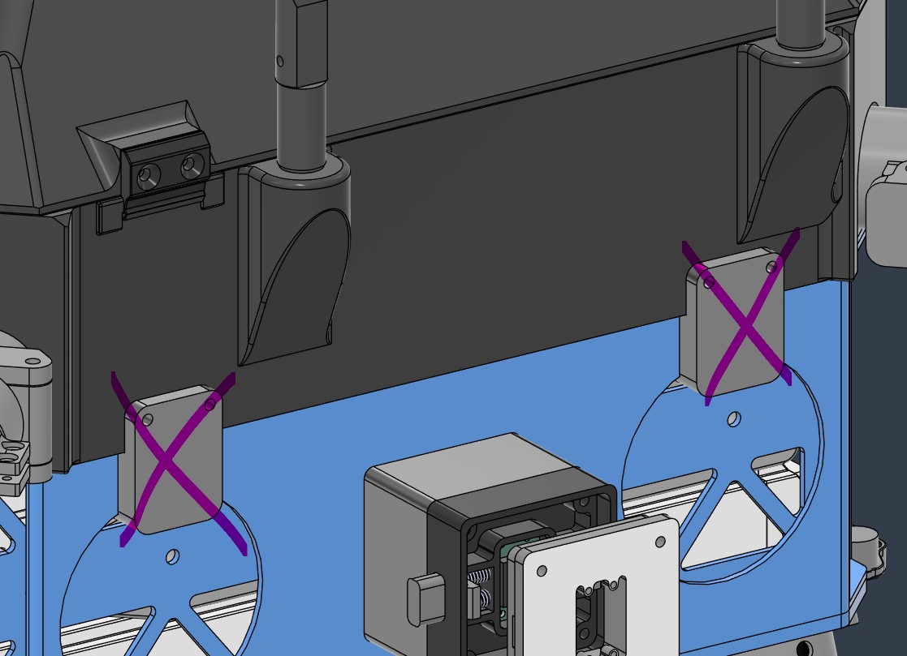
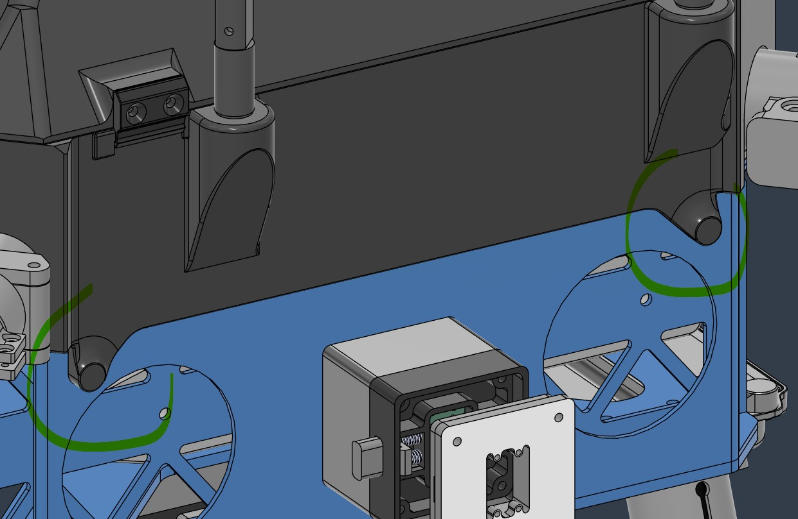
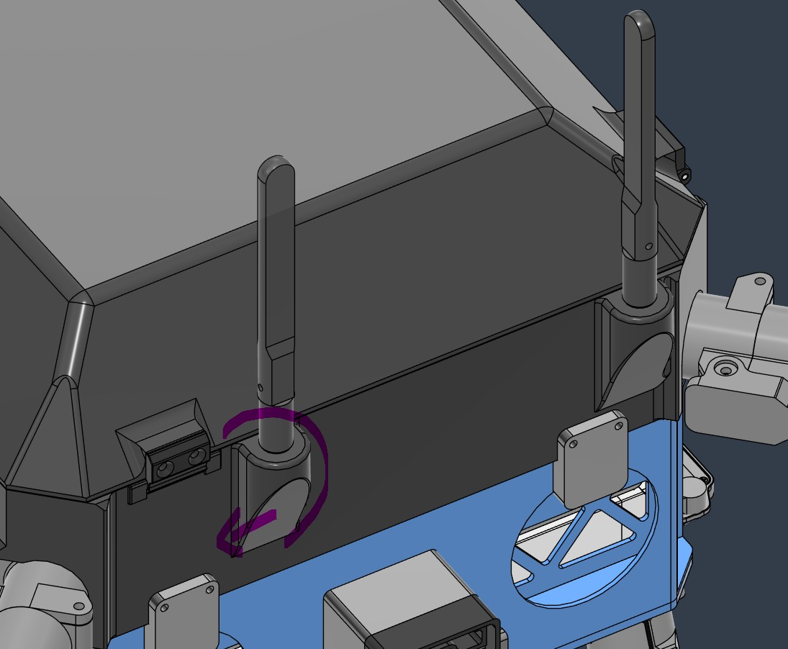
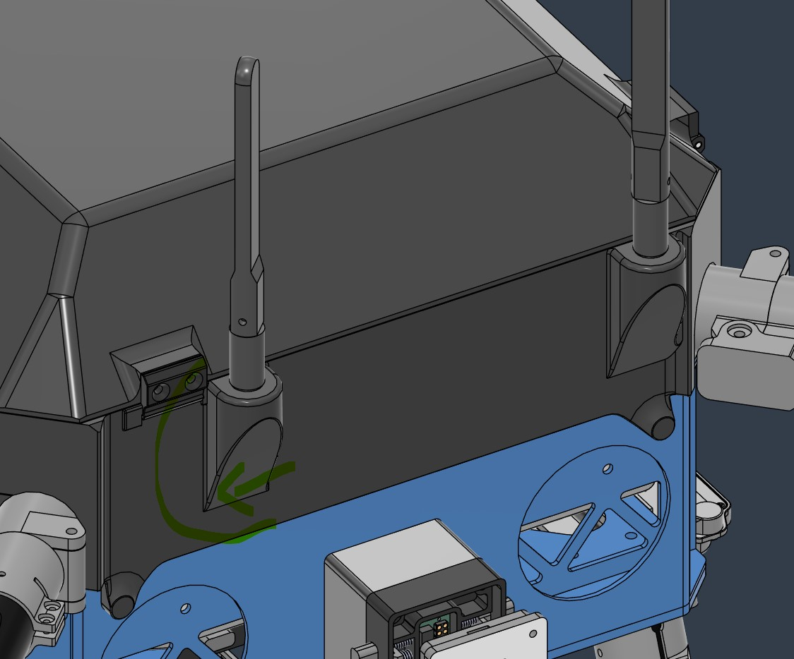
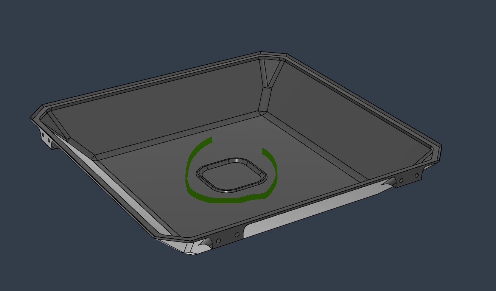
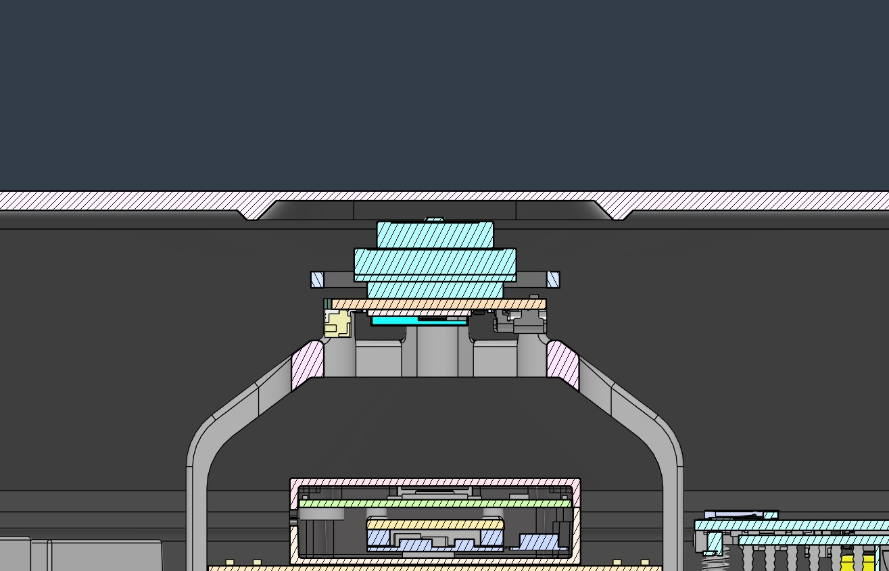
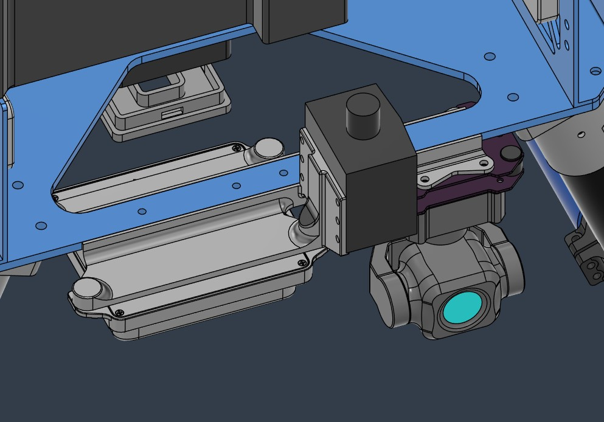
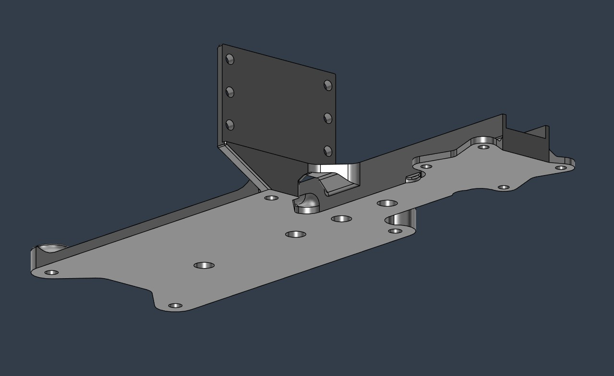

<!--Partial original Chinese writing included 包含部分汉语原文-->
# Status 

Valid
Revision History: V1
Replacement Log: None
Reference: 0001 - PT3 Comprehensive Airframe Modification

# Project Description

To improve the assembly process and structural safety of Quiver PT3 enclosure, also the basic performance of multiple radio systems, as well as address the mounting issue of gimbal camera, the following structural improvements have been made to the design:

- Main enclosure:
  - Latch mechanism: A replacement and upgrade was made, due to the original main enclosure which relied on four individual latches for retention and lacked of rigidity with a reasonable assembly process. 
  - Telemetry antenna outlet: An offset has been applied to the rear antenna, which shifted further away from the front antenna to reduce antenna coupling and enhance antenna isolation.
  - Top cap: The thickness of the center top cap area have been reduced to optimizing signal reception performance of RTK-GNSS module, also a special structural strength compensation has been added.
- Altitude sensor mount: A screw depth correction has been performed to the radar sensor mount, and the LiDAR sensor mounting orientation has been rotated to ensure the space for the new gimbal camera mount.

<!-- 
为了增加Quiver PT3的enclosure的组装流程、结构安全性和多个无线电系统的基本性能，并解决Quiver的云台相机安装位置问题，本次对设计做出了以下结构改良：

- Main enclosure: 
  - Latch mechanism：进行了替换和升级，因为原main enclosure由4个独立的latch作为限位手段，且缺乏刚性固定和合理的组装流程。
  - Telemetry antenna outlet: 对后侧天线执行了偏移，使其进一步远离前侧天线，以减小天线耦合并强化天线隔离。
  - Top cap: 减小顶部中心区域的厚度，优化RTK-GNSS模块的信号接收性能，并专门补偿了结构强度。
- Altitude sensor mount: 修正了radar sensor mount的螺丝深度，旋转了LiDAR sensor的安装方向以保障新的云台相机mount的空间。
-->

# Methodology 

This design and delivery was conducted using Fusion 360. All modifications were based on '0001-comprehensive_airframe_modification' and subsequent minor revisions (such as Julius's modification of the GNSS stand).

The top cap have been remodeled for this change, due to a time line dependencies error was introduced during the latch mechanism modification. Causing its fillet surface may having slightly difference from the previous version but does not affect performance.

Some redundant 'Location capture' operations on the time line also been optimized in this change.

<!--
本次设计和交付均使用Fusion 360软件，所有的改动基于0001-comprehensive_airframe_modification及其后的各类微小修正（例如Julius对GNSS stand的修改）。

由于对Latch mechanism进行修改时诱发了time line依赖问题，因此在本次改动时对Top cap进行了重新建模，导致其fillet surface对比上一版本可能存在微小变化，但不影响性能。

本次改动同时优化了time line上一些冗余的location capture操作。
-->

# Results and Deliverables 

The main results are:
- Printable 3D models of parts below (may requires support structures for printing) :
  - Main enclosure
  - Top cap
  - Altitude sensor mount
- New hole features of main enclosure modification on the vertical airframe metal parts (need to be drilled manually or re-ordered).

## Main Enclosure 

Contains multiple modification shown below :

### Latch Mechanism

|Old|New|Detailed New|
|-|-|-|
||||

Those 4 individual latches and their corresponding screw holes on the enclosure have been removed, and an integrated screw insert design with rigid mating is introduced, and a serie of new screw holes need to be drilled on the vertical wall. 

The new mating mechanism need to be accessed from inside the battery bay.

<!--
取消了4个独立的latch及其对应的enclosure螺丝孔位，改为刚性固定的一体化螺母设计，且需要在vertical wall上钻出一系列新螺丝孔。

新的紧固机制需要从battery bay内进行操作。
-->

### Telemetry Antenna Outlet

|Old|New|
|-|-|
||

- The distance of 'array replication' have been adjusted for more than 1 cm, provided a distance increase between two antennas. 
- And some fillet is applied to interior sharp corners to prevent cable damage or personnel injury from scratching in extreme cases (not shown in images).

<!--
- 调整了"阵列复制"距离约1cm以上，为两个天线增加了间距。
- 内部的锐角则应用了一些fillet以防其在极端情况下划伤电缆或操作人员（未配图）。
-->

### Top Cap

|New|Cut Away View|
|-|-|
|||

The thickness of the top center area have been reduced from 3 mm to 1.5 mm for better GNSS signal penetration, with a rounded rectangle shape have been designed for the area, and its edge is reinforced with ribs to prevent the area from cracking.

<!--
将顶部中心部分的厚度从3mm减小至1.5mm以获得更好的GNSS信号穿透，区域设计为圆角矩形，且边缘部分使用了加强筋进行强化以防区域破裂。
-->

## Altitude Sensor Mount

|New|Solo Part View|
|-|-|
||

Redesigned most of the structure.

- The radar sensor mount location have been tuned and shifted to the landing gear side for space efficiency, and the insufficient screw insert depth have been fixed.
- The orientation of LiDAR sensor have been rotated to provide enough space for the new gimbal camera mount with its shock-absorbing components.
  - The gimbal camera mount position is designed to avoid interference with LiDAR beam.

<!--
重新设计了大部分结构。

- 向起落架方向微调并偏移了radar sensor mount位置以优化空间效率，并且修复了螺母空间不足的问题。
- 旋转了LiDAR sensor的安装方向，为云台相机的新mount及其减震部件提供足够空间。
  - 云台相机mount的位置设计有考虑避免干扰LiDAR光束。
-->

# Remarks 

- KBM(the author) is recommending to seek for more compact altitude sensor options for future development.

(End of document)