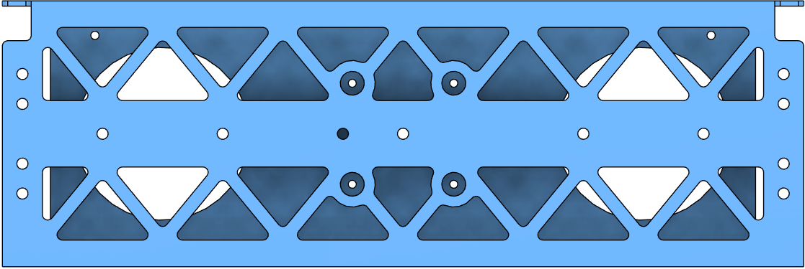
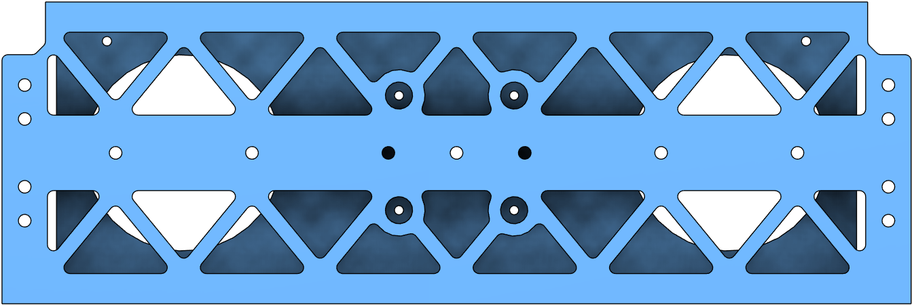
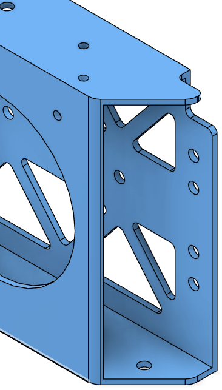
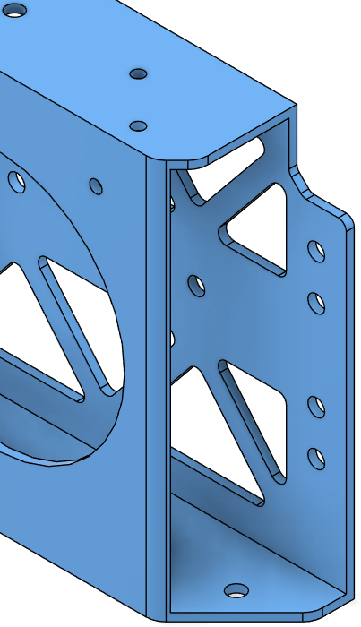

# Battery Wall Modification

# Status

`Valid`

`Revision History: v1.1`

`Replacement Log: None`

`Reference: 0001 - PT3 Comprehensive Airframe Modification`

# Project Description

This information note covers two corrective modifications on the battery wall that were identified during the assembly of PT3.

**Battery Slider Hole Symmetry:** The battery walls were originally ordered as symmetrical parts; however, they were not symmetric on the design. During tne assembly, this asymmetry created inconsistency and installation issues, as one side was missing the hole required for the battery slider part. 

**Motor Arm Connector Bolt Installation Cutouts:** The cutouts on the battery wall that were intended to leave enough space for one of the motor arm connector bolts were not sufficient. The restricted clearance complicated assembly and risked improper fastening.

# Methodology

Fusion 360 is used to make the necessary changes on the main assembly.

# Results and Deliverables

## Battery Slider Hole Symmetry
A new hole was created, making the battery wall symmetric.

| Old | New |
|-|-|
| | |

## Motor Arm Connector Bolt Installation Cutouts
The cutouts were enlarged to allow proper bolt installation and improved accessibility.

| Old | New |
|-|-|
| | |

# Remarks
The design should be validated in the next prototype build. Additional modification may be required.
