# Status
`Valid`

`Revision History: V1.0`

`Replacement Log: None`

`Reference: 0004 - PT3 Comprehensive Main Enclosure Modification`

`Author: Dow Fisher KBM`

# 1. Project Description

Since the initial design release of enclosure assembly, the main enclosure and the cockpit lid were became frequently accessed components, offering important protection for PCB and avionic wiring against various flight environment such as desert dust. 

As the demand of protection level was upgraded, certain modifications were performed in this design evolution. With two versions of modifications were provided for final decision.

Main modification version (by KBM):

1. Electrical engineering personnel asked for cable anchors with zip-tie-friendly.
2. An embedded mounting slot on the lid for "SLAMTEC RPLIDAR S2L" 360 LiDAR module.
3. A liquid silicone groove design for cockpit lid water proof performance upgrade.
4. Introducing a new cockpit latches for better reliability.
5. A mounting plate for settling the Ethernet adapter and Remote-ID beacon module.

Further modification version (By Julius):

1. New alternative water proof mechanism for the cockpit lid by using silicone strip. 
2. Improved LiDAR mounting slot with drainage design and cable inlet sealant reservation.
3. Improved outer shape of antenna mount bases with slope for better rain drainage.
4. Minimized battery rain shield and front cable outlet geometries for better 3D printer build size compatibility.

|KBM's Version|Julius's Version|
|-|-|
|||
|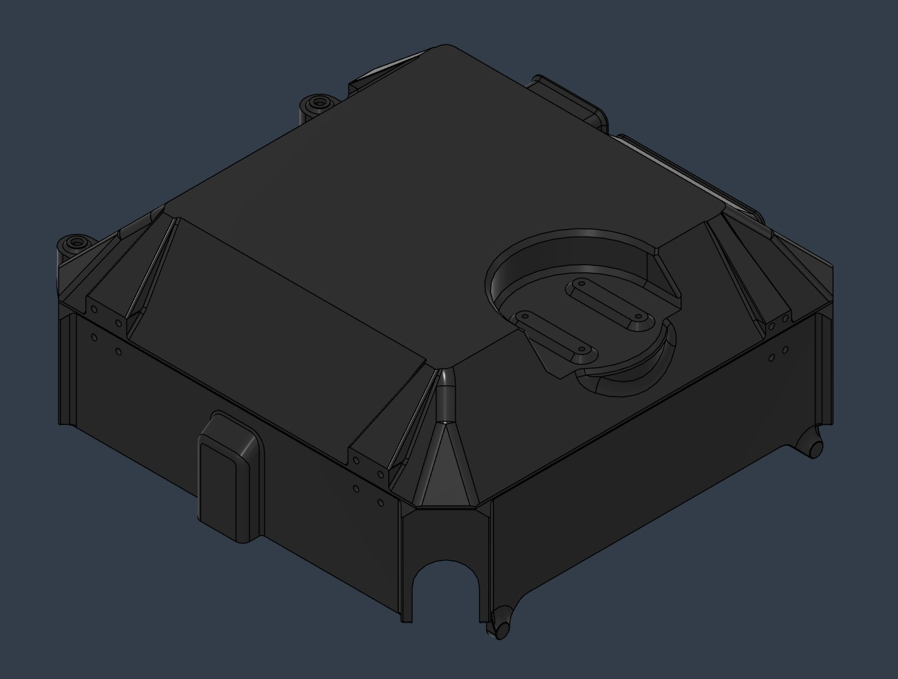||
_Two directions of overview of both versions_

# 2. Methodologies

Current evolution of KBM's version was modified based on the original enclosure design, with 3D models from corresponding peripheral and modules. Then Julius's version was preformed based on KBM's latest modification.

Most of inner corners of the main enclosure are been refined and smoothed for further modeling, while minimized support structures requirement of 3D printing.

## 2.1. Cable anchors

A new style of cable anchors are introduced, as curved shape for accommodate with zip-ties and large cables, also for better non-support 3D printing slicing process. Anchors are spread using array and mirror features for a even distribution. 

The total amount of anchors are designed for more than current need, this decision is to reserve free anchors for any additional or temporal wiring for future use.

|KBM's Version|Julius's Version|
|-|-|
|||
_A highlighted single anchor feature in images above._

## 2.2. Embedded LiDAR mount

The installation slot of LiDAR module was designed to minimize the height profile of the module, while not blocking the optical path of its laser beam. 

Those large space and gaps around the module are intended to reserve a better cleaning and draining space, the drainage in Julius's version uses a special designed slope for better draining effect. While cable outlet opening in both versions were designed to pass through the whole electrical connector of the LiDAR module, and their geometries are compatible with sealant application. 

|KBM's Version|Julius's Version|
|-|-|
|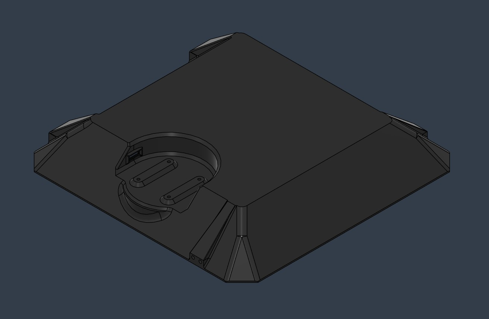||
|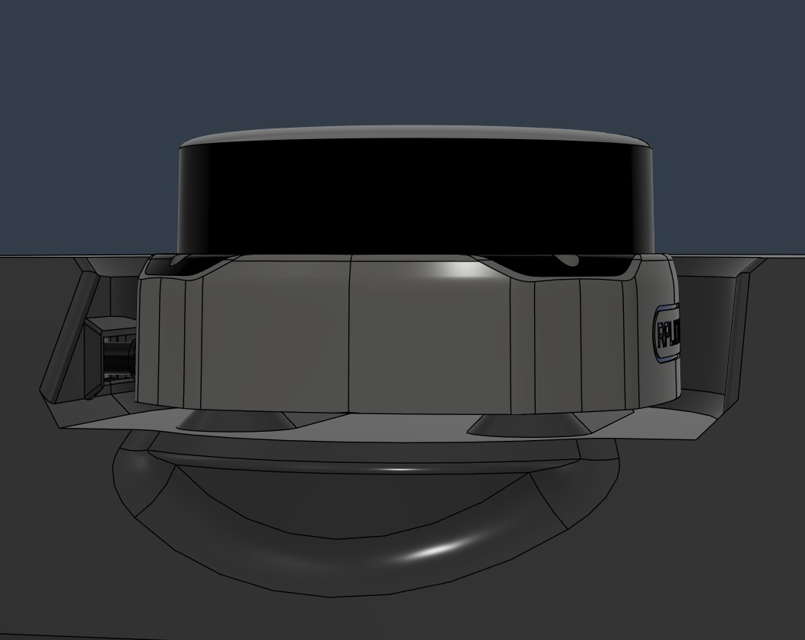|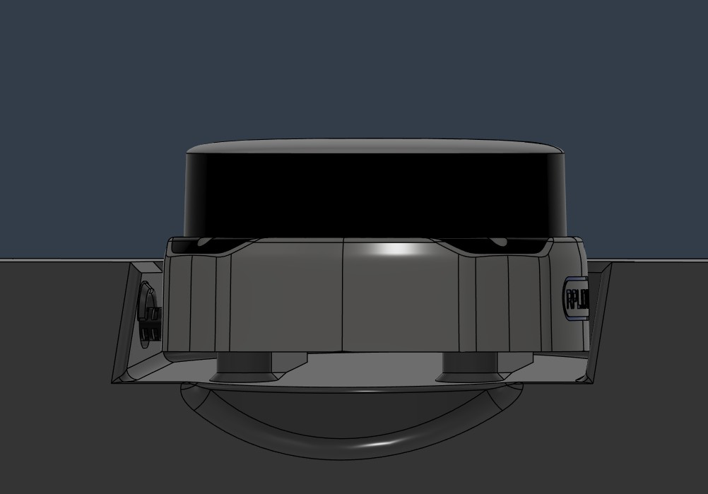|
|||

For reinforcing the the slot and the mount, multiple support beams and fillets are designed as inside features of the lid in KBM's version:

|KBM's Version|Julius's Version|
|-|-|
|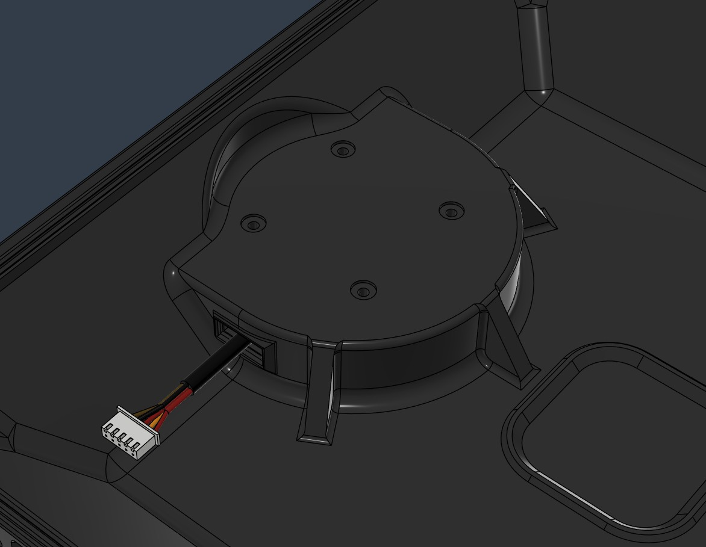|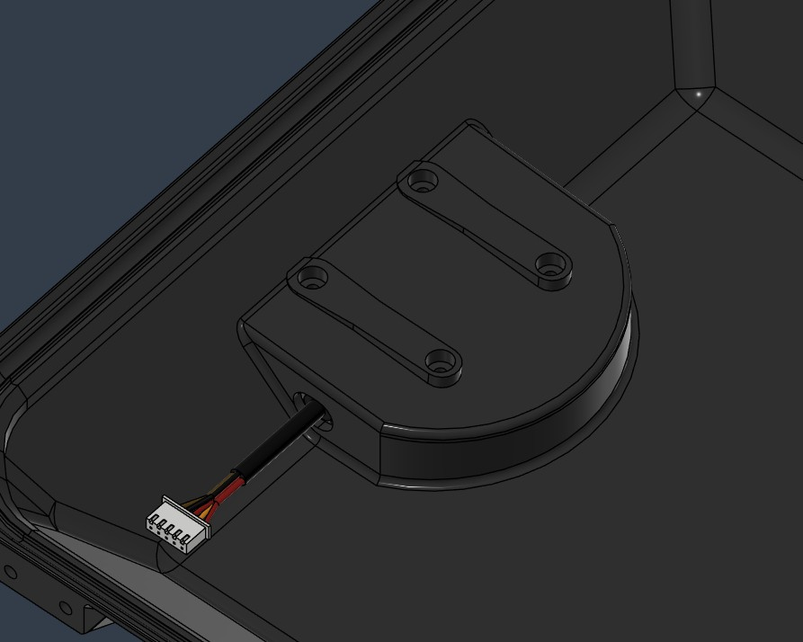|

_Display of inside of the lid, with LiDAR module cable harnessing and connector._

## 2.3. Water proof sealing

After the water splashing and spraying test in Germany, the original splash proof slope design on the lid has been found insufficient in mid-to-heavy rain scenario. 

To resolve the issue, a waterproof ring of groove and lip combination between lid and main enclosure has been introduced into both version, but with two different solutions for the sealant design:

|-|KBM's Version|Julius's Version|
|-|-|-|
|Design Purpose|A layer of 30A hardness liquid silicone is required to be filled into the groove which on the lid. After curing, the silicone will become a waterproof ring.|Attach a round silicone foam strip into the groove which on the main enclosure, to be the waterproof ring.|
|Groove View|||
|Groove Detail View|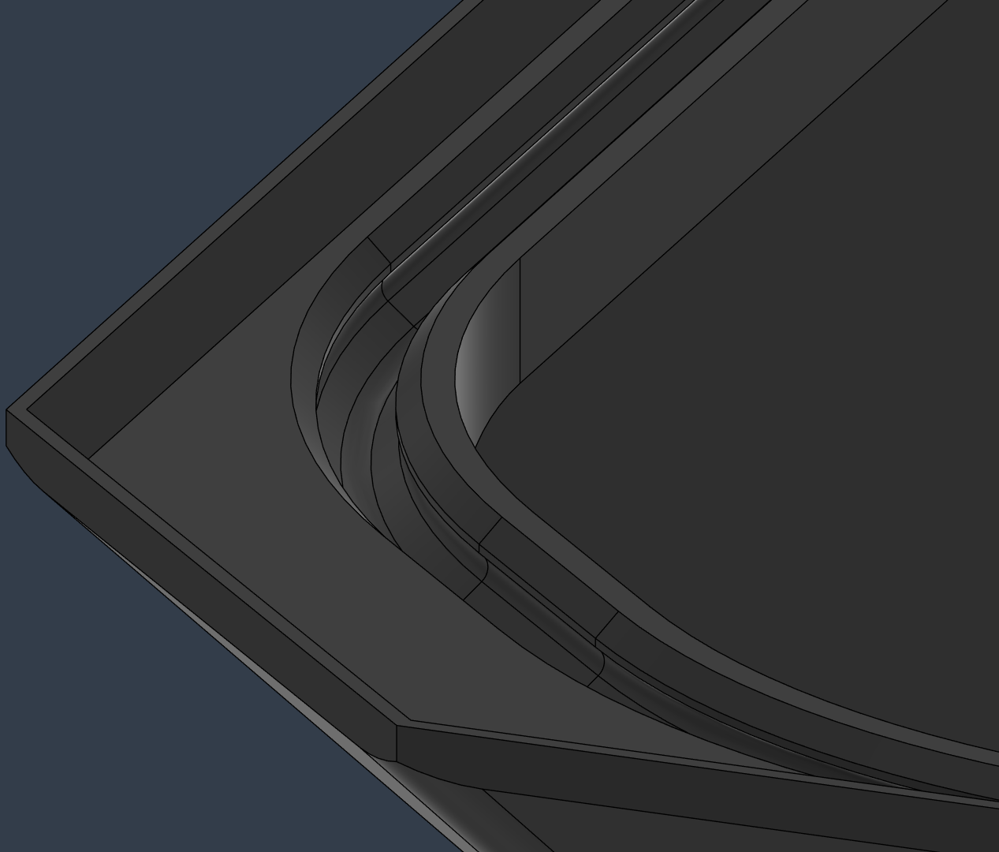|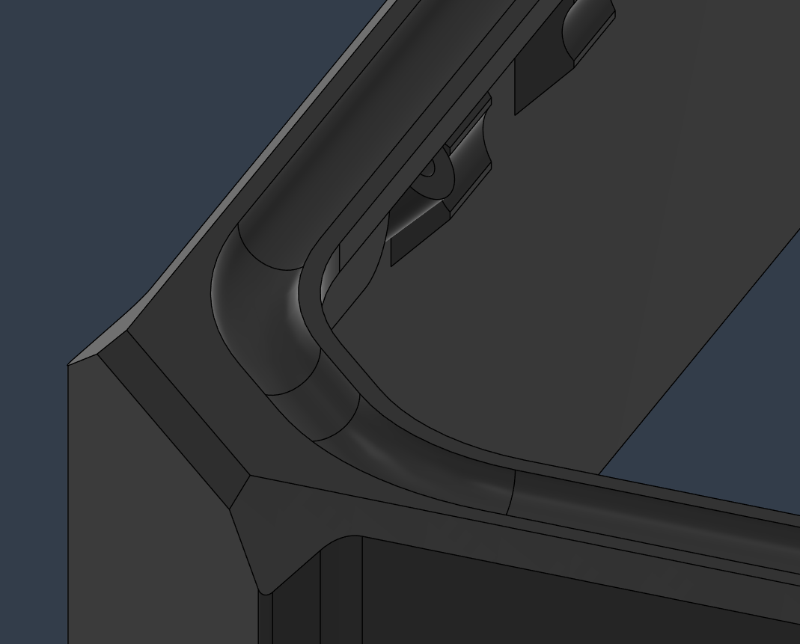|
|Lip View|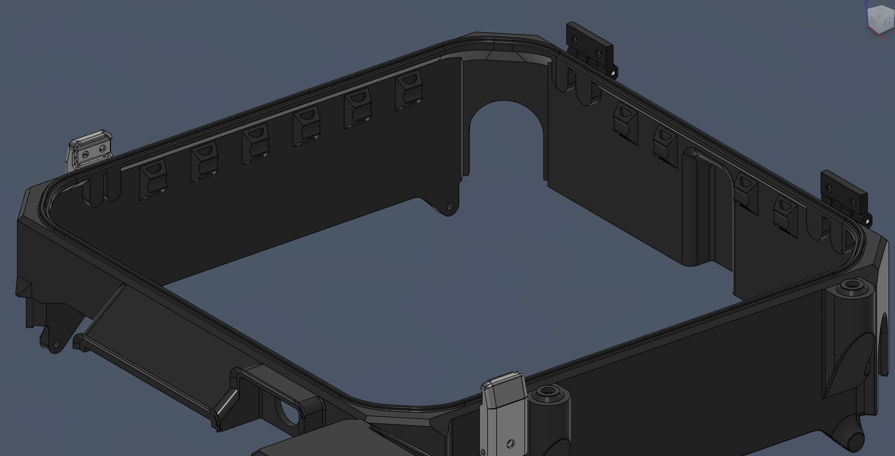||
|Cut Section|||
|Installation Example|||
|Installation Detail|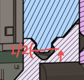  For the liquid silicone amount to applicate, half-depth of filling level is recommended for the desired pressure.|Measure and cut a certain length of 8 mm diamter "Uxcell Silicone Foam" seal strip into the groove.|
 
## 2.4. Cockpit latch replacement

The original 3D printed latches on both side of lid were been replaced by two stainless draw latches, with the model number of McMaster-Carr reference: 6082A11

The screw insert layout on both lid and enclosure has been modified to fit with the new latches.

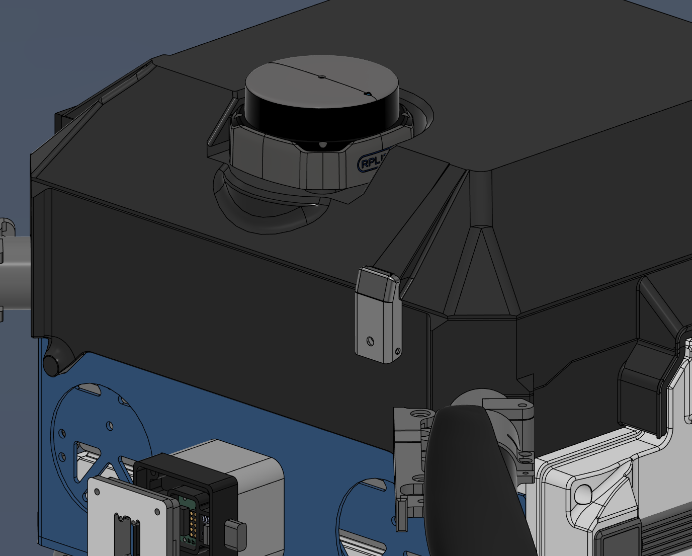
\* Using KBM's version for the display of the new latch.

## 2.5. Module mounting plate

For settling the Ethernet adapter and Remote-ID beacon module, without applying fragile mating to high-stressed structural parts (e.g. motor beam connectors). A simple, floating and triangular shaped module mounting plate has been introduced to the main enclosure's inner corner. This mounting plate is interchangeable between left and right side of the aircraft.

The geometry of mounting plate is simple. End users may customize the plate to fit with their purpose by removing or adding any features.

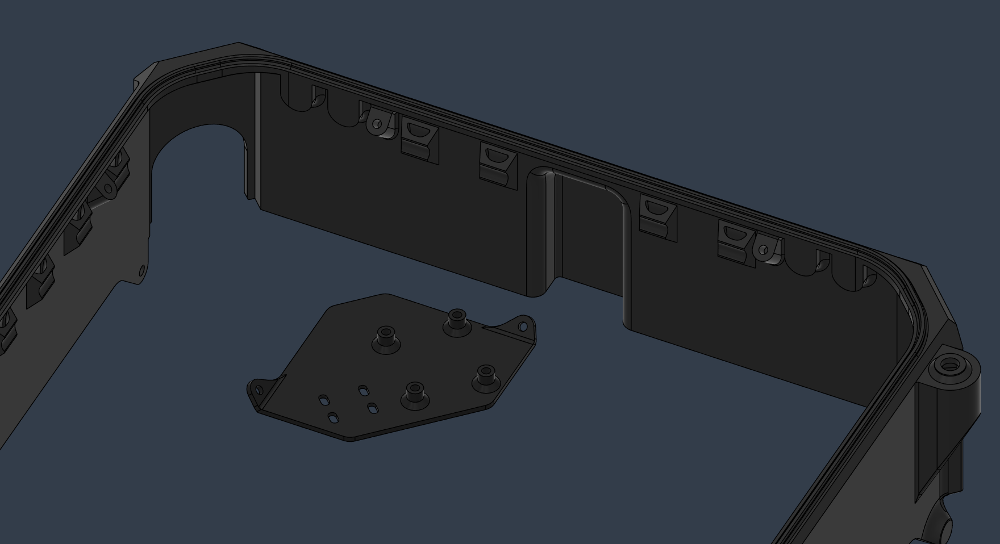
\* Using KBM's version for the display of mounting plate design.

The mounting plate's corresponding screw insert bases has been added to the enclosure wall, letting the plate maintain a moderated clearance between cable anchors, avoiding conflict with any cables between them. The screw insert bases are designed to be 45 degrees upward facing, for better maintenance access and non-support 3D printing. 

|Assembly View|Isolated View|
|-|-|
||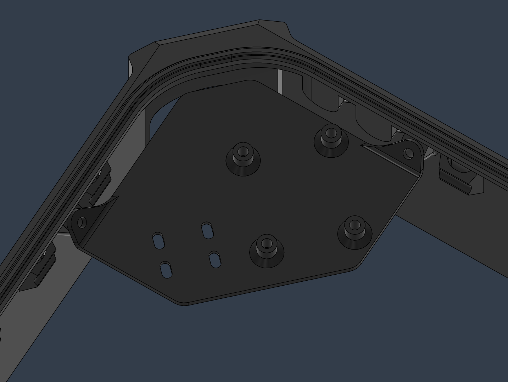|

\* Using KBM's version for the display of mounting plate design.

Additionally, the plates are **Not Interchangeable** between two versions due to the main enclosure geometry difference. The plate's screw insert lips between two versions are having different location:

_Grey: Julius's version._

_Blue: KBM's version._

## 2.6 3D Printing Compatibility Improvement

\* This modification is effective for Julius's version only.

### 2.6.1 Over-all Size Optimize

The original design of main enclosure is oversized for most of regular 3D printers, making it hard to be widely manufacture. Current best solution is reduce its total dimension, by shorten the battery rain shield and the front cable outlet.

|Original / KBM's Version|Julius's Version|
|-|-|
| 34.739 cm|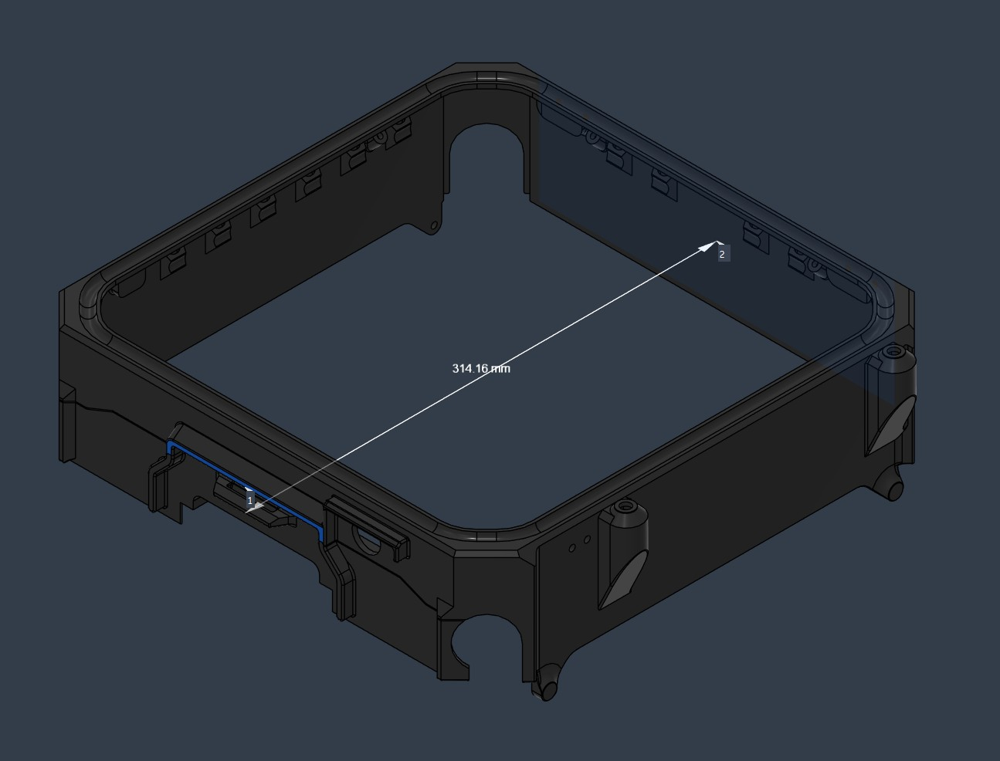 31.416 cm|

This modification is also effective to the battery PCB cover part with shortened rain shield:

_Highlighted display of battery PCB cover._

### 2.6.2 Antenna Mount Optimize

The outer shape of antenna mount has been improved to prevent junky 3D printing overhang, also preventing any rain drops to concentrate around the antenna base.

|Original / KBM's Version|Julius's Version|
|-|-|
|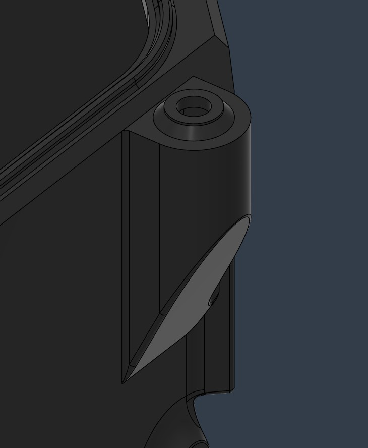|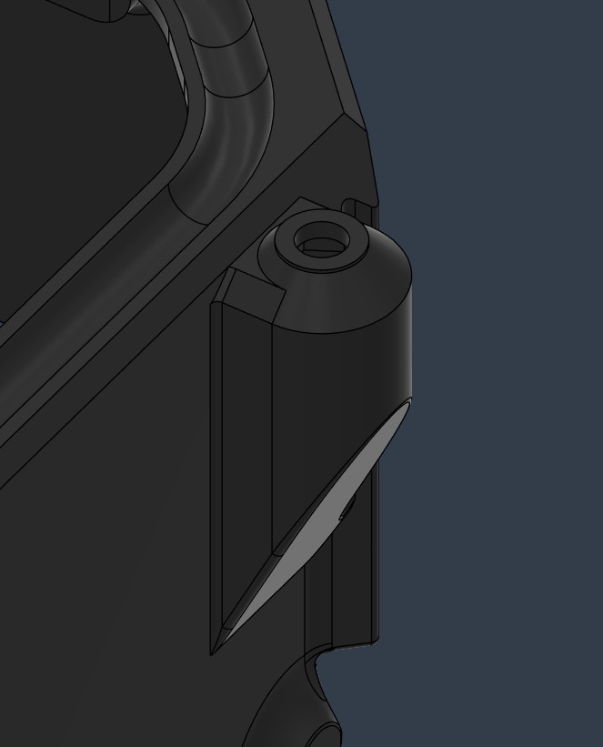|

# Results and Deliverables 

Two versions of new models sets, including: Lid, Main enclosure, Front PCB cover and Module mounting plate. All models are ready to be 3D printed.

For the ideal 3D printing quality, the slicing orientation shall set to upward facing. Enabling raft or support structures for the main enclosure during the printing are strongly recommended, or the printing may output various bad results.

For the waterproof liquid silicone applications, please refer to the silicone supplier's instructions for the operation, and perform the operation on a leveled surface.

# Remarks

**(End of content)**